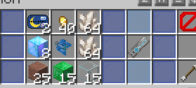

# Infinite Infernal 装备道具图鉴

这里记录只有在“无尽地狱”世界兑换的武器装备。  
当前，这些道具被分为以下大类：

- [防具](inf/items/Armors.md)*（施工中）* —— 抵御致命伤害（附加属性提升）
- [近战武器](#)*（暂无详情）* —— 如果你足够勇猛的话
- [远程武器](#)*（暂无详情）* —— 走敌人的路，让敌人无路可走
  + [弹药](#)*（暂无详情）* —— 远程武器所必需
- [魔法武器](#)*（暂无详情）* —— 同上，弹药变成了魔力
- [辅助道具](#)*（暂无详情）* —— 加血、回蓝，以及各种意想不到的玩法
  + [魔法书](#)*（暂无详情）* —— 为武器、防具额外增加伤害等效果
- [实物货币](#实物货币简述) —— 通用兑换凭证

<!-- 注意：以上除弹药/货币以外，应单独设立页面 -->

装备一般按强度划为 5 个等级，对应[黑化怪](inf/mobs.md)的 5 个阶段。因此，玩家习惯上也将其简称为 **T1，...，T5** 装备。

关于在主世界兑换的道具，请参阅 [主世界道具图鉴](space/items.md)。

!> 🎨 **现在可为尚无定制材质的道具** [绘制材质](nyaa/creation.md#infinite-infernal-模型制作)。

## 武器与辅助道具简述

目前，在无尽地狱，玩家可扮演三个职业——**近战、远程、魔法**。各个职业的特色如下：

- **近战：**使用剑、斧、棍、矛等武器。拥有最高的防御和近战输出。
- **远程：**使用弓、弩、枪等武器。拥有超远的射程和隐身能力。
- **魔法：**使用法杖、魔法书等武器。消耗魔力值，拥有超高的短时间爆发能力。

武器描述由以下部分依次组成：

- **基础伤害：**在没有任何加成和暴击的情况下，武器单次/单段攻击造成的伤害。这一行同时会注明武器的伤害类型。仅有标注了伤害类型的武器才能被套装正确地加成。
- **使用速度：**武器的使用/攻击速度，从很慢一直到疯狂。特别的，对于某些使用左键攻击的武器（枪、匕首等），如果它具有很高的攻击速度，但是玩家点击的速度不够快，实际造成的效果会不理想。
- **暴击率：**可能存在的一行，表示理想状态下，该武器的暴击成功率及伤害倍率。
  + 如果显示为「xxx % 综合暴击」，则代表理想状态下，该武器的平均伤害倍率。
  + 暴击成功时，将伤害按 **装备上所示伤害倍率** 乘积。
    * 如未标注伤害倍率，按其默认倍率设置计算。**对于武器，倍率均为 2.0 倍。**
  + 如身上佩戴多件可触发暴击的装备（包括防具），**依次** 选择是否触发暴击；触发成功的，将其所示倍率相乘，然后作用于伤害值。
- **特殊效果/使用方法：**表示武器攻击/使用/持有时的一些效果或者使用的方法。
- **Lore**
- **消耗信息：**
  + 对于近战武器，大多为维修方式与耐久；
  + 对于远程武器，大多为弹药种类和容量；
  + 对于魔法武器，大多为魔力消耗。
- **能量条：**可能存在的一行，用于实现特定的功能，如过热损坏、充满时可施展特殊技能等。

  
<small>一个典型的 inf 武器，信息面板包含了伤害、使用速度、特殊效果和消耗信息。</small>

**辅助道具**本身不能作为武器，其或多或少地给予若干效果、或者功能。包括而不限于：
- 恢复生命值、魔力；
- 增加魔力上限；
- 获得XX（正面）效果；
- 免疫XX（负面）效果；
- 随时随地访问末影箱空间；
- 储备弹药；
- 传送。

#### 铸造与分解

几乎所有武器和辅助道具，均依靠**铸造**取得。而一次铸造需要**魂玉与天界魔矿**，其中：
- 魂玉决定了铸造产物的类型。分别有：
  + **霜白魂玉** → 辅助道具
  + **炎红魂玉** → 近战武器
  + **幽绿魂玉** → 远程武器
  + **极蓝魂玉** → 魔法武器
- 天界魔矿的等级，决定了铸造产物的档次（或者“稀有度”）。
  + 分为 **1~5 级**，对应稀有度为 **白色、蓝色、绿色、紫色、金色**。
  + 五级魔矿另有小概率产出最稀有的 **红色** 产物。
  + 高档次产物一定强力，但低档次装备**不一定**都逊于高一档者。
- 每次铸造均最少要求一定数量的天界魔矿。
  + 数量越多，铸造稀有产物的概率越高。
  + 对于较低级的魔矿，由于装备池较浅，未必需要攒齐一组。适当投入即可。

在无尽地狱，和锻造台互动，打开铸造界面。在输入端分别投入魂玉、天界魔矿，右侧输出栏将显示**预期产出结果的概率**；点击输出栏即可铸造。

  
<small>一次铸造过程。</small>

  
<small>右键以后，聊天区域会展示所有使用**此数量天界魔矿和魂玉**可能产出的物品。 将鼠标移动到物品名称可以查看详情。</small>

如若反悔，可以用**分解石**进行分解。和切石机互动，分解界面会取代原版界面；投入武器和分解石，将返还随机数量的天界魔矿（铸造时用量 X 的 50~100%），并有一半概率额外返还「灵魂残片」（数量等于 X），但不返还魂玉。

#### 附魔与消魔

可用于装备的附魔书，皆有**粉色「魔法书」名称，和一行Lore「写满了看不懂的符文」**；还有一种**「贤者の石」**带有1.14版本以来的所有附魔。一些魔法书仅可加强特定类型的装备。  
在无尽地狱，和附魔台互动，打开附魔界面。投入装备和「魔法书」即可附魔。

如果反悔，可以用**消魔石**进行消魔。和砂轮互动，打开消魔界面。

#### 融合

“肝黑”过程中，低档装备往往会被更高档者淘汰，而弃置一边。利用「融合」功能，可令其焕发新生。  
**一些极独特的装备，仅可通过「融合」制造。**

现在月耀城提供**「便携式工作台」道具，只有它可进行「融合」操作**。手持之右键使用，将弹出类似查看箱子的界面，其中以蓝色玻璃板区分“合成区”和“输出区”，形如工作台。在此界面投入指定的原料即可融合。  
当前，支持的融合配方可概括如下：

- 低级武器、低级魔矿和少量高级矿物块，合成高级的武器；
  + 可能需要额外的「灵魂残片」、特定掉落物等。
- 低级防具合成至高级防具。

  
<small>一次融合过程。</small>

?> :heavy_check_mark: 月耀城还提供**「月耀城合成大百科」**道具，以便查询某种装备可支持的「融合」配方（包括作为原料、或产物对应的配方）。

!> 「便携式工作台」不兼容原版工作台。

!> 通过融合得到的新物品**不会继承**原有物品的任何自定义属性（附魔、耐久、剩余弹药等）。

## 防具简述

防具可提供一定的护甲值，和额外的生命值。当集齐全套，还会额外提供一些加成，如魔力上限、伤害倍率等，并且可能对某种职业给予不俗的支持效果。

其描述包含以下部分：
- **护甲值：**一般用于注明此防具的**高级护甲值**，部分低级防具不包含高级护甲，则以另外的形式注明。高级护甲是在 Minecraft 原版机制以外额外提供的减伤方式，对于与高伤害的怪物作战来说十分重要。
- **套装效果：**会标注在头盔上。穿上一整套套装后玩家会获得的效果。一般来说包含对职业的伤害加成。
- **Lore**
- **维修方式与耐久**

#### 获取和维修方法

几乎所有防具的兑换，均由NPC提供，一般需**矿物块**和某种黑化怪特定的掉落物。与天界魔矿类似，矿物块也分为 1~5 级。  
防具兑换点分布在几个安全城镇（包括月耀城）之内，离月耀城越远的，等级越高。

防具维修则依靠指定的修复材料，在其描述有注明方法。一般这些材料可从月耀城购得；某些材料只有击杀 Boss 方可取得。

## 实物货币简述

实物货币系统从旧版“无尽地狱”沿袭而来，当时，作为独立服务器，没有实装数字货币及市场系统，仅可以物易物，遂发展出了实物货币。现在可作为各种物资（原版和非原版）的兑换凭证。

|货币|稀有度|用途|获取途径|
|-|-|-|-|
| 一文大钱 | ★ | 换取原版物资，普通非原版物资 | 用原版部分物资兑换；击杀黑化怪；开奖等 |
| 一元钞票 | ★★ | 换取价值较高的物资 | 由 64 个一文大钱兑换（可逆） |
| 一张银行卡 | ★★★ | 方便存储大钱/钞票 | 由 64 个一元钞票兑换（可逆） |
| 喵爪银币 | ★★ | 换取某些特殊物资 | PTT签到礼包；击杀黑化怪等 |
| 千仞台通行凭证 | ★★★ | 在千仞台换取特殊物资 | 由 1 个**喵爪银币**和 1 个黑化怪的**随机**特有掉落物兑换 兑换地点：千仞台「入城登记站」 NPC 每过随机的一段时间（通常在 30 分钟以内）会刷新兑换要求 |

!> 旧版「一文大钱」「一两银票」「喵爪银币」已被废除。请通过各城镇的NPC「ATM」兑换为新版使用。

（WIP）
