# 防具

**防具**是在inf中用于承担伤害的装备，而很多装备需要整套穿戴才能获得加成。

矿物装甲会根据不同的头盔提供不同的加成，以支持不同的职业。Boss盔甲则是由Boss的掉落物获得。除此以外，也有很多散件的装备，可以随心搭配。

对于矿物装备，战士对应的头盔是头盔，射手对应的是面具，法师对应的是头饰/帽，召唤师对应的是头箍。战士的头盔将具有最高的防御力，其次是法师和射手（防御力相同），而召唤师的头箍的防御力最低。

!> 本页还未完成，还在正在逐渐更新中。

### T1装备

##### 粗铁套

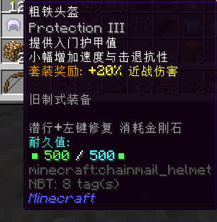

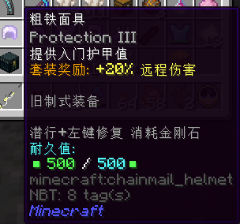

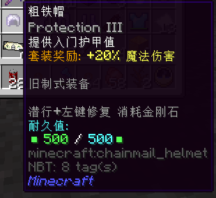

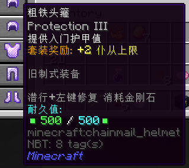

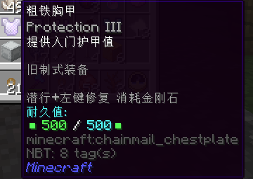

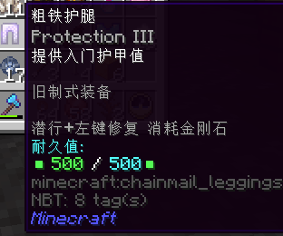

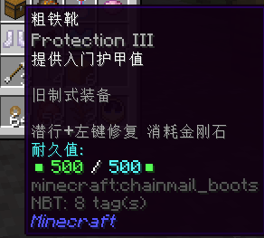

粗铁套可能是很多萌新来到inf时制作的第一套装备（当然，也可以直接制作铁套装）。它将提供入门护甲值，每件装备有500点耐久，使用金刚石修复。每个套装可以给除了召唤师外各个职业的武器增加+20%伤害，对于召唤师只增加2个召唤物上限。它并不会增加法师的魔力上限。此外，每套装备会自带总计12级的保护附魔。在这个阶段可以尝试不同的职业的不同的武器来选择属于自己的发展方向。

它可以在月曜城的工匠作坊中兑换得到。

每个头盔需要4个粗铁矿物块和2个远古布匹，而胸甲，裤子和靴子则各需要2个粗铁矿物块和1个远古布匹，完全兑换一个职业的装备需要10个粗铁矿物块和5个远古布匹，而把所有的粗铁装备一次换完则需要22个粗铁矿物块和11个远古布匹。

粗铁矿物块可以击杀1-5级秽土僵尸等普通怪物获得，而远古布匹则可以在击杀秽土僵尸时获得。

!> 注意，灰色名字的如下级僵尸，下级骷髅等怪物并不会掉落粗铁矿物块。

##### 铁套

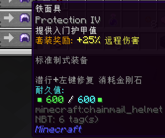

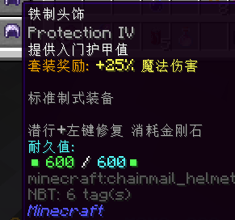

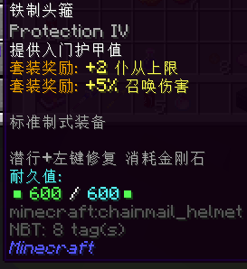

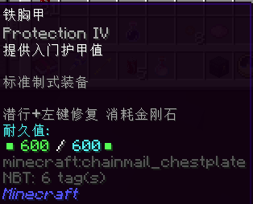

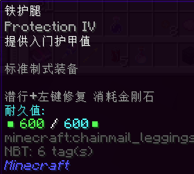

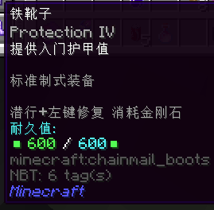

铁套也可能是很多萌新来到inf时制作的第一套装备。它将提供入门护甲值，每件装备有600点耐久，使用金刚石修复。每个套装可以给除了召唤师外各个职业的武器增加+25%伤害，对于召唤师则是增加5%召唤伤害的同时增加2个召唤物上限。它并不会增加法师的魔力上限。每套装备会自带总计16级的保护附魔。同样，在这个阶段可以尝试不同的职业，选择属于自己的发展方向。

它可以在月曜城的工匠作坊中兑换得到，或是由粗铁套装升级得来。

制造每个头盔需要8个粗铁矿物块和4个破损弩弦，而胸甲，裤子和靴子则各需要4个粗铁矿物块和2个破损弩弦，完全兑换一个职业的装备需要20个粗铁矿物块和10个破损弩弦，而把所有的铁装备一次换完则需要38个粗铁矿物块和22个破损弩弦。同时，也可以用任意粗铁头盔+5个粗铁矿物块+1个破损弩弦合成对应的铁头盔，使用粗铁胸甲，裤子，靴子和2个粗铁矿物块和1个破损弩弦来合成铁胸甲，裤子和靴子。

粗铁矿物块可以击杀1-5级秽土僵尸等普通怪物获得，而破损弩弦则可以在击杀骷髅弩手时获得。

!> 注意，灰色名字的如下级僵尸，下级骷髅等怪物并不会掉落粗铁矿物块。

（WIP）
