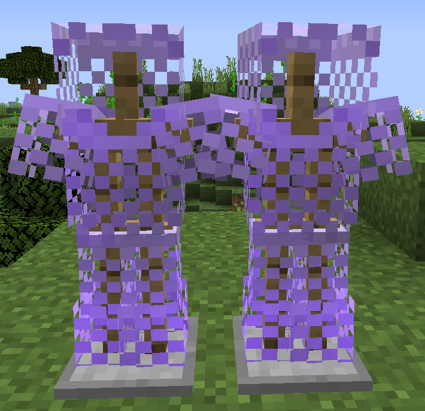
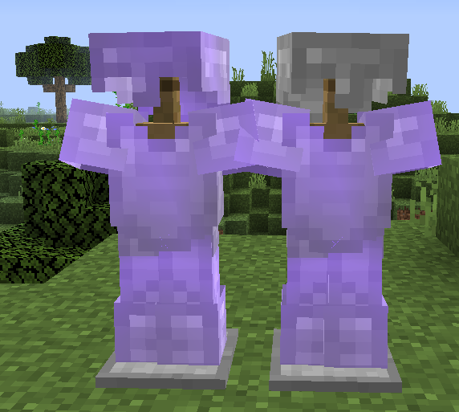
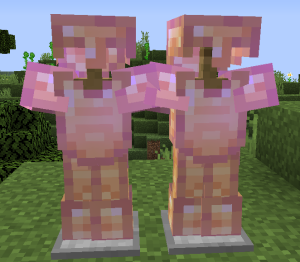
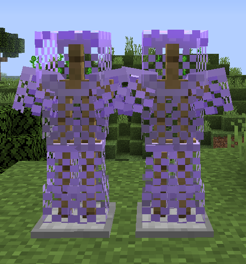
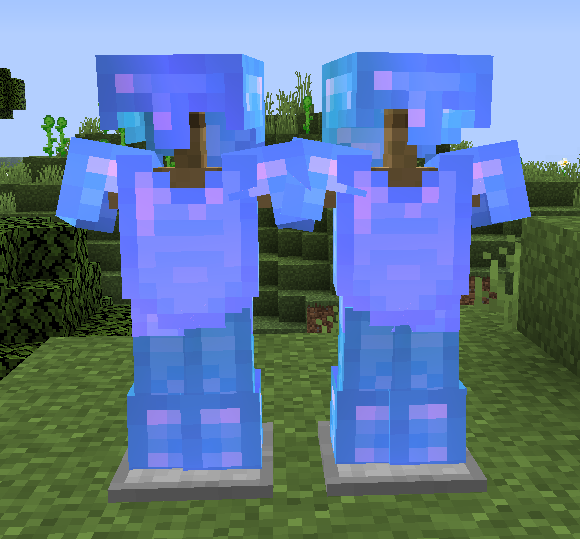

# 防具

**防具**  分为矿物装甲，Boss装甲和其它装甲。

矿物装甲会根据不同的头盔提供不同职业的加成；Boss装甲则是由Boss的掉落物兑换获得；而其它装甲包括部分套装，也有很多散件的装备，可以随心搭配。
对于矿物装备的头盔，战士（头盔）具有最高的防御力；其次是法师（头饰/帽）和射手（面具）；而召唤师（头箍）的防御力最低。

所有的防具都使用**金刚石**修复。

初始附魔不会在消魔过程中被清除，但照旧消耗消魔石。

!> 本页还未完成，还在正在逐渐更新中。

## 目录

- [矿物装甲](#矿物装甲)
  + [T1粗铁套/T1+铁套](#T1)
  + [T2精铁套/T2+淬火/精钢套](#T2)
  + [T3纯金套/T3+精金套](#T3)
  + [T4魔金套/T4+暗金套](#T4)
  + [T5蓝钻套/T5+星钻套](#T5)
- [Boss装甲](#Boss装甲)

## 矿物装甲

### T1

#### 粗铁套

- **护甲值**：均为入门级
- **加成**
  + **头盔**：近战伤害+20%
  + **面具**：远程伤害+20%
  + **帽**：魔法伤害+20%
  + **头箍**：仆从上限+2
- **初始附魔**：保护三
- **耐久**：500
- **获取方式**：
  + **融合制造**
    * 单职业：10x粗铁矿物块 + 5x远古布匹；全都要：22x粗铁矿物块 + 11x远古布匹。
  + **NPC 兑换**：所有部件均可在月曜城的工匠作坊兑换。

#### 铁套

- **护甲值**：均为入门级
- **加成**：
  + **头盔**：近战伤害+25%
  + **面具**：远程伤害+25%
  + **头饰**：魔法伤害+25%
  + **头箍**：仆从上限+3，召唤伤害+5%
- **初始附魔**：保护四
- **耐久**：600
- **获取方式**：
  + **融合制造**
    * 单职业：20x粗铁矿物块 + 8x破损弩弦；
    * 全都要：44x粗铁矿物块 + 14x破损弩弦。
  + **融合升级**：由粗铁套升级。
    * 单职业：11x粗铁矿物块 + 4x破损弩弦；
    * 全都升级：26x粗铁矿物块 + 7x破损弩弦。
  + **NPC 兑换**：所有部件均可在月曜城的工匠作坊兑换。

### T2

#### 精铁套

- **护甲值**：均为基础级
- **加成**：
  + **头盔**：近战伤害+35%
  + **面具**：远程伤害+30%，潜行获得隐身1
  + **头饰**：魔法伤害+30%，魔力上限+40
  + **头箍**：仆从上限+3
- **初始附魔**：保护五
- **耐久**：1000
- **获取方式**：
  + **融合制造**
    * 单职业：15x精铁矿物块 + 6x活性火药；
    * 全都要：33x精铁矿物块 + 15x活性火药。
  + **融合升级**：由铁套升级。
    * 单职业：10x精铁矿物块 + 5x活性火药；
    * 全部升级：22x精铁矿物块 + 11x活性火药。
  + **NPC 兑换**
    * 除头箍以外：远梦华镇
    * 头箍：枫之彼岸。

**淬火/精钢套**

- **护甲值**：均为基础级
- **加成**：
  + **淬火钢盔**：近战伤害+45%
  + **淬火面具**：远程伤害+40%，潜行获得隐身2
  + **精钢头饰**：魔法伤害+40%，魔力上限+60
  + **精钢头箍**：仆从上限+3，召唤伤害+8%
- **初始附魔**：保护五
- **耐久**：1800
- **获取方式**：
  + **融合制造**
    * 单职业：25x精铁矿物块 + 10x死亡草；
    * 全都要：55x精铁矿物块 + 22x死亡草。
  + **融合升级**：由精铁套升级。
    * 单职业：16x精铁矿物块 + 5x死亡草；
    * 全部升级：37x精铁矿物块 + 11x死亡草。
  + **NPC 兑换**
    * 除头箍以外：远梦华镇；
    * 头箍：枫之彼岸。

### T3

#### 纯金套

- **护甲值**：
  + **头盔**：32高级护甲
  + **面具**：7高级护甲
  + **头饰**：7高级护甲
  + **头箍**：2高级护甲
  + **其它部分**：基础护甲值
- **加成**：
  + **头盔**：近战伤害+60%，额外近战暴击+10%
  + **面具**：远程伤害+50%；潜行获得隐身2，额外远程伤害+10%
  + **头饰**：魔法伤害+50%，魔力上限+100，魔力攻击有几率偷取魔力
  + **头箍**：仆从上限+3，+80魔力上限，+15%召唤伤害
- **初始附魔**：保护五
- **耐久**：2500
- **获取方式**：
  + **融合制造**
    * 单职业：30x纯金矿物块 + 10x炮弹残骸；
    * 全都要：66x纯金矿物块 + 22x炮弹残骸。
  + **融合升级**：由淬火/精钢套升级。
    * 单职业：20x纯金矿物块 + 5x炮弹残骸；
    * 全部升级：44x纯金矿物块 + 11x炮弹残骸。
  + **NPC 兑换**
    * 除头箍以外：千仞台
    * 头箍：枫之彼岸。

#### 精金套

- **护甲值**：
  + **头盔**：33高级护甲
  + **面具**：8高级护甲
  + **头饰**：8高级护甲
  + **头箍**：3高级护甲
  + **其它部分**：各9高级护甲
- **加成**：
  + **头盔**：近战伤害+70%，额外近战暴击+15%
  + **面具**：远程伤害+60%；潜行获得隐身2，额外远程伤害+15%
  + **头饰**：魔法伤害+60%，魔力上限+140，魔力攻击有几率偷取魔力
  + **头箍**：仆从上限+3，+100魔力上限，+22%召唤伤害
- **初始附魔**：保护五
- **耐久**：3200
- **获取方式**：
  + **融合制造**
    * 单职业：60x纯金矿物块 + 25x浸毒蛛眼；
    * 全都要：132x纯金矿物块 + 55x浸毒蛛眼。
  + **融合升级**：由纯金套升级。
    * 单职业：40x纯金矿物块 + 12x浸毒蛛眼；
    * 全部升级：88x纯金矿物块 + 30x浸毒蛛眼。
  + **NPC 兑换**
    * 除头箍以外：千仞台
    * 头箍：枫之彼岸

### T4

#### 魔金套

- **护甲值**：
  + **头盔**：39高级护甲
  + **面具**：14高级护甲
  + **头饰**：14高级护甲
  + **头箍**：5高级护甲
  + **其它部分**：各18高级护甲
- **加成**：
  + **头盔**：近战伤害+80%，近战攻击额外吸取生命
  + **面具**：远程伤害+70%；潜行获得隐身3，额外远程伤害+20%
  + **头饰**：魔法伤害+70%，魔力上限+180，魔力攻击几率使敌人失明
  + **头箍**：仆从上限+4，+120魔力上限，+8%召唤伤害，攻击释放黑暗之魂追踪目标
- **初始附魔**：保护五
- **耐久**：4000
- **获取方式**：
  + **融合制造**
    * 单职业：50x魔金矿物块 + 25x小玩偶；
    * 全都要：110x魔金矿物块 + 49x小玩偶。
  + **融合升级**：由精金套升级。
    * 单职业：31x魔金矿物块 + 10x小玩偶；
    * 全部升级：70x魔金矿物块 + 22x小玩偶。
  + **NPC 兑换**
    * 除头箍以外：上野神社；
    * 头箍：枫之彼岸。

#### 暗金套

- **护甲值**：
  + **头盔**：42高级护甲
  + **面具**：17高级护甲
  + **头饰**：17高级护甲
  + **头箍**：8高级护甲
  + **其它部分**：各30高级护甲
- **加成**：
  + **头盔**：近战伤害+85%，近战攻击额外吸取生命
  + **面具**：远程伤害+75%；潜行获得隐身3，额外远程伤害+25%
  + **头饰**：魔法伤害+75%，魔力上限+220，魔力攻击几率使敌人失明
  + **头箍**：仆从上限+4，+140魔力上限，+12%召唤伤害，攻击释放黑暗之魂追踪目标
- **初始附魔**：保护五
- **耐久**：5000
- **获取方式**：
  + **融合制造**
    * 单职业：100x魔金矿物块 + 30x破损的枪械零件；
    * 全都要：220x魔金矿物块 + 66x破损的枪械零件。
  + **融合升级**：可由魔金套升级。
    * 单职业：64x魔金矿物块 + 15x破损的枪械零件；
    * 全部升级：139x魔金矿物块 + 33x破损的枪械零件。
  + **NPC 兑换**
    * 除头箍以外：上野神社；
    * 头箍：枫之彼岸。

### T5

#### 蓝钻套

- **护甲值**：
  + **头盔**：48高级护甲
  + **面具**：26高级护甲
  + **头饰**：26高级护甲
  + **头箍**：14高级护甲
  + **其它部分**：各42高级护甲
- **加成**：
  + **头盔**：近战伤害+90%，近战攻击能获得护盾抵挡一次伤害
  + **面具**：远程伤害+80%；潜行获得隐身4，远程攻击释放暗影箭追踪敌人
  + **头饰**：魔法伤害+80%，魔力上限+260，受攻击后恢复魔力
  + **头箍**：仆从上限+4，+150魔力上限，+15%召唤伤害，仆从攻击时50%短暂震慑敌人
- **初始附魔**：保护五
- **耐久**：6400
- **获取方式**：
  + **融合制造**
    * 单职业：80x蓝钻矿物块 + 30x巨大蛛网；
    * 大人的选择：176x蓝钻矿物块 + 66x巨大蛛网。
  + **融合升级**：由暗金套升级。
    * 单职业：51x蓝钻矿物块 + 15x巨大蛛网；
    * 大人的选择：114x蓝钻矿物块 + 33x巨大蛛网。
  + **NPC 兑换**
    * 除头箍以外：摩多地下；
    * 头箍：枫之彼岸。

#### 星钻套

- **护甲值**：
  + **头盔**：54高级护甲
  + **面具**：32高级护甲
  + **头饰**：32高级护甲
  + **头箍**：18高级护甲
  + **其它部分**：各57高级护甲
- **加成**：
  + **头盔**：近战伤害+95%，免疫缓慢，近战攻击能获得护盾抵挡一次伤害
  + **面具**：远程伤害+85%，免疫失明；潜行获得隐身4，远程攻击释放暗影箭追踪敌人
  + **头饰**：魔法伤害+85%，免疫凋零，魔力上限+300，受攻击后恢复魔力
  + **头箍**：仆从上限+4，+160魔力上限，+18%召唤伤害，免疫中毒，仆从攻击时50%短暂震慑敌人
- **初始附魔**：保护五
- **耐久**：7200
- **获取方式**：
  + **融合制造**
    * 单职业：160x蓝钻矿物块 + 60x亡灵幻影；
    * 肝帝的选择：352x蓝钻矿物块 + 132x亡灵幻影。
  + **融合升级**：由蓝钻套升级。
    * 单职业：106x蓝钻矿物块 + 30x亡灵幻影；
    * 肝帝的选择：235x蓝钻矿物块 + 66x亡灵幻影。
  + **NPC 兑换**
    * 除头箍以外：摩多地下；
    * 头箍：枫之彼岸。

#### 暮光套

*(WIP)*

## Boss装甲

（WIP）
