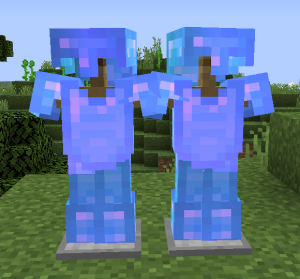
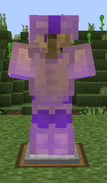
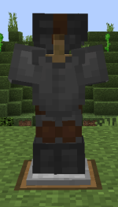
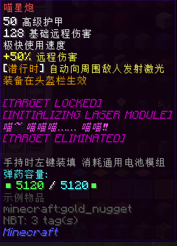
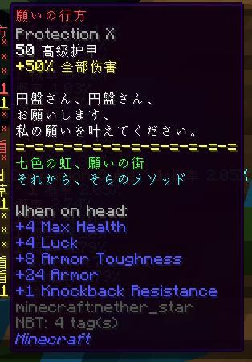

# 防具

**防具** 分为矿物装甲，Boss 装甲和其它装甲。

矿物装甲会根据不同的头盔提供不同职业的加成；Boss 装甲则是由 Boss 的掉落物兑换获得；而其它装甲包括部分套装，也有很多散件的装备，可以随心搭配。
对于矿物装备的头盔，战士（头盔）具有最高的防御力；其次是法师（头饰/帽）和射手（面具）；而召唤师（头箍）的防御力最低。

所有的防具都使用**金刚石**修复。

初始附魔不会在消魔过程中被清除，但照旧消耗消魔石。

感谢各位玩家在收集数据时提供的帮助。

## 目录

- [矿物装甲](#矿物装甲)
  + [T1 粗铁套/T1+ 铁套](#T1)
  + [T2 精铁套/T2+ 淬火/精钢套](#T2)
  + [T3 纯金套/T3+ 精金套](#T3)
  + [T4 魔金套/T4+ 暗金套](#T4)
  + [T5 蓝钻套/T5+ 星钻套](#T5)
- [Boss 装甲](#Boss-装甲)
  + [拉玛套](#拉玛套)
  + [古木套](#古木套)
  + [冰钻套](#冰钻套)
  + [刺客/Altaïr 套](#altaïr-套)
  + [牧师/神圣套](#神圣套)
  + [铁御套](#铁御套)
  + [耀斑套](#耀斑套)
  + [星璇套](#星璇套)
  + [星尘套](#星尘套)
- [其它套装](#其它套装)
  + [朴实套](#朴实套)
  + [Ezio 套](#ezio-套)
  + [暮光套](#暮光套)
- [散件](#散件)
  + [喵星炮](#喵星炮)
  + [お願いの行方](#お願いの行方)

## 矿物装甲

### T1

#### 粗铁套

- **护甲值**：均为入门级
- **加成**
  + **头盔**：近战伤害+20%
  + **面具**：远程伤害+20%
  + **帽**：魔法伤害+20%
  + **头箍**：仆从上限+2
- **初始附魔**：保护 III
- **耐久**：500
- **获取方式**：
  + **融合制造**
    * 单职业：10x 粗铁矿物块 + 5x 远古布匹；全都要：22x 粗铁矿物块 + 11x 远古布匹。
  + **NPC 兑换**：所有部件均可在月曜城的工匠作坊兑换。

#### 铁套

- **护甲值**：均为入门级
- **加成**：
  + **头盔**：近战伤害+25%
  + **面具**：远程伤害+25%
  + **头饰**：魔法伤害+25%
  + **头箍**：仆从上限+3，召唤伤害+5%
- **初始附魔**：保护 IV
- **耐久**：600
- **获取方式**：
  + **融合制造**
    * 单职业：20x 粗铁矿物块 + 8x 破损弩弦；
    * 全都要：44x 粗铁矿物块 + 14x 破损弩弦。
  + **融合升级**：由粗铁套升级。
    * 单职业：11x 粗铁矿物块 + 4x 破损弩弦；
    * 全都升级：26x 粗铁矿物块 + 7x 破损弩弦。
  + **NPC 兑换**：所有部件均可在月曜城的工匠作坊兑换。

### T2

#### 精铁套

- **护甲值**：均为基础级
- **加成**：
  + **头盔**：近战伤害+35%
  + **面具**：远程伤害+30%，潜行获得隐身 I
  + **头饰**：魔法伤害+30%，魔力上限+40
  + **头箍**：仆从上限+3
- **初始附魔**：保护 V
- **耐久**：1000
- **获取方式**：
  + **融合制造**
    * 单职业：15x 精铁矿物块 + 6x 活性火药；
    * 全都要：33x 精铁矿物块 + 15x 活性火药。
  + **融合升级**：由铁套升级。
    * 单职业：10x 精铁矿物块 + 5x 活性火药；
    * 全部升级：22x 精铁矿物块 + 11x 活性火药。
  + **NPC 兑换**
    * 除头箍以外：远梦华镇；
    * 头箍：枫之彼岸。

**淬火/精钢套**

- **护甲值**：均为基础级
- **加成**：
  + **淬火钢盔**：近战伤害+45%
  + **淬火面具**：远程伤害+40%，潜行获得隐身 II
  + **精钢头饰**：魔法伤害+40%，魔力上限+60
  + **精钢头箍**：仆从上限+3，召唤伤害+8%
- **初始附魔**：保护 V
- **耐久**：1800
- **获取方式**：
  + **融合制造**
    * 单职业：25x 精铁矿物块 + 10x 死亡草；
    * 全都要：55x 精铁矿物块 + 22x 死亡草。
  + **融合升级**：由精铁套升级。
    * 单职业：16x 精铁矿物块 + 5x 死亡草；
    * 全部升级：37x 精铁矿物块 + 11x 死亡草。
  + **NPC 兑换**
    * 除头箍以外：远梦华镇；
    * 头箍：枫之彼岸。

### T3

#### 纯金套

- **护甲值**：
  + **头盔**：32 高级护甲
  + **面具**：7 高级护甲
  + **头饰**：7 高级护甲
  + **头箍**：2 高级护甲
  + **其它部分**：基础护甲值
- **加成**：
  + **头盔**：近战伤害+60%，额外近战暴击+10%
  + **面具**：远程伤害+50%；潜行获得隐身 II ，额外远程伤害+10%
  + **头饰**：魔法伤害+50%，魔力上限+100，魔力攻击有几率偷取魔力
  + **头箍**：仆从上限+3，魔力上限+80，召唤伤害+15%
- **初始附魔**：保护 V
- **耐久**：2500
- **获取方式**：
  + **融合制造**
    * 单职业：30x 纯金矿物块 + 10x 炮弹残骸；
    * 全都要：66x 纯金矿物块 + 22x 炮弹残骸。
  + **融合升级**：由淬火/精钢套升级。
    * 单职业：20x 纯金矿物块 + 5x 炮弹残骸；
    * 全部升级：44x 纯金矿物块 + 11x 炮弹残骸。
  + **NPC 兑换**
    * 除头箍以外：千仞台；
    * 头箍：枫之彼岸。

#### 精金套

- **护甲值**：
  + **头盔**：33 高级护甲
  + **面具**：8 高级护甲
  + **头饰**：8 高级护甲
  + **头箍**：3 高级护甲
  + **其它部分**：各 9 高级护甲
- **加成**：
  + **头盔**：近战伤害+70%，额外近战暴击+15%
  + **面具**：远程伤害+60%；潜行获得隐身 II ，额外远程伤害+15%
  + **头饰**：魔法伤害+60%，魔力上限+140，魔力攻击有几率偷取魔力
  + **头箍**：仆从上限+3，魔力上限+100，召唤伤害+22%
- **初始附魔**：保护 V
- **耐久**： 3200
- **获取方式**：
  + **融合制造**
    * 单职业：60x 纯金矿物块 + 25x 浸毒蛛眼；
    * 全都要：132x 纯金矿物块 + 55x 浸毒蛛眼。
  + **融合升级**：由纯金套升级。
    * 单职业：40x 纯金矿物块 + 12x 浸毒蛛眼；
    * 全部升级：88x 纯金矿物块 + 30x 浸毒蛛眼。
  + **NPC 兑换**
    * 除头箍以外：千仞台；
    * 头箍：枫之彼岸。

### T4

#### 魔金套

- **护甲值**：
  + **头盔**：39 高级护甲
  + **面具**：14 高级护甲
  + **头饰**：14 高级护甲
  + **头箍**：5 高级护甲
  + **其它部分**：各 18 高级护甲
- **加成**：
  + **头盔**：近战伤害+80%，近战攻击额外吸取生命
  + **面具**：远程伤害+70%；潜行获得隐身 III ，额外远程伤害+20%
  + **头饰**：魔法伤害+70%，魔力上限+180，魔力攻击几率使敌人失明
  + **头箍**：仆从上限+4，魔力上限+120，召唤伤害+8%，攻击释放黑暗之魂追踪目标
- **初始附魔**：保护 V
- **耐久**：4000
- **获取方式**：
  + **融合制造**
    * 单职业：50x 魔金矿物块 + 25x 小玩偶；
    * 全都要：110x 魔金矿物块 + 49x 小玩偶。
  + **融合升级**：由精金套升级。
    * 单职业：31x 魔金矿物块 + 10x 小玩偶；
    * 全部升级：70x 魔金矿物块 + 22x 小玩偶。
  + **NPC 兑换**
    * 除头箍以外：上野神社；
    * 头箍：枫之彼岸。

#### 暗金套

- **护甲值**：
  + **头盔**：42 高级护甲
  + **面具**：17 高级护甲
  + **头饰**：17 高级护甲
  + **头箍**：8 高级护甲
  + **其它部分**：各 30 高级护甲
- **加成**：
  + **头盔**：近战伤害+85%，近战攻击额外吸取生命
  + **面具**：远程伤害+75%；潜行获得隐身 III ，额外远程伤害+25%
  + **头饰**：魔法伤害+75%，魔力上限+220，魔力攻击几率使敌人失明
  + **头箍**：仆从上限+4，魔力上限+140，召唤伤害+12%，攻击释放黑暗之魂追踪目标
- **初始附魔**：保护 V
- **耐久**：5000
- **获取方式**：
  + **融合制造**
    * 单职业：100x 魔金矿物块 + 30x 破损的枪械零件；
    * 全都要：220x 魔金矿物块 + 66x 破损的枪械零件。
  + **融合升级**：可由魔金套升级。
    * 单职业：64x 魔金矿物块 + 15x 破损的枪械零件；
    * 全部升级：139x 魔金矿物块 + 33x 破损的枪械零件。
  + **NPC 兑换**
    * 除头箍以外：上野神社；
    * 头箍：枫之彼岸。

### T5

#### 蓝钻套

- **护甲值**：
  + **头盔**：48 高级护甲
  + **面具**：26 高级护甲
  + **头饰**：26 高级护甲
  + **头箍**：14 高级护甲
  + **其它部分**：各 42 高级护甲
- **加成**：
  + **头盔**：近战伤害+90%，近战攻击能获得护盾抵挡一次伤害
  + **面具**：远程伤害+80%；潜行获得隐身 IV ，远程攻击释放暗影箭追踪敌人
  + **头饰**：魔法伤害+80%，魔力上限+260，受攻击后恢复魔力
  + **头箍**：仆从上限+4，魔力上限+150，召唤伤害+15%，仆从攻击时 50%短暂震慑敌人
- **初始附魔**：保护 V
- **耐久**：6400
- **获取方式**：
  + **融合制造**
    * 单职业：80x 蓝钻矿物块 + 30x 巨大蛛网；
    * 大人的选择：176x 蓝钻矿物块 + 66x 巨大蛛网。
  + **融合升级**：由暗金套升级。
    * 单职业：51x 蓝钻矿物块 + 15x 巨大蛛网；
    * 大人的选择：114x 蓝钻矿物块 + 33x 巨大蛛网。
  + **NPC 兑换**
    * 除头箍以外：摩多地下；
    * 头箍：枫之彼岸。

#### 星钻套

- **护甲值**：
  + **头盔**：54 高级护甲
  + **面具**：32 高级护甲
  + **头饰**：32 高级护甲
  + **头箍**：18 高级护甲
  + **其它部分**：各 57 高级护甲
- **加成**：
  + **头盔**：近战伤害+95%，免疫缓慢，近战攻击能获得护盾抵挡一次伤害
  + **面具**：远程伤害+85%，免疫失明；潜行获得隐身 IV ，远程攻击释放暗影箭追踪敌人
  + **头饰**：魔法伤害+85%，免疫凋零，魔力上限+300，受攻击后恢复魔力
  + **头箍**：仆从上限+4，魔力上限+160，召唤伤害+18%，免疫中毒，仆从攻击时 50%短暂震慑敌人
- **初始附魔**：保护 V
- **耐久**：7200
- **获取方式**：
  + **融合制造**
    * 单职业：160x 蓝钻矿物块 + 60x 亡灵幻影；
    * 肝帝的选择：352x 蓝钻矿物块 + 132x 亡灵幻影。
  + **融合升级**：由蓝钻套升级。
    * 单职业：106x 蓝钻矿物块 + 30x 亡灵幻影；
    * 肝帝的选择：235x 蓝钻矿物块 + 66x 亡灵幻影。
  + **NPC 兑换**
    * 除头箍以外：摩多地下；
    * 头箍：枫之彼岸。

## Boss 装甲

#### 拉玛套

- **所属 Boss**：拉玛族长 lv.12
- **可用职业**：全职业
- **等级**: T3
- **护甲值**：
  + **草笠**：15 高级护甲
  + **衰草披风**：10 高级护甲
  + **兽皮护膝**：10 高级护甲
  + **草靴**：10 高级护甲
- **加成**：
  + **套装加成**：全部伤害+50%，攻击能够短暂震撼敌人
  + **草靴**：极大幅度增加移动速度
- **初始附魔**：保护 V
- **耐久**：3200
- **获取方式**：
  + **融合制造**：36x 上等干草块
  + **NPC 兑换**：上野神社

#### 古木套

- **所属 Boss**：BadAnkou lv.16
- **职业**：全职业
- **等级**: T4+
- **护甲值**：
  + **古木头饰**：30 高级护甲
  + **古木护胸**：32 高级护甲
  + **古木护膝**：32 高级护甲
  + **古木靴**：32 高级护甲
- **加成**：
  + **套装加成**：全部伤害+65%，魔力上限+100，免疫中毒，凋零
  + **古木靴**：很大幅度增加移动速度
- **初始附魔**：保护 V
- **耐久**：5000
- **获取方式**：
  + **融合制造**：48x 神树古木
  + **NPC 兑换**：千仞台大门 2 层

#### 冰钻套

- **所属 Boss**：熊大 lv.20
- **职业**：全职业
- **等级**: T5+
- **护甲值**：
  + **冰钻头盔**：40 高级护甲
  + **冰钻胸甲**：60 高级护甲
  + **冰钻护腿**：60 高级护甲
  + **冰钻靴**：60 高级护甲
- **加成**：
  + **套装加成**：全部伤害+75%，魔力上限+180，生命值低于 10 点时获得吸收伤害的护盾
  + **冰钻靴**：很大幅度增加移动速度
- **初始附魔**：保护 V
- **耐久**：7200
- **获取方式**：
  + **融合制造**：48x 寒霜核，24x 蓝钻矿物块
  + **NPC 兑换**：劫掠山庄

#### Altaïr 套

- **所属 Boss**：空洞王 lv.24
- **职业**：战士/刺客
- **等级**: T5+
- **护甲值**：
  + **Helmet of Altaïr**：56 高级护甲
  + **Chestplate of Altaïr**：60 高级护甲
  + **Leggings of Altaïr**：60 高级护甲
  + **Boots of Altaïr**：60 高级护甲
- **加成**：
  + **套装加成**：近战伤害+100%，近战攻击获得额外怒气值；脱离战斗后获得隐身，之后首次近战攻击伤害翻倍。
  + **Boots of Altaïr**：很大幅度增加移动速度
- **初始附魔**：无
- **耐久**：无法破坏
- **获取方式**：
  + **合成**：144x 空洞黑暗立方，16x 精炼蓝钻，16x 黑色染料（注：暗黑之灵的掉落物），16x 暗黑十字章，16x 诅咒之书，16x 大大卷。

#### 神圣套

- **所属 Boss**：光明王 lv.24
- **职业**：牧师/法师
- **等级**: T5+
- **护甲值**：
  + **神圣头饰**：52 高级护甲
  + **神圣胸甲**：64 高级护甲
  + **神圣护腿**：64 高级护甲
  + **神圣靴**：64 高级护甲
- **加成**：
  + **套装加成**：全部伤害+40%，魔力上限+400，**无法获得怒气值**，未受攻击时持续回复自身生命，攻击时少量回复附近的其他玩家，潜行时消耗魔力治疗大范围内所有其他玩家。
- **初始附魔**：无
- **耐久**：7200
- **获取方式**：
  + **合成**：128x 神圣光明立方，16x 精炼蓝钻，4x 雪球精灵，4x 灵液球，4x 冷晶，4x 火焰尘。

#### 铁御套

- **所属 Boss**：光明王 lv.24，空洞王 lv.24，铁皮武士 lv.24，火星咕噜怪 lv.23
- **职业**：全职业
- **等级**: T5+
- **护甲值**：
  + **铁御头盔**：80 高级护甲
  + **铁御板甲**：70 高级护甲
  + **铁御护腿**：70 高级护甲
  + **铁御战靴**：70 高级护甲
- **加成**：
  + **套装加成**：25%概率抵挡受到的伤害；可防止一次死亡，冷却时间 240 秒。
  + **铁御头盔**：抵抗击退，**减缓移动速度**。
- **初始附魔**：无
- **耐久**：7200
- **获取方式**：
  + **融合升级**：由朴实套升级。48x 精炼蓝钻，12x 火星岩块，12x 空洞黑暗立方，12x 神圣光明立方，12x 精雕翡翠石块。

#### 耀斑套

- **所属 Boss**：火星咕噜怪 lv.23
- **职业**：战士
- **等级**: T5+
- **护甲值**：
  + **耀斑头盔**：64 高级护甲
  + **耀斑胸甲**：72 高级护甲
  + **耀斑护腿**：72 高级护甲
  + **耀斑长靴**：72 高级护甲
- **加成**：
  + **套装加成**：近战伤害+90%，怒气值提供额外防御和暴击；冲刺时释放耀斑幻影击退敌人
  + **耀斑长靴**：小幅度增加移动速度
- **初始附魔**：保护 V
- **耐久**：7200
- **获取方式**：
  + **融合制造**：128x 火星岩块，256x 蓝钻矿物块
  + **NPC 兑换**：海贼之家

!> 在主世界请勿穿着整套耀斑套装，冲刺技能可能会误伤其它玩家。

#### 星璇套

- **所属 Boss**：星璇火枪手 lv.22
- **职业**：射手
- **等级**: T5+
- **护甲值**：
  + **星璇头盔**：52 高级护甲
  + **星璇胸甲**：64 高级护甲
  + **星璇护腿**：64 高级护甲
  + **星璇靴**：64 高级护甲
- **加成**：
  + **套装加成**：远程伤害+60%，免疫失明，反胃；潜行时获得隐身 V 和夜视，怒气值提供额外暴击
- **初始附魔**：保护 V
- **耐久**：7200
- **获取方式**：
  + **融合制造**：128x 星璇碎块，256x 蓝钻矿物块
  + **NPC 兑换**：海贼之家

#### 星云套

- **所属 Boss**：暗精灵 lv.21
- **职业**：法师
- **等级**: T5+
- **护甲值**：
  + **星云兜帽**：52 高级护甲
  + **星云斗篷**：64 高级护甲
  + **星云护腿**：64 高级护甲
  + **星云靴子**：64 高级护甲
- **加成**：
  + **套装加成**：魔法伤害+40%，魔力上限+240；怒气将会提供攻击，生命，魔力加成
- **初始附魔**：保护 V
- **耐久**：7200
- **获取方式**：
  + **融合制造**：128x 精灵水晶，256x 蓝钻矿物块
  + **NPC 兑换**：神圣祭坛

#### 星尘套

- **所属 Boss**：姜王博士 lv.23
- **职业**：召唤师
- **等级**: T5+
- **护甲值**：
  + **星尘发饰**：32 高级护甲
  + **星尘胸甲**：58 高级护甲
  + **星尘护胫**：58 高级护甲
  + **星尘靴**：58 高级护甲
- **加成**：
  + **套装加成**：仆从上限+4，魔力上限+160， 召唤伤害+25%， 仆从攻击时50%几率短暂震撼敌人，仆从暴击率+10%，怒气召唤星尘环绕拦截入侵目标
- **初始附魔**：保护 V
- **耐久**：7200
- **获取方式**：
  + **融合制造**：128x 聚能核心，256x 蓝钻矿物块
  + **NPC 兑换**：圣怀特大教堂

## 其它套装

#### 朴实套

- **职业**：全职业
- **等级**: T5+
- **护甲值**：
  + **朴实无华的钻石头盔**：60 高级护甲
  + **朴实无华的钻石胸甲**：60 高级护甲
  + **朴实无华的钻石护腿**：60 高级护甲
  + **朴实无华的钻石靴**：60 高级护甲
- **加成**：无
- **初始附魔**：无
- **耐久**：7200
- **获取方式**：
  + **融合制造**：256x 蓝钻矿物块，16x 一元钞票
  + **NPC 兑换**：白熊平原

#### Ezio 套

- **职业**：射手
- **等级**: T5+
- **护甲值**：
  + **Helmet of Ezio**：32 高级护甲
  + **Chestplate of Ezio**：60 高级护甲
  + **Leggings of Ezio**：60 高级护甲
  + **Boots of Ezio**：60 高级护甲
- **加成**：
  + **套装加成**：远程伤害+100%，免疫发光，失明；脱离战斗后获得隐身，之后首次远程攻击伤害翻倍。
  + **Boots of Ezio**：小幅度增加移动速度
- **初始附魔**：无
- **耐久**：7200
- **获取方式**：
  + **融合升级**：由蓝钻射手套升级。8x 精炼蓝钻，24x 亡灵幻影，24x 海洋之魂

#### 暮光套

- **职业**：法师
- **等级**: T5+
- **护甲值**：
  + **暮光兜帽**：54 高级护甲
  + **暮光披风**：60 高级护甲
  + **暮光护胫**：60 高级护甲
  + **暮光长靴**：60 高级护甲
- **加成**：
  + **套装加成**：魔法伤害+200%，魔力上限+240；命中目标施展「暮光符咒」
- **初始附魔**：保护 V
- **耐久**：7200
- **获取方式**：
  + **融合升级**：256xT5 天界魔矿，4x 极蓝魂玉，20x 灵魂残片

## 散件

#### 喵星炮

展示：卷

- **职业**：射手
- **等级**: T5+
- **装备位置**：头部
- **护甲值**：50 高级护甲
- **加成**：远程伤害+50%，潜行时自动向周围敌人发射激光
- **使用速度**：极快
- **伤害**：128 基础远程伤害
- **弹药容量**：5120
- **补弹材料**：通用电池模组
- **初始附魔**：无
- **耐久**：不可破坏
- **获取方式**：
  + **合成**：1x 外星霰弹枪，1x 彩虹喵之刃，64x 精炼魔金，64x24K 纯金，64x 精炼蓝钻

#### お願いの行方

!> 这是一件需要装备在身上的**辅助道具**，需要在辅助道具池铸造获得。

展示：弐叁

- **职业**：全职业
- **等级**: T5+
- **装备位置**：头部
- **护甲值**：50 高级护甲
- **加成**：全部伤害+50%；最大生命值+4，幸运+4，装甲韧性+8，护甲+24，击退抗性+1
- **初始附魔**：保护 X
- **耐久**：不可破坏
- **获取方式**：T5 白池铸造
