# 魔法武器

**魔法武器**是指使用魔力的武器。魔力初始值为 20 ，需要使用对应**盔甲**，**辅助道具**或**天界碎片**提高魔力值上限。

魔法武器一般无需修复。但是部分 **Boss 武器**需要使用 Boss 掉落物兑换专用材料充能。

大多数魔法武器都可以通过铸造获得，部分武器可以通过合成升级。**Boss 武器**需要合成或者兑换，**活动武器**只能使用图纸合成获得。最新版红花火已经必须要合成获得。

初始附魔不会在消魔过程中被清除，但照旧消耗消魔石。

感谢各位玩家在数据收集时提供的帮助。

!> 请勿在主世界内随意玩耍inf武器，可能误伤玩家或使他人财产受到损失。

## 目录

- [铸造武器](#铸造武器)
  + [T1](#T1)
  + [T2](#T2)
  + [T3](#T3)
  + [T4](#T4)
  + [T5](#T5)
  + [T5+](#T5-红名)
- [合成武器](#合成武器)
- [Boss 武器](#Boss-武器)
- [活动武器](#活动武器)

## 铸造武器

### T1

#### 水晶风暴

- **伤害**：25
- **使用速度**: 较快
- **魔力消耗**：5
- **暴击率**：无
- **效果**：召唤水晶风暴攻击视野内目标，索敌范围 12 ，锁定目标 3
- **获得方式**：
  + **铸造**：
    * T1 ：4x T1 天界魔矿起

#### 黄金雨

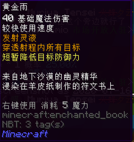

- **伤害**：40
- **使用速度**: 较快
- **魔力消耗**：5
- **暴击率**：无
- **效果**：发射灵液，穿透射程内目标，短暂降低目标防御力
- **获得方式**：
  + **铸造**：
    * T1 ：4x T1 天界魔矿起

#### 花火

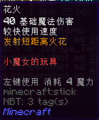

- **伤害**：40
- **使用速度**: 较快
- **魔力消耗**：4
- **暴击率**：无
- **效果**：发射短距离火花
- **获得方式**：
  + **铸造**：
    * T1 ：4x T1 天界魔矿起

#### 魔术火把

- **伤害**：40
- **使用速度**: 较快
- **魔力消耗**：3
- **暴击率**：无
- **效果**：发射无重力的魔法火把，点燃敌人
- **获得方式**：
  + **铸造**：
    * T1 ：4x T1 天界魔矿起

### T2

#### 电粒子法杖

- **伤害**：40
- **使用速度**: 极快
- **魔力消耗**：5
- **暴击率**：无
- **效果**：发射短距离电子束，穿透射程内目标
- **获得方式**：
  + **铸造**：
    * T1 ：16x T1 天界魔矿起
    * T2 ：6x T2 天界魔矿起
  + **合成**：
    * 由**魔术火把**升级，消耗 8x 精铁矿物块，12x T1 天界魔矿

#### 花火

- **伤害**：80
- **使用速度**: 较快
- **魔力消耗**：5
- **暴击率**：无
- **效果**：发射中程火花
- **获得方式**：
  + **铸造**：
    * T1 ：16x T1 天界魔矿起
    * T2 ：6x T2 天界魔矿起
  + **合成**：
    * 由 **T1 花火**升级，消耗 8x 精铁矿物块，12x T1 天界魔矿

#### 黄金雨 R

- **伤害**：80
- **使用速度**: 较快
- **魔力消耗**：8
- **暴击率**：无
- **效果**：发射灵液，穿透射程内目标，短暂降低目标防御力
- **获得方式**：
  + **铸造**：
  + T2 ：8x T2 天界魔矿起
  + **合成**：
    * 由**黄金雨**升级，消耗 8x 精铁矿物块，12x T1 天界魔矿

#### 水晶风暴 R

- **伤害**：50
- **使用速度**: 较快
- **魔力消耗**：8
- **暴击率**：无
- **效果**：召唤水晶风暴攻击视野内目标，索敌范围 16 ，锁定目标 5
- **获得方式**：
  + **铸造**：
    * T2 ：12x T2 天界魔矿起
  + **合成**：
    * 由**水晶风暴**升级，消耗 8x 精铁矿物块，12x T1 天界魔矿

### T3

#### 霜冰法杖

- **伤害**：60
- **使用速度**: 极快
- **魔力消耗**：6
- **暴击率**：20%
- **效果**：发射小霜冰球，对目标造成震慑
- **获得方式**：
  + **铸造**：
    * T2 ：24x T2 天界魔矿起
    * T3 ：14x T3 天界魔矿起
  + **合成**：
    * 由**电粒子法杖**升级，消耗 12x 纯金矿物块，28x T2 天界魔矿，2x 灵魂残片，3x 远古布匹，2x 活性火药和 3x 破损弩弦

#### 花火

- **伤害**：120
- **使用速度**: 较快
- **魔力消耗**：6
- **暴击率**：无
- **效果**：发射远距离火花，使目标发光
- **获得方式**：
  + **铸造**：
    * T2 ：24x T2 天界魔矿起
    * T3 ：10x T3 天界魔矿起
  + **合成**：
    * 由 **T2 花火**升级，消耗 12x 纯金矿物块，20x T2 天界魔矿，2x 灵魂残片，4x 远古布匹和 4x 破损弩弦

#### 黄金雨 SR

- **伤害**：120
- **使用速度**: 很快
- **魔力消耗**：10
- **暴击率**：无
- **效果**：发射灵液，穿透射程内目标，短暂降低目标防御力
- **获得方式**：
  + **铸造**：
    * T3 ：20x T3 天界魔矿起
  + **合成**：
    * 由**黄金雨 R** 升级，消耗 12x 纯金矿物块，40x T2 天界魔矿，2x 灵魂残片，4x 远古布匹和 4x 破损弩弦

#### 水晶风暴 SR

- **伤害**：75
- **使用速度**: 较快
- **魔力消耗**：10
- **暴击率**：15% ，伤害 x1.5
- **效果**：召唤水晶风暴攻击视野内目标，索敌范围 20 ，锁定目标 7
- **获得方式**：
  + **铸造**：
    * T3 ：20x T3 天界魔矿起
  + **合成**：
    * 由**水晶风暴 R** 升级，消耗 12x 纯金矿物块，40x T2 天界魔矿，2x 灵魂残片，4x 远古布匹和 4x 破损弩弦

#### 雾雨火花

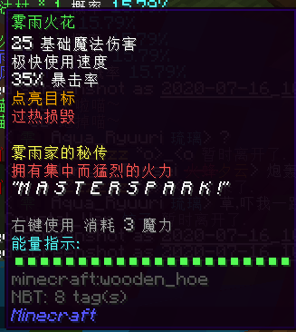

- **伤害**：25
- **使用速度**: 极快
- **魔力消耗**：3
- **暴击率**：35%
- **效果**：发射漂浮弹
- **获得方式**：
  + **铸造**：
    * T3 ：10x T3 天界魔矿起

#### 水晶巫士之剑

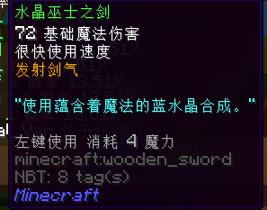

- **伤害**：72
- **使用速度**: 很快
- **魔力消耗**：4
- **暴击率**：无
- **效果**：发射剑气
- **获得方式**：
   + **铸造**：
    * T3 ：20x T3 天界魔矿起

#### 七彩画笔

- **伤害**：5
- **使用速度**: 极快
- **魔力消耗**：4
- **暴击率**：75%
- **效果**：划出七彩线条追踪敌人，伤害随颜色变化，可以穿墙
- **获得方式**：
   + **铸造**：
    * T3 ：20x T3 天界魔矿起

#### 龙牙火箭炮

- **伤害**：40
- **使用速度**: 较慢
- **魔力消耗**：左键单发消耗 5 点魔力，右键五连发消耗 15 点魔力
- **暴击率**：35%
- **效果**：发射龙牙火箭弹追踪目标
- **获得方式**：
  + **铸造**：
    * T3 ：20x T3 天界魔矿起

#### 毒液枪

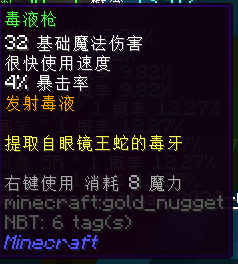

- **伤害**：32
- **使用速度**: 很快
- **魔力消耗**：8
- **暴击率**：4%
- **效果**：发射毒液
- **获得方式**：
  + **铸造**：
    * T3 ：26x T3 天界魔矿起

#### 《艾格尼丝纳特的精良准确预言集》

- **伤害**：200
- **使用速度**: 极慢（能量条恢复后才能再次使用）
- **魔力消耗**：20
- **暴击率**：无
- **附魔**：消失诅咒
- **效果**：造成大量伤害
- **获得方式**：
  + **铸造**：
    * T3 ：30x T3 天界魔矿起

### T4

#### 花火

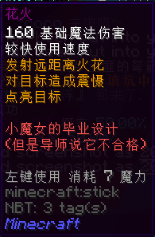

- **伤害**：160
- **使用速度**: 较快
- **魔力消耗**：7
- **暴击率**：无
- **效果**：发射远距离火花，使目标发光并震慑目标
- **获得方式**：
  + **铸造**：
    * T4 ：14x 天界魔矿起
  + **合成**：
    * 由 **T3 花火**升级，消耗 16x 魔金矿物块，28x T3 天界魔矿，6x 灵魂残片，8x 死亡草和 8x 炮弹残骸

#### 水龙弹

- **伤害**：180
- **使用速度**: 较快
- **魔力消耗**：10
- **暴击率**：无
- **效果**：发射水龙弹，穿透射程中所有目标，使目标长时间眩晕
- **获得方式**：
  + **铸造**：
    * T3 ：32x T3 天界魔矿起
    * T4 ：30x T4 天界魔矿起
  + **合成**：
    * 由**龙牙火箭炮**升级，消耗 16x 魔金矿物块，60x T3 天界魔矿，6x 灵魂残片，6x 死亡草，4x 浸毒蛛眼和 6x 炮弹残骸

#### 腐化法杖

- **伤害**：120
- **使用速度**: 较慢
- **魔力消耗**：12
- **暴击率**：15%
- **效果**：左键喷射毒液，命中后敌人获得腐蚀状态 20 秒，腐蚀状态下受到的所有伤害 +60%
- **获得方式**：
  + **铸造**：
    * T4 ：24x T4 天界魔矿起
    * T5 ：24x T5 天界魔矿起
  + **合成**：
    * 由**毒液枪**升级，消耗 16x 魔金矿物块，48x T3 天界魔矿，6x 灵魂残片，6x 死亡草，4x 浸毒蛛眼和 6x 炮弹残骸

#### 暴雪法杖

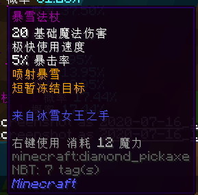

- **伤害**：20
- **使用速度**: 极快
- **魔力消耗**：12
- **暴击率**：5%
- **效果**：喷射暴雪，短暂冻结目标
- **获得方式**：
  + **铸造**：
    * T4 ：30x T4 天界魔矿起
  + **合成**：
    * 由**霜冰法杖**升级，消耗 16x 魔金矿物块，60x T3 天界魔矿，6x 灵魂残片，8x 死亡草和 8x 炮弹残骸

#### 七彩画笔

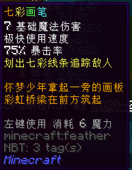

- **伤害**：7
- **使用速度**: 极快
- **魔力消耗**：6
- **暴击率**：75%
- **效果**：划出七彩线条追踪敌人，伤害随颜色变化，可以穿墙
- **获得方式**：
  + **铸造**：
    * T4 ：32x T4 天界魔矿起
  + **合成**：
    * 由 **T3 七彩画笔**升级，消耗 16x 魔金矿物块，64x T3 天界魔矿，6x 灵魂残片，8x 死亡草和 8x 炮弹残骸

#### 水晶风暴 X

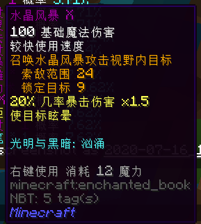

- **伤害**：100
- **使用速度**: 较快
- **魔力消耗**：12
- **暴击率**：20% ，伤害 x1.5
- **效果**：召唤水晶风暴攻击视野内目标，索敌范围 24 ，锁定目标 9 ，使目标眩晕
- **获得方式**：
  + **铸造**：
    * T4 ：32x T4 天界魔矿起
  + **合成**：
    * 由**水晶风暴 SR** 升级，消耗 16x 魔金矿物块，64x T3 天界魔矿，6x 灵魂残片，8x 死亡草和 8x 炮弹残骸

#### 黄金雨 X

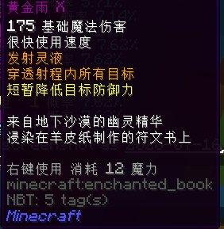

- **伤害**：175
- **使用速度**: 很快
- **魔力消耗**：12
- **暴击率**：无
- **效果**：发射灵液，穿透射程内目标，短暂降低目标防御力
- **获得方式**：
  + **铸造**：
    * T4 ：32x T4 天界魔矿起
  + **合成**：
    * 由**黄金雨 SR** 升级，消耗 16x 魔金矿物块，64x T3 天界魔矿，6x 灵魂残片，8x 死亡草和 8x 炮弹残骸

#### 慧慧的法杖

- **伤害**：1024
- **使用速度**: 极慢（ 1200s 冷却）
- **魔力消耗**：全部魔力
- **暴击率**：无
- **效果**：释放技能「爆裂魔法」,引爆范围内所有生物，**并对自己造成不适**
- **获得方式**：
  + **铸造**：
    * T3 ：30x T3 天界魔矿起

#### 雷神之戟

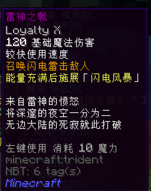

- **伤害**：120
- **使用速度**: 较快
- **魔力消耗**：10
- **暴击率**：无
- **附魔**：忠诚 X
- **效果**：召唤闪电雷击敌人，能量充满后施展「闪电风暴」
- **获得方式**：
  + **铸造**：
    * T3 ：30x T3 天界魔矿起

#### 风暴之灵

- **伤害**：120
- **使用速度**: 极快
- **魔力消耗**：6 ，50% 几率不消耗魔力值
- **暴击率**：无
- **效果**：横冲直撞并对身边敌人造成伤害
- **获得方式**：
  + **铸造**：
    * T3 ：32x T3 天界魔矿起
    * T4 ：30x T4 天界魔矿起

#### 相位移动术

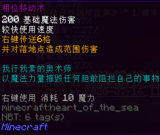

- **伤害**：200
- **使用速度**: 较快
- **魔力消耗**：10
- **暴击率**：无
- **效果**：右键传送 6 格，并对落地点周围敌人造成范围伤害
- **获得方式**：
  + **铸造**：
    * T3 ：32x T3 天界魔矿起
    * T4 ：32x T4 天界魔矿起

#### 暗影焰刀

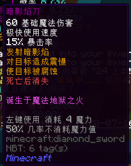

- **伤害**：60
- **使用速度**: 极快
- **魔力消耗**：4 ，50% 几率不消耗魔力值
- **暴击率**：15%
- **效果**：发射暗影焰，对目标造成震慑并腐蚀目标，**死亡后消失**
- **获得方式**：
  + **铸造**：
    * T4 ：14x T4 天界魔矿起

#### 星细胞法杖

- **伤害**：100
- **使用速度**: 很快
- **魔力消耗**：10 ，40% 几率不消耗魔力值
- **暴击率**：无
- **效果**：发射星细胞，穿透射程内所有目标，使目标被腐蚀并虚弱
- **获得方式**：
  + **铸造**：
    * T4 ：30x T4 天界魔矿起

#### 水晶锁链

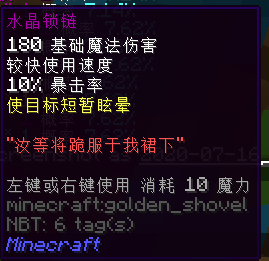

- **伤害**：180
- **使用速度**: 较快
- **魔力消耗**：10
- **暴击率**：10%
- **效果**：使目标短暂眩晕
- **获得方式**：
  + **铸造**：
    * T4 ：32x T4 天界魔矿起

#### 直线法杖

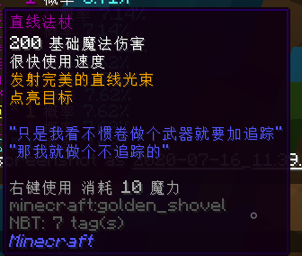

- **伤害**：200
- **使用速度**: 很快
- **魔力消耗**：10
- **暴击率**：无
- **效果**：发射直线光束，点亮目标
- **获得方式**：
  + **铸造**：
    * T4 ：32x T4 天界魔矿起

### T5

#### 花火

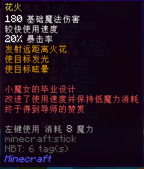

- **伤害**：180
- **使用速度**: 较快
- **魔力消耗**：8
- **暴击率**：20%
- **效果**：发射远距离火花，使目标发光，眩晕
- **获得方式**：
  + **铸造**：
    * T4 ：56x T4 天界魔矿起
    * T5 ：20x T5 天界魔矿起
  + **合成**：
    * 由 **T4 花火**升级，消耗 24x 蓝钻矿物块，40x T4 天界魔矿，12x 灵魂残片，16x 小玩偶和 16x 浸毒蛛眼

#### 叶绿法杖

- **伤害**：200
- **使用速度**: 很快
- **魔力消耗**：16 ，50% 几率不消耗魔力值
- **暴击率**：20%
- **效果**：发射叶绿魔法光束，使目标发光
- **获得方式**：
  + **铸造**：
    * T4 ：48x T4 天界魔矿起
    * T5 ：28x T5 天界魔矿起
  + **合成**：
    * 由**直线法杖**升级，消耗 24x 蓝钻矿物块，64x T4 天界魔矿，12x 灵魂残片，16x 小玩偶和 16x 巨大蛛网

#### 空间指向之杖

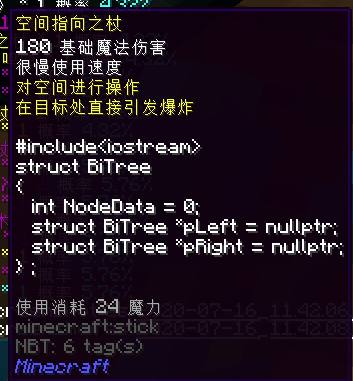

- **伤害**：328
- **使用速度**: 很慢
- **魔力消耗**：24
- **暴击率**：无
- **效果**：对空间进行操作，在目标处直接引发爆炸
- **获得方式**：
  + **铸造**：
    * T4 ：48x T4 天界魔矿起
    * T5 ：64x T5 天界魔矿起
  + **合成**：
    * 由** T4 花火**和**星细胞法杖**升级，消耗 24x 蓝钻矿物块，128x T4 天界魔矿，12x 灵魂残片，12x 亡灵幻影和 12x 巨大蛛网

#### 暗影束法杖

- **伤害**：200
- **使用速度**: 很快
- **魔力消耗**：16
- **暴击率**：无
- **效果**：发射远距离暗影光束，穿透射程内所有目标，遇到障碍物反弹
- **获得方式**：
  + **铸造**：
    * T4 ：48x T4 天界魔矿起
    * T5 ：32x T5 天界魔矿起
  + **合成**：
    * 由**暗影焰刀**升级，消耗 24x 蓝钻矿物块，64x T4 天界魔矿，12x 灵魂残片，16x 小玩偶和 16x 巨大蛛网

#### 奇妙法杖

- **伤害**：8
- **使用速度**: 较慢
- **魔力消耗**：18
- **暴击率**：？？？
- **效果**：发射奇妙光束，各有 10% 几率造成以下效果：震慑，发光，失明，凋零，中毒，吸血，沉默，混乱，破甲，虚弱，雷击，爆炸
- **获得方式**：
  + **铸造**：
    * T4 ：56x T4 天界魔矿起
    * T5 ：64x T5 天界魔矿起
  + **合成**：
    * 由**星细胞法杖**升级，消耗 24x 蓝钻矿物块，128x T4 天界魔矿，12x 灵魂残片，16x 小玩偶和 16x 巨大蛛网

#### 电弧法杖

- **伤害**：160
- **使用速度**: 很快
- **魔力消耗**：18
- **暴击率**：20%
- **效果**：发射短距离电弧，使目标眩晕
- **获得方式**：
  + **铸造**：
    * T4 ：56x T4 天界魔矿起
    * T5 ：28x T5 天界魔矿起
  + **合成**：
    * 由**水晶锁链**升级，消耗 24x 蓝钻矿物块，56x T4 天界魔矿，12x 灵魂残片，16x 小玩偶和 16x 巨大蛛网

#### 毘沙門天の宝塔

- **伤害**：88
- **使用速度**: 较慢
- **魔力消耗**：24
- **暴击率**：4%
- **效果**：攻击目标几率获得绿宝石
- **获得方式**：
  + **铸造**：
    * T5 ：20x T5 天界魔矿起
  + **合成**：
    * 由**风暴之灵**升级，消耗 24x 蓝钻矿物块，40x T4 天界魔矿，12x 灵魂残片，12x 小玩偶，12x 浸毒蛛眼和 8x 破损的枪械零件

#### 暗影利刃

- **伤害**：24
- **使用速度**: 疯狂
- **魔力消耗**：25
- **暴击率**：30%
- **效果**：发射锋利的暗影焰刃，使目标缓慢
- **获得方式**：
  + **铸造**：
    * T5 ：32x T5 天界魔矿起
  + **合成**：
    * 由**水龙弹**升级，消耗 24x 蓝钻矿物块，64x T4 天界魔矿，12x 灵魂残片，16x 小玩偶和 16x 巨大蛛网

#### 恶魔触手

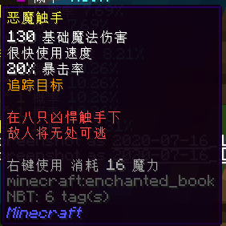

- **伤害**：130
- **使用速度**: 很快
- **魔力消耗**：16
- **暴击率**：20%
- **效果**：追踪目标
- **获得方式**：
  + **铸造**：
    * T5 ：32x T5 天界魔矿起
  + *合成**：
    * 由**腐化法杖**升级，消耗 24x 蓝钻矿物块，64x T4 天界魔矿，12x 灵魂残片，16x 小玩偶和 16x 巨大蛛网

#### 水晶风暴 EX

- **伤害**：125
- **使用速度**: 很快
- **魔力消耗**：16
- **暴击率**：30% ，伤害 x1.5
- **效果**：召唤水晶风暴攻击视野内目标，索敌范围 32 ，锁定目标 12 ，使目标眩晕
- **获得方式**：
  + **铸造**：
    * T5 ：40x T5 天界魔矿起
  + **合成**：
    * 由**水晶风暴 X** 升级，消耗 24x 蓝钻矿物块，80x T4 天界魔矿，12x 灵魂残片，16x 小玩偶和 16x 浸毒蛛眼

#### 黄金雨 EX

- **伤害**：220
- **使用速度**: 较快
- **魔力消耗**：16
- **暴击率**：无
- **效果**：发射灵液，穿透射程内目标，短暂降低目标防御力
- **获得方式**：
  + **铸造**：
    * T5 ：40x T5 天界魔矿起
  + **合成**：
    * 由**黄金雨 X** 升级，消耗 24x 蓝钻矿物块，80x T4 天界魔矿，12x 灵魂残片，16x 小玩偶和 16x 浸毒蛛眼

#### 魔法烟花

- **伤害**：180
- **使用速度**: 很慢
- **魔力消耗**：16
- **暴击率**：无
- **效果**：发射烟花弹，造成范围伤害
- **获得方式**：
  + **铸造**：
    * T5 ：48x T5 天界魔矿起
  + **合成**：
    * 由** T5 花火**升级，消耗 4x 精炼蓝钻

#### 闪电链法杖

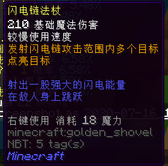

- **伤害**：210
- **使用速度**: 较慢
- **魔力消耗**：18
- **暴击率**：无
- **效果**：发射闪电链攻击范围内多个目标，点亮目标
- **获得方式**：
  + **铸造**：
    * T5 ：48x T5 天界魔矿起
  + **合成**：
    * 由**暴雪法杖**升级，消耗 24x 蓝钻矿物块，96x T4 天界魔矿，12x 灵魂残片，16x 小玩偶和 16x 巨大蛛网

#### 维度之杖

- **伤害**：64
- **使用速度**: 很慢
- **魔力消耗**：48
- **暴击率**：无
- **效果**：在目标点创立超立方体投影，吸取立方体内生命能量（注：不是吸血，只是造成伤害）
- **获得方式**：
  + **铸造**：
    * T5 ：64x T5 天界魔矿起
  + **合成**：
    * 由 **T4 花火**和**暴雪法杖**升级，消耗 24x 蓝钻矿物块，128x T4 天界魔矿，12x 灵魂残片，12x 小玩偶和 12x 巨大蛛网

#### 狱火叉

- **伤害**：144
- **使用速度**: 很慢
- **魔力消耗**：24
- **暴击率**：25%
- **效果**：左键发射狱火球，碰撞后爆炸并造成多段伤害，使目标发光
- **获得方式**：
  + **铸造**：
    * T5 ：64x T5 天界魔矿起
  + **合成**：
    * 由**雷神之戟**升级，消耗 24x 蓝钻矿物块，128x T4 天界魔矿，12x 灵魂残片，16x 巨大蛛网，16x 破损的枪械零件和 8x 浸毒蛛眼

#### 《启示录》

- **伤害**：400
- **使用速度**: 极慢（能量条恢复后可再次使用）
- **魔力消耗**：20
- **暴击率**：无
- **附魔**：消失诅咒
- **效果**：造成大量伤害
- **获得方式**：
  + **铸造**：
    * T4 ：32x T4 天界魔矿起
    * T5 ：24x T5 天界魔矿起
  + **合成**：
    * 由**《艾格尼丝纳特的精良准确预言集》**升级，消耗 16x 魔金矿物块，64x T3 天界魔矿，6x 灵魂残片，6x 死亡草，4x 浸毒蛛眼和 6x 炮弹残骸

#### 神圣火炬

- **伤害**：100
- **使用速度**: 很快
- **魔力消耗**：8
- **暴击率**：30%
- **效果**：左键发射神圣火球，右键施展AOE圣光之击。点亮目标，持有时免疫凋零
- **获得方式**：
  + **铸造**：
    * T4 ：32x T4 天界魔矿起
    * T5 ：24x T5 天界魔矿起

#### 绿宝石法杖

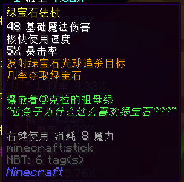

- **伤害**：48
- **使用速度**: 极快
- **魔力消耗**：8
- **暴击率**：5%
- **效果**：发射绿宝石光球追杀目标，几率夺取绿宝石
- **获得方式**：
  + **铸造**：
    * T4 ：48x T4 天界魔矿起
    * T5 ：24x T5 天界魔矿起

#### 棒棒糖☆奏鸣曲

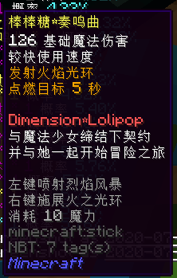

- **伤害**：126
- **使用速度**: 较快
- **魔力消耗**：10
- **暴击率**：无
- **效果**：左键喷射烈焰风暴，右键发射火焰光环。点燃目标 5 秒
- **获得方式**：
  + **铸造**：
    * T4 ：48x T4 天界魔矿起
    * T5 ：20x T5 天界魔矿起

#### 魔法飞刀

- **伤害**：72
- **使用速度**: 很快
- **魔力消耗**：12
- **暴击率**：16%
- **效果**：发射魔法飞刀追踪目标
- **获得方式**：
  + **铸造**：
    * T5 ：48x T5 天界魔矿起

#### 山荷叶

- **伤害**：82
- **使用速度**: 较快
- **魔力消耗**：12
- **暴击率**：积攒怒气值获得暴击
- **效果**：左键发射水滴离子束，右键使用水滴粒子云禁锢目标，潜行在能量充满时释放技能「雨」
- **获得方式**：
  + **铸造**：
    * T5 ：48x T5 天界魔矿起

#### 克雷贝尔狙击枪

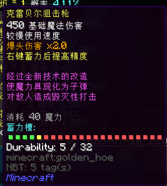

- **伤害**：450
- **使用速度**: 较慢
- **魔力消耗**：40
- **暴击率**：无
- **效果**：爆头伤害 x2.0 ，右键蓄力后提高精度
- **获得方式**：
  + **铸造**：
    * T5 ：48x T5 天界魔矿起

#### 犹大的誓约

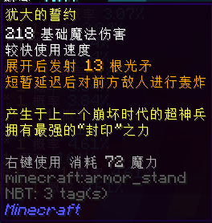

- **伤害**：218
- **使用速度**: 较快
- **魔力消耗**：72
- **暴击率**：无
- **效果**：展开后发射13根光矛，短暂延迟后对前方敌人进行轰炸
- **获得方式**：
  + **铸造**：
    * T5 ：64x T5 天界魔矿起

### T5 红名

#### 天界符

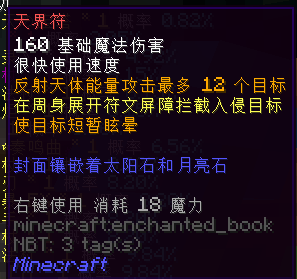

- **伤害**：160
- **使用速度**: 很快
- **魔力消耗**：18
- **暴击率**：无
- **效果**：反射天体能量攻击最多12个目标，在周身展开符文屏障拦截入侵目标，攻击使目标震慑
- **获得方式**：
  + **铸造**：
    * T5 ：40x T5 天界魔矿起
  + **合成**：
    * 由**月亮石**和**太阳石**升级，消耗 8x 精炼蓝钻，64x T5 天界魔矿，32x 灵魂残片，16x 被掠夺的宝藏和 16x 劫掠之心

#### 激光机枪

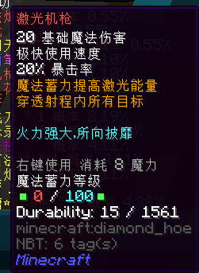

- **伤害**：20
- **使用速度**: 极快
- **魔力消耗**：6
- **暴击率**：20%
- **效果**：魔法蓄力大幅度提高精度与伤害，穿透所有射程内目标
- **获得方式**：
  + **铸造**：
    * T5 ：48x T5 天界魔矿起
  + **合成**：
    * 由**克雷贝尔狙击枪**升级，消耗 6x 精炼蓝钻，96x T5 天界魔矿，32x 灵魂残片，15x 火星岩块，15x 精雕翡翠石块

#### 雾雨火花·绽放

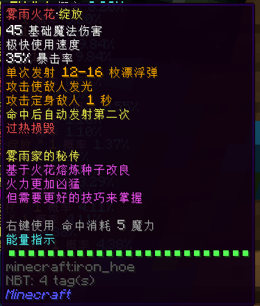

- **伤害**：45
- **使用速度**: 极快
- **魔力消耗**：8
- **暴击率**：40%
- **效果**：发射漂浮弹，「Master Spark」造成 260% 伤害，震慑敌人
- **获得方式**：
  + **铸造**：
    * T5 ：48x T5 天界魔矿起
  + **合成**：
    * 由**雾雨火花**，**魔法烟花**和 **T4 花火**升级，消耗 4x 精炼蓝钻，64x T5 天界魔矿，28x 灵魂残片，16x 狱火核心，8x 混沌元素

#### 七彩画笔

- **伤害**：10
- **使用速度**: 极快
- **魔力消耗**：12
- **暴击率**：75%
- **效果**：划出七彩线条追踪敌人，伤害随颜色变化，可以穿墙
- **获得方式**：
  + **铸造**：
    * T5 ：48x T5 天界魔矿起
  + **合成**：
    * 由 **T4 七彩画笔**升级，消耗 6x 精炼蓝钻，96x T5 天界魔矿，36x 灵魂残片，2x 一张银行卡，15x 火星岩块，15x 星璇碎块，10x 精灵水晶

#### 星云奥秘

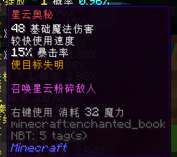

- **伤害**：112
- **使用速度**: 较快
- **魔力消耗**：32
- **暴击率**：16%
- **效果**：召唤星云，使目标失明，无视任何障碍
- **获得方式**：
  + **铸造**：
    * T5 ：64x T5 天界魔矿起
  + **合成**：
    * 由**暗影利刃**升级，消耗 2x 精炼蓝钻，64x T5 天界魔矿，24x 灵魂残片，1x 一张银行卡，16x 枯草，16x 木乃伊的绷带碎片，8x 破碎的铠甲

#### 星云水晶法杖

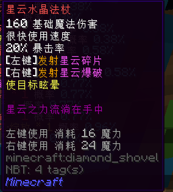

- **伤害**：125
- **使用速度**: 很快
- **魔力消耗**：左键消耗 16 魔力，右键消耗 24 魔力
- **暴击率**：20%
- **效果**：左键发射三发星云碎片跟踪敌人，右键发射星云爆破穿透敌人，造成 5 倍伤害，攻击使目标震慑
- **获得方式**：
  + **铸造**：
    * T5 ：64x T5 天界魔矿起
  + **合成**：
    * 由**水晶风暴 EX** 升级，消耗 6x 精炼蓝钻，96x T5 天界魔矿，32x 灵魂残片，1x 一张银行卡，16x 噬魂之眼，16x 暗影箭，8x 被压扁的黄金

#### 霊符「夢想封印」

- **伤害**：60
- **使用速度**: 很快
- **魔力消耗**：24
- **暴击率**：20%
- **效果**：发射符卡攻击目标，使目标震慑
- **获得方式**：
  + **铸造**：
    * T5 ：64x T5 天界魔矿起
  + **合成**：
    * 由**魔法烟花**升级，消耗 2x 精炼蓝钻，64x T5 天界魔矿，24x 灵魂残片，1x 一张银行卡，16x 剧毒药剂，16x 细胞样本，8x 大大卷

#### 星云闪耀

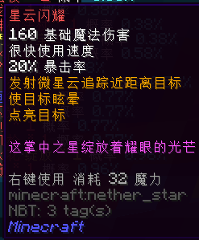

- **伤害**：160
- **使用速度**: 极慢
- **魔力消耗**：32
- **暴击率**：20%
- **效果**：发射微星云追踪近距离目标，攻击使目标震慑，发光
- **获得方式**：
   + **铸造**：
    * T5 ：64x T5 天界魔矿起
  + **合成**：
    * 由**魔法烟花**升级，消耗 8x 精炼蓝钻，128x T5 天界魔矿，40x 灵魂残片，2x 一张银行卡，15x 精雕翡翠石块，15x 星璇碎块，15x 精灵水晶

#### 生命木法杖

- **伤害**：72
- **使用速度**: 较快
- **魔力消耗**：32
- **暴击率**：无
- **效果**：释放生命火花，命中后提供大范围生命恢复
- **获得方式**：
  + **铸造**：
    * T5 ：64x T5 天界魔矿起
  + **合成**：
    * 由**生命木双叶**和 **T4 生命之种**升级，消耗 12x 精炼蓝钻，128x T5 天界魔矿，33x 灵魂残片，16x 灵液球，32x 细胞样本，16x 巨人之眼

#### 月之神树法杖

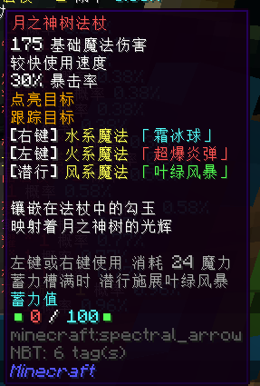

- **伤害**：96
- **使用速度**: 较快
- **魔力消耗**：左键消耗 24 魔力，右键消耗 18 魔力
- **暴击率**：25%
- **效果**：点亮目标，右键水系魔法「霜冰球」，左键火系魔法「炽炎集束」，蓄力槽满时潜行释放风系魔法「叶绿风暴」
- **获得方式**：
  + **铸造**：
    * T5 ：64x T5 天界魔矿起
  + **合成**：
    * 由**叶绿法杖**和 **T5 花火**升级，消耗 16x 精炼蓝钻，96x T5 天界魔矿，28x 灵魂残片，32x 末影尘，16x 灵液球，16x 诅咒之书

#### 超电磁炮

- **伤害**：200
- **使用速度**: 极慢
- **魔力消耗**：40
- **暴击率**：无
- **效果**：副手持**一文大钱**，右键抛掷硬币，充能达到最高时可以造成最高伤害。放射高压电流，贯穿途径所有目标
- **获得方式**：
  + **铸造**：
    * T5 ：48x T5 天界魔矿起

#### 小火龙

- **伤害**：320
- **使用速度**: 较慢
- **魔力消耗**：10
- **暴击率**：无
- **效果**：点燃并对前方所有敌人造成伤害，50% 使敌人进入灼伤状态，持续 10 秒，灼伤状态敌人受到的所有伤害翻倍，使用后自身进入灼伤状态 15 秒
- **获得方式**：
  + **铸造**：
    * T5 ：48x T5 天界魔矿起

#### 《诸世纪》

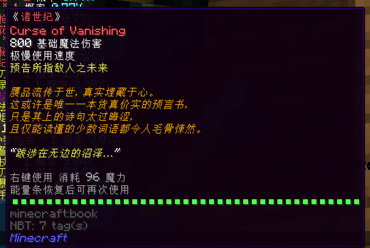

- **伤害**：800
- **使用速度**: 极慢（能量条恢复后可再次使用）
- **魔力消耗**：96
- **暴击率**：无
- **附魔**：消失诅咒
- **效果**：造成大量伤害
- **获得方式**：
  + **铸造**：
    * T5 ：64x T5 天界魔矿起

#### 火山法杖

- **伤害**：120
- **使用速度**: 很快
- **魔力消耗**：命中消耗 8 魔力
- **暴击率**：无
- **效果**：左键发射熔岩，命中后为法杖充能，能量满后右键释放「火山」，攻击力 +130% ，攻击范围增大，攻击间隔大幅度缩短，攻击变为对范围内至多 6 名敌人发射熔岩。魔力值空时大幅降低伤害
- **获得方式**：
  + **铸造**：
    * T5 ：64x T5 天界魔矿起

#### 日晷

- **伤害**：188
- **使用速度**: 很快
- **魔力消耗**：12
- **暴击率**：无
- **效果**：攻击使敌人沉默，怒气值充满时施展「狼魂」，攻击力 +120% 并能够攻击多个远处目标，且在双持时攻击 2 次
- **获得方式**：
  + **铸造**：
    * T5 ：64x T5 天界魔矿起

#### 月曜

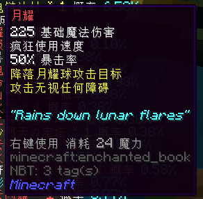

- **伤害**：225
- **使用速度**: 疯狂
- **魔力消耗**：24
- **暴击率**：50%
- **效果**：降落月曜球攻击目标，攻击无视任何障碍
- **获得方式**：
  + **铸造**：
    * T5 ：64x T5 天界魔矿起

#### 终极棱镜

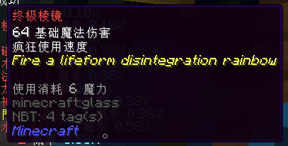

- **伤害**：64
- **使用速度**: 疯狂
- **魔力消耗**：6
- **暴击率**：无
- **效果**：Fire a lifeform disintegration rainbow
- **获得方式**：
  + **铸造**：
    * T5 ：64x T5 天界魔矿起

## 合成武器

#### 花火

- **等级**：T5+
- **伤害**：210
- **使用速度**: 极快
- **魔力消耗**：20
- **暴击率**：20%
- **效果**：三连发射远距离火花，火花命中后小范围爆炸，使目标震慑，发光，沉默
- **获得方式**：
  + **合成**：
    * 由 **T1-T5 花火**升级，消耗 32x 精炼蓝钻，32x 灵魂残片，4x 一张银行卡和 32x 火元素

## Boss 武器

#### 竹韵清风

- **所属 Boss** ：BadAnkou lv.16
- **等级**：T4+
- **伤害**：68
- **使用速度**: 极快
- **魔力消耗**：8
- **暴击率**：20%
- **能量上限**：800
- **充能材料**：新叶
- **效果**：右键奏响韵音，可能沉默，震慑敌人或吸取魔力值，怒气充满时潜行施展「乱弦」，**能量值耗尽时大幅度降低伤害**
- **获得方式**：
  + **兑换**：千仞台大门 2 层：40x 神树古木

#### 星云烈焰

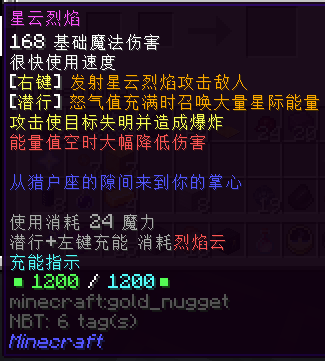

- **所属 Boss** ：暗精灵 lv.21
- **等级**：T5+
- **伤害**：168
- **使用速度**: 很快
- **魔力消耗**：24
- **暴击率**：无
- **能量上限**：1200
- **充能材料**：烈焰云
- **效果**：右键发射星云烈焰攻击敌人，怒气值充满时潜行召唤大量星际能量，攻击使目标失明并造成爆炸，**能量值空时大幅降低伤害**
- **获得方式**：
  + **兑换**：神圣祭坛：64x 精灵水晶

#### 神界书库

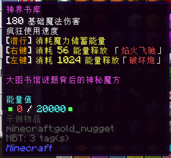

- **所属 Boss** ：光明王 lv.24
- **等级**：T5+
- **伤害**：180
- **使用速度**: 疯狂
- **魔力消耗**：潜行消耗魔力储蓄能量，右键消耗 56 能量，左键消耗 1024 能量
- **暴击率**：无
- **能量上限**：20000
- **效果**：右键释放「焰火飞驰」，左键释放「破坏炮」
- **获得方式**：
  + **合成**：64x 神圣光明立方，4x 精炼蓝钻，24x灵魂残片，16x 黑色染料，16x 雪球精灵

#### 天球仪

- **所属 Boss** ：光明王 lv.24
- **等级**：T5+
- **伤害**：24
- **使用速度**: 疯狂
- **魔力消耗**：命中消耗 2 魔力
- **暴击率**：无
- **效果**：持有时展开星图，持续攻击并驱逐范围内敌人，右键开启能量增幅 20 秒，禁锢范围内所有敌人，使其沉默，发光，震慑，并使其受到的伤害增加 60% ，**期间魔力消耗变为两倍**
- **获得方式**：
  + **合成**：64x 神圣光明立方，4x 精炼蓝钻，24x灵魂残片，32x 霜之星

## 活动武器

### 2020 年 劳动节活动

#### 魔箭

- **等级**：T3
- **伤害**：48
- **使用速度**: 较慢
- **魔力消耗**：16
- **暴击率**：无
- **效果**：左键发射两只追踪敌人的魔箭，右键在目标处召唤箭雨。攻击使敌人发光
- **获得方式**：
  + **合成**：1x 武器蓝图 - 魔箭，64x T3 天界魔矿， 2x 24K 纯金

#### 魔箭 S

- **等级**：T5
- **伤害**：148
- **使用速度**: 较慢
- **魔力消耗**：16
- **暴击率**：45%
- **效果**：左键发射两只追踪敌人的魔箭，右键在目标处召唤箭雨。攻击使敌人发光
- **获得方式**：
  + **合成**：由**魔箭**升级，消耗 1x 武器蓝图 - 魔箭，64x T5 天界魔矿， 2x 24K 纯金，2x 精炼魔金，2x 精炼蓝钻
