# 近战武器

近战武器是指以近距离作战为主，造成近战伤害的武器。

它们需要使用特定材料进行修复，并一般没有初始附魔。

大部分近战武器为铸造获得，小部分（包含 Boss 武器）需要合成或兑换获得。

感谢各位玩家在数据收集时提供的帮助。

!> 请勿在主世界内随意玩耍inf武器，可能误伤玩家或使他人财产受到损失。

## 目录

- [铸造武器](#铸造武器)
  + [T1](#T1)
  + [T2](#T2)
  + [T3](#T3)
  + [T4](#T4)
  + [T5](#T5)
  + [T5+](#T5红名)
- [合成武器](#合成武器)
- [Boss 武器](#Boss-武器)
- [活动武器](#活动武器)

## 铸造武器

### T1

#### 铜大剑

- **伤害**：36
- **使用速度**：较快
- **耐久**：150
- **修复材料**：精炼铁锭
- **暴击率**：5% 空降伤害 x1.5
- **效果**：近战攻击
- **获得方式**：
  + **铸造**：
    * T1 ：4x T1 天界魔矿起

#### 守卫者细剑

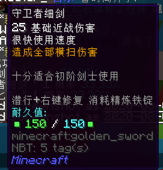

- **伤害**：25
- **使用速度**：很快
- **耐久**：150
- **修复材料**：精炼铁锭
- **暴击率**：无
- **效果**：造成全部横扫伤害
- **获得方式**：
  + **铸造**：
    * T1 ：4x T1 天界魔矿起

#### 护身匕首

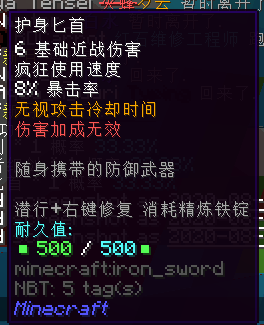

- **伤害**：6
- **使用速度**：疯狂
- **耐久**：500
- **修复材料**：精炼铁锭
- **暴击率**：8%
- **效果**：无视攻击冷却时间，**伤害加成无效**
- **获得方式**：
  + **铸造**：
    * T1 ：4x T1 天界魔矿起

### T2

#### 酒吧凶器

- **伤害**：9
- **使用速度**：疯狂
- **耐久**：600
- **修复材料**：精炼铁锭
- **暴击率**：10%
- **效果**：无视攻击冷却时间，造成全部横扫伤害
- **获得方式**：
  + **铸造**：
    * T1 ：16x T1 天界魔矿起
    * T2 ：6x T2 天界魔矿起
  + **合成**：
    * 由**护身匕首**升级，消耗 8x 精铁矿物块和 12x T1 天界魔矿

#### 铜铁巨剑

- **伤害**：50
- **使用速度**：较快
- **耐久**：200
- **修复材料**：精炼铁锭
- **暴击率**：空降伤害 x1.3
- **效果**：近战攻击
- **获得方式**：
  + **铸造**：
    * T1 ：16x T1 天界魔矿起
    * T2 ：6x T2 天界魔矿起
  + **合成**：
    * 由**铜大剑**升级，消耗 8x 精铁矿物块和 12x T1 天界魔矿

#### 高阶守卫者细剑

- **伤害**：40
- **使用速度**：很快
- **耐久**：200
- **修复材料**：精炼铁锭
- **暴击率**：无
- **效果**：造成全部横扫伤害
- **获得方式**：
  + **铸造**：
    * T1 ：16x T1 天界魔矿起
    * T2 ：6x T2 天界魔矿起
  + **合成**：
    * 由**守卫者细剑**升级，消耗 8x 精铁矿物块和 12x T1 天界魔矿

#### 远古石斧

- **伤害**：95
- **使用速度**：很慢
- **耐久**：250
- **修复材料**：精炼铁锭
- **暴击率**：无
- **效果**：近战攻击
- **获得方式**：
  + **铸造**：
    * T2 ：8x T2 天界魔矿起

### T3

#### 水晶毁灭之剑

- **伤害**：60
- **使用速度**：很快
- **耐久**：250
- **修复材料**：精炼铁锭
- **暴击率**：15%
- **效果**：造成全部横扫伤害，右键激活屏障力场与临时护盾，持续时间 5 秒
- **获得方式**：
  + **铸造**：
    * T2 ：24x T2 天界魔矿起
    * T3 ：10x T3 天界魔矿起
  + **合成**：
    * 由**高阶守卫者细剑**升级，消耗 12x 纯金矿物块，20x T2 天界魔矿，2x 灵魂残片和 8x 破损弩弦

#### 粉碎者

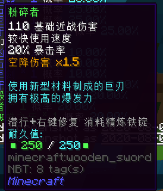

- **伤害**：110
- **使用速度**：较快
- **耐久**：250
- **修复材料**：精炼铁锭
- **暴击率**：20% ，空降伤害 x1.5
- **效果**：近战攻击
- **获得方式**：
  + **铸造**：
    * T2 ：24x T2 天界魔矿起
    * T3 ：10x T3 天界魔矿起
  + **合成**：
    * 由**铜铁巨剑**升级，消耗 12x 纯金矿物块，20x T2 天界魔矿，2x 灵魂残片和 8x 远古布匹

#### 水晶蜘蛛之牙

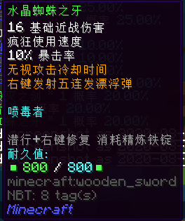

- **伤害**：16
- **使用速度**：疯狂
- **耐久**：800
- **修复材料**：精炼铁锭
- **暴击率**：10%
- **效果**：无视攻击冷却时间，右键发射五连发漂浮弹
- **获得方式**：
  + **铸造**：
    * T2 ：24x T2 天界魔矿起
    * T3 ：10x T3 天界魔矿起
  + **合成**：
    * 由**酒吧凶器**升级，消耗 12x 纯金矿物块，20x T2 天界魔矿，2x 灵魂残片，4x 破损弩弦和 4x 远古布匹

#### 绿宝石长剑

- **伤害**：69
- **使用速度**：很快
- **耐久**：250
- **修复材料**：精炼铁锭
- **暴击率**：10%
- **效果**：造成全部横扫伤害
- **获得方式**：
  + **铸造**：
    * T3 ：16x T3 天界魔矿起

#### 狂热战斧

- **伤害**：130
- **使用速度**：较慢
- **耐久**：250
- **修复材料**：精炼铁锭
- **暴击率**：空降伤害 x1.5%
- **效果**：近战攻击
- **获得方式**：
  + **铸造**：
    * T3 ：16x T3 天界魔矿起
  + **合成**：
    * 由**远古石斧**升级，消耗 12x 纯金矿物块，20x T2 天界魔矿，2x 灵魂残片和 8x 活性火药

#### 合気杖

- **伤害**：60
- **使用速度**：很快
- **耐久**：200
- **修复材料**：精炼铁锭
- **暴击率**：无
- **效果**：横扫所有近身目标
- **获得方式**：
  + **铸造**：
    * T3 ：16x T3 天界魔矿起

#### 孢子毒刃

- **伤害**：50
- **使用速度**：很快
- **耐久**：250
- **修复材料**：精炼铁锭
- **暴击率**：20%
- **效果**：造成全部横扫伤害，释放缓慢加速的剧毒孢子
- **获得方式**：
  + **铸造**：
    * T3 ：24x T3 天界魔矿起

#### 屠刀

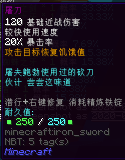

- **伤害**：120
- **使用速度**：较快
- **耐久**：250
- **修复材料**：精炼铁锭
- **暴击率**：20%
- **效果**：攻击目标恢复饥饿值
- **获得方式**：
  + **铸造**：
    * T3 ：16x T3 天界魔矿起

#### 闪烁匕首

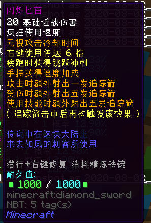

- **伤害**：20
- **使用速度**：疯狂
- **耐久**：1000
- **修复材料**：精炼铁锭
- **暴击率**：无
- **效果**：无视攻击冷却时间，右键使用传送 6 格，疾跑时获得跳跃冲刺，手持获得速度加成，攻击时额外射出一发追踪箭，受伤时额外射出五发追踪箭，使用技能时额外射出五发追踪箭（追踪箭击中后再次触发该效果）
- **获得方式**：
  + **铸造**：
    * T3 ：20x T3 天界魔矿起

#### 小狐丸

- **伤害**：15
- **使用速度**：疯狂
- **耐久**：600
- **修复材料**：精炼铁锭
- **暴击率**：15%
- **效果**：无视攻击冷却时间，右键发射 10 发漂浮弹
- **获得方式**：
  + **铸造**：
    * T3 ：20x T3 天界魔矿起

#### 齿樱·初生

- **伤害**：60
- **使用速度**：较快
- **耐久**：150
- **修复材料**：精炼铁锭
- **暴击率**：20%
- **效果**：攻击使敌人发光，被攻击的敌人 10 秒内额外受到 40% 伤害
- **获得方式**：
  + **铸造**：
    * T3 ：24x T3 天界魔矿起

### T4

#### 利刃

- **伤害**：70
- **使用速度**：很快
- **耐久**：250
- **修复材料**：精炼铁锭
- **暴击率**：20%
- **效果**：造成全部横扫伤害，吸取敌人生命 2% ，点亮目标
- **获得方式**：
  + **铸造**：
    * T3 ：36x T3 天界魔矿起
    * T4 ：14x T4 天界魔矿起
  + **合成**：
    * 由**水晶毁灭之剑**或**孢子毒刃**升级，消耗 16x 魔金矿物块，28x T3 天界魔矿，6x 灵魂残片，8x 死亡草和 8x 炮弹残骸

#### 灭鬼凶器

- **伤害**：75
- **使用速度**：较快
- **耐久**：250
- **修复材料**：精炼铁锭
- **暴击率**：15%
- **效果**：对目标造成震慑，手持获得临时护盾
- **获得方式**：
  + **铸造**：
    * T3 ：36x T3 天界魔矿起
    * T4 ：14x T4 天界魔矿起
  + **合成**：
    * 由**粉碎者**升级，消耗 16x 魔金矿物块，28x T3 天界魔矿，6x 灵魂残片，8x 死亡草和 8x 炮弹残骸

#### 恶魔之击

- **伤害**：20
- **使用速度**：疯狂
- **耐久**：800
- **修复材料**：精炼铁锭
- **暴击率**：50%
- **效果**：无视攻击冷却时间，对目标造成破甲伤害，右键对 24 范围目标造成震慑
- **获得方式**：
  + **铸造**：
    * T3 ：36x T3 天界魔矿起
    * T4 ：14x T4 天界魔矿起
  + **合成**：
    * 由**水晶蜘蛛之牙**升级，消耗 16x 魔金矿物块，28x T3 天界魔矿，6x 灵魂残片，8x 死亡草和 8x 炮弹残骸

#### 军团粉碎者

- **伤害**：85
- **使用速度**：较快
- **耐久**：250
- **修复材料**：金刚石
- **暴击率**：15%
- **效果**：对目标造成震慑；右键冲锋造成伤害并获得抗性，冷却时间 30 秒
- **获得方式**：
  + **铸造**：
    * T3 ：48x T3 天界魔矿起
    * T4 ：24x T4 天界魔矿起
  + **合成**：
    * 由**屠刀**升级，消耗 16x 魔金矿物块，60x T3 天界魔矿，6x 灵魂残片，6x 死亡草，4x 浸毒蛛眼和 6x 炮弹残骸
    * 由**粉碎者**升级，消耗 16x 魔金矿物块，48x T3 天界魔矿，6x 灵魂残片，6x 死亡草，4x 浸毒蛛眼和 6x 炮弹残骸

#### 月神镰刀

- **伤害**：90
- **使用速度**：很快
- **耐久**：250
- **修复材料**：精炼铁锭
- **暴击率**：20%
- **效果**：造成全部横扫伤害，点亮目标
- **获得方式**：
  + **铸造**：
    * T3 ：48x T3 天界魔矿起
    * T4 ：20x T4 天界魔矿起
  + **合成**：
    * 由**水晶毁灭之剑**升级，消耗 16x 魔金矿物块，40x T3 天界魔矿，6x 灵魂残片，6x 死亡草，4x 浸毒蛛眼和 6x 炮弹残骸

#### 小鳥丸

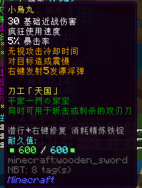

- **伤害**：30
- **使用速度**：疯狂
- **耐久**：600
- **修复材料**：精炼铁锭
- **暴击率**：5%
- **效果**：无视攻击冷却时间，对目标造成震慑，右键发射 5 发漂浮弹
- **获得方式**：
  + **铸造**：
    * T3 ：48x T3 天界魔矿起
    * T4 ：24x T4 天界魔矿起
  + **合成**：
    * 由**小狐丸**升级，消耗 16x 魔金矿物块，48x T3 天界魔矿，6x 灵魂残片，6x 死亡草，4x 浸毒蛛眼和 6x 炮弹残骸

#### 龙骨

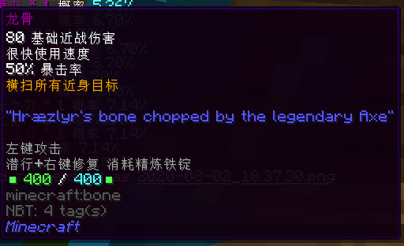

- **伤害**：80
- **使用速度**：很快
- **耐久**：400
- **修复材料**：精炼铁锭
- **暴击率**：50%
- **效果**：横扫所有近身目标
- **获得方式**：
  + **铸造**：
    * T4 ：30x T4 天界魔矿起
  + **合成**：
    * 由**合気杖**升级，消耗 16x 魔金矿物块，60x T3 天界魔矿，6x 灵魂残片，6x 死亡草，4x 浸毒蛛眼和 6x 炮弹残骸

#### 圣光之怒

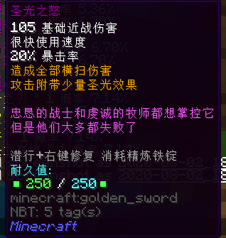

- **伤害**：105
- **使用速度**：很快
- **耐久**：250
- **修复材料**：精炼铁锭
- **暴击率**：20%
- **效果**：造成全部横扫伤害，攻击附带少量圣光效果
- **获得方式**：
  + **铸造**：
    * T4 ：30x T4 天界魔矿起
  + **合成**：
    * 由**水晶毁灭之剑**升级，消耗 16x 魔金矿物块，60x T3 天界魔矿，6x 灵魂残片，6x 死亡草，4x 浸毒蛛眼和 6x 炮弹残骸

#### 牛若丸

- **伤害**：65
- **使用速度**：很快
- **耐久**：250
- **修复材料**：精炼铁锭
- **暴击率**：10%
- **效果**：造成全部横扫伤害，攻击几率获得额外食物
- **获得方式**：
  + **铸造**：
    * T4 ：30x T4 天界魔矿起
  + **合成**：
    * 由**绿宝石长剑**升级，消耗 16x 魔金矿物块，60x T3 天界魔矿，6x 灵魂残片，8x 死亡草和 8x 炮弹残骸

#### 钯金战锤

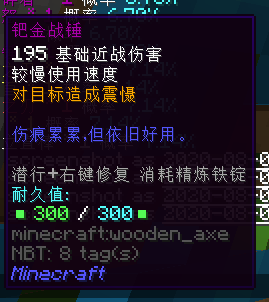

- **伤害**：195
- **使用速度**：较慢
- **耐久**：300
- **修复材料**：精炼铁锭
- **暴击率**：无
- **效果**：对目标造成震慑
- **获得方式**：
  + **铸造**：
    * T4 ：30x T4 天界魔矿起
  + **合成**：
    * 由**狂热战斧**升级，消耗 16x 魔金矿物块，28x T3 天界魔矿，6x 灵魂残片，8x 死亡草和 8x 炮弹残骸

#### 狂战士之刃 （L）

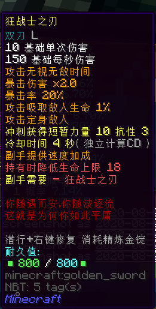

- **伤害**：10
- **使用速度**：疯狂
- **耐久**：800
- **修复材料**：精炼金锭
- **暴击率**：20% ，暴击伤害 x2.0
- **效果**：副手需要狂战士之刃（R）；攻击无视无敌时间，攻击吸取敌人生命 1% 并定身敌人；冲刺获得短暂力量 X 与抗性提升 III ，冷却时间 4 秒（独立计算 CD），副手提供速度加成，**持有时降低生命上限 18**
- **获得方式**：
  + **铸造**：
    * T4 ：32x T4 天界魔矿起

#### 狂战士之刃 （ R ）

- **伤害**：单次 10 ，每秒 150
- **使用速度**：未知
- **耐久**：800
- **修复材料**：精炼金锭
- **暴击率**：20% ，暴击伤害 x2.0
- **效果**：副手需要狂战士之刃（L）；攻击无视无敌时间，攻击吸取敌人生命 1% 并定身敌人；冲刺获得短暂力量 X 与抗性提升 III ，冷却时间 4 秒（独立计算 CD），副手提供速度加成，**持有时降低生命上限 18**
- **获得方式**：
  + **铸造**：
    * T4 ：32x T4 天界魔矿起

### T5

#### 仪式匕首

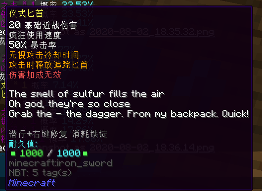

- **伤害**：20
- **使用速度**：疯狂
- **耐久**：1000
- **修复材料**：精炼铁锭
- **暴击率**：50%
- **效果**：无视攻击冷却时间，攻击时释放追踪匕首，**伤害加成无效**
- **获得方式**：
  + **铸造**：
    * T4 ：24x T4 天界魔矿起
    * T5 ：28x T5 天界魔矿起
  + **合成**：
    * 由**闪烁匕首**升级，消耗 16x 魔金矿物块，48x T3 天界魔矿，6x 灵魂残片，8x 死亡草和 8x 炮弹残骸

#### 黑金匕首

- **伤害**：90
- **使用速度**：疯狂
- **耐久**：500
- **修复材料**：精炼金锭
- **暴击率**：40%
- **效果**：右键开启技能「　爆发斩　」，使 1 秒内的攻击无视受伤间隔
- **获得方式**：
  + **铸造**：
    * T4 ：32x T4 天界魔矿起
    * T5 ：32x T5 天界魔矿起

#### 白之牙

- **伤害**：140
- **使用速度**：很快
- **耐久**：400
- **修复材料**：精炼铁锭
- **暴击率**：50%
- **效果**：使用白牙斩攻击目标
- **获得方式**：
  + **铸造**：
    * T4 ：32x T4 天界魔矿起
    * T5 ：28x T5 天界魔矿起

#### 狗骨头立直棒

- **伤害**：100
- **使用速度**：很快
- **耐久**：无法破坏
- **修复材料**：无
- **暴击率**：50%
- **效果**：右键丢出一根点棒，10% 几率造成 1000 点伤害
- **获得方式**：
  + **铸造**：
    * T4 ：32x T4 天界魔矿起
    * T5 ：28x T5 天界魔矿起

#### 北极枪

图源：CierraRunis_

- **伤害**：180
- **使用速度**：较慢
- **耐久**：600
- **修复材料**：精炼铁锭
- **暴击率**：20%
- **效果**：发射冰雪矛，使目标缓慢
- **获得方式**：
  + **铸造**：
    * T4 ：36x T4 天界魔矿起
    * T5 ：32x T5 天界魔矿起

#### 天之怒

- **伤害**：100
- **使用速度**：很快
- **耐久**：300
- **修复材料**：精炼铁锭
- **暴击率**：25%
- **效果**：造成全部横扫伤害，免疫失明，漂浮，缓慢，虚弱，饥饿，中毒，凋零
- **获得方式**：
  + **铸造**：
    * T4 ：48x T4 天界魔矿起
    * T5 ：20x T5 天界魔矿起
  + **合成**：
    * 由**利刃**，**月神镰刀**，**圣光之怒**或**牛若丸**升级，消耗 24x 蓝钻矿物块，40x T4 天界魔矿，12x 灵魂残片，16x 小玩偶和 16x 浸毒蛛眼

#### 至尊者

- **伤害**：250
- **使用速度**：较快
- **耐久**：100
- **修复材料**：精炼铁锭
- **暴击率**：25% ，背刺伤害 x2.0 ；冲刺伤害 x1.5 ；高速伤害 x1.5
- **效果**：50% 概率击飞目标
- **获得方式**：
  + **铸造**：
    * T4 ：48x T4 天界魔矿起
    * T5 ：20x T5 天界魔矿起
  + **合成**：
    * 由**灭鬼凶器**或**军团粉碎者**升级，消耗 24x 蓝钻矿物块，40x T4 天界魔矿，12x 灵魂残片，16x 小玩偶和 16x 浸毒蛛眼

#### 袭心

- **伤害**：25
- **使用速度**：疯狂
- **耐久**：1000
- **修复材料**：精炼铁锭
- **暴击率**：25% ，冲刺伤害 x3.0 ；高速伤害 x1.5
- **效果**：攻击无视冷却时间，冲刺获得短暂加速
- **获得方式**：
  + **铸造**：
    * T4 ：48x T4 天界魔矿起
    * T5 ：20x T5 天界魔矿起
  + **合成**：
    * 由**恶魔之击**升级，消耗 24x 蓝钻矿物块，40x T4 天界魔矿，12x 灵魂残片，16x 小玩偶和 16x 浸毒蛛眼

#### 一姬

- **伤害**：2048
- **使用速度**：超超超超级慢
- **耐久**：10
- **修复材料**：金刚石
- **暴击率**：无
- **效果**：近战攻击
- **获得方式**：
  + **铸造**：
    * T4 ：56x T4 天界魔矿起
    * T5 ：40x T5 天界魔矿起

#### 鬼切丸

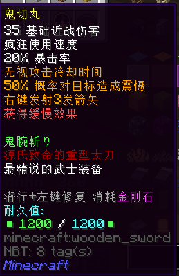

- **伤害**：35
- **使用速度**：疯狂
- **耐久**：1200
- **修复材料**：金刚石
- **暴击率**：20%
- **效果**：无视攻击冷却时间，50% 概率对目标造成震慑，右键发射 3 发箭矢，**获得缓慢效果**
- **获得方式**：
  + **铸造**：
    * T4 ：56x T4 天界魔矿起
    * T5 ：36x T5 天界魔矿起
  + **合成**：
    * 由**小鳥丸**升级，消耗 24x 蓝钻矿物块，72x T4 天界魔矿，12x 灵魂残片，12x 小玩偶，8x 破损的枪械零件和 12x 浸毒蛛眼

#### 40 米长刀

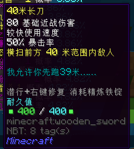

- **伤害**：80
- **使用速度**：较快
- **耐久**：400
- **修复材料**：精炼铁锭
- **暴击率**：50%
- **效果**：横扫前方 40 米范围内敌人
- **获得方式**：
  + **铸造**：
    * T4 ：56x T4 天界魔矿起
    * T5 ：36x T5 天界魔矿起
  + **合成**：
    * 由**利刃**升级，消耗 24x 蓝钻矿物块，72x T4 天界魔矿，12x 灵魂残片，12x 小玩偶，8x 亡灵幻影和 12x 浸毒蛛眼

#### 桃花剑

- **伤害**：168
- **使用速度**：很快
- **耐久**：600
- **修复材料**：金刚石
- **暴击率**：25%
- **效果**：发射桃花瓣
- **获得方式**：
  + **铸造**：
    * T4 ：64x T4 天界魔矿起
    * T5 ：36x T5 天界魔矿起

#### 泰拉刃

- **伤害**：160
- **使用速度**：很快
- **耐久**：600
- **修复材料**：翡翠石
- **暴击率**：50%
- **效果**：造成全部横扫伤害，发射短距离剑气，穿透射程中所有目标
- **获得方式**：
  + **铸造**：
    * T5 ：36x T5 天界魔矿起

#### 天龙之怒

- **伤害**：120
- **使用速度**：很快
- **耐久**：1000
- **修复材料**：精炼金锭
- **暴击率**：50%
- **效果**：横扫所有近身目标，发射天龙怒火
- **获得方式**：
  + **铸造**：
    * T5 ：40x T5 天界魔矿起
  + **合成**：
    * 由**龙骨**或**白之牙**升级，消耗 24x 蓝钻矿物块，80x T4 天界魔矿，12x 灵魂残片，16x 小玩偶和 16x 浸毒蛛眼

#### 白之约定

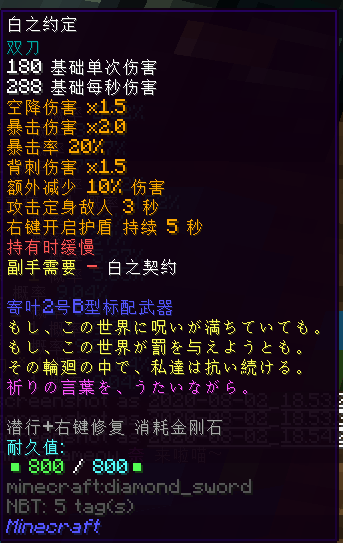

- **伤害**：单次 180 ，每秒 288
- **使用速度**：未知
- **耐久**：800
- **修复材料**：金刚石
- **暴击率**：20% ，暴击伤害 x2.0 ，空降伤害 x1.5 ，背刺伤害 x1.5
- **效果**：副手需要白之契约；额外减少 10% 伤害；攻击定身敌人 3 秒；右键开启护盾，持续 5 秒
- **获得方式**：
  + **铸造**：
    * T5 ：40x T5 天界魔矿起
  + **合成**：
    * 由**利刃**和 **T4 勇气之花**升级，消耗 24x 蓝钻矿物块，80x T4 天界魔矿，12x 灵魂残片，12x 小玩偶和 12x 巨大蛛网

#### 白之契约

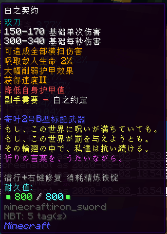

- **伤害**：单次 150 - 170 ，每秒 300 - 340
- **使用速度**：未知
- **耐久**：800
- **修复材料**：精炼铁锭
- **暴击率**：无
- **效果**：副手需要白之约定，吸取敌人生命 2% ，大幅削弱护甲效果，获得速度 II ，**降低自身护甲值**
- **获得方式**：
  + **铸造**：
    * T5 ：40x T5 天界魔矿起
  + **合成**：
    * 由**利刃**和 **T4 守护之花**升级，消耗 24x 蓝钻矿物块，80x T4 天界魔矿，12x 灵魂残片，12x 小玩偶和 12x 巨大蛛网

#### 臭虎爪

- **伤害**：24
- **使用速度**：疯狂
- **耐久**：6000
- **修复材料**：翡翠石
- **暴击率**：50%
- **效果**：高速连击近处敌人
- **获得方式**：
  + **铸造**：
    * T5 ：48x T5 天界魔矿起

#### 闪电剑刃

- **伤害**：40
- **使用速度**：疯狂
- **耐久**：500
- **修复材料**：精炼铁锭
- **暴击率**：25%
- **效果**：无视攻击冷却时间，秘技「 反复横切 」，**伤害加成无效**
- **获得方式**：
  + **铸造**：
    * T5 ：50x T5 天界魔矿起
  + **合成**：
    * 由**恶魔之击**升级，消耗 24x 蓝钻矿物块，100x T4 天界魔矿，12x 灵魂残片，12x 小玩偶，8x破损的枪械零件和 12x 巨大蛛网

#### 日酱喷发剑

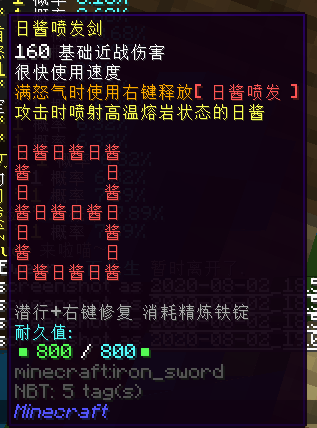

- **伤害**：160
- **使用速度**：很快
- **耐久**：800
- **修复材料**：精炼铁锭
- **暴击率**：无
- **效果**：满怒气时使用右键释放【 日酱喷发 】，攻击时喷射高温熔岩状态的日酱
- **获得方式**：
  + **铸造**：
    * T5 ：50x T5 天界魔矿起

#### 日向千代

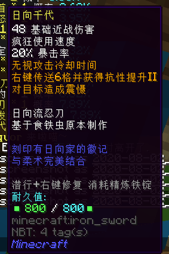

- **伤害**：48
- **使用速度**：疯狂
- **耐久**：800
- **修复材料**：精炼铁锭
- **暴击率**：20%
- **效果**：无视攻击冷却时间，右键传送 6 格并获得抗性提升 II ，对目标造成震慑
- **获得方式**：
  + **铸造**：
    * T5 ：50x T5 天界魔矿起

#### 西格玛

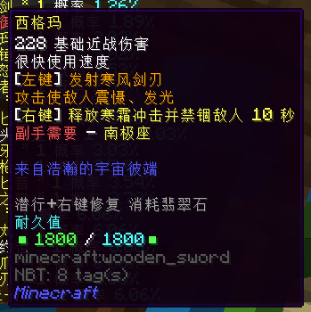

- **伤害**：228
- **使用速度**：很快
- **耐久**：1800
- **修复材料**：翡翠石
- **暴击率**：无
- **效果**：副手需要南极座，左键发射寒风剑刃，攻击使敌人震慑，发光；右键释放寒霜冲击并禁锢敌人 10 秒
- **获得方式**：
  + **铸造**：
    * T5 ：56x T5 天界魔矿起

#### 聚能锤

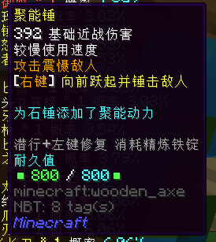

- **伤害**：392
- **使用速度**：较慢
- **耐久**：800
- **修复材料**：精炼铁锭
- **暴击率**：无
- **效果**：攻击震慑敌人，右键向前跃起并锤击敌人
- **获得方式**：
  + **铸造**：
    * T5 ：56x T5 天界魔矿起
  + **合成**：
    * 由**钯金战锤**升级，消耗 24x 蓝钻矿物块，96x T4 天界魔矿，12x 灵魂残片和 16x 石质精华

#### 嗜血之刃

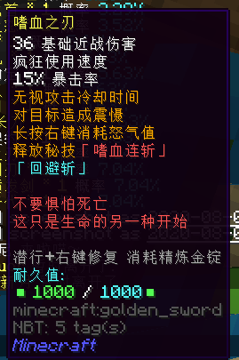

- **伤害**：36
- **使用速度**：疯狂
- **耐久**：1000
- **修复材料**：精炼金锭
- **暴击率**：15%
- **效果**：无视攻击冷却时间，对目标造成震慑，长按右键消耗怒气值，释放秘技「 怒气斩 」「 回避斩 」
- **获得方式**：
  + **铸造**：
    * T5 ：60x T5 天界魔矿起

#### 女武神枪

- **伤害**：200
- **使用速度**：较快
- **耐久**：1200
- **修复材料**：金刚石
- **暴击率**：无
- **效果**：降低目标攻击力
- **获得方式**：
  + **铸造**：
    * T5 ：64x T5 天界魔矿起
  + **合成**：
    * 由**北极枪**升级，消耗 24x 蓝钻矿物块，128x T4 天界魔矿，12x 灵魂残片，12x 小玩偶，8x亡灵幻影和 12x 巨大蛛网

### T5红名

#### 博麗御幣

- **伤害**：100
- **使用速度**：很快
- **耐久**：1000
- **修复材料**：精炼铁锭
- **暴击率**：50% 
- **效果**：横扫所有近身目标
- **获得方式**：
  + **铸造**：
    * T5 ：40x T5 天界魔矿起
  + **合成**：
    * 由**天之怒**和**希望の花**升级，消耗 2x 精炼蓝钻，64x T5 天界魔矿，24x 灵魂残片，16x 龙鱼刺，12x 龙鱼角和 8x 鱼泡泡

#### 英雄愿望

- **伤害**：32767
- **使用速度**：未知
- **耐久**：3
- **修复材料**：无
- **暴击率**：无
- **效果**：「 必杀 · 英雄愿望 」
- **获得方式**：
  + **铸造**：
    * T5 ：50x T5 天界魔矿起

#### 村雨

图源：CierraRunis_

- **伤害**：320
- **使用速度**：较快
- **耐久**：1000
- **修复材料**：金刚石
- **暴击率**：无
- **效果**：对敌人造成持续凋零；右键施放秘技「 化身妖刀 」基础攻击力 x2 ，攻击时吸取 1% 的生命，持续时间 15 秒
- **获得方式**：
  + **铸造**：
    * T5 ：64x T5 天界魔矿起
  + **合成**：
    * 由**至尊者**升级，消耗 2x 精炼蓝钻，128x T5 天界魔矿，32x 灵魂残片，1x 一张银行卡和 32x 钙质外壳

#### 丹增

- **伤害**：188
- **使用速度**：很快
- **耐久**：1200
- **修复材料**：精炼铁锭
- **暴击率**：无
- **效果**：攻击使敌人发光，怒气值充满时攻击施展「 真银斩 」，**防御力降低**，攻击力 +140% ，攻击范围扩大
- **获得方式**：
  + **铸造**：
    * T5 ：64x T5 天界魔矿起
  + **合成**：
    * 由**白之牙**和**棒棒糖☆奏鸣曲**升级，消耗 10x 精炼蓝钻，96x T5 天界魔矿，32x 灵魂残片，32x 破碎的心脏，16x 狗咬骨和 16x 暗黑十字章

#### 彩虹喵之刃

- **伤害**：218
- **使用速度**：极快
- **耐久**：1200
- **修复材料**：翡翠石
- **暴击率**：无
- **效果**：发射彩虹喵
- **获得方式**：
  + **铸造**：
    * T5 ：64x T5 天界魔矿起

#### 破晓之光

- **伤害**：75
- **使用速度**：疯狂
- **耐久**：2000
- **修复材料**：金刚石
- **暴击率**：40%
- **效果**：造成持续燃烧伤害，自动跟踪目标，怒气值充满时施展「 无尽之矛 」
- **获得方式**：
  + **铸造**：
    * T5 ：64x T5 天界魔矿起
  + **合成**：
    * 由**女武神枪**升级，消耗 6x 精炼蓝钻，128x T5 天界魔矿，36x 灵魂残片，1x 一张银行卡，16x 烈焰凝胶，16x 火元素和 8x 地狱火

#### 铠罗兵装

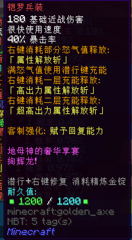

- **伤害**：180
- **使用速度**：很快
- **耐久**：1200
- **修复材料**：精炼金锭
- **暴击率**：40%
- **效果**：右键消耗部分怒气值释放「 属性解放斩 」；满怒气值使用潜行键充能，右键消耗一层充能释放「 高出力属性解放斩 」右键消耗二层充能释放「 超高出力属性解放斩 」
- **获得方式**：
  + **铸造**：
    * T5 ：64x T5 天界魔矿起

#### 铠罗剑·火

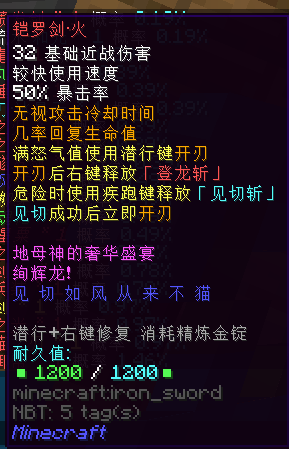

- **伤害**：32
- **使用速度**：较快
- **耐久**：1200
- **修复材料**：精炼金锭
- **暴击率**：50%
- **效果**：无视攻击冷却时间，几率回复生命值，满怒气值使用潜行键开刃，开刃后右键释放「 登龙斩 」，危险时使用疾跑键释放「 见切斩 」，见切成功后立即开刃
- **获得方式**：
  + **铸造**：
    * T5 ：64x T5 天界魔矿起

#### 魂镜之刃

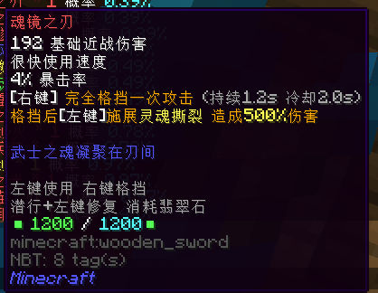

- **伤害**：192
- **使用速度**：很快
- **耐久**：1200
- **修复材料**：翡翠石
- **暴击率**：4%
- **效果**：右键完全格挡一次攻击（持续 1.2s 冷却 2.0s ）格挡后左键施展灵魂撕裂，造成 500% 伤害
- **获得方式**：
  + **铸造**：
    * T5 ：64x T5 天界魔矿起

#### 齿樱·星粟

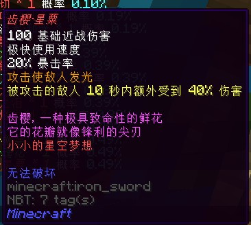

- **伤害**：100
- **使用速度**：极快
- **耐久**：无法破坏
- **修复材料**：无
- **暴击率**：20%
- **效果**：攻击使敌人发光，被攻击的敌人 10 秒内额外受到 40% 伤害
- **获得方式**：
  + **铸造**：
    * T5 ：64x T5 天界魔矿起
  + **合成**：
    * 由**齿樱·初生**和**梦想罗盘**升级，消耗 8x 精炼蓝钻，64x T5 天界魔矿，32x 灵魂残片，2x 一张银行卡，16x 噬魂之眼，16x 暗影箭和 16x 被压扁的黄金

#### 齿樱·魂花

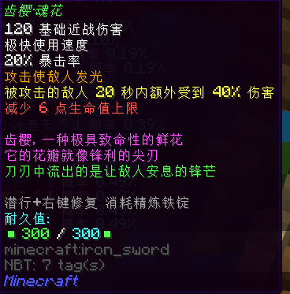

- **伤害**：120
- **使用速度**：极快
- **耐久**：300
- **修复材料**：精炼铁锭
- **暴击率**：20%
- **效果**：攻击使敌人发光，被攻击的敌人 10 秒内额外受到 40% 伤害，**减少 6 点生命值上限**
- **获得方式**：
  + **铸造**：
    * T5 ：64x T5 天界魔矿起
  + **合成**：
    * 由**齿樱·初生**和**泰坦手环**升级，消耗 8x 精炼蓝钻，64x T5 天界魔矿，32x 灵魂残片，2x 一张银行卡，32x 混沌元素和 32x 狱火核心

#### 齿樱·柳穿

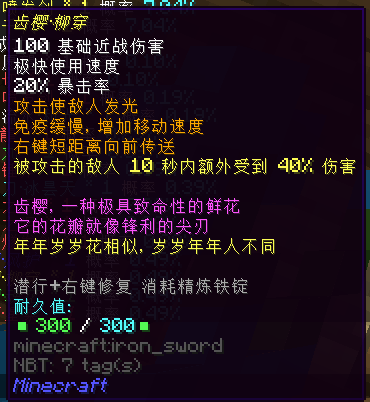

- **伤害**：100
- **使用速度**：极快
- **耐久**：300
- **修复材料**：精炼铁锭
- **暴击率**：20%
- **效果**：攻击使敌人发光，免疫缓慢，增加移动速度，右键短距离向前传送，被攻击的敌人 10 秒内额外受到 40% 伤害
- **获得方式**：
  + **铸造**：
    * T5 ：64x T5 天界魔矿起
  + **合成**：
    * 由**齿樱·初生**和**闪电手链**升级，消耗 8x 精炼蓝钻，64x T5 天界魔矿，32x 灵魂残片，2x 一张银行卡，16x 末影尘，16x 灵液球和 16x 诅咒之书

#### 齿樱·风护

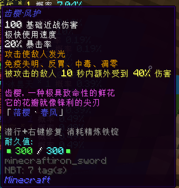

- **伤害**：118
- **使用速度**：极快
- **耐久**：300
- **修复材料**：精炼铁锭
- **暴击率**：50%
- **效果**：攻击使敌人发光；免疫失明，反胃，中毒，凋零；被攻击的敌人 10 秒内额外受到 40% 伤害
- **获得方式**：
  + **铸造**：
    * T5 ：64x T5 天界魔矿起
  + **合成**：
    * 由**齿樱·初生**和 **T5 守护之花**升级，消耗 8x 精炼蓝钻，64x T5 天界魔矿，32x 灵魂残片，2x 一张银行卡，16x 碎翼，16x 石质精华和 16x 弹药桶

#### 龙炎燧发剑

- **伤害**：172
- **使用速度**：很快
- **耐久**：1200
- **修复材料**：金刚石
- **暴击率**：10%
- **效果**：右键消耗怒气开启燧发模式
- **获得方式**：
  + **铸造**：
    * T5 ：64x T5 天界魔矿起

#### 暗黑之泪

- **伤害**：224
- **使用速度**：很快
- **耐久**：1200
- **修复材料**：翡翠石
- **暴击率**：无
- **效果**：右键怒气值满时解除暗黑封印，基础伤害提升，发射 12 枚「 紅蓮 」飞弹轰炸前方目标
- **获得方式**：
  + **铸造**：
    * T5 ：64x T5 天界魔矿起

#### 真空之刃

- **伤害**：54
- **使用速度**：疯狂
- **耐久**：6000
- **修复材料**：翡翠石
- **暴击率**：20%
- **效果**：连击近身敌人
- **获得方式**：
  + **铸造**：
    * T5 ：64x T5 天界魔矿起
  + **合成**：
    * 由**闪电剑刃**和**臭虎爪**升级，消耗 16x 精炼蓝钻，64x T5 天界魔矿，16x 灵魂残片，1x 一张银行卡，4x 巨人之眼，4x 寒霜花和 4x 粗牛角

#### 仿灵刀·冰昙天

- **伤害**：130
- **使用速度**：极快
- **耐久**：4000
- **修复材料**：翡翠石
- **暴击率**：无
- **效果**：右键消耗怒气使用【零时刃闪】；潜行释放必杀技【寒天狂舞】；释放【寒天狂舞】后将持续回复怒气值
- **获得方式**：
  + **铸造**：
    * T5 ：64x T5 天界魔矿起

#### 波涌锤斧

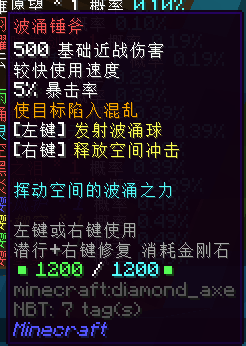

- **伤害**：500
- **使用速度**：极快
- **耐久**：1200
- **修复材料**：金刚石
- **暴击率**：5%
- **效果**：使目标陷入混乱，左键释放波涌球，右键释放空间冲击
- **获得方式**：
  + **铸造**：
    * T5 ：64x T5 天界魔矿起

#### 叢雨丸

- **伤害**：72
- **使用速度**：较快
- **耐久**：1200
- **修复材料**：翡翠石
- **暴击率**：无
- **效果**：增加移动速度，免疫缓慢，左键攻击造成三连击，右键消耗 30 怒气值使用「 拔刀 」，对前方范围敌人造成当前攻击力 420% 的伤害，持续攻击时提升攻击力至最高两倍
- **获得方式**：
  + **铸造**：
    * T5 ：64x T5 天界魔矿起
  + **合成**：
    * 由**小鳥丸**，**鬼切丸**，**日向千代**和**小狐丸**升级，消耗 8x 精炼蓝钻，32x 灵魂残片，12x 精灵水晶和 12x 火星岩块

#### 昇  龍

- **伤害**：375
- **使用速度**：很快
- **耐久**：1200
- **修复材料**：翡翠石
- **暴击率**：15%
- **效果**：几率震慑目标；右键怒气满时释放「 昇龍 」
- **获得方式**：
  + **铸造**：
    * T5 ：64x T5 天界魔矿起
  + **合成**：
    * 由**天龙之怒**升级，消耗 6x 精炼蓝钻，128x T5 天界魔矿，36x 灵魂残片，1x 一张银行卡，16x 枯草，16x 木乃伊的绷带碎片和 8x 破碎的铠甲

#### 行云流水·和光

- **伤害**：35
- **使用速度**：较快
- **耐久**：1200
- **修复材料**：金刚石
- **暴击率**：无
- **效果**：无视攻击冷却时间，攻击增加移动速度；按住潜行键进行蓄力，蓄力完成后右键释放「 居合斩 」持续攻击提升攻击力至最高 2.4 倍
- **获得方式**：
  + **铸造**：
    * T5 ：64x T5 天界魔矿起

#### 日耀喷发剑

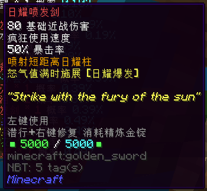

- **伤害**：80
- **使用速度**：疯狂
- **耐久**：5000
- **修复材料**：精炼金锭
- **暴击率**：50%
- **效果**：喷射短距离日耀柱，怒气值满时施展【日耀喷发】
- **获得方式**：
  + **铸造**：
    * T5 ：64x T5 天界魔矿起

#### 千羽切

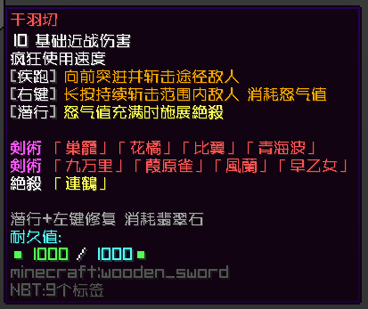

图源：CierraRunis_

- **伤害**：10
- **使用速度**：疯狂
- **耐久**：1000
- **修复材料**：翡翠石
- **暴击率**：无
- **效果**：疾跑向前突进并斩击途径敌人；右键长按持续斩击范围内敌人，消耗怒气值；怒气值满时潜行施展绝杀
- **获得方式**：
  + **铸造**：
    * T5 ：64x T5 天界魔矿起

> 这件武器出自《学战都市 Asterisk 》的角色刀藤绮凛（感谢卷的科普）

## 合成武器

#### 齿樱·满开

- **伤害**：118
- **使用速度**：疯狂
- **耐久**：无法破坏
- **修复材料**：无
- **暴击率**：10%
- **效果**：攻击使敌人发光，沉默；被攻击的敌人 10 秒内额外受到 40% 伤害；左键发射剑气造成 200% 伤害；右键消耗 30 怒气向前突进并斩击两次，造成 750% 伤害
- **获得方式**：
  + **合成**：
    * 由**齿樱·星粟**，**齿樱·魂花**，**齿樱·风护**和**齿樱·柳穿**升级，消耗 32x 精炼蓝钻

## Boss 武器

#### 拉玛

- **所属 Boss** ：拉玛族长 lv.12
- **等级**：T3
- **伤害**：32
- **使用速度**：疯狂
- **耐久**：3000
- **修复材料**：拉玛旗
- **暴击率**：20%
- **效果**：攻击无视无敌时间，右键消耗怒气发射喷雾，怒气充满时潜行施展技能【拉玛重击】
- **获得方式**：
  + **兑换**：
    * 在上野神社兑换
    * 消耗 40x 上等干草块

#### 吹雪

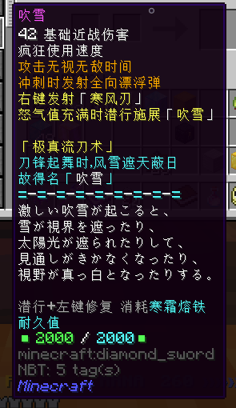

- **所属 Boss** ：熊大 lv.20
- **等级**：T5+
- **伤害**：42
- **使用速度**：疯狂
- **耐久**：2000
- **修复材料**：寒霜熔铁
- **暴击率**：无
- **效果**：攻击无视无敌时间，冲刺时发射全向漂浮弹；右键发射「 寒风刃 」，怒气值充满时潜行施展「　吹雪　」
- **获得方式**：
  + **兑换**：
    * 在劫掠山庄兑换
    * 消耗 40x 寒霜核

#### 狂星之怒

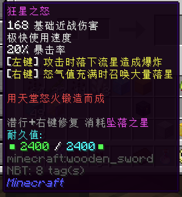

- **所属 Boss** ：火星咕噜怪 lv.23
- **等级**：T5+
- **伤害**：168
- **使用速度**：极快
- **耐久**：2400
- **修复材料**：坠落之星
- **暴击率**：20%
- **效果**：左键攻击时落下流星造成爆炸，右键怒气值充满时召唤大量落星
- **获得方式**：
  + **兑换**：
    * 在海贼之家兑换
    * 消耗 64x 火星岩块

#### 袖剑

- **所属 Boss** ：铁皮武士 lv.24
- **等级**：T5+
- **伤害**：10
- **使用速度**：较快
- **耐久**：16
- **修复材料**：Apple of Eden
- **暴击率**：70%
- **效果**：冲刺时获得短暂速度加成，攻击时伤害多次叠加：近距离时提升至最高 5 倍，低生命时提升至最高 4 倍，冲刺时提升至最高 18 倍，暴击时提升至最高 6 倍，背刺时提升至 2 倍
- **获得方式**：
  + **兑换**：
    * 在不祥的流浪者（ 1322 ，1974 ）兑换
    * 消耗 64x 精雕翡翠石块

#### BLOODTEAR

- **所属 Boss** ：光明王 lv.24
- **等级**：T5+
- **伤害**：542
- **使用速度**：较快
- **耐久**：1800
- **修复材料**：翡翠石
- **暴击率**：20%
- **效果**：副手需要 DARKTEAR ；免疫中毒，凋零；**攻击消耗生命值**，右键消耗 30 怒气向前跃起，对落点范围内敌人造成伤害并使其混乱，切换副手下一次攻击伤害 x1.5
- **获得方式**：
  + **合成**：
    * 消耗 48x 神圣光明立方，4x 精炼蓝钻，16x 灵魂残片和 64x T5 天界魔矿

#### DARKTEAR

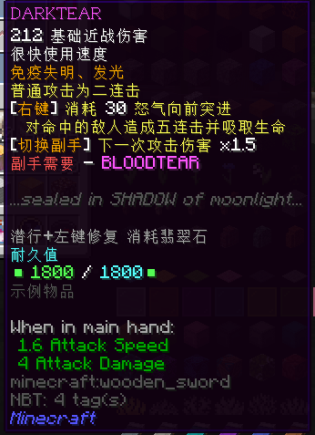

- **所属 Boss** ：空洞王 lv.24
- **等级**：T5+
- **伤害**：212
- **使用速度**：很快
- **耐久**：1800
- **修复材料**：翡翠石
- **暴击率**：无
- **效果**：副手需要 BLOODTEAR ；免疫失明，发光；普通攻击为二连击，右键消耗 30 怒气向前跃起，对落点范围内敌人造成五连击并吸取生命，切换副手下一次攻击伤害 x1.5
- **获得方式**：
  + **合成**：
    * 消耗 48x 空洞黑暗立方，4x 精炼蓝钻，16x 灵魂残片和 64x T5 天界魔矿

## 活动武器

### 2020 年 劳动节活动

#### 极光剑

- **等级**：T3
- **伤害**：88
- **使用速度**：很快
- **耐久**：2400
- **修复材料**：翡翠石
- **暴击率**：无
- **效果**：攻击使敌人发光，右键消耗 30 点怒气发射极光束
- **获得方式**：
  + **合成**：
    * 消耗武器蓝图 - 极光剑，2x 24K 纯金和 64x T3 天界魔矿

#### 极光剑 S

图源：CierraRunis_

- **等级**：T5
- **伤害**：188
- **使用速度**：很快
- **耐久**：2400
- **修复材料**：翡翠石
- **暴击率**：50%
- **效果**：攻击使敌人发光，右键消耗 30 点怒气发射极光束
- **获得方式**：
  + **合成**：
    * 由**极光剑**升级，消耗武器蓝图 - 极光剑，2x 24K 纯金，2x 精炼魔金，2x 精炼蓝钻和 64x T5 天界魔矿

### 泰拉瑞亚 开荒活动

#### 传奇泰拉刃

图源：CierraRunis_

- **等级**：T5+
- **伤害**：180
- **使用速度**：很快
- **耐久**：1800 ，50% 几率不消耗耐久
- **修复材料**：翡翠石
- **暴击率**：50%
- **效果**：造成全部横扫伤害，发射剑气，穿透射程中所有目标；生长叶绿藤蔓刺穿目标
- **获得方式**：
  + **合成**：
    * 由**泰拉刃**升级，消耗 24x 精炼蓝钻和 Terraria 勇士勋章
