# 远程武器

远程武器是指使用弹药进行长距离攻击的武器。

远程武器一般只消耗[弹药](../inf/items?id=耗材简述)，部分武器需要使用**精炼金锭**维修。

大部分远程武器可以通过铸造获得，小部分则需要合成或者兑换。

初始附魔不会在消魔过程中被清除，但照旧消耗消魔石。

感谢各位玩家在数据收集时提供的帮助。

!> 请勿在主世界内随意玩耍inf武器，可能误伤玩家或使他人财产受到损失。

## 目录

- [铸造武器](#铸造武器)
  + [T1](#T1)
  + [T2](#T2)
  + [T3](#T3)
  + [T4](#T4)
  + [T5](#T5)
  + [T5+](#T5红名)
- [合成武器](#合成武器)
- [Boss 武器](#Boss-武器)
- [活动武器](#活动武器)

## 铸造武器

### T1

#### P90

- **伤害**：6
- **使用速度**: 疯狂
- **弹药类型**：通用纳米子弹
- **弹药容量**：50
- **耐久**：无
- **暴击率**：无
- **初始附魔**：无
- **效果**：五连发射击
- **获得方式**：
  + **铸造**：
    * T1 ：4x T1 天界魔矿起

#### 猎人短弓

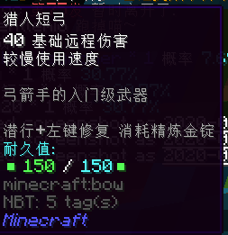

- **伤害**：40
- **使用速度**: 较慢
- **弹药类型**：箭矢
- **弹药容量**：无
- **耐久**：150
- **维修材料**：精炼金锭
- **暴击率**：无
- **初始附魔**：无
- **效果**：射击
- **获得方式**：
  + **铸造**：
    * T1 ：4x T1 天界魔矿起

#### P2020

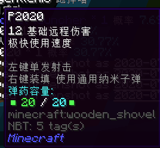

- **伤害**：12
- **使用速度**: 极快
- **弹药类型**：通用纳米子弹
- **弹药容量**：20
- **耐久**：无
- **暴击率**：无
- **初始附魔**：无
- **效果**：单发射击
- **获得方式**：
  + **铸造**：
    * T1 ：4x T1 天界魔矿起

### T2

#### Rocklet launcher

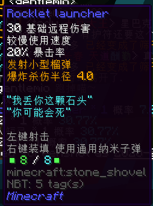

- **伤害**：30
- **使用速度**: 较慢
- **弹药类型**：通用纳米子弹
- **弹药容量**：8
- **耐久**：无
- **暴击率**：20%
- **初始附魔**：无
- **效果**：发射小型榴弹，爆炸杀伤半径 4.0
- **获得方式**：
  + **铸造**：
    * T1 ：4x T1 天界魔矿起

#### G7

- **伤害**：15
- **使用速度**: 极快
- **弹药类型**：通用纳米子弹
- **弹药容量**：10
- **耐久**：无
- **暴击率**：20% ，爆头伤害 x1.5
- **初始附魔**：无
- **效果**：单发射击，潜行开镜
- **获得方式**：
  + **铸造**：
    * T1 ：16x T1 天界魔矿起
    * T2 ：6x T2 天界魔矿起
  + **合成**:
    * 由 **P90** 或 **P2020** 升级，消耗 8x 精铁矿物块和 12x T1 天界魔矿

#### 制式长弓

- **伤害**：72
- **使用速度**: 较慢
- **弹药类型**：箭矢
- **弹药容量**：无
- **耐久**：无
- **暴击率**：20%
- **初始附魔**：无
- **效果**：在主手时无法被击退
- **获得方式**：
  + **铸造**：
    * T1 ：16x T1 天界魔矿起
    * T2 ：6x T2 天界魔矿起
  + **合成**：
    * 由**猎人短弓**升级，消耗 8x 精铁矿物块和 12x T1 天界魔矿

#### 吹箭筒

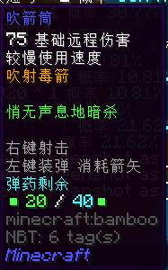

- **伤害**：75
- **使用速度**: 较慢
- **弹药类型**：箭矢
- **弹药容量**：40
- **耐久**：无
- **暴击率**：无
- **初始附魔**：无
- **效果**：吹射毒箭
- **获得方式**：
  + **铸造**：
    * T1 ：16x T1 天界魔矿起
    * T2 ：6x T2 天界魔矿起

#### 冰蓝强弓

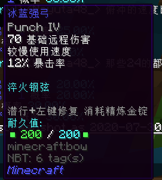

- **伤害**：70
- **使用速度**: 较慢
- **弹药类型**：箭矢
- **弹药容量**：无
- **耐久**：200
- **修复材料**：精炼金锭
- **暴击率**：12%
- **初始附魔**：冲击 IV
- **效果**：射击
- **获得方式**：
  + **铸造**：
    * T2 ：8x T2 天界魔矿起
  + **合成**：
    * 由**猎人短弓**升级，消耗 8x 精铁矿物块和 16x T1 天界魔矿

#### 快速短弓

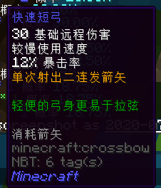

- **伤害**：30
- **使用速度**: 较慢
- **弹药类型**：箭矢
- **弹药容量**：无
- **耐久**：无
- **暴击率**：12%
- **初始附魔**：无
- **效果**：单次射出二连发箭矢
- **获得方式**：
  + **铸造**：
    * T2 ：12x T2 天界魔矿起

### T3

#### VK-47

- **伤害**：35
- **使用速度**: 疯狂
- **弹药类型**：通用纳米子弹
- **弹药容量**：30
- **耐久**：无
- **暴击率**：20%
- **初始附魔**：无
- **效果**：单发射击，对目标造成震慑
- **获得方式**：
  + **铸造**：
    * T2 ：12x T2 天界魔矿起

#### Rocklet launcher MAKE II

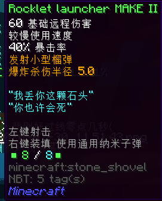

- **伤害**：60
- **使用速度**: 较慢
- **弹药类型**：通用纳米子弹
- **弹药容量**：8
- **耐久**：无
- **暴击率**：40%
- **初始附魔**：无
- **效果**：发射小型榴弹，爆炸杀伤半径 5.0
- **获得方式**：
  + **铸造**：
    * T2 ：16x T2 天界魔矿起
  + **合成**：
    * 由 **Rocklet launcher** 升级，消耗 12x 纯金矿物块，48x T2 天界魔矿，2x 灵魂残片，3x 远古布匹，3x 活性火药和 3x 破损弩弦

#### 飓风

- **伤害**：125
- **使用速度**: 较慢
- **弹药类型**：箭矢
- **弹药容量**：无
- **耐久**：无
- **暴击率**：12% ，爆头伤害 x1.5
- **初始附魔**：无
- **效果**：免疫失明，*使自身难以行动（未确定是否有该效果）*
- **获得方式**：
  + **铸造**：
    * T2 ：24x T2 天界魔矿起
    * T3 ：10x T3 天界魔矿起
  + **合成**：
    * 由**制式长弓**升级，消耗 12x 纯金矿物块，20x T2 天界魔矿，2x 灵魂残片，4x 远古布匹和 4x 破损弩弦

#### Astra 900

- **伤害**：64
- **使用速度**: 很快
- **弹药类型**：通用纳米子弹
- **弹药容量**：10
- **耐久**：无
- **暴击率**：20%
- **初始附魔**：无
- **效果**：射击
- **获得方式**：
  + **铸造**：
    * T2 ：24x T2 天界魔矿起
    * T3 ：10x T3 天界魔矿起

#### 龙骨狙击枪

- **伤害**：180
- **使用速度**: 很慢
- **弹药类型**：通用纳米子弹
- **弹药容量**：10
- **耐久**：无
- **暴击率**：50%
- **初始附魔**：无
- **效果**：射击，右键开镜
- **获得方式**：
  + **铸造**：
    * T2 ：24x T2 天界魔矿起
    * T3 ：16x T3 天界魔矿起
  + **合成**：
    * 由 **G7** 升级，消耗 12x 纯金矿物块，20x T2 天界魔矿，2x 灵魂残片，4x 远古布匹和 4x 活性火药

#### 超级风怒弓

- **伤害**：30
- **使用速度**: 很快
- **弹药类型**：箭矢
- **弹药容量**：无
- **耐久**：无
- **暴击率**：20% 
- **初始附魔**：无
- **效果**：单次射出四连发箭矢
- **获得方式**：
  + **铸造**：
    * T3 ：16x T3 天界魔矿起
  + **合成**：
    * 由**快速短弓**升级，消耗 12x 纯金矿物块，32x T2 天界魔矿，2x 灵魂残片，4x 远古布匹和 4x 活性火药
    * 由**吹箭筒**升级，消耗 12x 纯金矿物块，32x T2 天界魔矿，2x 灵魂残片，4x 远古布匹和 4x 破损弩弦

#### 冰雪弓

- **伤害**：110
- **使用速度**: 较慢
- **弹药类型**：箭矢
- **弹药容量**：无
- **耐久**：200
- **修复材料**：精炼金锭
- **暴击率**：25%
- **初始附魔**：无
- **效果**：降低目标的攻击力和速度
- **获得方式**：
  + **铸造**：
    * T3 ：16x T3 天界魔矿起
  + **合成**：
    * 由**冰蓝强攻**升级，消耗 12x 纯金矿物块，32x T2 天界魔矿，2x 灵魂残片，4x 远古布匹和 4x 破损弩弦

#### Win-Man

- **伤害**：70
- **使用速度**: 较快
- **弹药类型**：通用纳米子弹
- **弹药容量**：6
- **耐久**：无
- **暴击率**：15% ，爆头伤害 x2.0
- **初始附魔**：无
- **效果**：单发射击
- **获得方式**：
  + **铸造**：
    * T3 ：20x T3 天界魔矿起

#### M4A1

- **伤害**：12
- **使用速度**: 疯狂
- **弹药类型**：通用纳米子弹
- **弹药容量**：30
- **耐久**：无
- **暴击率**：无 
- **初始附魔**：无
- **效果**：有穿透破坏力
- **获得方式**：
  + **铸造**：
    * T3 ：20x T3 天界魔矿起

#### Rocklet launcher MAKE III

- **伤害**：100
- **使用速度**: 较慢
- **弹药类型**：通用纳米子弹
- **弹药容量**：8
- **耐久**：无
- **暴击率**：40% 
- **初始附魔**：无
- **效果**：发射小型榴弹，爆炸杀伤半径 6.0
- **获得方式**：
  + **铸造**：
    * T3 ：24x T3 天界魔矿起
  + **合成**：
    * 由 **Rocklet launcher MAKE II** 升级，消耗 12x 纯金矿物块，48x T2 天界魔矿，2x 灵魂残片，3x 远古布匹，2x 活性火药和 3x 破损弩弦

### T4

#### 伦鲁迪洛尔

- **伤害**：160
- **使用速度**: 较慢
- **弹药类型**：箭矢
- **弹药容量**：无
- **耐久**：无
- **暴击率**：20% 
- **初始附魔**：无
- **效果**：对目标造成破甲伤害并造成震慑
- **获得方式**：
  + **铸造**：
    * T3 ：36x T3 天界魔矿起
    * T4 ：14x T4 天界魔矿起
  + **合成**：
    * 由**飓风**升级，消耗 16x 魔金矿物块，28x T3 天界魔矿，6x 灵魂残片，8x 死亡草和 8x 炮弹残骸

!> 这件武器在查询时还有另一种 **120 伤害，150 耐久，需要用精炼金锭修复**的版本，如下图所示。暂不清楚哪个是最新版本。

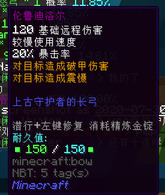

#### 狱火弓

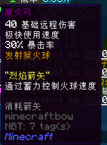

- **伤害**：40
- **使用速度**: 极快
- **弹药类型**：箭矢
- **弹药容量**：无
- **耐久**：无
- **暴击率**：30% 
- **初始附魔**：无
- **效果**：发射狱火球，通过蓄力控制火球速度
- **获得方式**：
  + **铸造**：
    * T3 ：36x T3 天界魔矿起
    * T4 ：16x T4 天界魔矿起
  + **合成**：
    * 由**冰雪弓**升级，消耗 16x 魔金矿物块，32x T3 天界魔矿，6x 灵魂残片，8x 死亡草和 8x 炮弹残骸

!> 这件武器在查询时还有另一种 **82 伤害，150 耐久，用精炼金锭修复**的版本，如下图所示。暂不清楚哪个是最新版本。

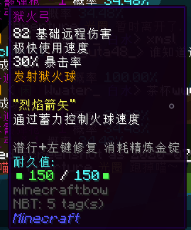

#### 喷火轻机枪

- **伤害**：30
- **使用速度**: 疯狂
- **弹药类型**：通用纳米子弹
- **弹药容量**：300
- **耐久**：无
- **暴击率**：15% 
- **初始附魔**：无
- **效果**：全自动射击，对目标造成破甲伤害，点亮目标
- **获得方式**：
  + **铸造**：
    * T3 ：36x T3 天界魔矿起
    * T4 ：18x T4 天界魔矿起
  + **合成**：
    * 由 **M4A1** 升级，消耗 16x 魔金矿物块，32x T3 天界魔矿，6x 灵魂残片，8x 死亡草和 8x 炮弹残骸

所以它到底是轻机枪还是重机枪呢

#### 战术霰弹枪

- **伤害**：36
- **使用速度**: 较快
- **弹药类型**：通用纳米子弹
- **弹药容量**：12
- **耐久**：无
- **暴击率**：30% 
- **初始附魔**：无
- **效果**：降低目标的攻击力，对目标造成震慑
- **获得方式**：
  + **铸造**：
    * T3 ：36x T3 天界魔矿起
    * T4 ：16x T4 天界魔矿起
  + **合成**：
    * 由 **Astra 900** 升级，消耗 16x 魔金矿物块，32x T3 天界魔矿，6x 灵魂残片，8x 死亡草和 8x 炮弹残骸

#### 高温射线枪

- **伤害**：145
- **使用速度**: 较快
- **弹药类型**：通用纳米子弹
- **弹药容量**：150
- **耐久**：无
- **暴击率**：无
- **初始附魔**：无
- **效果**：发射高温激光，穿透射程中所有目标
- **获得方式**：
  + **铸造**：
    * T4 ：20x T4 天界魔矿起
  + **合成**：
    * 由 **Win-Man** 升级，消耗 16x 魔金矿物块，40x T3 天界魔矿，6x 灵魂残片，8x 死亡草和 8x 炮弹残骸

!> 这件武器在其来源游戏 **Terraria** 中是魔法武器，而在 Inf 中是远程武器。

#### 嵐

- **伤害**：42
- **使用速度**: 较快
- **弹药类型**：箭矢
- **弹药容量**：无
- **耐久**：无
- **暴击率**：12% ，爆头伤害 x2.0
- **初始附魔**：无
- **效果**：单次射出三连发箭矢，潜行时跃向空中，左键跃向后方
- **获得方式**：
  + **铸造**：
    * T4 ：20x T4 天界魔矿起
  + **合成**：
    * 由**超级风怒弓**升级，消耗 16x 魔金矿物块，40x T3 天界魔矿，6x 灵魂残片，8x 死亡草和 8x 炮弹残骸

#### Rocklet launcher MAKE IV

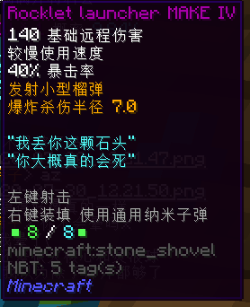

- **伤害**：140
- **使用速度**: 较慢
- **弹药类型**：通用纳米子弹
- **弹药容量**：8
- **耐久**：无
- **暴击率**：40%
- **初始附魔**：无
- **效果**：发射小型榴弹，爆炸杀伤半径 7.0
- **获得方式**：
  + **铸造**：
    * T4 ：24x T4 天界魔矿起
  + **合成**：
    * 由 **Rocklet launcher MAKE III** 升级，消耗 16x 魔金矿物块，48x T3 天界魔矿，6x 灵魂残片，6x 死亡草，4x 浸毒蛛眼和 6x 炮弹残骸

#### 龙骨狙击枪（久经沙场）

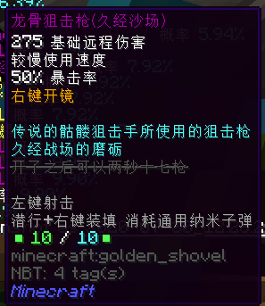

- **伤害**：275
- **使用速度**: 较慢
- **弹药类型**：通用纳米子弹
- **弹药容量**：10
- **耐久**：无
- **暴击率**：50% 
- **初始附魔**：无
- **效果**：射击，右键开镜
- **获得方式**：
  + **铸造**：
    * T4 ：32x T4 天界魔矿起
  + **合成**：
    * 由**龙骨狙击枪**升级，消耗 16x 魔金矿物块，64x T3 天界魔矿，6x 灵魂残片，6x 死亡草，4x 浸毒蛛眼和 6x 炮弹残骸

### T5

#### 代达罗斯风暴弓

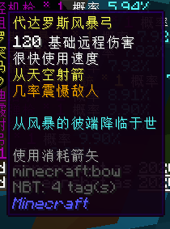

- **伤害**：120
- **使用速度**: 很快
- **弹药类型**：箭矢
- **弹药容量**：无
- **耐久**：无
- **暴击率**：无
- **初始附魔**：无
- **效果**：从天空射箭，几率震慑敌人
- **获得方式**：
  + **铸造**：
    * T4 ：32x T4 天界魔矿起
    * T5 ：32x T5 天界魔矿起

#### 精准突击步枪

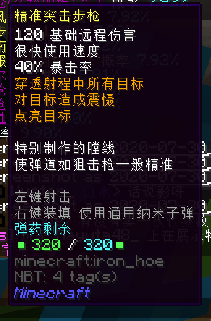

- **伤害**：120
- **使用速度**: 很快
- **弹药类型**：通用纳米子弹
- **弹药容量**：320
- **耐久**：无
- **暴击率**：40%
- **初始附魔**：无
- **效果**：穿透射程中所有目标，对目标造成震慑，点亮目标
- **获得方式**：
  + **铸造**：
    * T4 ：32x T4 天界魔矿起
    * T5 ：28x T5 天界魔矿起

#### 激光马格南

- **伤害**：120
- **使用速度**: 极快
- **弹药类型**：电力（使用通用电池模组充能）
- **弹药容量**：1000
- **耐久**：无
- **暴击率**：无
- **初始附魔**：无
- **效果**：发射激光，遇到障碍物时反弹，对目标造成震慑，降低目标防御力
- **获得方式**：
  + **铸造**：
    * T4 ：32x T4 天界魔矿起
    * T5 ：24x T5 天界魔矿起

#### セーラー服と機関銃

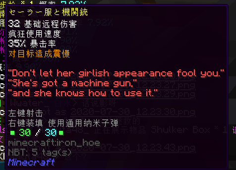

- **伤害**：32
- **使用速度**: 疯狂
- **弹药类型**：通用纳米子弹
- **弹药容量**：30
- **耐久**：无
- **暴击率**：35%
- **初始附魔**：无
- **效果**：对目标造成震慑
- **获得方式**：
  + **铸造**：
    * T4 ：32x T4 天界魔矿起
    * T5 ：24x T5 天界魔矿起

#### 迷你加特林

- **伤害**：30
- **使用速度**: 疯狂
- **弹药类型**：通用纳米子弹
- **弹药容量**：600
- **耐久**：无
- **暴击率**：20%
- **初始附魔**：无
- **效果**：射击
- **获得方式**：
  + **铸造**：
    * T4 ：48x T4 天界魔矿起
    * T5 ：48x T5 天界魔矿起
  + **合成**：
    * 由**喷火轻机枪**升级，消耗 24x 蓝钻矿物块，96x T4 天界魔矿，12x 灵魂残片，12x 小玩偶，8x 破损的枪械零件和 12x 浸毒蛛眼

#### Desert Eagle Mark XIX

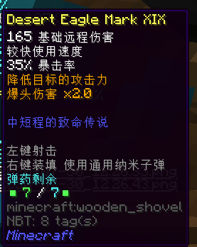

- **伤害**：165
- **使用速度**: 较快
- **弹药类型**：通用纳米子弹
- **弹药容量**：7
- **耐久**：无
- **暴击率**：35% ，爆头伤害 x2.0
- **初始附魔**：无
- **效果**：降低目标的攻击力
- **获得方式**：
  + **铸造**：
    * T4 ：48x T4 天界魔矿起
    * T5 ：20x T5 天界魔矿起

#### 镖枪

- **伤害**：185
- **使用速度**: 很快
- **弹药类型**：箭矢
- **弹药容量**：150
- **耐久**：无
- **暴击率**：30%
- **初始附魔**：无
- **效果**：发射腐蚀飞镖
- **获得方式**：
  + **铸造**：
    * T4 ：48x T4 天界魔矿起
    * T5 ：20x T5 天界魔矿起

#### 海啸

- **伤害**：75
- **使用速度**: 较快
- **弹药类型**：箭矢
- **弹药容量**：无
- **耐久**：无
- **暴击率**：20%
- **初始附魔**：无
- **效果**：发射箭雨
- **获得方式**：
  + **铸造**：
    * T4 ：48x T4 天界魔矿起
    * T5 ：24x T5 天界魔矿起
  + **合成**：
    * 由**嵐**升级，消耗 24x 蓝钻矿物块，48x T4 天界魔矿，12x 灵魂残片，16x 小玩偶和 16x 浸毒蛛眼

#### 仙人球机枪

- **伤害**：88
- **使用速度**: 疯狂
- **弹药类型**：通用纳米子弹
- **弹药容量**：1000（ 5% 弹药消耗）
- **耐久**：无
- **暴击率**：20%
- **初始附魔**：无
- **效果**：发射全方向短距离仙人掌刺，穿透射程中所有目标
- **获得方式**：
  + **铸造**：
    * T4 ：48x T4 天界魔矿起
    * T5 ：48x T5 天界魔矿起

!> 这件武器在查询时还有另一种 **50 伤害，无弹药数量减免**的版本，如下图所示。暂不清楚哪个是最新版本。

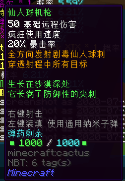

#### 日灼凤凰长弓

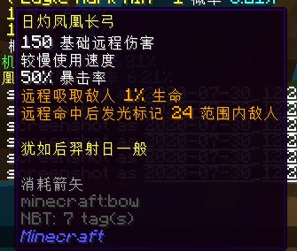

- **伤害**：150
- **使用速度**: 较慢
- **弹药类型**：箭矢
- **弹药容量**：无
- **耐久**：无
- **暴击率**：50%
- **初始附魔**：无
- **效果**：远程吸取敌人 1% 生命，远程命中后发光标记 24 范围内敌人
- **获得方式**：
  + **铸造**：
    * T4 ：48x T4 天界魔矿起
    * T5 ：20x T5 天界魔矿起
  + **合成**：
    * 由**伦鲁迪洛尔**升级，消耗 24x 蓝钻矿物块，40x T4 天界魔矿，12x 灵魂残片，16x 小玩偶和 16x 浸毒蛛眼

#### 巨兽鲨

- **伤害**：40
- **使用速度**: 疯狂
- **弹药类型**：通用纳米子弹
- **弹药容量**：1000（ 50% 几率不消耗弹药）
- **耐久**：无
- **暴击率**：30%
- **初始附魔**：无
- **效果**：穿透射程中所有目标
- **获得方式**：
  + **铸造**：
    * T4 ：56x T4 天界魔矿起
    * T5 ：48x T5 天界魔矿起
  + **合成**：
    * 由**高温射线枪**升级，消耗 24x 蓝钻矿物块，96x T4 天界魔矿，12x 灵魂残片，12x 小玩偶，8x 破损的枪械零件和 12x 浸毒蛛眼

#### 妙缘

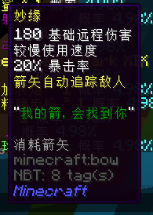

- **伤害**：180
- **使用速度**: 较慢
- **弹药类型**：箭矢
- **弹药容量**：无
- **耐久**：无
- **暴击率**：20%
- **初始附魔**：无
- **效果**：箭矢自动追踪敌人
- **获得方式**：
  + **铸造**：
    * T4 ：56x T4 天界魔矿起
    * T5 ：32x T5 天界魔矿起
  + **合成**：
    * 由**伦鲁迪洛尔**升级，消耗 24x 蓝钻矿物块，64x T4 天界魔矿，12x 灵魂残片，12x 小玩偶，8x 巨大蛛网和 12x 浸毒蛛眼

#### 玉米加农炮

- **伤害**：288
- **使用速度**: 很慢
- **弹药类型**：火箭弹
- **弹药容量**：9
- **耐久**：无
- **暴击率**：无
- **初始附魔**：无
- **效果**：在准心位置投放一枚炸弹，大幅度击退敌人
- **获得方式**：
  + **铸造**：
    * T4 ：56x T4 天界魔矿起
    * T5 ：48x T5 天界魔矿起
  + **合成**：
    * 由**喷火轻机枪**升级，消耗 24x 蓝钻矿物块，96x T4 天界魔矿，12x 灵魂残片，12x 破损的枪械零件，8x 巨大蛛网和 12x 浸毒蛛眼

#### 长弓精确步枪

- **伤害**：120
- **使用速度**: 较慢
- **弹药类型**：通用纳米子弹
- **弹药容量**：5
- **耐久**：无
- **暴击率**：10%
- **初始附魔**：无
- **效果**：免疫失明，爆头伤害 x4.0
- **获得方式**：
  + **铸造**：
    * T4 ：56x T4 天界魔矿起
    * T5 ：40x T5 天界魔矿起
  + **合成**：
    * 由**龙骨狙击枪（久经沙场）**升级，消耗 24x 蓝钻矿物块，80x T4 天界魔矿，12x 灵魂残片，12x 小玩偶，8x 巨大蛛网和 12x 浸毒蛛眼

!> 这件武器在查询时还有另一种 **75 伤害**的版本，如下图所示。暂不清楚哪个是最新版本。

#### 符文弓

- **伤害**：160
- **使用速度**: 很快
- **弹药类型**：箭矢
- **弹药容量**：无
- **耐久**：1000
- **修复材料**：精炼金锭
- **暴击率**：20%
- **初始附魔**：无
- **效果**：发射符文，对目标造成震慑
- **获得方式**：
  + **铸造**：
    * T5 ：32x T5 天界魔矿起

#### 索利达尔·群星之怒

- **伤害**：40
- **使用速度**: 较快
- **弹药类型**：箭矢
- **弹药容量**：无
- **耐久**：120
- **修复材料**：精炼金锭
- **暴击率**：30%
- **初始附魔**：无
- **效果**：命中后自动射出第二发
- **获得方式**：
  + **铸造**：
    * T5 ：32x T5 天界魔矿起
  + **合成**：
    * 由**狱火弓**升级，消耗 24x 蓝钻矿物块，64x T4 天界魔矿，12x 灵魂残片，16x 小玩偶和 16x 浸毒蛛眼

#### 钱币枪

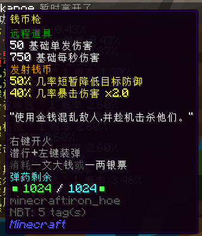

- **伤害**：50（单发）750（每秒）
- **使用速度**: 较快
- **弹药类型**：一文大钱（也可用一两银票装弹）
- **弹药容量**：1024
- **耐久**：无
- **暴击率**：40% 伤害 x2.0
- **初始附魔**：无
- **效果**：发射钱币，50% 几率短暂降低目标防御力
- **获得方式**：
  + **铸造**：
    * T5 ：48x T5 天界魔矿起

#### 双子轨道炮·彗星

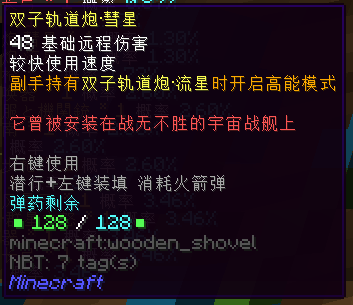

- **伤害**：48
- **使用速度**: 较快
- **弹药类型**：火箭弹
- **弹药容量**：128
- **耐久**：无
- **暴击率**：无
- **初始附魔**：无
- **效果**：副手持有**双子轨道炮·流星**时开启高能模式
- **获得方式**：
  + **铸造**：
    * T5 ：48x T5 天界魔矿起

#### 双子轨道炮·流星

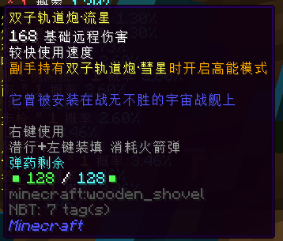

- **伤害**：168
- **使用速度**: 较快
- **弹药类型**：火箭弹
- **弹药容量**：128
- **耐久**：无
- **暴击率**：无
- **初始附魔**：无
- **效果**：副手持有**双子轨道炮·彗星**时开启高能模式
- **获得方式**：
  + **铸造**：
    * T5 ：48x T5 天界魔矿起

#### 核打击召唤器

- **伤害**：2000
- **使用速度**: 极慢
- **弹药类型**：火箭弹
- **弹药容量**：1
- **耐久**：无
- **暴击率**：无
- **初始附魔**：无
- **效果**：发射核弹，数秒后在指定位置爆炸
- **获得方式**：
  + **铸造**：
    * T5 ：48x T5 天界魔矿起
  + **合成**：
    * 由**喷火轻机枪**升级，消耗 24x 蓝钻矿物块，96x T4 天界魔矿，12x 灵魂残片，12x 破损的枪械零件，8x 巨大蛛网和 12x 浸毒蛛眼

#### 榴弹发射器

- **伤害**：188
- **使用速度**: 很快
- **弹药类型**：通用纳米子弹
- **弹药容量**：6
- **耐久**：无
- **暴击率**：50%
- **初始附魔**：无
- **效果**：发射弹射榴弹，命中或一段时间后爆炸
- **获得方式**：
  + **铸造**：
    * T5 ：48x T5 天界魔矿起
  + **合成**：
    * 由 **Rocklet launcher MAKE V** 升级，消耗 8x 精炼蓝钻

#### Rocklet launcher MAKE V

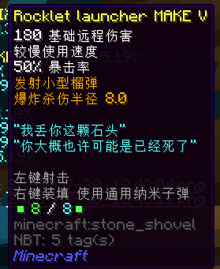

- **伤害**：180
- **使用速度**: 较慢
- **弹药类型**：通用纳米子弹
- **弹药容量**：8
- **耐久**：无
- **暴击率**：50%
- **初始附魔**：无
- **效果**：发射小型榴弹，爆炸杀伤半径 8.0
- **获得方式**：
  + **铸造**：
    * T5 ：48x T5 天界魔矿起
  + **合成**：
    * 由 **Rocklet launcher MAKE IV** 升级，消耗 24x 蓝钻矿物块，96x T4 天界魔矿，12x 灵魂残片，12x 小玩偶，8x 巨大蛛网和 12x 浸毒蛛眼

#### 水晶镖枪

- **伤害**：100
- **使用速度**: 较快
- **弹药类型**：通用纳米子弹
- **弹药容量**：600
- **耐久**：无
- **暴击率**：5%
- **初始附魔**：无
- **效果**：发射水晶镖，遇到障碍物时反弹，碰撞时水晶破片造成溅射伤害
- **获得方式**：
  + **铸造**：
    * T5 ：48x T5 天界魔矿起
  + **合成**：
    * 由**镖枪**升级，消耗 24x 蓝钻矿物块，96x T4 天界魔矿，12x 灵魂残片，12x 破损的枪械零件，8x 亡灵幻影和 12x 浸毒蛛眼

#### 爆破霰弹枪

- **伤害**：200
- **使用速度**: 较慢
- **弹药类型**：通用纳米子弹
- **弹药容量**：1000
- **耐久**：无
- **暴击率**：无
- **初始附魔**：无
- **效果**：发射霰弹，降低目标的攻击力，25% 几率降低目标的防御力
- **获得方式**：
  + **铸造**：
    * T5 ：48x T5 天界魔矿起
  + **合成**：
    * 由**战术霰弹枪**升级，消耗 24x 蓝钻矿物块，96x T4 天界魔矿，12x 灵魂残片，12x 小玩偶，8x 破损的枪械零件和 12x 浸毒蛛眼

#### 塔诺西加农炮

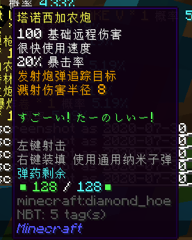

- **伤害**：100
- **使用速度**: 很快
- **弹药类型**：通用纳米子弹
- **弹药容量**：128
- **耐久**：无
- **暴击率**：20%
- **初始附魔**：无
- **效果**：发射炮弹追踪目标，溅射伤害半径 8
- **获得方式**：
  + **铸造**：
    * T5 ：48x T5 天界魔矿起
  + **合成**：
    * 由**高温射线枪**升级，消耗 24x 蓝钻矿物块，96x T4 天界魔矿，12x 灵魂残片，12x 小玩偶，8x 破损的枪械零件和12x 巨大蛛网

#### 火药桶·爆炸卷

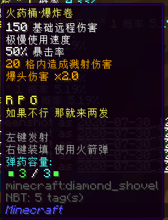

- **伤害**：150
- **使用速度**: 极慢
- **弹药类型**：火箭弹
- **弹药容量**：3
- **耐久**：无
- **暴击率**：50% ，爆头伤害 x2.0
- **初始附魔**：无
- **效果**：20 格内造成溅射伤害
- **获得方式**：
  + **铸造**：
    * T5 ：48x T5 天界魔矿起

#### 魔焰弓

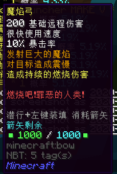

- **伤害**：200
- **使用速度**: 很快
- **弹药类型**：箭矢
- **弹药容量**：1000
- **耐久**：无
- **暴击率**：10%
- **初始附魔**：无
- **效果**：发射巨大的魔焰，对目标造成震慑，造成持续的燃烧伤害
- **获得方式**：
  + **铸造**：
    * T5 ：48x T5 天界魔矿起
  + **合成**：
    * 由**狱火弓**升级，消耗 24x 蓝钻矿物块，96x T4 天界魔矿，12x 灵魂残片，12x 小玩偶，8x 亡灵幻影和 12x 巨大蛛网

#### 拉特兰守护铳

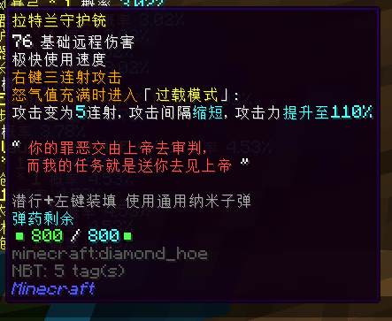

- **伤害**：76
- **使用速度**: 极快
- **弹药类型**：通用纳米子弹
- **弹药容量**：800
- **耐久**：无
- **暴击率**：无
- **初始附魔**：无
- **效果**：右键三连射攻击；怒气值满时进入「过载模式」，攻击变为 5 连射，攻击间隔缩短，攻击力提升至 110%
- **获得方式**：
  + **铸造**：
    * T5 ：64x T5 天界魔矿起
  + **合成**：
    * 由**战术霰弹枪**升级，消耗 24x 蓝钻矿物块，128x T4 天界魔矿，12x 灵魂残片，12x 破损的枪械零件，8x 亡灵幻影和 12x 巨大蛛网

### T5红名

#### 雪风短弓

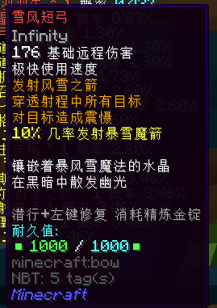

- **伤害**：176
- **使用速度**: 极快
- **弹药类型**：箭矢
- **弹药容量**：无
- **耐久**：1000
- **修复材料**：精炼金锭
- **暴击率**：无
- **初始附魔**：无限
- **效果**：发射风雪之箭，穿透射程中所有的目标，对目标造成震慑，10% 几率发射暴雪魔箭
- **获得方式**：
  + **铸造**：
    * T5 ：48x T5 天界魔矿起

#### 光之水晶长弓

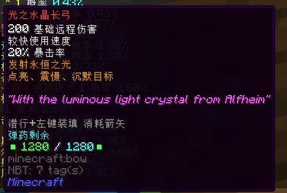

- **伤害**：200
- **使用速度**: 较快
- **弹药类型**：箭矢
- **弹药容量**：1280
- **耐久**：无
- **暴击率**：20%
- **初始附魔**：无
- **效果**：发射永恒之光，点亮，震慑，沉默目标
- **获得方式**：
  + **铸造**：
    * T5 ：48x T5 天界魔矿起
  + **合成**：
    * 由**索利达尔·群星之怒**升级，消耗 4x 精炼蓝钻，128x T5 天界魔矿，28x 灵魂残片，1x 一张银行卡，32x 被掠夺的宝藏和 8x 劫掠之心

#### 飞雷弓·羽羽矢

- **伤害**：210
- **使用速度**: 极快
- **弹药类型**：箭矢
- **弹药容量**：无
- **耐久**：150
- **修复材料**：精炼金锭
- **暴击率**：12% ，爆头伤害 x1.5
- **初始附魔**：无
- **效果**：对目标造成震慑，命中后恢复少量饥饿值；命中后使用疾跑键触发「回避」，回避成功后消耗体力并获得短暂抗性效果；累积命中 3 次后左键触发「曲射」，潜行 + 空格消耗体力发动技能「体术」
- **获得方式**：
  + **铸造**：
    * T5 ：48x T5 天界魔矿起

#### 毒刺

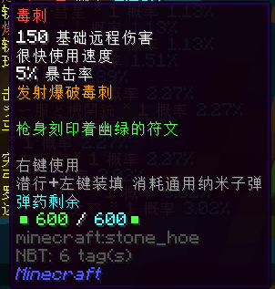

- **伤害**：150
- **使用速度**: 很快
- **弹药类型**：通用纳米子弹
- **弹药容量**：600
- **耐久**：无
- **暴击率**：5%
- **初始附魔**：无
- **效果**：发射爆破毒刺
- **获得方式**：
  + **铸造**：
    * T5 ：64x T5 天界魔矿起
  + **合成**：
    * 由**镖枪**升级，消耗 2x 精炼蓝钻，64x T5 天界魔矿，24x 灵魂残片，16x 剧毒药剂，16x 细胞样本和 8x 大大卷
  
#### 电磁爆发炮

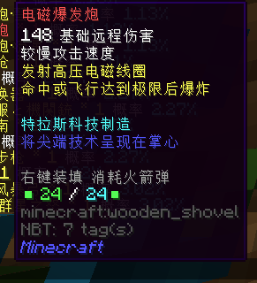

- **伤害**：148
- **使用速度**: 较慢
- **弹药类型**：火箭弹
- **弹药容量**：24
- **耐久**：无
- **暴击率**：无
- **初始附魔**：无
- **效果**：发射高压电磁线圈，命中或飞行达到极限后爆炸
- **获得方式**：
  + **铸造**：
    * T5 ：64x T5 天界魔矿起

#### 幻影

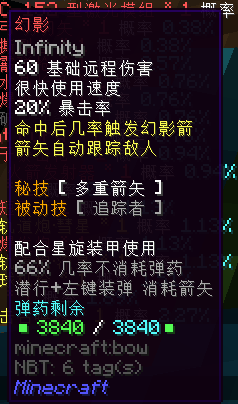

- **伤害**：60
- **使用速度**: 很快
- **弹药类型**：箭矢
- **弹药容量**：3840（ 66% 几率不消耗弹药）
- **耐久**：无
- **暴击率**：20%
- **初始附魔**：无限
- **效果**：配合星璇装甲使用，命中后几率触发幻影箭，箭矢自动跟踪敌人。秘技 [ 多重箭矢 ] ，被动技 [ 追踪者 ]
- **获得方式**：
  + **铸造**：
    * T5 ：48x T5 天界魔矿起

#### TAC 火箭发射器

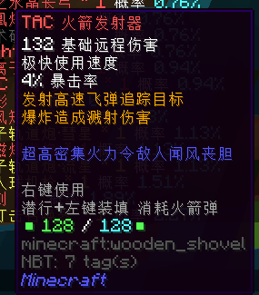

- **伤害**：132
- **使用速度**: 极快
- **弹药类型**：火箭弹
- **弹药容量**：128
- **耐久**：无
- **暴击率**：4%
- **初始附魔**：无
- **效果**：发射高速飞弹追踪目标，爆炸造成溅射伤害
- **获得方式**：
  + **铸造**：
    * T5 ：64x T5 天界魔矿起

#### 等离子暴击枪

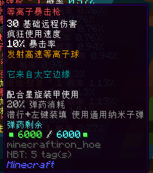

- **伤害**：30
- **使用速度**: 疯狂
- **弹药类型**：通用纳米子弹
- **弹药容量**：6000（ 20% 弹药消耗）
- **耐久**：无
- **暴击率**：10%
- **初始附魔**：无
- **效果**：配合星璇装甲使用，发射高速等离子球
- **获得方式**：
  + **铸造**：
    * T5 ：64x T5 天界魔矿起
  + **合成**：
    * 由**巨兽鲨**升级，消耗 10x 精炼蓝钻，128x T5 天界魔矿，24x 灵魂残片，1x 一张银行卡，16x 霜之星，16x 冷晶和 32x 雪蛤壳
 
#### Night Fury

- **伤害**：150
- **使用速度**: 极快
- **弹药类型**：箭矢
- **弹药容量**：3840
- **耐久**：无
- **暴击率**：50%
- **初始附魔**：无限
- **效果**：发射等离子爆破弹，命中后造成范围爆炸并震慑敌人
- **获得方式**：
  + **铸造**：
    * T5 ：64x T5 天界魔矿起
  + **合成**：
    * 由**魔焰弓**升级，消耗 4x 精炼蓝钻，128x T5 天界魔矿，28x 灵魂残片，1x 一张银行卡，16x 龙鱼角，16x 龙鱼刺，8x 鱼泡泡
  
#### 战术破甲强弩

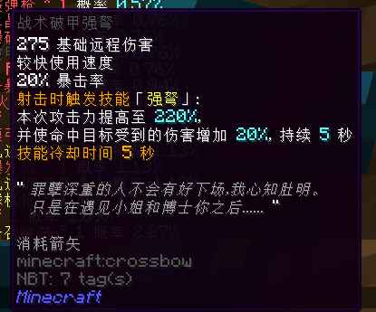

- **伤害**：275
- **使用速度**: 较快
- **弹药类型**：箭矢
- **弹药容量**：无
- **耐久**：无
- **暴击率**：20%
- **初始附魔**：无
- **效果**：射击时触发「强弩」，本次攻击力提高至220% ，并使命中目标受到的伤害增加 20% ，持续 5 秒。技能冷却时间 5 秒
- **获得方式**：
  + **铸造**：
    * T5 ：64x T5 天界魔矿起
  + **合成**：
    * 由**长弓精确步枪**和**海啸**升级，消耗 4x 精炼蓝钻，128x T5 天界魔矿，28x 灵魂残片，16x 土匪的弩箭和 16x断臂

#### 凤凰爆破枪

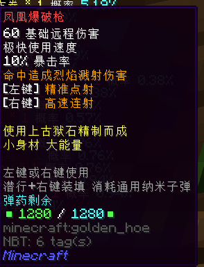

- **伤害**：60
- **使用速度**: 极快
- **弹药类型**：通用纳米子弹
- **弹药容量**：1280
- **耐久**：无
- **暴击率**：10%
- **初始附魔**：无
- **效果**：命中造成烈焰溅射伤害，左键精准点射，右键高速连射
- **获得方式**：
  + **铸造**：
    * T5 ：64x T5 天界魔矿起
  + **合成**：
    * 由 **Desert Eagle Mark XIX** 升级，消耗 6x 精炼蓝钻，128x T5 天界魔矿，32x 灵魂残片，1x 一张银行卡，25x 星璇碎块和 15x 精雕翡翠石块

#### 外星霰弹枪

- **伤害**：236
- **使用速度**: 较慢
- **弹药类型**：通用纳米子弹
- **弹药容量**：260
- **耐久**：无
- **暴击率**：20%
- **初始附魔**：无
- **效果**：发射环状外星射线，射线命中后产生爆炸
- **获得方式**：
  + **铸造**：
    * T5 ：64x T5 天界魔矿起

#### 次元撕裂者

- **伤害**：400
- **使用速度**: 较慢
- **弹药类型**：通用纳米子弹
- **弹药容量**：10
- **耐久**：无
- **暴击率**：50%
- **初始附魔**：无
- **效果**：配合星璇装甲使用，右键开镜，左键射击。
- **获得方式**：
  + **铸造**：
    * T5 ：64x T5 天界魔矿起
  + **合成**：
    * 由**精准突击步枪 MK II** 升级，消耗 8x 精炼蓝钻，128x T5 天界魔矿，32x 灵魂残片，2x 一张银行卡，25x 星璇碎块，15x 精雕翡翠石块和 15x 精灵水晶

#### NCOC-152 型激光模组

- **伤害**：56
- **使用速度**: 疯狂
- **弹药类型**：电力（使用通用电池模组充能）
- **弹药容量**：20000
- **耐久**：无
- **暴击率**：无
- **初始附魔**：无
- **效果**：发射高能激光，遇到障碍物时返弹
- **获得方式**：
  + **铸造**：
    * T5 ：64x T5 天界魔矿起
  + **合成**：
    * 由**激光马格南**升级，消耗 8x 精炼蓝钻，128x T5 天界魔矿，40x 灵魂残片，2x 一张银行卡，25x 火星岩块，15x 精雕翡翠石块和 15x 精灵水晶

#### 黑洞导弹

- **伤害**：568
- **使用速度**: 极慢
- **弹药类型**：火箭弹
- **弹药容量**：6
- **耐久**：无
- **暴击率**：无
- **初始附魔**：无
- **效果**：发射小型黑洞，吸引大范围内的生物，并引发爆炸
- **获得方式**：
  + **铸造**：
    * T5 ：64x T5 天界魔矿起

#### S.D.M.G

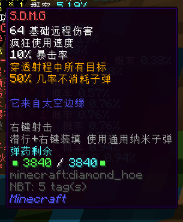

- **伤害**：64
- **使用速度**: 疯狂
- **弹药类型**：通用纳米子弹
- **弹药容量**：3840（ 50% 几率不消耗子弹）
- **耐久**：无
- **暴击率**：10%
- **初始附魔**：无
- **效果**：穿透射程中所有目标
- **获得方式**：
  + **铸造**：
    * T5 ：64x T5 天界魔矿起

## 合成武器

#### 精准突击步枪 MK II

- **等级**：T5
- **伤害**：198
- **使用速度**: 极快
- **弹药类型**：通用纳米子弹
- **弹药容量**：512
- **耐久**：无
- **暴击率**：40%
- **初始附魔**：无
- **效果**：穿透射程中所有目标，对目标造成震慑，右键开镜并高亮周围目标
- **获得方式**：
  + **合成**：
    * 由**精准突击步枪** 升级，消耗 8x 精炼蓝钻，128x T5 天界魔矿和 8x 灵魂残片
  
#### 榴弹步枪

- **等级**：T5+
- **伤害**：168
- **使用速度**: 较快
- **弹药类型**：通用纳米子弹
- **弹药容量**：180
- **耐久**：无
- **暴击率**：50%
- **初始附魔**：无
- **效果**：攻击使敌人虚弱，右键发射三连发小型榴弹，满怒气时潜行发射一枚小型制导火箭
- **获得方式**：
  + **合成**：
    * 由**双子轨道炮·彗星**，**双子轨道炮·流星**，**毒刺**，**凤凰爆破枪**和 32x 精炼蓝钻
  
## Boss 武器

#### 星璇机枪

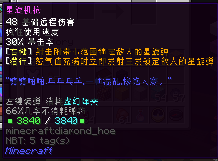

- **所属 Boss** ：星璇火枪手 lv.22
- **等级**：T5+
- **伤害**：48
- **使用速度**: 疯狂
- **弹药类型**：特殊子弹（用**虚幻弹夹**装填）
- **弹药容量**：3840（66% 几率不消耗弹药）
- **耐久**：无
- **暴击率**：30%
- **初始附魔**：无
- **效果**：右键射击带有小范围锁定敌人的星璇弹，怒气值充满时潜行发射三发锁定敌人的星璇弹
- **获得方式**：
  + **兑换**：
    * 地点：海贼之家
    * 需要 64x 星璇碎块

#### 玛瑙爆破枪

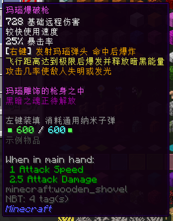

- **所属 Boss** ：空洞王 lv.24
- **等级**：T5+
- **伤害**：728
- **使用速度**: 较快
- **弹药类型**：通用纳米子弹
- **弹药容量**：600
- **耐久**：无
- **暴击率**：25%
- **初始附魔**：无
- **效果**：右键发射玛瑙弹头，命中后爆炸，飞行距离达到极限后爆发并释放暗黑能量，攻击几率使敌人失明或发光
- **获得方式**：
  + **合成**：
    * 需要 64x 空洞黑暗立方，4x 精炼蓝钻，64x T5 天界魔矿，24x 灵魂残片

## 活动武器

### 2020 年 劳动节活动

#### 森林重弩

- **等级**：T3
- **伤害**：52
- **使用速度**: 很快
- **弹药类型**：箭矢
- **弹药容量**：无
- **耐久**：无
- **暴击率**：无
- **初始附魔**：无
- **效果**：穿透射程内所有目标，潜行攻击时额外射出精灵箭矢，精灵箭矢造成 2 倍伤害并跟踪敌人
- **获得方式**：
  + **合成**：
    * 需要武器蓝图 - 森林重弩，2x 24K 纯金和 64x T3 天界魔矿

#### 森林重弩 S

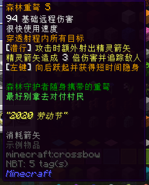

- **等级**：T5
- **伤害**：94
- **使用速度**: 很快
- **弹药类型**：箭矢
- **弹药容量**：无
- **耐久**：无
- **暴击率**：无
- **初始附魔**：无
- **效果**：穿透射程内所有目标，潜行攻击时额外射出精灵箭矢，精灵箭矢造成 3 倍伤害并跟踪敌人，左键向后跃起并获得短时间隐身
- **获得方式**：
  + **合成**：
    * 由**森林重弩**升级，消耗武器蓝图 - 森林重弩，2x 24K 纯金，2x 精炼魔金，2x 精炼蓝钻和 64x T5 天界魔矿
