# 召唤武器

召唤武器是指召唤炮台，利用炮台进行攻击的武器。

它们一般需要**智慧之尘**修复（ Boss 武器除外），并具有 200 点耐久（陨石法杖除外），也一般没有初始附魔。同时，它们也没有暴击。

召唤武器需要通过铸造和兑换（ Boss 武器）获得，少数召唤武器可以通过合成升级。

感谢各位玩家在数据收集时提供的帮助。本篇使用了部分来自于玩家铸造后使用指令展示的武器，已在下方标明。

!> 请勿在主世界内随意玩耍inf武器，可能误伤玩家或使他人财产受到损失。

## 目录

- [铸造武器](#铸造武器)
  + [T1](#T1)
  + [T2](#T2)
  + [T3](#T3)
  + [T4](#T4)
  + [T5](#T5)
  + [T5+](#T5-红名)
- [Boss 武器](#Boss-武器)

## 铸造武器

### T1

#### 雪球炮法杖

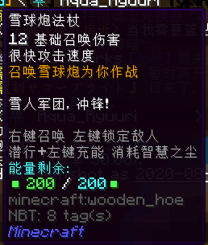

- **伤害**：12
- **攻击速度**：很快
- **耐久**：200
- **修复材料**：智慧之尘
- **仆从位**：1
- **效果**：召唤雪球炮
- **获得方式**：
  + **铸造**：
    * T1 ：4x T1 天界魔矿起

#### 弩车法杖

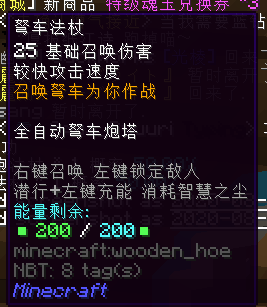

- **伤害**：25
- **攻击速度**：较快
- **耐久**：200
- **修复材料**：智慧之尘
- **仆从位**：1
- **效果**：召唤弩车
- **获得方式**：
  + **铸造**：
    * T1 ：4x T1 天界魔矿起

#### 凋零法杖

- **伤害**：15
- **攻击速度**：较快
- **耐久**：200
- **修复材料**：智慧之尘
- **仆从位**：1
- **效果**：召唤凋零图腾发射大量凋零骷髅头
- **获得方式**：
  + **铸造**：
    * T1 ：8x T1 天界魔矿起

### T2

#### 尖刺图腾法杖

- **伤害**：50
- **攻击速度**：较慢
- **耐久**：200
- **修复材料**：智慧之尘
- **仆从位**：1
- **效果**：召唤尖刺图腾，周期性对小范围内所有敌人造成伤害
- **获得方式**：
  + **铸造**：
    * T1 ：16x T1 天界魔矿起
    * T2 ：8x T2 天界魔矿起

#### 弩车法杖 MKII

- **伤害**：45
- **攻击速度**：较快
- **耐久**：200
- **修复材料**：智慧之尘
- **仆从位**：1
- **效果**：召唤弩车
- **获得方式**：
  + **铸造**：
    * T1 ：16x T1 天界魔矿起
    * T2 ：6x T2 天界魔矿起

#### 爆炸机关法杖

- **伤害**：55
- **攻击速度**：较快
- **耐久**：200
- **修复材料**：智慧之尘
- **仆从位**：1
- **效果**：召唤爆弹图腾，向周围敌人发射小型爆破弹
- **获得方式**：
  + **铸造**：
    * T2 ：8x T2 天界魔矿起

#### 精灵熔炉

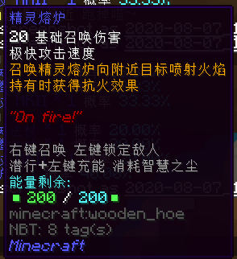

- **伤害**：20
- **攻击速度**：极快
- **耐久**：200
- **修复材料**：智慧之尘
- **仆从位**：1
- **效果**：召唤精灵熔炉，向附近目标喷射火焰，持有时获得抗火效果
- **获得方式**：
  + **铸造**：
    * T2 ：12x T2 天界魔矿起

### T3

#### 神灯法杖

- **伤害**：64
- **攻击速度**：较快
- **耐久**：200
- **修复材料**：智慧之尘
- **仆从位**：1
- **效果**：召唤神灯攻击附近至多两个敌人
- **获得方式**：
  + **铸造**：
    * T2 ：24x T2 天界魔矿起
    * T3 ：20x T3 天界魔矿起

#### 弩车法杖 MKIII

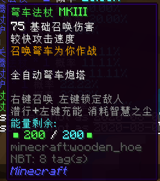

- **伤害**：64
- **攻击速度**：较快
- **耐久**：200
- **修复材料**：智慧之尘
- **仆从位**：1
- **效果**：召唤弩车
- **获得方式**：
  + **铸造**：
    * T2 ：24x T2 天界魔矿起
    * T3 ：10x T3 天界魔矿起

#### 鱼叉法杖

- **伤害**：80
- **攻击速度**：较快
- **耐久**：200
- **修复材料**：智慧之尘
- **仆从位**：1
- **效果**：召唤鱼叉图腾向敌人发射鱼叉！~~（感叹）~~
- **获得方式**：
  + **铸造**：
    * T3 ：10x T3 天界魔矿起

#### 闪光图腾法杖

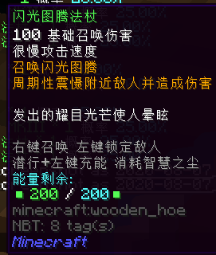

- **伤害**：100
- **攻击速度**：很慢
- **耐久**：200
- **修复材料**：智慧之尘
- **仆从位**：1
- **效果**：召唤闪光图腾，周期性震慑附近敌人并造成伤害
- **获得方式**：
  + **铸造**：
    * T3 ：14x T3 天界魔矿起

#### 尖刺图腾法杖

- **伤害**：85
- **攻击速度**：较慢
- **耐久**：200
- **修复材料**：智慧之尘
- **仆从位**：1
- **效果**：召唤尖刺图腾，周期性对小范围内所有敌人造成伤害
- **获得方式**：
  + **铸造**：
    * T3 ：20x T3 天界魔矿起

#### 机关连弩法杖

- **伤害**：28
- **攻击速度**：极快
- **耐久**：200
- **修复材料**：智慧之尘
- **仆从位**：1
- **效果**：召唤机关连弩
- **获得方式**：
  + **铸造**：
    * T3 ：20x T3 天界魔矿起

#### 雷神法杖

- **伤害**：96
- **攻击速度**：较慢
- **耐久**：200
- **修复材料**：智慧之尘
- **仆从位**：1
- **效果**：召唤雷神图腾，雷击敌人！~~（渡劫专用）~~
- **获得方式**：
  + **铸造**：
    * T3 ：20x T3 天界魔矿起

#### 精灵熔炉 EX

- **伤害**：36
- **攻击速度**：极快
- **耐久**：200
- **修复材料**：智慧之尘
- **仆从位**：1
- **效果**：召唤精灵熔炉向附近目标喷射火焰，持有时获得抗火效果
- **获得方式**：
  + **铸造**：
    * T3 ：30x T3 天界魔矿起

### T4

#### 光棱法杖

- **伤害**：85
- **攻击速度**：很快
- **耐久**：200
- **修复材料**：智慧之尘
- **仆从位**：1
- **效果**：召唤光棱塔，向敌人发射锁定光束
- **获得方式**：
  + **铸造**：
    * T3 ：32x T3 天界魔矿起
    * T4 ：26x T4 天界魔矿起

#### 标枪法杖

- **伤害**：115
- **攻击速度**：较快
- **耐久**：200
- **修复材料**：智慧之尘
- **仆从位**：1
- **效果**：召唤标枪塔向敌人投掷标枪，攻击使敌人虚弱
- **获得方式**：
  + **铸造**：
    * T3 ：32x T3 天界魔矿起
    * T4 ：14x T4 天界魔矿起

#### 弩车法杖 MKIV

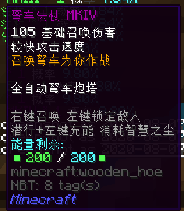

- **伤害**：105
- **攻击速度**：较快
- **耐久**：200
- **修复材料**：智慧之尘
- **仆从位**：1
- **效果**：召唤弩车
- **获得方式**：
  + **铸造**：
    * T3 ：32x T3 天界魔矿起
    * T4 ：14x T4 天界魔矿起

#### 尖刺图腾法杖

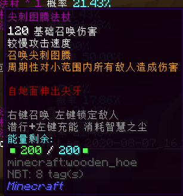

- **伤害**：120
- **攻击速度**：较慢
- **耐久**：200
- **修复材料**：智慧之尘
- **仆从位**：1
- **效果**：召唤尖刺图腾，周期性对小范围内所有敌人造成伤害
- **获得方式**：
  + **铸造**：
    * T4 ：20x T4 天界魔矿起

#### 脉冲波法杖

- **伤害**：240
- **攻击速度**：很慢
- **耐久**：200
- **修复材料**：智慧之尘
- **仆从位**：1
- **效果**：召唤脉冲塔，周期性对附近所有敌人造成伤害，并将其大幅度击退
- **获得方式**：
  + **铸造**：
    * T4 ：20x T4 天界魔矿起

#### 诅咒图腾法杖

- **伤害**：210
- **攻击速度**：很慢
- **耐久**：200
- **修复材料**：智慧之尘
- **仆从位**：1
- **效果**：召唤混沌图腾，周期性对附近敌人造成伤害并使其混乱
- **获得方式**：
  + **铸造**：
    * T4 ：20x T4 天界魔矿起

#### 爆炸机关法杖 MKII

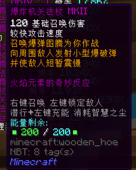

- **伤害**：120
- **攻击速度**：较快
- **耐久**：200
- **修复材料**：智慧之尘
- **仆从位**：1
- **效果**：召唤爆弹图腾，向周围敌人发射小型爆破弹，并使敌人短暂震慑
- **获得方式**：
  + **铸造**：
    * T4 ：26x T4 天界魔矿起

#### 寒霜球法杖

- **伤害**：45
- **攻击速度**：极快
- **耐久**：200
- **修复材料**：智慧之尘
- **仆从位**：1
- **效果**：召唤寒霜图腾，向敌人发射寒霜球，使命中敌人减速
- **获得方式**：
  + **铸造**：
    * T4 ：26x T4 天界魔矿起

#### 烈焰炮台法杖

- **伤害**：195
- **攻击速度**：很慢
- **耐久**：200
- **修复材料**：智慧之尘
- **仆从位**：1
- **效果**：召唤烈焰炮台，向敌人发射火焰并造成爆炸
- **获得方式**：
  + **铸造**：
    * T4 ：26x T4 天界魔矿起

#### 卫星定位器

- **伤害**：325
- **攻击速度**：极慢
- **耐久**：200
- **修复材料**：智慧之尘
- **仆从位**：1
- **效果**：召唤狙击哨塔，锁定并攻击大范围内敌人
- **获得方式**：
  + **铸造**：
    * T4 ：32x T4 天界魔矿起

#### 箭雨法杖

- **伤害**：75
- **攻击速度**：较快
- **耐久**：200
- **修复材料**：智慧之尘
- **仆从位**：2
- **效果**：召唤箭雨图腾，对附近敌人释放箭雨，并使命中的敌人发光
- **获得方式**：
  + **铸造**：
    * T4 ：32x T4 天界魔矿起

#### 黑洞法杖

- **伤害**：18
- **攻击速度**：极快
- **耐久**：200
- **修复材料**：智慧之尘
- **仆从位**：1
- **效果**：生成持续短时间的迷你黑洞，持续吸引附近所有生物并造成伤害
- **获得方式**：
  + **铸造**：
    * T4 ：32x T4 天界魔矿起

### T5

#### 尖刺图腾法杖

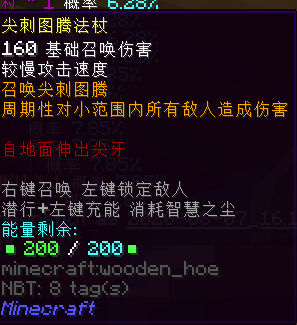

- **伤害**：160
- **攻击速度**：较慢
- **耐久**：200
- **修复材料**：智慧之尘
- **仆从位**：1
- **效果**：召唤尖刺图腾，周期性对小范围内所有敌人造成伤害
- **获得方式**：
  + **铸造**：
    * T4 ：36x T4 天界魔矿起
    * T5 ：32x T5 天界魔矿起

#### 弩车法杖 MKV

- **伤害**：135
- **攻击速度**：较快
- **耐久**：200
- **修复材料**：智慧之尘
- **仆从位**：1
- **效果**：召唤弩车
- **获得方式**：
  + **铸造**：
    * T4 ：36x T4 天界魔矿起
    * T5 ：20x T5 天界魔矿起

#### 月星法杖

- **伤害**：155
- **攻击速度**：较快
- **耐久**：200
- **修复材料**：智慧之尘
- **仆从位**：1
- **效果**：召唤月亮传送门，向敌人发射月亮光束并点亮敌人
- **获得方式**：
  + **铸造**：
    * T4 ：48x T4 天界魔矿起
    * T5 ：64x T5 天界魔矿起

#### 精密线控仪

- **伤害**：55
- **攻击速度**：极快
- **耐久**：200
- **修复材料**：智慧之尘
- **仆从位**：1
- **效果**：召唤电磁塔，向附近敌人发射电弧并震慑敌人
- **获得方式**：
  + **铸造**：
    * T4 ：48x T4 天界魔矿起
    * T5 ：56x T5 天界魔矿起

> 这件武器在 Terraria 中的英文原名为 "The grand design" 旧版中文翻译为“宏伟蓝图”，某次版本更新后翻译变为“精密线控仪”。

> 而且它在 Terraria 中也只是一个用于接线的道具，并不是武器。

#### 机关连弩法杖 EX

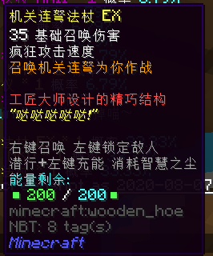

- **伤害**：35
- **攻击速度**：疯狂
- **耐久**：200
- **修复材料**：智慧之尘
- **仆从位**：1
- **效果**：召唤机关连弩
- **获得方式**：
  + **铸造**：
    * T5 ：20x T5 天界魔矿起

#### 闪电风暴法杖

- **伤害**：160
- **攻击速度**：较慢
- **耐久**：200
- **修复材料**：智慧之尘
- **仆从位**：1
- **效果**：召唤天气控制器，雷击大范围内至多 3 名敌人 ~~（渡劫专用）~~
- **获得方式**：
  + **铸造**：
    * T5 ：20x T5 天界魔矿起

#### 混沌图腾法杖

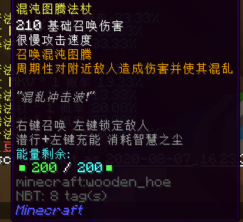

- **伤害**：210
- **攻击速度**：很慢
- **耐久**：200
- **修复材料**：智慧之尘
- **仆从位**：1
- **效果**：召唤混沌图腾，周期性对附近敌人造成伤害并使其混乱
- **获得方式**：
  + **铸造**：
    * T5 ：32x T5 天界魔矿起

#### 烈焰炮台法杖 EX

- **伤害**：265
- **攻击速度**：很慢
- **耐久**：200
- **修复材料**：智慧之尘
- **仆从位**：1
- **效果**：召唤烈焰炮台，向敌人发射火焰并造成爆炸
- **获得方式**：
  + **铸造**：
    * T5 ：32x T5 天界魔矿起

#### 精灵熔炉 EX V

- **伤害**：48
- **攻击速度**：极快
- **耐久**：200
- **修复材料**：智慧之尘
- **仆从位**：1
- **效果**：召唤精灵熔炉向附近目标喷射火焰，持有时获得抗火效果
- **获得方式**：
  + **铸造**：
    * T5 ：48x T5 天界魔矿起

#### 脉冲波法杖 EX

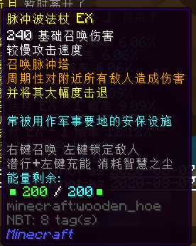

- **伤害**：240
- **攻击速度**：较慢
- **耐久**：200
- **修复材料**：智慧之尘
- **仆从位**：1
- **效果**：召唤脉冲塔，周期性对附近所有敌人造成伤害并将其大幅度击退
- **获得方式**：
  + **铸造**：
    * T5 ：48x T5 天界魔矿起

#### 陨石法杖

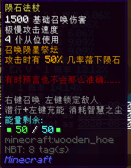

- **伤害**：1500
- **攻击速度**：极慢
- **耐久**：50
- **修复材料**：智慧之尘
- **仆从位**：4
- **效果**：召唤陨星祭坛，攻击时有 50% 几率落下陨石
- **获得方式**：
  + **铸造**：
    * T5 ：48x T5 天界魔矿起

#### 魔法灯笼

- **伤害**：85
- **攻击速度**：很快
- **耐久**：200
- **修复材料**：智慧之尘
- **仆从位**：1
- **效果**：召唤魔法灯笼，释放光灵追踪敌人
- **获得方式**：
  + **铸造**：
    * T5 ：48x T5 天界魔矿起

#### 神圣图腾法杖

图源：Ankou54

- **伤害**：265
- **攻击速度**：很慢
- **耐久**：200
- **修复材料**：智慧之尘
- **仆从位**：1
- **效果**：召唤神圣图腾，周期性沉默敌人并造成伤害，同时治疗范围内玩家
- **获得方式**：
  + **铸造**：
    * T5 ：56x T5 天界魔矿起

#### 卫星定位器

- **伤害**：450
- **攻击速度**：极慢
- **耐久**：200
- **修复材料**：智慧之尘
- **仆从位**：1
- **效果**：召唤狙击哨塔，锁定并攻击大范围内敌人
- **获得方式**：
  + **铸造**：
    * T5 ：64x T5 天界魔矿起

#### 标枪飞弹法杖

- **伤害**：160
- **攻击速度**：较快
- **耐久**：200
- **修复材料**：智慧之尘
- **仆从位**：1
- **效果**：召唤飞弹发射台
- **获得方式**：
  + **铸造**：
    * T5 ：64x T5 天界魔矿起

#### 神圣光球法杖

图源：Entaro_Zeratul

- **伤害**：120
- **攻击速度**：较慢
- **耐久**：200
- **修复材料**：智慧之尘
- **仆从位**：1
- **效果**：召唤神圣光球，治疗 1% 伤害值
- **获得方式**：
  + **铸造**：
    * T5 ：64x T5 天界魔矿起

#### 入侵防御控制器

- **伤害**：40
- **攻击速度**：疯狂
- **耐久**：200
- **修复材料**：智慧之尘
- **仆从位**：1
- **效果**：召唤近卫监视器拦截入侵目标
- **获得方式**：
  + **铸造**：
    * T5 ：64x T5 天界魔矿起

#### 寒霜球法杖 EX

- **伤害**：75
- **攻击速度**：极快
- **耐久**：200
- **修复材料**：智慧之尘
- **仆从位**：1
- **效果**：召唤寒霜图腾，向敌人发射寒霜球使敌人减速
- **获得方式**：
  + **铸造**：
    * T5 ：64x T5 天界魔矿起

#### 光棱法杖 EX

- **伤害**：175
- **攻击速度**：很快
- **耐久**：200
- **修复材料**：智慧之尘
- **仆从位**：1
- **效果**：召唤光棱塔，向敌人发射锁定光束
- **获得方式**：
  + **铸造**：
    * T5 ：64x T5 天界魔矿起

### T5 红名

#### 黎明法杖

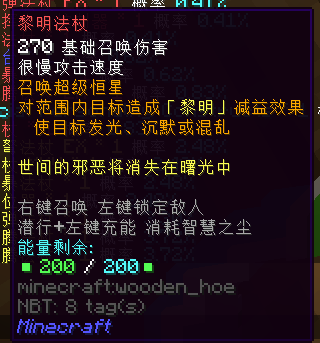

- **伤害**：270
- **攻击速度**：很慢
- **耐久**：200
- **修复材料**：智慧之尘
- **仆从位**：1
- **效果**：召唤超级恒星，对范围内目标造成「 黎明 」减益效果，使目标发光，沉默或混乱
- **获得方式**：
  + **铸造**：
    * T5 ：64x T5 天界魔矿起

#### Artificial Personality Constructs

图源：kanoe

- **伤害**：64
- **攻击速度**：疯狂
- **耐久**：200
- **修复材料**：智慧之尘
- **仆从位**：3
- **效果**：召唤炮塔哨兵，将试图击杀视野中的实验目标
- **获得方式**：
  + **铸造**：
    * T5 ：64x T5 天界魔矿起

#### 神圣图腾法杖 EX

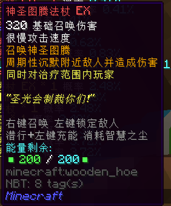

- **伤害**：320
- **攻击速度**：很慢
- **耐久**：200
- **修复材料**：智慧之尘
- **仆从位**：1
- **效果**：召唤神圣图腾，周期性沉默附近敌人并造成伤害，同时治疗范围内玩家
- **获得方式**：
  + **铸造**：
    * T5 ：64x T5 天界魔矿起
  + **合成**：
    * 由**神圣图腾法杖**升级，消耗 128x T5 天界魔矿，8x 灵魂残片和 1x 一张银行卡

#### 星尘风暴法杖

- **伤害**：64
- **攻击速度**：极快
- **耐久**：200
- **修复材料**：智慧之尘
- **仆从位**：1
- **效果**：召唤星尘风暴，对范围 32 内的最多 6 个目标造成持续伤害
- **获得方式**：
  + **铸造**：
    * T5 ：64x T5 天界魔矿起

#### 爵士电台

- **伤害**：160
- **攻击速度**：极快
- **耐久**：200
- **修复材料**：智慧之尘
- **仆从位**：2
- **效果**：召唤爵士电台
- **获得方式**：
  + **铸造**：
    * T5 ：64x T5 天界魔矿起

#### 寒霜波法杖

- **伤害**：240
- **攻击速度**：较快
- **耐久**：200
- **修复材料**：智慧之尘
- **仆从位**：1
- **效果**：召唤寒霜女王，冻结，沉默目标
- **获得方式**：
  + **铸造**：
    * T5 ：64x T5 天界魔矿起

#### 星际指挥中心控制器

- **伤害**：48
- **攻击速度**：疯狂
- **耐久**：200
- **修复材料**：智慧之尘
- **仆从位**：3
- **效果**：召唤星舰
- **获得方式**：
  + **铸造**：
    * T5 ：64x T5 天界魔矿起

#### 标枪飞弹法杖 EX

- **伤害**：120
- **攻击速度**：很快
- **耐久**：200
- **修复材料**：智慧之尘
- **仆从位**：1
- **效果**：召唤标枪飞弹发射台
- **获得方式**：
  + **铸造**：
    * T5 ：64x T5 天界魔矿起
  + **合成**：
    * 由**标枪飞弹法杖**升级，消耗 128x T5 天界魔矿，8x 灵魂残片和 1x 一张银行卡

#### 龙腾™武装打击模块

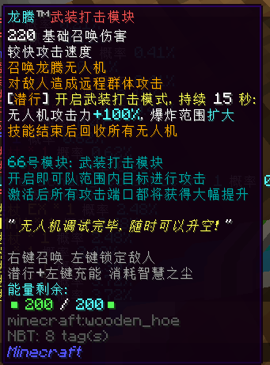

- **伤害**：220
- **攻击速度**：较快
- **耐久**：200
- **修复材料**：智慧之尘
- **仆从位**：1
- **效果**：召唤龙腾无人机，对敌人造成远程群体攻击；潜行开启武装打击模式，持续 15 秒：无人机攻击力 +100% ，爆炸范围扩大，技能结束后回收所有无人机
- **获得方式**：
  + **铸造**：
    * T5 ：64x T5 天界魔矿起

#### 七彩调色盘

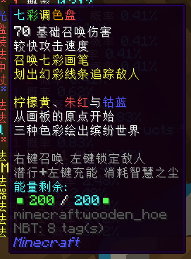

- **伤害**：70
- **攻击速度**：较快
- **耐久**：200
- **修复材料**：智慧之尘
- **仆从位**：1
- **效果**：召唤七彩画笔，划出幻彩线条追踪敌人
- **获得方式**：
  + **铸造**：
    * T5 ：64x T5 天界魔矿起

#### 龙腾™激光开采模块

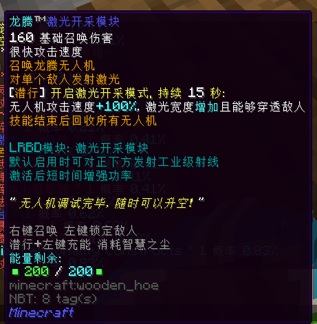

- **伤害**：160
- **攻击速度**：很快
- **耐久**：200
- **修复材料**：智慧之尘
- **仆从位**：1
- **效果**：召唤龙腾无人机，对单个敌人发射激光；潜行开启激光开采模式，持续 15 秒：无人机攻击速度 +100% ，激光宽幅增加且能够穿透敌人，技能结束后回收所有无人机
- **获得方式**：
  + **铸造**：
    * T5 ：64x T5 天界魔矿起

#### 星尘爆碎

图源：CierraRunis_

- **伤害**：160
- **攻击速度**：很快
- **耐久**：200
- **修复材料**：智慧之尘
- **仆从位**：3
- **效果**：召唤星尘漩涡，点亮目标
- **获得方式**：
  + **铸造**：
    * T5 ：64x T5 天界魔矿起

#### Mon3tr

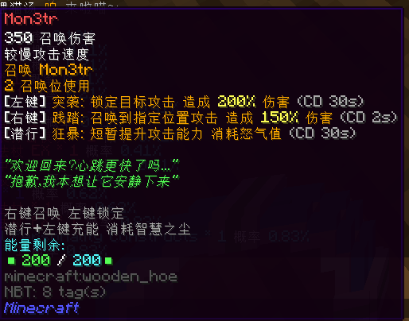

- **伤害**：350
- **攻击速度**：较慢
- **耐久**：200
- **修复材料**：智慧之尘
- **仆从位**：2
- **效果**：召唤 Mon3tr ；左键突袭，锁定目标攻击，造成 200% 伤害（ CD 30s ）；右键践踏，召唤到指定位置攻击，造成 150% 伤害（ CD 30s ）；潜行狂暴，短暂提升攻击能力，消耗怒气值（ CD 30s ）
- **获得方式**：
  + **铸造**：
    * T5 ：64x T5 天界魔矿起

#### 聚变法杖

- **伤害**：420
- **攻击速度**：较慢
- **耐久**：200
- **修复材料**：智慧之尘
- **仆从位**：3
- **效果**：召唤核聚变发生器，对大范围目标造成冲击和辐射伤害
- **获得方式**：
  + **铸造**：
    * T5 ：64x T5 天界魔矿起

#### 星尘精灵

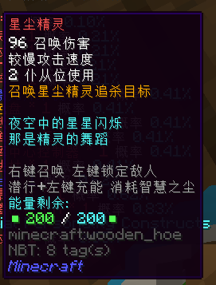

- **伤害**：96
- **攻击速度**：较慢
- **耐久**：200
- **修复材料**：智慧之尘
- **仆从位**：2
- **效果**：召唤星尘精灵追杀目标
- **获得方式**：
  + **铸造**：
    * T5 ：64x T5 天界魔矿起

#### 万华镜

- **伤害**：120
- **攻击速度**：较快
- **耐久**：200
- **修复材料**：智慧之尘
- **仆从位**：2
- **效果**：召唤万华镜折射彩虹光束，10% 几率造成混乱
- **获得方式**：
  + **铸造**：
    * T5 ：64x T5 天界魔矿起

## Boss 武器

#### 恒星韵

- **所属 Boss** ：姜王博士 lv.23
- **等级**：T5+
- **伤害**：196
- **攻击速度**：较快
- **耐久**：200
- **修复材料**：异界之尘
- **仆从位**：1
- **效果**：召唤恒星韵，10% 几率沉默目标
- **获得方式**：
  + **兑换**：
    * 地点：圣怀特大教堂内
    * 材料：64x 聚能核心
