# 辅助道具

**辅助道具**是指给予玩家不同属性加成的道具，它们往往不能直接造成伤害。

多数辅助道具需要放置在副手生效，願いの行方和精灵回廊神经需要放置在头部装备槽生效，其它的道具有不同的使用方式。

初始附魔不会在消魔过程中被清除，但照旧消耗消魔石。

感谢各位玩家在数据收集时提供的帮助。

## 目录

- [铸造道具](#铸造道具)
  + [T1](#T1)
  + [T2](#T2)
  + [T3](#T3)
  + [T4](#T4)
  + [T5](#T5)
  + [T5+](#T5-红名)
- [合成道具](#合成道具)
- [Boss 道具](#Boss-道具)

## 铸造道具

### T1

#### 生命之种

- **职业**：全职业
- **使用方式**：放置在副手生效
- **效果**：+6 生命值上限
- **获得方式**：
  + **铸造**：
    * T1 4x T1 天界魔矿起

#### 魔法石

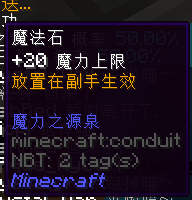

- **职业**：法师/召唤师
- **使用方式**：放置在副手生效
- **效果**：+20 魔力值上限
- **获得方式**：
  + **铸造**：
    * T1 4x T1 天界魔矿起

#### 力量之花

- **职业**：战士
- **使用方式**：放置在副手生效
- **效果**：+15% 近战武器伤害
- **获得方式**：
  + **铸造**：
    * T1 8x T1 天界魔矿起

#### 暗黑骷髅头

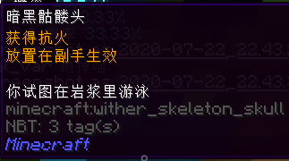

- **职业**：全职业
- **使用方式**：放置在副手生效
- **效果**：获得抗火
- **获得方式**：
  + **铸造**：
    * T1 8x T1 天界魔矿起

### T2

#### 勇气之花

- **职业**：全职业
- **使用方式**：放置在副手生效
- **效果**：+5% 全部伤害
- **获得方式**：
  + **铸造**：
    * T1 16x T1 天界魔矿起
    * T2 6x T2 天界魔矿起

#### 守护之花

- **职业**：全职业
- **使用方式**：放置在副手生效
- **效果**：5 高级护甲
- **获得方式**：
  + **铸造**：
    * T1 16x T1 天界魔矿起
    * T2 6x T2 天界魔矿起

#### 魔法石

- **职业**：法师 / 召唤师
- **使用方式**：放置在副手生效
- **效果**：+40 魔力上限
- **获得方式**：
  + **铸造**：
    * T2 8x T2 天界魔矿起
  + **合成**：
    * 由 **T1 魔法石**升级，消耗 8x 精铁矿物块和 16x T1 天界魔矿

#### 生命之种

- **职业**：全职业
- **使用方式**：放置在副手生效
- **效果**：+10 生命值上限
- **获得方式**：
  + **铸造**：
    * T2 12x T2 天界魔矿起
  + **合成**：
    * 由 **T1 生命之种**升级，消耗 8x 精铁矿物块和 24x T1 天界魔矿

#### 力量之花

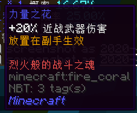

- **职业**：战士
- **使用方式**：放置在副手生效
- **效果**：+20% 近战武器伤害
- **获得方式**：
  + **铸造**：
    * T2 12x T2 天界魔矿起
  + **合成**：
    * 由 **T1 力量之花**升级，消耗 8x 精铁矿物块和 24x T1 天界魔矿

#### 鲨牙项链

- **职业**：全职业
- **使用方式**：放置在副手生效
- **效果**：积攒怒气会提升暴击，最高提升至 15%
- **获得方式**：
  + **铸造**：
    * T2 16x T2 天界魔矿起

### T3

#### 生命木双叶

- **职业**：全职业
- **使用方式**：放置在副手生效
- **效果**：免疫凋零
- **获得方式**：
  + **铸造**：
    * T2 24x T2 天界魔矿起
    * T3 10x T3 天界魔矿起

#### 灵巧手镯

- **职业**：全职业
- **使用方式**：放置在副手生效
- **效果**：+40% 移动速度
- **获得方式**：
  + **铸造**：
    * T2 24x T2 天界魔矿起
    * T3 20x T3 天界魔矿起

#### 蜜蜂复眼标本

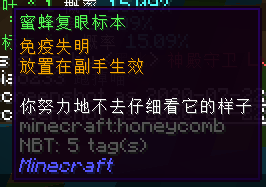

- **职业**：全职业
- **使用方式**：放置在副手生效
- **效果**：免疫失明
- **获得方式**：
  + **铸造**：
    * T2 24x T2 天界魔矿起
    * T3 24x T3 天界魔矿起

#### 魔法石

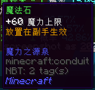

- **职业**：法师 / 召唤师
- **使用方式**：放置在副手生效
- **效果**：+60 魔力上限
- **获得方式**：
  + **铸造**：
    * T3 10x T3 天界魔矿起
  + **合成**：
    * 由 **T2 魔法石**升级，消耗 12x 纯金矿物块，20x T2 天界魔矿，2x 灵魂残片，4x 破损弩弦和 4x 远古布匹

#### 生命之种

- **职业**：全职业
- **使用方式**：放置在副手生效
- **效果**：+16 生命值上限
- **获得方式**：
  + **铸造**：
    * T3 10x T3 天界魔矿起
  + **合成**：
    * 由 **T2 生命之种**升级，消耗 12x 纯金矿物块，20x T2 天界魔矿，2x 灵魂残片，4x 破损弩弦和 4x 远古布匹

#### 守护之花

- **职业**：全职业
- **使用方式**：放置在副手生效
- **效果**：10 高级护甲
- **获得方式**：
  + **铸造**：
    * T3 16x T3 天界魔矿起
  + **合成**：
    * 由 **T2 守护之花**升级，消耗 12x 纯金矿物块，32x T2 天界魔矿，2x 灵魂残片，4x 破损弩弦和 4x 活性火药

#### 勇气之花

- **职业**：全职业
- **使用方式**：放置在副手生效
- **效果**：+10% 全部伤害
- **获得方式**：
  + **铸造**：
    * T3 20x T3 天界魔矿起
  + **合成**：
    * 由 **T2 勇气之花**升级，消耗 12x 纯金矿物块，40x T2 天界魔矿，2x 灵魂残片，4x 破损弩弦和 4x 活性火药

#### 力量之花

- **职业**：战士
- **使用方式**：放置在副手生效
- **效果**：+25% 近战武器伤害
- **获得方式**：
  + **铸造**：
    * T3 20x T3 天界魔矿起
  + **合成**：
    * 由 **T2 力量之花**升级，消耗 12x 纯金矿物块，40x T2 天界魔矿，2x 灵魂残片，4x 破损弩弦和 4x 远古布匹

#### 四叶草

- **职业**：全职业
- **使用方式**：放置在副手生效
- **效果**：+2 生命值上限，+2 幸运
- **获得方式**：
  + **铸造**：
    * T3 24x T3 天界魔矿起

#### 怒气背包

- **职业**：全职业
- **使用方式**：放置在副手生效
- **效果**：积攒怒气会提升暴击，最高提升至 24%
- **获得方式**：
  + **铸造**：
    * T3 24x T3 天界魔矿起
  + **合成**：
    * 由**鲨牙项链**升级，消耗 12x 纯金矿物块，48x T2 天界魔矿，2x 灵魂残片，4x 破损弩弦和 4x 活性火药

#### 战士徽章

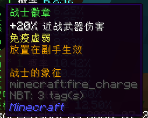

- **职业**：战士
- **使用方式**：放置在副手生效
- **效果**：+20% 近战武器伤害，免疫虚弱
- **获得方式**：
  + **铸造**：
    * T3 24x T3 天界魔矿起

#### 矮人手环

- **职业**：召唤
- **使用方式**：放置在副手生效
- **效果**：+1 仆从上限
- **获得方式**：
  + **铸造**：
    * T3 32x T3 天界魔矿起

### T4

#### 剧毒抗体

- **职业**：全职业
- **使用方式**：放置在副手生效
- **效果**：免疫中毒
- **获得方式**：
  + **铸造**：
    * T3 32x T3 天界魔矿起
    * T4 14x T4 天界魔矿起

#### 魔法石

- **职业**：法师 / 召唤师
- **使用方式**：放置在副手生效
- **效果**：+80 魔力上限
- **获得方式**：
  + **铸造**：
    * T3 32x T3 天界魔矿起
    * T4 24x T4 天界魔矿起
  + **合成**：
    * 由 **T3 魔法石**升级，消耗 16x 魔金矿物块，48x T3 天界魔矿，6x 灵魂残片，8x 死亡草和 8x 炮弹残骸

#### 快走时钟

- **职业**：全职业
- **使用方式**：放置在副手生效
- **效果**：+60% 移动速度
- **获得方式**：
  + **铸造**：
    * T3 32x T3 天界魔矿起
    * T4 18x T4 天界魔矿起
  + **合成**：
    * 由**灵巧手镯**升级，消耗 16x 魔金矿物块，36x T3 天界魔矿，6x 灵魂残片，6x 死亡草，4x 浸毒蛛眼和 6x 炮弹残骸

#### 易筋经

- **职业**：全职业
- **使用方式**：放置在副手生效
- **效果**：积攒怒气会提升暴击，最高提升至 36%
- **获得方式**：
  + **铸造**：
    * T3 36x T3 天界魔矿起
    * T4 32x T4 天界魔矿起
  + **合成**：
    * 由**怒气背包**升级，消耗 16x 魔金矿物块，64x T3 天界魔矿，6x 灵魂残片，6x 死亡草，4x 浸毒蛛眼和 6x 炮弹残骸

#### 希望の花

- **职业**：全职业
- **使用方式**：右键使用
- **效果**：获得不断前行的动力
- **获得方式**：
  + **铸造**：
    * T3 36x T3 天界魔矿起
    * T4 32x T4 天界魔矿起

#### 勇气之花

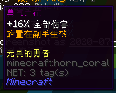

- **职业**：全职业
- **使用方式**：放置在副手生效
- **效果**：+16% 全部伤害
- **获得方式**：
  + **铸造**：
    * T4 14x T4 天界魔矿起
  + **合成**：
    * 由 **T3 勇气之花**升级，消耗 16x 魔金矿物块，28x T3 天界魔矿，6x 灵魂残片，8x 死亡草和 8x 炮弹残骸

#### 守护之花

- **职业**：全职业
- **使用方式**：放置在副手生效
- **效果**：15 高级护甲
- **获得方式**：
  + **铸造**：
    * T4 18x T4 天界魔矿起
  + **合成**：
    * 由 **T3 守护之花**升级，消耗 16x 魔金矿物块，28x T3 天界魔矿，6x 灵魂残片，8x 死亡草和 8x 炮弹残骸

#### 力量之花

- **职业**：战士
- **使用方式**：放置在副手生效
- **效果**：+30% 近战武器伤害
- **获得方式**：
  + **铸造**：
    * T4 24x T4 天界魔矿起
  + **合成**：
    * 由 **T3 力量之花**升级，消耗 16x 魔金矿物块，48x T3 天界魔矿，6x 灵魂残片，8x 死亡草和 8x 炮弹残骸

#### 生命之种

- **职业**：全职业
- **使用方式**：放置在副手生效
- **效果**：+20 生命值上限
- **获得方式**：
  + **铸造**：
    * T4 24x T4 天界魔矿起
  + **合成**：
    * 由 **T3 生命之种**升级，消耗 16x 魔金矿物块，48x T3 天界魔矿，6x 灵魂残片，8x 死亡草和 8x 炮弹残骸

#### カプチーノ

- **职业**：全职业
- **使用方式**：放置在副手生效
- **效果**：手持时缓慢回复生命值与饥饿值，并获得充能；满充能时右键获得 60 秒临时护盾
- **获得方式**：
  + **铸造**：
    * T4 32x T4 天界魔矿起

### T5

#### 闪电手链

- **职业**：全职业
- **使用方式**：在主手握持生效
- **效果**：+40% 移动速度；冲刺时短暂加速
- **获得方式**：
  + **铸造**：
    * T4 40x T4 天界魔矿起
    * T5 28x T5 天界魔矿起

#### 黑曜石护盾

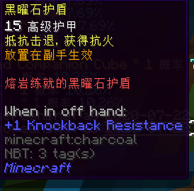

- **职业**：全职业
- **使用方式**：放置在副手生效
- **效果**：15 高级护甲；+1 击退抗性，获得抗火
- **获得方式**：
  + **铸造**：
    * T4 40x T4 天界魔矿起
    * T5 28x T5 天界魔矿起

#### Weighted Companion Cube

- **职业**：全职业
- **使用方式**：在主手握持加速，右键传送
- **效果**：+100% 移动速度；右键向前传送 6 格，冷却时间 3 秒
- **获得方式**：
  + **铸造**：
    * T4 40x T4 天界魔矿起
    * T5 36x T5 天界魔矿起

#### 泰坦手环

- **职业**：战士
- **使用方式**：放置在副手生效
- **效果**：+25% 近战武器伤害，免疫虚弱；一定几率沉默敌人
- **获得方式**：
  + **铸造**：
    * T4 48x T4 天界魔矿起
    * T5 36x T5 天界魔矿起
  + **合成**：
    * 由**战士徽章**升级，消耗 24x 蓝钻矿物块，40x T4 天界魔矿，12x 灵魂残片，16x 巨大蛛网和 16x 小玩偶

#### 复仇者护盾

- **职业**：全职业
- **使用方式**：放置在副手生效
- **效果**：15 高级护甲；+1 击退抗性，获得 10% 额外暴击
- **获得方式**：
  + **铸造**：
    * T4 48x T4 天界魔矿起
    * T5 28x T5 天界魔矿起

#### 回程魔杖

- **职业**：全职业
- **使用方式**：在主副手间来回切换生效
- **效果**：切换至副手时投递传送信标，再切换至主手时传送至信标，**距离过远时可能传送失效**
- **获得方式**：
  + **铸造**：
    * T4 48x T4 天界魔矿起
    * T5 20x T5 天界魔矿起

#### 梦想罗盘

- **职业**：全职业
- **使用方式**：放置在副手生效
- **效果**：免疫缓慢；+4 幸运
- **获得方式**：
  + **铸造**：
    * T4 ? x T4 天界魔矿起
    * T5 36x T5 天界魔矿起

#### 月亮石

- **职业**：全职业
- **使用方式**：放置在副手生效
- **效果**：免疫凋零，缓慢，反胃
- **获得方式**：
  + **铸造**：
    * T4 ? x T4 天界魔矿起
    * T5 24x T5 天界魔矿起
  + **合成**：
    * 由 **T4 魔法石**升级，消耗 24x 蓝钻矿物块，48x T4 天界魔矿，12x 灵魂残片，8x 巨大蛛网，12x 浸毒蛛眼和 12x 小玩偶

#### 太阳石

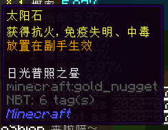

- **职业**：全职业
- **使用方式**：放置在副手生效
- **效果**：获得抗火；免疫失明，中毒
- **获得方式**：
  + **铸造**：
    * T4 ? x T4 天界魔矿起
    * T5 24x T5 天界魔矿起
  + **合成**：
    * 由 **T4 魔法石**升级，消耗 24x 蓝钻矿物块，48x T4 天界魔矿，12x 灵魂残片，8x 破损的枪械零件，12x 浸毒蛛眼和 12x 小玩偶

#### 霜花戒指

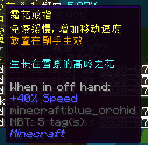

- **职业**：全职业
- **使用方式**：放置在副手生效
- **效果**：+40% 移动速度，免疫缓慢
- **获得方式**：
  + **铸造**：
    * T4 ? x T4 天界魔矿起
    * T5 20x T5 天界魔矿起

#### 勇气之花

- **职业**：全职业
- **使用方式**：放置在副手生效
- **效果**：+24% 全部伤害
- **获得方式**：
  + **铸造**：
    * T4 ? x T4 天界魔矿起
    * T5 20x T5 天界魔矿起
  + **合成**：
    * 由 **T4 勇气之花**升级，消耗 24x 蓝钻矿物块，40x T4 天界魔矿，12x 灵魂残片，16x 浸毒蛛眼和 16x 小玩偶

#### 魔法石

- **职业**：法师 / 召唤师
- **使用方式**：放置在副手生效
- **效果**：+100 魔力上限
- **获得方式**：
  + **铸造**：
    * T5 24x T5 天界魔矿起
  + **合成**：
    * 由 **T4 魔法石**升级，消耗 24x 蓝钻矿物块，64x T4 天界魔矿，12x 灵魂残片，16x 浸毒蛛眼和 16x 小玩偶

#### 守护之花

- **职业**：全职业
- **使用方式**：放置在副手生效
- **效果**：20 高级护甲
- **获得方式**：
  + **铸造**：
    * T5 32x T5 天界魔矿起
  + **合成**：
    * 由 **T4 守护之花**升级，消耗 24x 蓝钻矿物块，64x T4 天界魔矿，12x 灵魂残片，16x 浸毒蛛眼和 16x 小玩偶

#### 力量之花

- **职业**：战士
- **使用方式**：放置在副手生效
- **效果**：+40% 近战武器伤害
- **获得方式**：
  + **铸造**：
    * T5 32x T5 天界魔矿起
  + **合成**：
    * 由 **T4 力量之花**升级，消耗 24x 蓝钻矿物块，64x T4 天界魔矿，12x 灵魂残片，16x 浸毒蛛眼和 16x 小玩偶

#### 烈火符文

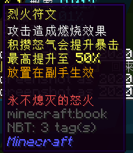

- **职业**：全职业
- **使用方式**：放置在副手生效
- **效果**：攻击造成燃烧效果；积攒怒气会提升暴击，最高提升至 50%
- **获得方式**：
  + **铸造**：
    * T5 32x T5 天界魔矿起
  + **合成**：
    * 由**易筋经**升级，消耗 24x 蓝钻矿物块，64x T4 天界魔矿，12x 灵魂残片，16x 巨大蛛网和 16x 小玩偶

#### 黄金四叶草

- **职业**：全职业
- **使用方式**：放置在副手生效
- **效果**：+4 生命值上限，+6 幸运
- **获得方式**：
  + **铸造**：
    * T5 42x T5 天界魔矿起
  + **合成**：
    * 由**四叶草**升级，消耗 24x 蓝钻矿物块，96x T4 天界魔矿，12x 灵魂残片，16x 巨大蛛网，16x 破损的枪械零件和 16x 小玩偶

#### 闪亮石

- **职业**：全职业
- **使用方式**：放置在副手生效
- **效果**：+20 生命值上限；潜行时快速恢复生命值
- **获得方式**：
  + **铸造**：
    * T5 42x T5 天界魔矿起
  + **合成**：
    * 由 **T4 生命之种**升级，消耗 24x 蓝钻矿物块，84x T4 天界魔矿，12x 灵魂残片，8x 巨大蛛网，8x 破损的枪械零件和 16x 小玩偶

#### 南极座

- **职业**：战士
- **使用方式**：放置在副手且主手是西格玛时生效
- **效果**：20 高级护甲；+1 击退抗性，免疫失明，虚弱，缓慢；潜行获得持续刷新的护盾
- **获得方式**：
  + **铸造**：
    * T5 56x T5 天界魔矿起

### T5 红名

#### 霜冰符文

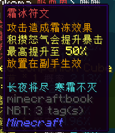

- **职业**：全职业
- **使用方式**：放置在副手生效
- **效果**：攻击造成霜冻效果；积攒怒气会提升暴击，最高提升至 50%
- **获得方式**：
  + **铸造**：
    * T5 48x T5 天界魔矿起
  + **合成**：
    * 由**烈火符文**升级，消耗 2x 精炼蓝钻，64x T5 天界魔矿，24x 灵魂残片，1x 一张银行卡，16x 噬魂之眼，16x 暗影箭和 8x 被压扁的黄金

#### 极光戒指

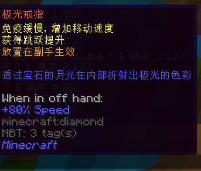

- **职业**：全职业
- **使用方式**：放置在副手生效
- **效果**：免疫缓慢，+80% 移动速度；获得跳跃提升
- **获得方式**：
  + **铸造**：
    * T5 48x T5 天界魔矿起
  + **合成**：
    * 由**霜花戒指**和**快走时钟**升级，消耗 4x 精炼蓝钻，128x T5 天界魔矿，32x 灵魂残片，16x 末影尘，16x 灵液球和 8x 诅咒之书

#### 十字章护盾

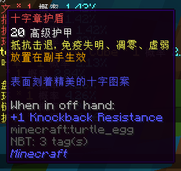

- **职业**：全职业
- **使用方式**：放置在副手生效
- **效果**：20 高级护甲；+1 击退抗性，免疫失明，凋零，虚弱
- **获得方式**：
  + **铸造**：
    * T5 48x T5 天界魔矿起
  + **合成**：
    * 由 **T5 守护之花**升级，消耗 2x 精炼蓝钻，64x T5 天界魔矿，24x 灵魂残片，1x 一张银行卡，16x 枯草，16x 木乃伊的绷带碎片和 8x 破碎的铠甲

#### 星力手环

- **职业**：法师 / 召唤师
- **使用方式**：放置在副手生效
- **效果**：+80 魔力上限；受伤时恢复魔力
- **获得方式**：
  + **铸造**：
    * T5 48x T5 天界魔矿起
  + **合成**：
    * 由 **T5 魔法石**升级，消耗 2x 精炼蓝钻，64x T5 天界魔矿，24x 灵魂残片，1x 一张银行卡，16x 末影尘，16x 灵液球和 8x 诅咒之书

#### 天界石

- **职业**：全职业
- **使用方式**：放置在副手生效
- **效果**：免疫凋零，中毒，缓慢；获得抗火，潮涌能量
- **获得方式**：
  + **铸造**：
    * T5 56x T5 天界魔矿起

#### 天界手环

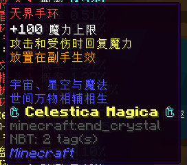

- **职业**：法师 / 召唤师
- **使用方式**：放置在副手生效
- **效果**：+100 魔力上限；攻击和受伤时回复魔力
- **获得方式**：
  + **铸造**：
    * T5 56x T5 天界魔矿起

#### 天界护盾

- **职业**：全职业
- **使用方式**：放置在副手生效
- **效果**：25 高级护甲；+1 击退抗性，免疫失明，凋零，虚弱；受伤后几率回复生命值
- **获得方式**：
  + **铸造**：
    * T5 56x T5 天界魔矿起

#### 天界护符

- **职业**：全职业
- **使用方式**：放置在副手生效
- **效果**：+20 生命值上限，+60% 移动速度，+8 幸运，潜行时快速恢复生命值
- **获得方式**：
  + **铸造**：
    * T5 56x T5 天界魔矿起

#### 天界卷轴

- **职业**：召唤
- **使用方式**：放置在副手生效
- **效果**：免疫中毒和凋零，获得抗火和潮涌能量；受伤后短时间内大幅提升防御（抗性提升 IV ）（冷却：5s ）
- **获得方式**：
  + **铸造**：
    * T5 64x T5 天界魔矿起

#### 願いの行方

展示：弐叁

- **职业**：全职业
- **使用方式**：装备在头部生效
- **护甲值**：50 高级护甲
- **效果**：+50% 全部伤害，+4 生命值上限，+4 幸运，+8 盔甲韧性，+24 盔甲，+1 击退抗性
- **获得方式**：
  + **铸造**：
    * T5 56x T5 天界魔矿起

#### 精灵回廊神经

!> 这件装备只能**单独使用**，如若与任何其它装备同时使用都会有严重的后果。

展示：阿姨

- **职业**：射手
- **使用方式**：装备在头部生效
- **护甲值**：234 高级护甲
- **加成**：+80% 远程伤害，免疫多种负面效果，获得强大的机动性，解放**机凯兵装**技能「对未知用战斗演算」，潜行施展「通行禁止」，抵御 7 秒内所有伤害（冷却 30 秒）
- **初始附魔**：保护 20
- **获取方式**：
  + **铸造**：
    * T5 64x T5 天界魔矿起
  + **合成**：
    * 消耗 16x 星璇碎块，16x 精灵水晶，8x 空洞黑暗立方，8x 神圣光明立方，32x 灵魂残片和 16x 精炼蓝钻

#### 魔力花

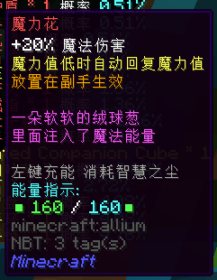

- **职业**：法师
- **使用方式**：放置在副手生效
- **效果**：+20% 魔法伤害，+40 魔力上限，魔力值低于 40 时自动回复魔力值
- **能量上限**：160
- **充能材料**：智慧之尘
- **获得方式**：
  + **铸造**：
    * T5 64x T5 天界魔矿起

## 合成道具

#### 凤凰卷轴 · 重生

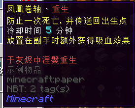

- **职业**：全职业
- **使用方式**：放置在背包生效，放置在副手额外获得吸血效果
- **效果**：防止一次死亡，并传送回出生点；冷却时间 5 分钟，放置在副手额外获得吸血效果
- **获得方式**：
  + **合成**：
    * 消耗 8x 精炼蓝钻，32x 灵魂残片，64x 远古布匹，16x 寒霜花，16x 火焰尘，3x 姜饼手办

!> 该道具目前在拯救时可能导致掉线，**异常危险**，因此请在 BUG 修复后再使用

## Boss 道具

#### 幽灵瓶

- **所属 Boss** ：铁皮武士
- **职业**：法师
- **使用方式**：放置在副手生效
- **效果**：+15% 魔法伤害；+40% 移动速度，免疫凋零，魔法攻击释放幽灵追踪敌人
- **获得方式**：
  + **兑换**：
    * 在不祥的流浪者（1322,1974）处兑换
    * 消耗 96x 精雕翡翠石块

#### 扩散火力模组

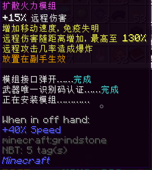

- **所属 Boss** ：铁皮武士
- **职业**：射手
- **使用方式**：放置在副手生效
- **效果**：+15% 远程伤害；+40% 移动速度，免疫失明，远程伤害随距离增加，最高至 130% ，远程攻击几率造成爆炸
- **获得方式**：
  + **兑换**：
    * 在不祥的流浪者（1322,1974）处兑换
    * 消耗 96x 精雕翡翠石块

#### 武士魂

- **所属 Boss** ：铁皮武士
- **职业**：战士
- **使用方式**：放置在副手生效
- **效果**：+45% 近战伤害，+40% 移动速度，+1 击退抗性，免疫虚弱，20% 几率抵挡受到的伤害
- **获得方式**：
  + **兑换**：
    * 在不祥的流浪者（1322,1974）处兑换
    * 消耗 96x 精雕翡翠石块
