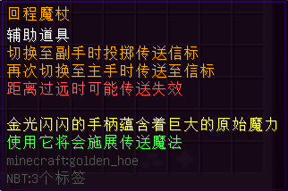
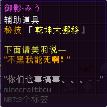
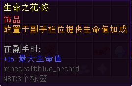
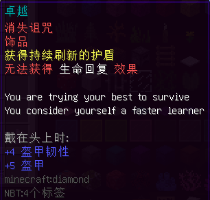

## 辉金 T5 道具明细

#### 力量之花·终

#### 回程魔杖

#### Miu_Wen 哒

#### 不稳定的特斯拉线圈

#### 生命之花·终

#### 种族棋子

PS：所以说为什么会有这么多枚啊！到底谁才是人类的王？

#### 被诅咒的心脏

#### 猩红之杖

#### 尸花

#### Dio的死党

#### 卓越

#### 不朽的守护

#### 库哈纳的抉择

#### 变形玻璃

愤怒使人脆弱，却也能发挥极大的力量

#### oooOOO

#### 願いの行方

PS:i don't know...