# 精英黑化怪

——在**特定的野外遗迹**，以较低概率自然生成的黑化怪。  
其共同特点是：
- 名称必为**红色**；
- 生命值、技能等强度相较同级普通怪物更高；
- 可掉落普通怪物没有的战利品，如**天界魔矿**。

每次击杀所获战利品，皆从两组物品中，各抽取一种。战利品结构：

|组别|物品类型|相对稀有度|
|-|-|-|
| A 组 | 一文大钱1 | ★ |
| A 组 | 矿物块2 | ★★★ |
| B 组 | 天界魔矿2 | ★★ |
| B 组 | 单种怪物特有物品 | ★★ |
| B 组 | 喵爪银币1 | ★★ |

1. 一文大钱、喵爪银币可统称 **代币**。
2. **等级达 21 及以上**时，「矿物块」与「天界魔矿」不会掉落。

以下为其介绍，并按「阶段」划分之。

!> 附图仅用于展示怪物外形。关于生命值，“血量显示”（Orderly）插件最大仅支持 1024 点，请以文字描述为准。

------

## 第一阶段 (T1)

#### 受感染的村民

- 【等级】2
- 【外形】僵尸村民（沙漠服装）
- 【出没地点】**沙漠墓地** `(395, 23)`
- **【生命值】600**
- **【掉落物】天界魔矿①**，矿物块①，代币
  + 特有物品：「小麦种子」
- 【攻击特征】有小范围位移的能力；只有近身攻击，攻击附带「反胃 X」负面效果。
- 【对战建议】
  + 拉到旁边水池可以减缓村民移动速度；
  + 使用带击退属性的玩具或武器。

#### 羊咩咩
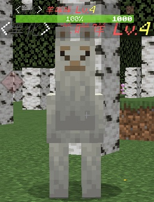
- 【等级】4
- 【外形】羊驼
- 【出没地点】**羊驼的诅咒** `(-301, -214)`
- **【生命值】1000**
- **【掉落物】天界魔矿①**，矿物块①，代币
  + 特有物品：「白色羊毛」
- 【攻击特征】移动速度极快；只有远程攻击，攻击附带「缓慢 X」负面效果（等同于定身，下同）。
- 【对战建议】
  + 拉到旁边水池可以减缓羊咩咩移动速度；
  + 站在树上可以卡视野，但是要注意会瞬移的末影螨（无吸血技能）。

#### 火焰精灵

- 【等级】4
- 【外形】烈焰人
- 【出没地点】**熔沙陨坑** `(650, -64)`
- **【生命值】1000**
- **【掉落物】天界魔矿①**，矿物块①，代币
  + 特有物品：「火焰尘」
- 【攻击特征】攻击机理同原版烈焰人，攻击无debuff，但是自带的灼烧初始刻伤害是**真实伤害**（无视护甲，下同）。
- 【对战建议】
  + 小心岩浆！小心岩浆！小心岩浆！
  + 注意远距离作战，方便躲闪火球，同时躲避火焰精灵阵亡时的爆炸伤害。

------

## 第二阶段 (T2)

#### 十月十日豚

- 【等级】6
- 【外形】河豚
- 【出没地点】**酸性沼泽** `(315, -889)`
- **【生命值】3000**
- **【掉落物】天界魔矿②**，矿物块②，代币
  + 特有物品：「河豚」
- 【攻击特征】有小范围位移的能力；只有**近身攻击**，攻击附带「反胃Ⅱ」负面效果。
- 【对战建议】
  + 站在建筑上，远程攻击，可以防止吃到负面buff，还可以躲避史莱姆的围攻。

#### 咕咕怪

- 【等级】8
- 【外形】鹦鹉
- 【出没地点】**咕咕废墟** `(926, -840)`
- **【生命值】4000**
- **【掉落物】天界魔矿②**，矿物块②，代币
  + 特有物品：「咕咕怪的羽毛」
- 【攻击特征】
  + 无位移技能，会上下飞动；
  + 仅具有**远程粒子攻击**，攻击附带短暂「中毒」。在显示最少粒子效果的设置下，攻击轨迹不可见。
- 【对战建议】
  + 注意躲避凋零玫瑰，躲避噬魂蛛的滞留中毒粒子。
  + 据说咕咕怪最讨厌吃曲奇饼干。
  + ~~咕咕怪可以驯服。驯服后不会主动攻击驯服者，并可带回主世界。~~

#### 史莱姆女王

- 【等级】8
- 【外形】史莱姆（巨型）
- 【出没地点】**深沼巨林** `(-433, 207)`
- **【生命值】2000**
- **【掉落物】天界魔矿②**，矿物块②，代币
  + 特有物品：「皇家凝胶」
- 【攻击特征】体积较大；伤害较高，攻击附带10s「中毒」效果。
- 【对战建议】
  + 注意女巫呯的射线攻击，因为她会把你从安全的树顶推下来。
  + 史莱姆女王的攻击伤害较高，站在树上攻击是最稳妥的方案，你只需要注意第一时间清理「不受欢迎的女巫呯」即可使自己受到最少的伤害。

------
## 第三阶段 (T3)

#### 小狐狸(AWSL)
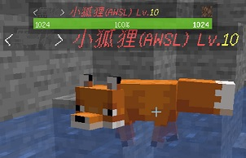
- 【等级】10
- 【外形】狐狸
- 【出没地点】**西海之巅** `(-741, 543)`
- **【生命值】3600**
- **【掉落物】天界魔矿③**，矿物块③，代币
  + 特有物品：「兔子皮」
- 【攻击特征】
  + 兼有远程和近战，攻击和移动速度较快。攻击附带10s「中毒」效果。
  + 靠近玩家时会**啃咬玩家。**
  + 使用**粒子射线**远程攻击。
  + ~~改版之前，T4的你根本不敢直视它。~~
- 【对战建议】
  + 注意周围的「亡灵炼金术师」，他会瞬移，可以用粒子射线攻击玩家，也可在地上释放中毒粒子云，所以优先清理他。
  + 小狐狸伤害很高，注意与它保持距离。

#### 土匪头子

- 【等级】12
- 【外形】掠夺者（队长）
- 【出没地点】**劫掠山庄** `(1386, -207)`
- **【生命值】4800**
- **【掉落物】天界魔矿③**，矿物块③，代币
  + 特有物品：「土匪的弩箭」
- 【攻击特征】
  + 可以隐身瞬移。
  + 只会用弩射箭攻击，但攻速很快。
  + 击中玩家后，**削减玩家生命值上限 14 点**，该效果持续 30 秒。
- 【对战建议】
  + 上面的坐标选取有特殊意义（受伤的只有它）。
  + 尽量使用带点亮效果的远程武器（比如T3花火、米波生物雷达），便于跟踪隐身的敌人。

#### 火星漫步者
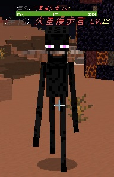
- 【等级】12
- 【外形】末影人
- 【出没地点】**火星地层** `(-14, 383)`
- **【生命值】4800**
- **【掉落物】天界魔矿③**，矿物块③，代币
  + 特有物品：「火星土壤标本」
- 【攻击特征】
  + 可以隐身瞬移。
  + 可**近身攻击**（同原版）与粒子射线**远程攻击**。
  + 击中玩家后，**削减玩家生命值上限 12 点**，该效果持续 30 秒。
- 【对战建议】
  + 优先清理**岩浆怪**，它们能在很远的地方点燃你。
  + 虽然末影人天生怕水，但是黑化后它拥有了远程攻击方式，因此在对战时，高护甲值是必要的。

------
## 第四阶段 (T4)

#### 喵喵卷(不高兴)

- 【等级】14
- 【外形】猫
- 【出没地点】**摩多** `(-825, -1332)` 的地表，但有时生成于地下
- **【生命值】6200**
- **【掉落物】天界魔矿④**，矿物块④，代币
  + 特有物品：「小鱼干」
- 【攻击特征】
  + 移动速度极快。
  + 仅可**近身啃咬**，攻击附带「虚弱」效果。
- 【对战建议】
  + 注意保持距离。
  + 山洞较多，建议使用符卡、画笔、博丽御币等武器清理怪物，也可下线等待区块卸载后再上线。

#### 寻仇者
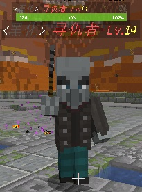
- 【等级】14
- 【外形】卫道士
- 【出没地点】**恶地战场** `(33, 1477)`
- **【生命值】6200**
- **【掉落物】天界魔矿④**，矿物块④，代币
  + 特有物品：「仇怨之魂」
- 【攻击特征】
  + 移动速度很快，可以瞬移。
  + 仅可**近身攻击**，攻击附带「缓慢 X」效果。
- 【对战建议】
  + 对于玩家最大的威胁是岩浆坑，一定要远离。
  + 注意躲在远处放冷枪的「髅本伟」，和高处看不见的「尖叫恶魂」。

#### 白乌鸡
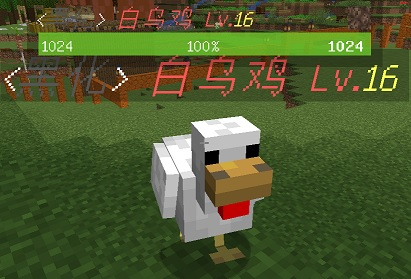
- 【等级】16
- 【外形】鸡
- 【出没地点】**白鹅小道** `(1044, -1069)`
- **【生命值】9600**
- **【掉落物】天界魔矿④**，矿物块④，代币
  + 特有物品：「烤鹅腿」
- 【攻击特征】
  + 可以瞬移。
  + 远程攻击，带有***吸血*** 效果（真实伤害，并回复自身，下同；吸血时玩家眼前冒出:heart:粒子）。
- 【对战建议】
  + 注意风筝战术对战恶狼，被减速到很容易暴毙。
  + 多备药瓶，想贴贴就要做好被吸干的准备。

#### 铁憨憨
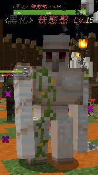
- 【等级】16
- 【外形】铁傀儡
- 【出没地点】**野蛮部落** `(-1634, -857)`
- **【生命值】7800**
- **【掉落物】天界魔矿④**，矿物块④，代币
  + 特有物品：「红玫瑰」
- 【攻击特征】仅可**近身攻击**，将玩家击飞（同原版）。未接触到玩家但距离很近，也会攻击。
- 【对战建议】
  + 加强护甲，加强护甲，加强护甲！
  + 不要离开部落太远，因为周围地区刷出的灵液怪会使战斗变得棘手。

------
## 第五阶段 (T5)

#### 熊二
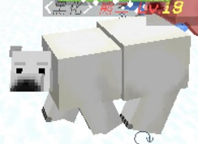
- 【等级】18
- 【外形】北极熊
- 【出没地点】**白熊平原**
- **【生命值】15600**
- **【掉落物】天界魔矿⑤**，矿物块⑤，代币
  + 特有物品：「寒霜花」
- 【攻击特征】使玩家致盲，释放中毒效果药水，强力击飞玩家。

#### 牛爷爷

- 【等级】18
- 【外形】劫掠兽
- 【出没地点】**贪婪之地** `(1835, 400)`
- **【生命值】19200**
- **【掉落物】天界魔矿⑤**，矿物块⑤，代币
  + 特有物品：「粗牛角」
- 【攻击特征】强力击飞玩家。冒出大量火花时，进入反伤模式，将玩家造成伤害**等量反弹**到玩家身上。
- 【对战建议】
  + **快速打法**——灵活运用贪婪之地的柱子。抓住牛爷爷不反伤的时机，站在柱子上暴打牛爷爷。
  + **稳健打法**——使用单发伤害较低但是射速较快的武器抗反伤进行输出 建议使用水晶镖枪，等离子暴击枪这类武器
  + **不建议**使用单发伤害过 800 以上的武器去打牛爷爷，在反伤时候一发就反死自己。
  + 没有**位移道具和加速道具**，不推荐刷牛爷爷！

#### 捣蛋鬼

- 【等级】18
- 【外形】恼鬼
- 【出没地点】**摩多** `(-825, -1332)` 的地底第一层
- **【生命值】19200**
- **【掉落物】天界魔矿⑤**，矿物块⑤，代币
  + 特有物品：「碎蛋壳」
- 【攻击特征】会**瞬移**到玩家附近。发射光线，对玩家***吸血*** 。

#### 堕落精灵使

- 【等级】18
- 【外形】唤魔者
- 【出没地点】**迷失回廊第一、第二层**
- **【生命值】19200**
- **【掉落物】天界魔矿⑤**，矿物块⑤，代币
  + 特有物品：「精灵笛」
- 【攻击特征】地刺技能全范围，发射射线，并且有一次拯救。

#### 迷失的精灵

- 【等级】18
- 【外形】恼鬼
- 【出没地点】**迷失回廊第三层**
- **【生命值】23200**
- **【掉落物】天界魔矿⑤**，矿物块⑤，代币
  + 特有物品：「暗黑染料」
- 【攻击特征】发射球射线，附带「抗性提升 -1」（伤害 +20%）效果。并可召唤精灵分身（分身有短暂无敌）。

#### 巨神兵
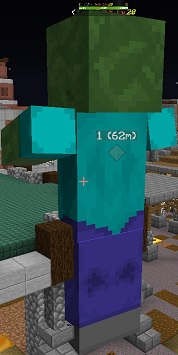
- 【等级】20
- 【外形】巨人
- 【出没地点】**塔吉特废墟地表**
- **【生命值】23200**
- **【掉落物】天界魔矿⑤**，矿物块⑤，代币
  + 特有物品：「巨人眼」
- 【攻击特征】发射三道穿透激光，发射穿墙火焰光线，在玩家头上释放火球。

#### 暗黑之灵

- 【等级】20
- 【外形】凋零骷髅
- 【出没地点】**神圣祭坛**
- **【生命值】23200**
- **【掉落物】天界魔矿⑤**，矿物块⑤，代币
  + 特有物品：「暗黑染料」
- 【攻击特征】发射较快凋零和中毒射线，并且有两次拯救。

#### 幻术射手

- 【等级】20
- 【外形】幻术师
- 【出没地点】**异星山谷**
- **【生命值】23200**
- **【掉落物】天界魔矿⑤**，矿物块⑤，代币
  + 特有物品：「虚幻之影」
- 【攻击特征】会**瞬移**到玩家附近。对附近玩家造成**失明**。发射高速高伤箭头（一箭 298）。

#### 雪怪

- 【等级】20
- 【外形】雪傀儡
- 【出没地点】**杀手山谷**
- **【生命值】23200**
- **【掉落物】天界魔矿⑤**，矿物块⑤，代币
  + 特有物品：「雪球精灵」
- 【攻击特征】疯狂发射雪球。

#### 深海亡灵
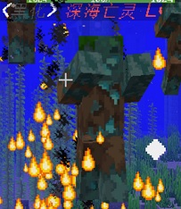
- 【等级】20
- 【外形】溺尸
- 【出没地点】**潮涌神殿**
- **【生命值】23200**
- **【掉落物】天界魔矿⑤**，矿物块⑤，代币
  + 特有物品：「海洋之魂」
- 【攻击特征】近距离对玩家***吸血*** 。召唤自身分身（分身被召唤有短期无敌）。

------
## 第五阶段以上 (T5+)

!> 你需要 **Boss 套装** 来跟以下怪物作战。

#### 灾厄术师
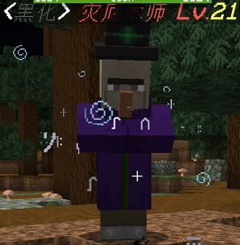
- 【等级】21
- 【外形】女巫
- 【出没地点】**潮涌神殿**
- **【生命值】48000**
- **【掉落物】**「黑暗碎块」，代币
- 【攻击特征】发射字符射线，附加「中毒」与「凋零」debuff。

#### 神殿守卫
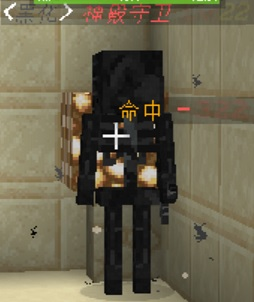
- 【等级】22
- 【外形】凋零骷髅
- 【出没地点】**光明神殿**
- **【生命值】50000**
- **【掉落物】**「光明碎片」，代币
- 【攻击特征】
  + 近距离对玩家***吸血*** 。对附近玩家施加「发光」与「缓慢」debuff。
  + 可发射闪光弹幕。
  + 自带两次拯救。

*（WIP）*

------
## 鸣谢 {docsify-ignore}

- *硅通孔 `silicon_via`* 提供了 T1~T4 精英怪资料。
- *托尼 `tony_teacher`* 测试了土匪头子等削减生命上限的技能。
- *霜糖 `frost_candy`、伊万 `Evan_76`* 等人提供了 T5 精英怪资料。
