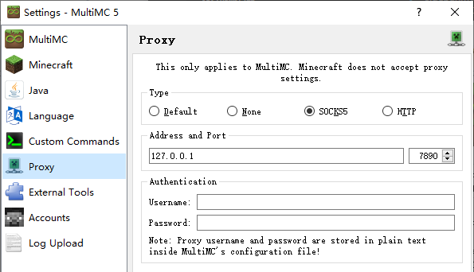

<!-- 由毛线官网与NyaaWiki整合而成的KedamaFAQ -->
<!-- Last Updated: by 秋秋 -->

# FAQ
本页面用于整理各类常见问题（Frequently Asked Questions）。对于初来乍到不清楚毛线情况的玩家，建议简单浏览这里列出的常见问题以免出现任何误解。

| 常见疑问 | 直达传送门 |
|-|-|
| 毛线是什么 | 👉 [毛玉线圈物語](kedama/beginners-guide.md)服务器的简称。|
| 毛线服务器对客户端有特别的要求吗？ | :point_right: [如何准备客户端](kedama/beginners-guide#入服准备)。 |
| 我有点卡 | 👉[服务器连线相关](kedama/faq#技术性问题)。|
| 我是新玩家，我应该去哪生存？ | :point_right:[新手上路](kedama/beginners-guide#新手上路) |
| 我该怎么赚钱？ | :point_right:[每个卷都要精打细算](kedama/beginners-guide#每个卷都要精打细算) |
| 如何去其它维度（世界）？ | :point_right:[维度列表](kedama/worlds.md)<br />要摆传送门请往下翻\~ |
| 如何在游戏聊天内分享一条命令？ | 命令前面加上`&f`。 |
| 如何使用锁箱插件？ | :point_right:[牌子锁指南](tutorial/plugins/lockettepro.md) |
| 如何设置名称前/后缀？ | :point_right:[Ukit 帮助](tutorial/plugins/ukit.md#chat-prefix-suffix) |
| 如何创建邮箱？ | :point_right:[Ukit 帮助](tutorial/plugins/ukit.md#mailer) |
| 服务器的管理员该找谁？ | 请参阅《[玩家权限](wiki/permission)》之“管理组”。 |


没有找到所需的答案？

先对自己的问题分类 —— 它是属于[Minecraft 本身](https://wiki.biligame.com/mc)的，还是服务器里各种新奇玩意的？</br>
不妨先在本页和整个 Wiki 内尝试搜索；如果 Wiki 上也没有，那就试着在社群里询问吧。

总之，抽出一定时间仔细阅读 Wiki，后面只会节省更多时间！

## 初来者相关

更多方面的问题：
- [插件和命令](tutorial/commands-help.md)
- 关于[神奇物品](#关于物品)
- 关于[毛线世界](#关于这个世界)
- 服务器[连接问题](#关于服务器连接问题)
- [其它问题](#其它初来者问题)


### 关于物品

?> ⛏️ **我看商店里，那些装备道具似乎很厉害，值得买吗？**

由于毛线v5服务器重置地图及纪念品，目前并没有大幅超出原版性能的装备道具。</br>
喵毛服务器[特殊附魔](/*未有此页面*/) (此页面未完成) 工具兼有高实用性和获取难度，可以考虑入手。
</br></br>

?> ⚒️ **为什么有一些非工具的物品有附魔？它们可以给其它工具附魔吗？**

这些附魔往往**仅用于装饰**，不能给其它工具附魔。  
一些东西可能具有其他的加成属性，比如增加你的攻击、速度等，这时你可以选择把它们戴在头上（`/hat`），或者放在副手上。  
一些附魔可能会间接工作，但并不靠谱，请不要依赖这个技巧。
</br></br>

?> 💱 **那么这些物品(纪念品)要在哪里获取呢**

服务器不定期举办活动，参与活动可获得兑换币获取纪念品，欢迎各路神仙游玩或[投标](https://craft.moe/faq)</br>
活动详情见[喵毛论坛](https://community.craft.moe/)当期发布的公告

活动纪念品可在出生点或[银河商人处](https://community.craft.moe/d/3570)兑换。
银河商人会被放置在管理组认为完成度高的原创建筑群中，位置固定后不会离开。
</br></br>


### 关于这个世界

?> ❓ **没有领地插件?**

- [游戏规则](https://craft.moe/rules)

`本服务器的最小化限制不代表对违规行为有丝毫的宽容。干净利落快准狠是本服务器管理组的风格。`

如果`有目的性地给他人造成损失、破坏游戏公平性、社区氛围和他人的游戏体验，包括盗窃、刷屏、无故杀人、抢夺物品、破坏他人物品或建筑、滥用他人无偿提供的公益设施或物品、恶意锁住他人箱子或方块等。`一经查证证据确凿则立即封禁。

服务器提供方块交互记录查询。 [`/co i`](tutorial/commands-help.md) 打开日志查看器，左键点方块、右键点箱子查看变更记录。再输入一次 [`/co i`](tutorial/commands-help.md) 关闭查看器回到正常生存状态。
</br></br>

?> :classical_building: **那些美观的建筑，都是在生存模式下建造的吗？**

所有资源均产自生电与人工收集。不可再生资源大多来自不定期重置的 vx 世界
</br></br>

?> 🧊 **我能不能自己摆个下界传送门？**

一般在野外，下界传送门可自行设置；但在聚落内则不建议私自设置，应首先和聚落内其他邻居共同决定。  
若你新摆设的传送门与既有的门发生“串门”，应**以既有者为先，不得私自破坏或更改其目的地。**
</br></br>

?> :world_map: **毛线主世界地图是什么时候生成的？期间有更换过吗？**

v1 ~ v4 已封存 </br>
v5 世界大约已开启 3 年, 版本为 1.18 ~ 1.20 </br>
v6 世界大约已开启 0.5 年，版本为 1.21 </br>
-本条目更新时间: 2024/10/1
</br></br>


?> :arrow_up: **毛线服务端什么时候升级到最新 Minecraft 版本？**

将服务端升级到最新的 Minecraft 版本不是件非常容易的事情。在喵毛服务器升级到下一个版本以前，需要等待插件跟进、性能评估、游戏策略的调整等。

不过，毛线对于跟进官方最新版本是非常积极的，目前的版本已是1.21.1。
</br></br>

### 关于服务器连接问题

?> :computer: **修改密码后无法登陆？**

在 Mojang 官网修改密码后，新密码将会在 24h 内生效。在新密码生效前，**使用新旧密码均无法登陆 Minecraft**。

总之甩锅给 Mojang 就是了
</br></br>

?> :woozy_face: **为什么我感觉服务器突然好卡啊？**

- 宽带速度( Mbps )
- 延迟( ms )
- 服务端游戏刻( [TPS](https://www.zhihu.com/question/269769734/answer/349795953) )
- 客户端帧率( FPS )

均非同一“卡顿”来源。服务器游戏刻( TPS )可以使用 miniHud mod 查看。

毛线拥有多台自有产权的物理机设备，但这并不能解决 Mojang 的代码性能问题。 TPS 正常值为 20， 低于 15 时时间运行速度会明显缓慢。如果 TPS 数值持续过低，请联系管理组反馈以协助解决问题。


tip: 帧率低？推荐使用[插件整合包](wiki/resources.md)
</br></br>


?> :iphone: **我可以用手机登录毛线吗？**

你确定真的要这么干？  

的确有个解决方案，叫[PojavLauncher](https://github.com/PojavLauncherTeam/PojavLauncher)。
</br></br>

### 其它初来者问题

?> :congratulations: **我可以自行举办活动吗？**

当然可以。  
请事先计划好整个活动的各方面细节，包括主办方(一名或多名玩家或服内玩家组织)、活动名称、活动主题、时间、地点、可以参与的玩家、活动流程细节、需要管理组做何种支持等。制作成一份活动规划发送至管理组邮件列表：`owo@nyaa.cat`。管理组审核后会予以回复。


? > 💦 额外: 救命！我的微软账号被盗了！

如果无法找回账号，可以注册并购买新的 MC 账号，然后联系管理组成员转移角色资料(余额，背包内容等)，人工转移商店物资，移除被盗账号的 Lockette 木牌，然后重新锁箱即可。

被盗账号直接作封禁处理。

---------

## 论坛相关

?> :wrench: **我该如何分辨管理组成员和站长？**

管理组成员的头像上有着“深蓝色的闪电”徽章，而“红色的小扳手”徽章则代表站长。  
将鼠标移动到徽章上可看到这些徽章的具体含义。


?> :six_pointed_star: **头像上粉红色的徽章是什么？我能获取吗？有什么用处？**

该徽章意为「Verified」（已认证），当在 NyaaBBS **累计发帖、回复 50 次以上** 时，即有资格获取之。  
需要获取时，联系管理组处理。

目前，该徽章仅作装饰之用。


?> :-( **我在论坛发言中输入了一个颜文字，然后样式崩坏了！**

这是因为你输入的颜文字中，恰好包含了会被认为是 Markdown 样式语法的符号，如：
- 下划线 `_` 和星号 `*`，表示斜体或加粗（成对使用，下同）；
- 指数符号 `^`，表示上标；
- 波浪号 `~`，表示下标或删除线；
- 加减号 `+` `-` 和星号，表示无序列表；
- 反引号 ``` ` ```，表示代码块；
- 反斜杠 `\`，表示对上述符号转义。

正确的解决方法是在上述符号前面加上反斜杠 `\`，转义后其按原样显示。例如，当输入颜文字 \_(:з」∠)\_ 时，可以这样输入：

```markdown
\_(:з」∠)\_
```

---------

## 社区相关

?> :people_holding_hands: **我可以带我的对象/同学/朋友…… 来玩吗？**

当然可以，你的伙伴需要自行在 [minecraft.net](https://www.minecraft.net) 注册、激活国际版账号，使用**自己的账号**登录游戏。
- **不要与你的伙伴互相共享账号**（即使你们在一起）。这是违反规则的！


?> :construction_worker: **我不从事 IT 相关行业 / 我对 IT 相关领域没有兴趣，可以加入这个社区吗？**

相信很多人有这种误解的一个理由是 NyaaCat 社区中有相当一部分成员来自 [ArchLinuxCN](https://www.archlinuxcn.org) 社区，加上 NyaaCat 社区在 [V2EX](https://www.v2ex.com) 上进行过较多的宣传。

尽管 NyaaCat 社区有很多成员在现实生活中从事 IT 相关行业，但我们也拥有很多从事其它行业的成员。而且，我们欢迎来自任何行业 / 正在学习任何专业的小伙伴们，只要你热爱 NyaaCat 社区。

--------

## 技术性问题

?> :red_circle: **服务器地址无法解析？显示 Unknown host?**

请更新您的 DNS。[戳这里查询目前使用的 DNS 地址](https://ping.huatuo.qq.com/)。


?> :orange_circle: **GNU/Linux 下 Minecraft 如何输入中文（或其他 CJK 字符）？**

GNU/Linux 下 Minecraft 输入中文/日文等解决方案：(无需 Mod，无需修改客户端，支持任何输入法)
- [方案一](#linux-typing-1)
- [方案二](#linux-typing-2)

##### 方案一

> 此方案拥有比 bash 脚本更好的鲁棒性，适应多种情形，并绕过了一些坑。但是需要 Ruby。（[Gist](https://gist.github.com/FiveYellowMice/86b73e35298467e2d89b5d0cc3db1f0d)）

```ruby
#!/usr/bin/env ruby
# encoding: utf-8
# frozen_string_literal: true

# mc-im.rb
# ========
#
# 在 Linux 下的 Minecraft 中输入中文。拥有比 bash 脚本更好的鲁棒性，适应多种情形，并绕过了一些坑。
#
# 使用方法
# -------
#
# 1. 将此脚本下载，保存在任意位置。（如 `/home/user/.bin/mc-im.rb` ）
# 2. 将此文件赋予执行权限。（如 `chmod +x /home/user/.bin/mc-im.rb` ）
# 3. 在你使用的桌面环境中，添加一个快捷键（如 Meta - c ），将执行的命令设置为脚本的路径。
# 4. （可选）再添加一个另外快捷键，将执行的命令设置为脚本的路径，并在后面加上一个空格和 `--direct` 。
#
# 使用 `--direct` 选项来直接输入文字，而不去按 Esc 、 t 和 Enter ，在输入告示牌等情形下有用。
#
# 要求
# ---
# 
# 需要 Ruby 1.9 或更高版本。（除非你用的是比 Debian 7, Ubuntu 14.04, CentOS 7 还要老的发行版，这一般没有问题，不过还是确认一下你装了 Ruby 啊！）
# 需要 `xdotool` ，所以也只能在 X11 下工作。（不一定自带，请用包管理器装）
# 在 KDE 和 LXQt 中需要 `kdialog` ，而在其他桌面环境中需要 `zenity` 。（一般来说都是自带的）
#
# 版权
# ---
#
# 此脚本以公有领域授权。

TITLE_TEXT = "输入"
LABEL_TEXT = "在此输入文字："

def press(*keystrokes)
  system 'xdotool', 'key', '--delay', '100', *keystrokes
end

def type(str)
  system 'xdotool', 'type', '--delay', '100', '--', str
end

input =
if %w(KDE LXQt).include? ENV['XDG_CURRENT_DESKTOP']
  `kdialog --title '#{TITLE_TEXT}' --inputbox '#{LABEL_TEXT}'`
else
  `zenity --entry --title '#{TITLE_TEXT}' --text '#{LABEL_TEXT}'`
end.chomp

sleep 0.1

if ARGV.include? '--direct'
  type ' '
  press 'BackSpace'
  type input
elsif !input.empty?
  press 'Escape', 't'
  sleep 0.2
  type input
  press 'Return'
else
  press 'Escape'
end
```

##### 方案二 :id=linux-typing-2
> 此方案也可写入告示牌。需要 zenity 和 xdotool，如果用 `apt-get` 的话可以用 `sudo apt-get install zenity xdotool` 来安装：<sup>[（来源）](https://blog.lilydjwg.me/2015/5/17/input-chinese-to-minecraft-in-linux.93167.html)</sup>

```bash
#!/bin/bash -e
chars=$(zenity --title 中文输入 --text 中文输入 --width 500 --entry 2>/dev/null)
sleep 0.1
xdotool key --delay 150 Escape t
sleep 0.2
xdotool type --delay 150 "$chars"
xdotool key Return
```

如果不想自动按 t 和回车的话（如写入告示牌的情形），可以去掉不需要的行：

```bash
#!/bin/bash
chars=$(zenity --title 中文输入 --text 中文输入 --width 500 --entry 2>/dev/null)
xdotool type --delay 150 "$chars"
```

如果不想使用 zenity 的话，请根据你所使用的工具来修改第二行。如 Ubuntu 下用 gdialog ，就将第二行修改为：

```bash
chars=$(gdialog --inputbox ' ' 2>&1)
```


?> :yellow_circle: **macOS 下 Minecraft 如何在聊天框输入中文（或其他 CJK 字符）？**

喵窝目前使用的游戏版本在 macOS Catalina (10.15) 和 Big Sur (11.0) 可以正常通过输入法输入中文。

根据笔者测试，目前直接输入中文时存在以下问题：

- 输入拼音时，如果试图删除已经输入的拼音，则会同时删除已经输入的汉字。

尽管如此，目前还是基本可以使用的。对于比较重要的文本，建议先在其它文本编辑器中输入，然后粘贴到游戏中。


?> :green_circle: **macOS 下鼠标滚轮速度鬼畜**

这是由于 macOS Sierra 及以上版本的鼠标滚轮加速功能导致的；该功能对 Minecraft 并不是非常友好，从而会导致滚动速度鬼畜的问题。

如果需要禁用滚轮加速功能，可以尝试安装 [DiscreteScroll](https://github.com/emreyolcu/discrete-scroll)。

?> :large_blue_circle: **下载文件失败/无法登录正版服务器**

因为 Mojang 的服务器基本托管在 Amazon AWS，所以部分地区的用户经常会遇到下载失败、无法登录等等问题。解决方案之一是让启动器通过 [SOCKS5](https://en.wikipedia.org/wiki/SOCKS#SOCKS5) 代理启动。

但是，由于新版启动器没有提供代理设置，通过 Proxifier 等第三方工具配置步骤繁杂、稳定性不确定，我们建议直接更换第三方启动器（如 [MultiMC](https://multimc.org/)），然后在启动器中配置代理。

通常情况下，给启动器配置代理**不会影响**游戏的网络连接，但还请仔细阅读启动器的相关说明。

  
<small>MultiMC 的代理设置页面。正如界面中的说明，该代理设置<b>仅适用于启动器</b>，不适用于游戏本体。</small>


?> :purple_circle: **如何设置游戏的内存大小**

在 JVM Arguments 中填写 `-Xmx` 参数。
例如：`-Xmx2G` 表示为最多占用 2G 内存。

请勿安装 32 位 Java——其最大只能分配 1G，已远不能满足在喵窝游玩的需求。
