# 2020 年活动

## 2020 喵窝&毛线万圣节活动 [Treat or Beat]

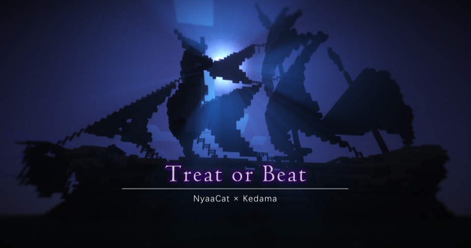

> 这里是[预告帖](https://community.craft.moe/d/2108)  
特别感谢以下玩家的辛勤付出（排名不分先后）： `Ankou54` `EchoLake_` `WarspiTeX` `Dani233` `forst_candy` `Round_Cookies` `ABRAHAMside` `PinkishRed`  
~~还不感恩戴德~~

以杰克斯派洛为首的莱德海盗与以巴博萨为首的布鲁海盗为争夺凤凰群岛的宝藏展开了一次对决, 然而双方都成为了这场战争的陪葬品。
多年以后, 海盗们的亡魂在凤凰群岛飘荡着, 并再一次剑拔弩张, 针锋相对……

?> :gift: **REWARDS | 新奖励追加**

参与活动的所有玩家，活动结束后返回主服务器排队领取活动纪念品（每位玩家限领一份，不可代领）
活动奖励在毛线和喵窝同时发放。同时在两个服务器的玩家可以在每个服务器都领取一份。奖励内容敬请期待。

?> :clock3: **SCHEDULE | 活动日程**

**北京时间 10月31日 星期六 19:30-21:40**
每场活动进行 30 分钟，预计开放三场。

?> :game_die: **DETAIL | 活动详情**

- **游戏基础设定：**  
冒险模式；无自动回复生命值；无死亡掉落。
- **玩法介绍：**
  + 本次活动为大型对称对抗类PVP活动，每局比赛共分为两个阵营，玩家需扮演一名**亡灵海盗**进行游玩。  
  （当亡灵海盗下水时，只能在**一格深**的水域行走，否则会迅速扣血，或许你可以试试划船？）
  + 地图内共有三个点位，A、B点分别靠近各自阵营，C点位于地图的中心, 玩家需通过**占点**使己方所有队员获得**金锭**。
  + 金锭可在 NPC 处用于升级盔甲、武器和购买道具。玩家有**头颅、近战、远程**三项升级线路。（详情见下）
  + 占点与杀敌均可获得**积分**。最终根据双方获得的积分判别胜负。  
_（请注意: 以上描述仅供参考，实际内容以游戏内为准）_
- **参与方法：**
  + 使用命令`/server act`进入活动服务器。
  + 玩家可以在大厅选择加入**莱德海盗**或**布鲁海盗**；选择完毕后, 服务器会随机调整平衡人数。
  + 活动正式开始后，中途不可加入，迟到玩家需进行观赛，等待下一场比赛。

科技树与 NPC 详情

 

| 升级路线 | 一级 | 二级 | 三级 | 四级 |
|-|-|-|-|-|
| **头颅** | 南瓜头 | 南瓜灯 | [坦系] 苦力怕头 [速系] 骷髅头 | [坦系] 僵尸头 [速系] 凋零头 |
| 近战 | 木头短剑 | [剑系] 合金大剑 [斧系] 战斧 | [剑系] 契约失败之剑 [斧系] 锟金烤 |
| 远程 | 小型弩 | [弩系] 爆炸弩 [弓系] 骨弓 | [弩系] 爆炸机关弩 [弓系] 机械复合弓 |

| NPC职业 | 莱德海盗方 | 布鲁海盗方 |
|-|-|-|
| **头颅** | 铁血战士 平克一世·莱德 | 铸甲师 安口武士 |
| **近战** | 击剑大师 艾口·雷克 | 独孤剑圣 瑞姆·侍欧 |
| **远程** | 神射手 沃斯佰·达尼 | 双枪战神 步灵王 |
| **杂项** | 皇室商人 朗多·库奇斯 | 双面老板 巴格·法科托瑞 |
| **药水** | 炼金术士 阿伯拉罕·赛德 | 药水专家 佛斯特·坎迪 |

（这名字……读起来很顺口的样子）

!> **NOTICE | 注意事项**

- 文明交流, 理性沟通, 拒绝内鬼行为
- 禁止严重破坏他人游戏体验的行为

--------

## 2020 喵窝&毛线国庆活动 【围攻行动】 :id=national-day-besiege

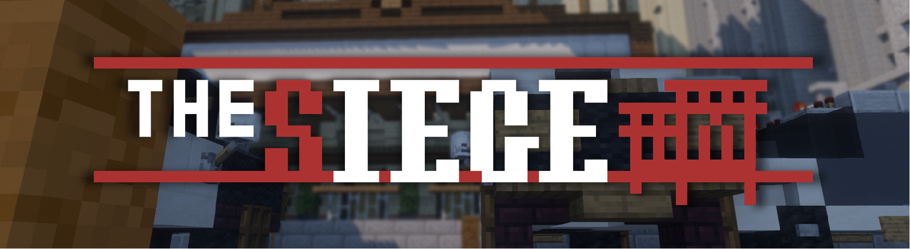

> 这里是[预告帖](https://community.craft.moe/d/2086)

#### 引言

20世纪末，喵窝新北联邦警局在一次突击中成功逮捕了当地最大黑帮凤凰卷帮的多名主要成员，为了逼迫警方交出自己的黑帮成员，凤凰卷帮的残余黑帮成员袭击了新北大剧院，并安装了能够快速set0大片区域的定时命令方块以威胁新北警方，在得知消息后新北警方快速包围了新北大剧院，并与黑帮展开谈判，最终双方未能达成一致，凤凰卷帮还是启动了在大剧院内的定时命令方块。为了拆除定时命令方块，新北警方派出了全新北最精锐的反恐部队【新北攻坚特勤.N.N.C.S.】

> !谈判破裂，准备攻坚!

#### 活动详情

?> :game_die: **玩法介绍**

**游戏流程：**

1. 游戏共有【蓝色进攻方】（黑色队服）和【橙色防守方】（白色队服）两个阵营；每个阵营都有一名可以重复选择的普通角色，和不能重复选择的特殊角色。
1. 游戏场内共有四个游戏房间，各有 A、B 两个阵营。进入游戏后，可选择加入任意游戏房间和任意阵营；待该房间双方人数平衡，游戏会自动开始，并随机指定某阵营为进攻方或防守方，进入准备阶段。
1. 准备阶段，需选择出生点和干员。
1. 准备阶段结束后，玩家获得装备并被转送到所选出生点，开始对抗。
1. 一局时长为 3 分钟 15 秒。指定时间内，防守方需坚守防守点位并加强防御，进攻方则需占领防守点位。  
  死亡后无法复活。  
  【胜利条件】  
   - 进攻方：防守点位无守方人员时，占领该处 15 秒获胜。  
       （双方人员皆在点位内，则暂停计时；进攻方离开点位，则每秒回退占领时间一秒。）
   - 防守方：防守点位在规定时间未被占领，则获胜。
   - 僵持阶段：常规时间结束后，如防守点位有进攻方人员（占领中或处于僵持），则加时 30 秒，直至满足上述条件。
1. 游戏结束，房间将被重置，同时玩家返回大厅。

点击展开示意图

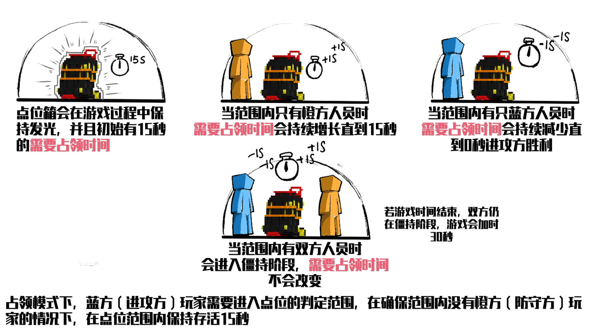

?> :gun: **基础道具使用方法介绍**

点击这里展开

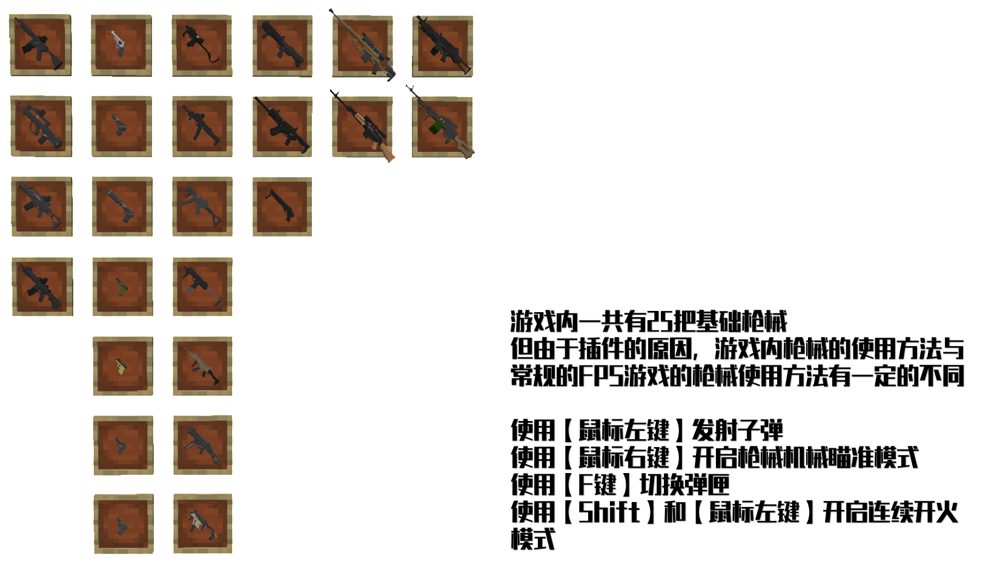
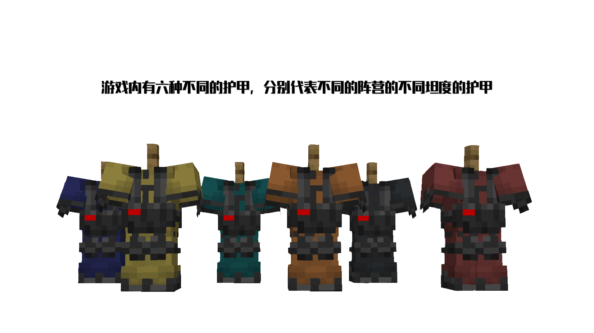
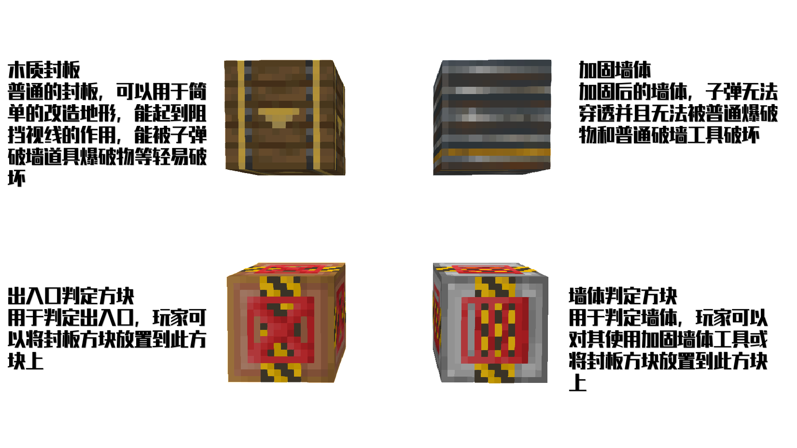
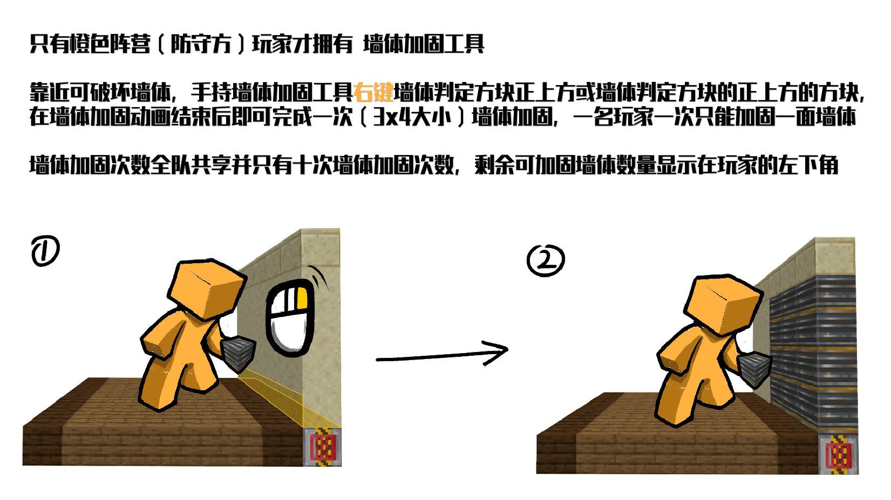
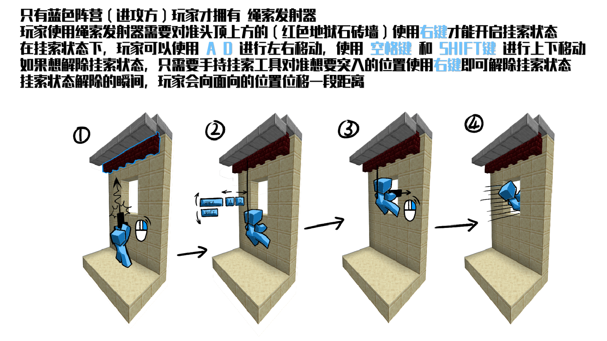
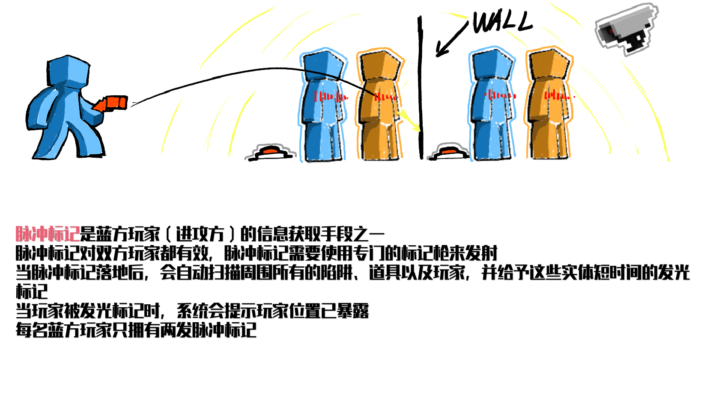
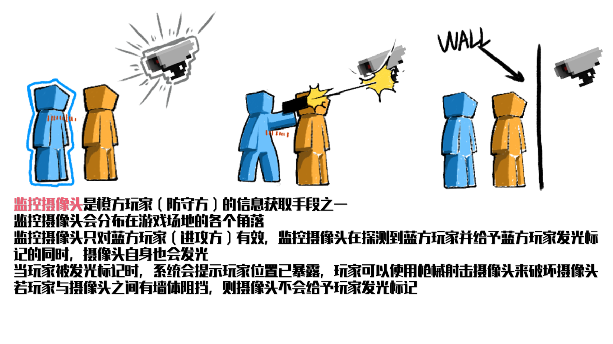

?> :house: **场地介绍**

点击这里展开

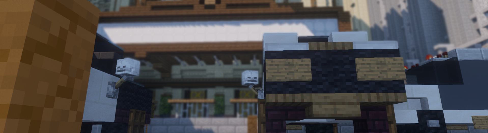  
被警车包围的 **新北大剧院**

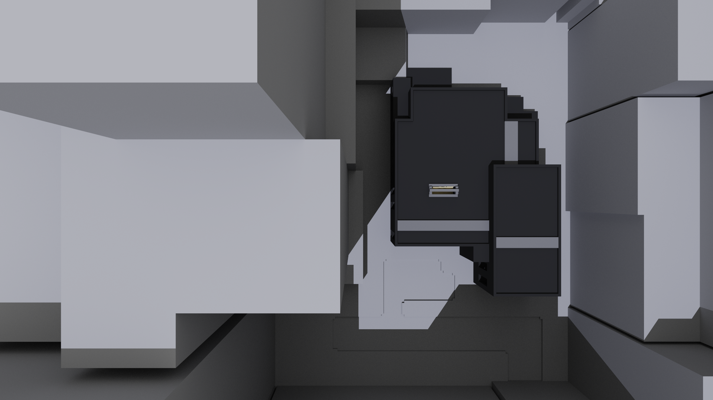  
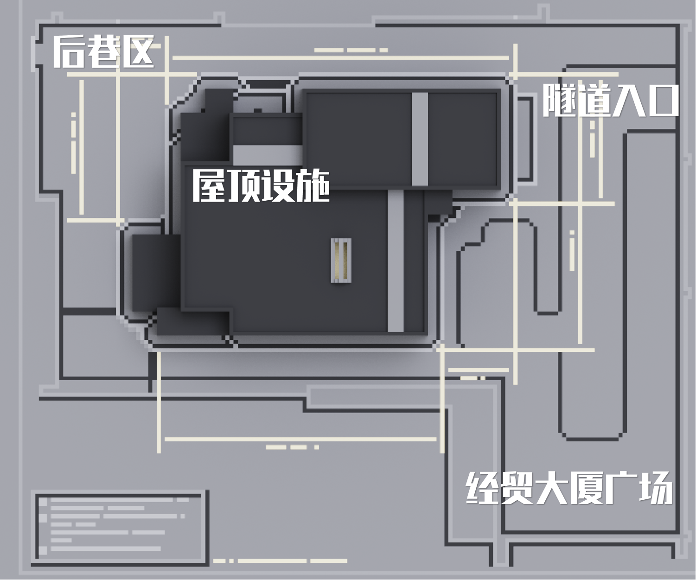  
室外场地区块命名

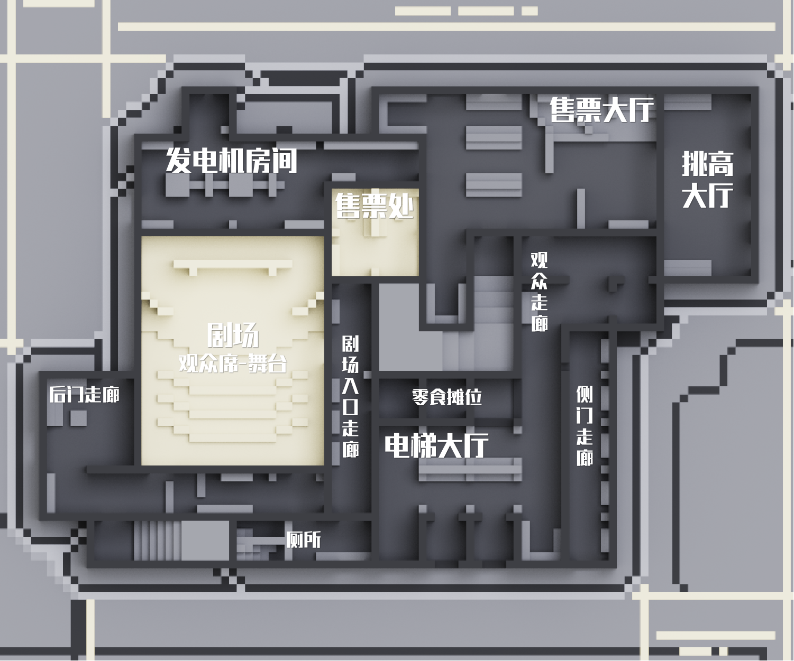  
游戏场地1F

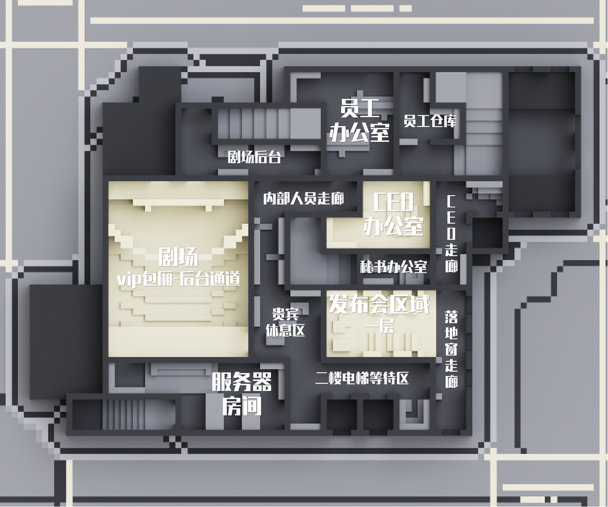  
游戏场地2F

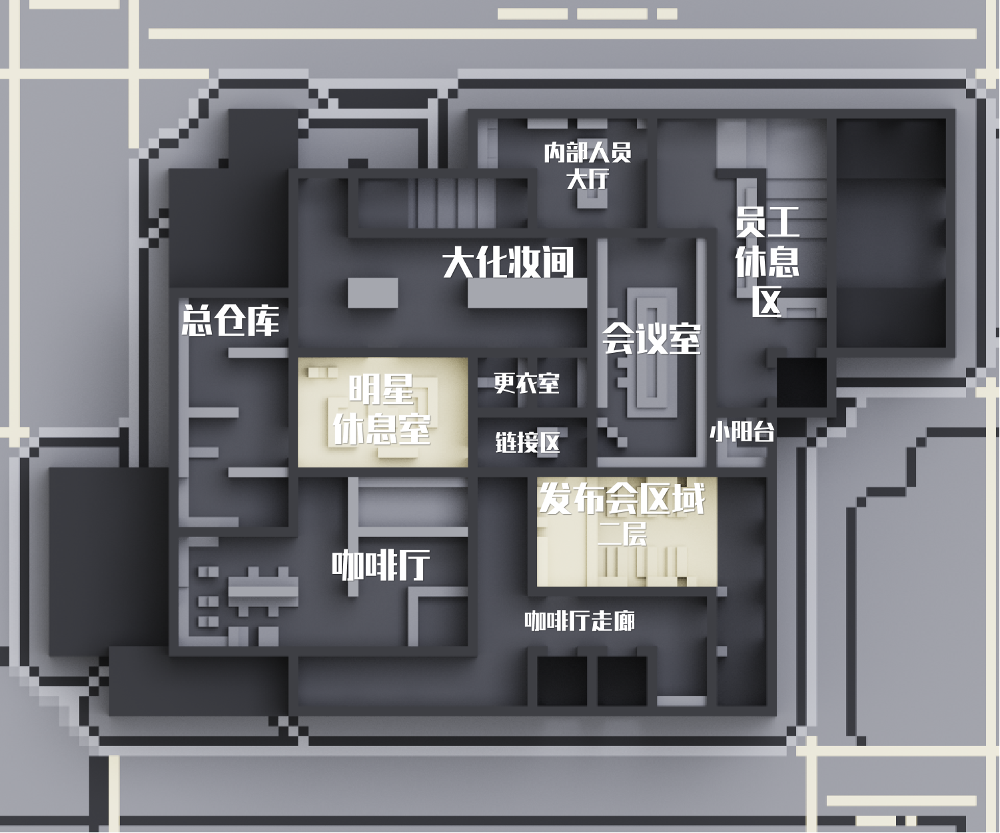  
游戏场地3F

新北大剧院，位于喵窝新北市区中心市区的经济中心，1.13.2动工建造，1.15.2正式投入使用，是新北地标式建筑 。
新北大剧院占地面积1.8公顷，最高的屋顶距海平面60米，总建筑面积88000平方米，有一个2700座的音乐厅，一个1550座的歌剧院和一个420座的小剧场，有展览、录音、酒吧、餐厅等大小房间900个，2007年，新北大剧院被联合国教科文组织评为世界文化遗产。（口胡）

?> :mens: **角色简介**

点击这里展开

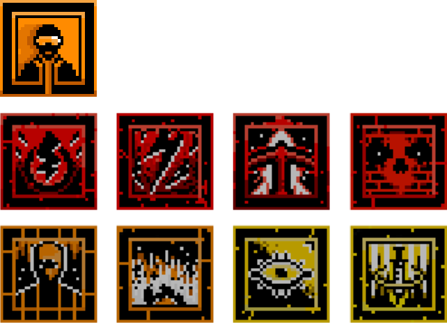  
**来自【新北攻坚特勤.N.N.C.S.】的，八名各具特色的【精英干员】**
*(介绍顺序 : 从左往右, 从上往下)*

| 干员 | 速度 | 护甲 | 技能 |
|-|-|-|-|
| **NEWSTAFF** **新晋干员** | ▼▼▽ | ▼▼▽ | 无技能 |
| **BLACKOUT** **电磁手雷** | ▼▼▽ | ▼▽▽ | 电磁手雷可以摧毁防守方设备 |
| **STRIKRE** **爆破榴弹** | ▼▼▼ | ▼▽▽ | 拥有榴弹发射器和两发瞬爆榴弹 |
| **BLADE** **切割突破** | ▼▽▽ | ▼▼▼ | 拥有能够切割开加固墙面的切割机 |
| **HELLFIRE** **铝热炸药** | ▼▼▽ | ▼▼▽ | 拥有可以切开加固墙面的炸药 |
| **SNAKE** **无痕潜行** | ▼▼▽ | ▼▼▽ | 可以屏蔽所有探测仪器 |
| **MASTERKEY** **多功能弩** | ▼▼▼ | ▼▽▽ | 拥有可以发射火焰和烟雾的弩箭 |
| **MONITOR** **远程狙击** | ▼▼▽ | ▼▼▽ | 拥有能够一击毙命的 M200 狙击步枪 |
| **CARDIOTONIC** **全局激素** | ▼▼▼ | ▼▽▽ | 能够远程给所有队友提供肾上腺素 |

 

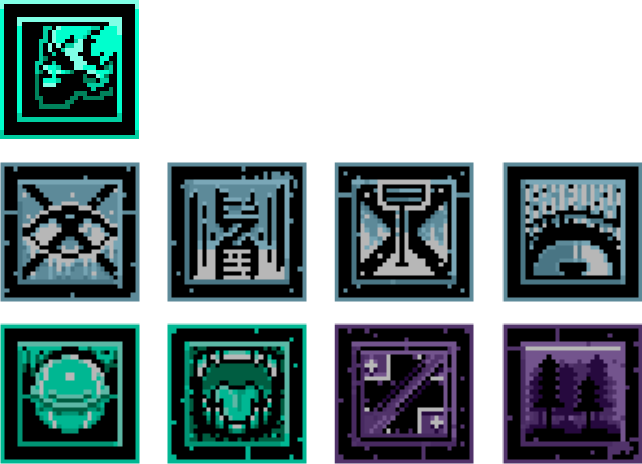  
**来自【凤凰卷帮】的，八名各具特色的【黑帮核心成员】**

| 干员 | 速度 | 护甲 | 技能 |
|-|-|-|-|
| **MAFIA** **黑帮成员** | ▼▼▽ | ▼▼▽ | 无技能 |
| **STUN** **震撼陷阱** | ▼▼▼ | ▼▽▽ | 可以放置使人失明的震撼陷阱 |
| **TOXIN** **毒素陷阱** | ▼▼▽ | ▼▼▽ | 可以放置具有光学迷彩的毒素陷阱 |
| **TRAPWIRE** **感应地雷** | ▼▽▽ | ▼▼▼ | 可以在场地里设置感应地雷 |
| **INTERFERE** **信号干扰** | ▼▼▽ | ▼▼▽ | 可以放置信号干扰器 |
| **ORION** **干扰游走** | ▼▼▽ | ▼▼▽ | 持有一把自己改装的狙击步枪 |
| **GUARDDOG** **自动霰弹** | ▼▼▽ | ▼▼▽ | 持有一把高射速半自动霰弹枪 |
| **LANCET** **战地医生** | ▼▽▽ | ▼▼▼ | 持有能够范围治疗的治疗激素 |
| **SANDFOREST** **重机枪手** | ▼▽▽ | ▼▼▼ | 他有一把机枪, 大机枪!!! |

#### 活动报名

- 在 **10 月 8 日 12:00 ~ 10 月 15 日 12:00** 内，进入游戏匹配大厅选择房间和阵营后等待人数到达规定数量后自动开始一场游戏。
- 活动开始后，使用命令 `/server act` 进入活动服务器，即可等待比赛开始。

#### 注意事项

1. 因采用特殊材质包, 请关闭 "强制 Unicode" 该选项
2. PVP 活动惯例, 请关闭玩家雷达等一系列作弊性质的辅助工具
3. 全程开启友军伤害, 禁止恶意击杀队友
4. 请保持良好的游戏心态
5. 请勿恶意刷战绩，一经发现，立刻交给管理处理
6. 如果网络较差，可以下载预材质包，在服务器选择禁止加载材质包  
材质包下载链接：pan.baidu.com/s/1RW8tsdvzy-GS42qWwpL36g 提取码：SGRP

- - -

## 2020 喵窝&毛线国庆活动 【王牌战机】 :id=national-day-airfight

> 这里是[预告帖](https://community.craft.moe/d/2059)

?> :game_die: **游戏规则**

1. 本活动类型为 PVP 对称作战, 玩家需要通过组建三人战队来进行淘汰赛, [报名帖传送门](https://community.craft.moe/d/2084)
2. 职位分为长机和僚机, 一个队伍有且只有一个长机和两个僚机
3. 对决的两队赛前需要在甲板上集结, 进行职业选择, 最多准备时长 5 min, 否则将视为弃权
4. 舰载机从港口旁边的航母甲板处起飞, 碰到水面后立即坠毁
5. 舰载机经过出口处会获得 3s 的无敌效果, 经过入口处会进行维修, 完全恢复生命值
6. 战斗单位若以任何形式被摧毁, 都会给敌方阵营加上相对应的分数
7. 一局时长为 10 min, 时间结束按分数判定胜负, 若比分相等, 则进行加时赛
8. 完成一轮晋级赛后, 决胜队伍若为奇数, 则比分最高的队伍直接晋级下一轮

?> :clock3: **赛程时间**

- 10 月 6 日
  - 14:30-16:30 预赛A场
  - 19:30-21:30 预赛B场
- 10 月 7 日
  - **19:30-21:30 决赛**

?> :mens: **职位简介**

+ 【僚机】
  - **血量:** 20
  - **分值:** 3
  - **对空武器:** AIM-54X空空导弹(CD=10s) 12.7mm航空机枪
+ 【长机】
  - **血量:** 30
  - **分值:** 5
  - **对空武器:** AIM-117改良型空空导弹(CD=7s) 12.7mm航空机枪

!> **注意事项**

- 禁止恶意击杀队友
- 禁止开启生物雷达
- 禁止严重破坏游戏体验

违规玩家将会受到管理组的制裁!

?> :gift: **兑换物获得**

兑换物: **战机功勋证明**

战队兑换物发放 (三人份)

- 首轮淘汰 25星
- 十六强 35星
- 八强 45星
- 四强 60星
- 季军 80星
- 亚军 90星
- 冠军 100星

--------

## 【周末搞事活动】是强者就下 255 层

> ~~这是一个放了一年半的饼~~  
参见 [【趣味竞技】是猛男就下 255 层](https://community.craft.moe/d/742-255)

~~YuzukiYuris 落地过猛~~  
~~YuzukiYuris 感受到了动能~~

刚从蘑菇洞的魔爪中逃出的你，想着如果再也不会摔伤多好。

一眨眼，你已经被传送到了一个奇妙的世界，脚边是万丈深渊，要想回到原来的世界，只能跳到这个世界的最低点！

~~“喂，前面可是地狱啊（迫真）”~~

?> :gift: **REWARDS | 新奖励追加**

本组游戏结束后所有参与玩家将获得同等数量的保底兑换物【大柚子】x10，在此基础上完成全部赛道的玩家将进行排名并额外获得排名奖励：

第 1 名：【大柚子】x5  
第 2-5 名：【大柚子】x4  
第 5-10 名：【大柚子】x3  
第 11 名及之后的完赛玩家：【大柚子】x2

活动奖励在毛线和喵窝同时发放，同时在两个服务器的玩家可以在每个服务器都领取一份。奖励内容敬请期待。

?> :clock3: **SCHEDULE | 活动日程**

- CST 2020 年 9 月 12 日 星期六 19:00 - 20:10（喵窝场）
  + 19:00 - 19:20 活动预备（共 20 分钟）
  + 19:20 - 20:10 活动开始（共 50 分钟）
- CST 2020 年 9 月 12 日 星期六 20:00 - 20:50（毛线场）
  + 20:10 - 20:30 活动预备（共 20 分钟）
  + 20:30 - 21:20 活动开始（共 50 分钟）

?> :game_die: **DETAIL | 活动详情**

- **游戏基础设定：**  
冒险模式，玩家不会受到任何伤害。
- **玩法介绍：**
  + 参与的玩家从 255 层的平台跳下，比赛谁先掉出这个世界。
  + 地图共有三个赛道，赛道难度逐级递增，每个赛道从 255-1 层之间，布置有各种可能的障碍物、隧道、药水云，阻碍玩家下坠。玩家每完成一个赛道（进入本赛道第 0 层传送门），将会被传送至下一个赛道第 255 高度处起点继续游戏，以此类推，直至进入最终赛道的第 0 层传送门后，视为完赛。
  + 不同赛道中玩家会被给予不同的效果与道具辅助玩家游戏，整场活动中玩家不会受到任何伤害；部分赛道中，玩家可以合理、充分利用被给予的道具干扰其他玩家，为游戏增加更多的不确定性！
- **参与方法：**
  + 活动开始后，使用命令 `/server act` 进入活动服务器，即可等待比赛开始。

!> **NOTICE | 注意事项**

**特别提醒：本次活动分为【喵窝场】和【毛线场】两场，为保证游戏公平，同时在两个服务器的玩家只能选择其中一场参加游戏，请务必注意！**

本次活动可能会有地图部分、功能设计不完善等问题，活动结束后欢迎各位玩家在[公告帖（Internet Archive）](https://web.archive.org/web/20210614053949/https://bbs.nyaa.cat/d/1766-255)下方进行反馈，提出自己的宝贵建议与意见！

--------

## 2020 夏日祭

一年一度的夏日庆典活动！2020 夏日祭&毛运会 重磅归来！  
与往届一样，在为期一周的连续大型活动中，每个活动都会提前一天或数天在论坛发布活动详细信息，敬请关注。

以下是本次夏日祭、毛运会的日程安排：

- 8/7 至 8/13 [买买镇的夏日奇妙大作战](https://community.craft.moe/d/2000)
- 8/7 至 8/13 [World Wings Rally](https://community.craft.moe/d/2004)
- 8/8 [2020 毛运会开幕式&步行马拉松](https://community.craft.moe/d/2009)
- 8/9 [采花答道](https://community.craft.moe/d/2008)
- 8/10 至 8/13 [毛运会跑酷场地开放](https://community.craft.moe/d/2009)
- 8/11 [区块链技术的应用与实践](https://community.craft.moe/d/2012)
- 8/12 [毛运会击退擂台决赛&闭幕式](https://community.craft.moe/d/2009)
- 8/13 [决战！夏夜幻影](https://community.craft.moe/d/2014)

[奖励发放说明](https://community.craft.moe/d/2021)

请访问论坛页面查看完整夏日祭、毛运会活动详情，以及参与讨论： https://community.craft.moe/d/2015

--------

## 2020 喵窝&毛线劳动节活动 【 Adventurer Legends | 职业死斗 】 :id=labour-day

> ~~你们要的饼来了~~  
这里是[预告帖](https://community.craft.moe/d/1682)

劳动节将至，根据喵x毛节日活动的传统，PvP活动他又来了！  
Adventurer Legends 活动回归，伴随着全新职业，全新技能，全新地图又回来了！  
这一次，又是全新的体验。  
通过冒险家之间的切磋，提升小队的默契程度，让自己变得更强。  
那么话不多说，冒险家们，再一次集结起来，在这场战斗中脱颖而出吧！  

?> :gift: **REWARDS | 新奖励追加**

本次活动结束后，根据团队击杀数按比例发放最终活动奖励兑换物。  
奖励发放至小队队长，由队长自行分配。  
活动奖励在毛线和喵窝同时发放。同时在两个服务器的玩家可以在每个服务器都领取一份。奖励内容敬请期待。  

?> :clock3: **SCHEDULE | 活动日程**

**2020.5.1午 13:00-18:00**

+ 供玩家练习和熟悉场地

**2020.5.1晚 19:30-22:00 （白天模式）**

+ 19:30-20:00开始组队
+ 20:00-22:00正式开始

**2020.5.4晚 19:30-22:00 （黑夜模式）**

+ 19:30-20:00开始组队
+ 20:00-22:00正式开始

?> :game_die: **DETAIL | 活动详情**

- **游戏基础设定：**  
冒险模式；饥饿值不扣减；无自动回复生命值；无死亡掉落；无队友伤害与摔落伤害；有怒气值（Rage）与魔力值（Mana），怒气可加强某些特定属性。
- **玩法介绍：**
  + 所有队伍在活动地图内同时进行职业死斗。
  + 每一个冒险者小队由**五名**玩家组成，职业分别为：战士，圣骑士，精灵弩手，法师，牧师（详情见下）。**不允许重复选择职业**。队长需要分配好每位队员的职业。
  + 小队成员死亡后等待片刻可以传送至随机一名队友身边。若全队阵亡，则在集结后回到固定出生点。  
  + 最终按照**团队击杀数**进行排名。
- **参与方法：**
  + 活动正式开始前，进入活动服务器，进行自由组队。推荐在活动当晚前提前组队，并推选出小队队长。  
  （对于不愿意参加PvP活动的玩家，我们设置了观战功能。活动开始后，你可以使用观察者模式进行观战。）
  + 每一小队人数固定为 5 人。迟到的玩家可以在等待大厅集结满 5 人后方可加入游戏。
  + 活动开始后，使用命令 `/server act` 进入活动服务器，即可等待比赛开始。  

点击展开职业介绍

 

| 职业 | :heart: | 武器与伤害 | 怒气加成于 | 被动技能 | 主技能 | 副技能 | 终极技能 |
|-|-|-|-|-|-|-|-|
| **双刀战士** | 34 | 双刀 (3) | 攻击 | 乘胜追击 | 突进二连斩 | ①晕眩之刃 ②得心应手 | 献祭 |
| **圣骑士** | 40 | 单手剑 (2) | 攻击,防御 | ①盛气凌人 ②领袖气场 | 野蛮斗殴 | 急救恢复 | 集结号令 |
| **精灵弩手** | 26 | 弩 (4) | 攻击 | ①猎人印记 ②正中要害 | 专注模式 | 精灵庇护 | 魔法缠绕 |
| **法师** | 28 | 法杖 (4) | 攻击 | 因为怕痛所以 全点闪避值 | ①魔法飞弹 ②束缚之环 | 魔法剑雨 | 奥术智慧 |
| **牧师** | 30 | 法杖 (3) | 攻击,治疗 | 守护光环 | ①惩罚之击 ②治疗之术 | 治疗之瓶 | 英雄不朽 |

!> **NOTICE | 注意事项**

+ 本次活动非常不推荐独狼作战，请以团队优先。
+ PVP活动惯例，请关闭玩家雷达等一系列作弊性质的辅助工具。
+ 请保持良好的游戏心态。

--------

## 2020 喵窝&毛线春节活动【An Epoch of D.D. Juan | 卷卷纪实】

> 本页依据[预告帖](https://community.craft.moe/d/1431)略有改动

> 卷年将至，不详的迹象接踵而来……  
诡异的 TPS，离奇的死亡，苏醒的米优尔姐姐……  
此时此刻，他就站在众人的面前……！  

解开尘封的毛线历史，探索史前卷世界中不为人知的秘密。  
年关将至，潜伏在世界角落的危机变得躁动不安，其中有着闻所未闻的怪物……  
选择你的职业，和小队成员分享你的战斗经验，一同成长！  
对抗每个夜晚怪物们的围攻，迎接卷年的终极挑战！  

?> :gift: **REWARDS | 新奖励追加**

参与晚间的对抗作战，每日可获得活动奖励【 NANO-MONKEY KICKING HIGH | 纳米窜天猴 】x1。奖励无排名或得分要求，只需参与即可获得。  
活动奖励在毛线和喵窝同时发放。同时在两个服务器的玩家可以在每个服务器都领取一份。  
每个【纳米窜天猴】可在毛线/喵窝兑换一个奖励道具。完整参与本次活动，可以全部兑换七种活动奖励。奖励内容敬请期待。  

?> :clock3: **SCHEDULE | 活动日程**

**开始时间** CST 2020年1月24日除夕 星期五下午 14:00  
**结束时间** CST 2020年1月30日初六 星期四晚上 22:00  

**对抗作战开启时间** CST 活动期间每天晚上 21:00  

?> :game_die: **DETAIL | 活动详情**

- **游戏基础设定：**  
冒险模式，禁止PVP，死亡不掉落。
- **玩法介绍：**
  + 这是一个短期开放的小 RPG 世界。玩家的出生地【月芒镇】，玩家需要努力击败世界中的各种怪物，获得【金钱】、【经验】以及【各种素材】。月芒镇内的 NPC 将提供各式交易，供玩家补给物资、升级装备。
  + 共有【战士】【法师】【游侠】三个职业供玩家选择。职业一旦选择不可更改。玩家的攻击属性基于自身的等级以及装备倍率。等级越高，攻击基础值越强。武器越强，攻击倍率越高。
  + 活动期间，每晚会有大量怪物对月芒镇发起围攻，玩家需要尽全力击败它们。在每晚的怪物对抗作战中，玩家会得到进阶的高级素材。此素材能够帮助落后的玩家快速进入下一阶段，与更强大的怪物作战。
  + 玩家在组队时，获得的经验值将平分至队伍中的每个玩家，以帮助职业之间均衡成长。  
_（以上描述仅供参考，实际内容以游戏内为准）_
- **参与方法：**
  + 活动开始后，使用命令 `/server act` 进入活动服务器，等待比赛开始；完成服务器内的简单引导后，即可开启你的史前卷冒险旅程。
  + 为了更好的游戏体验，推荐多人组成小队作战。组队可以直接在游戏内实时完成。  

!> **NOTICE | 注意事项**

PVE 游戏中意外死亡很常见。我们不设立获得活动奖励的门槛，请大家能够放松心态来游玩。  
本次活动同时为 Inf 服务器版本更新提供小规模压力测试。希望大家能够反馈活动中出现的问题。  
~~本次活动不排除延期甚至咕咕咕的可能，具体看阿伊艾恩填坑的速度~~  
