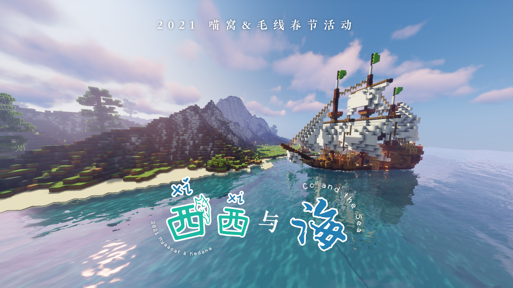

# 2021 年活动

## 2021 国庆节活动：快递员的一日假期 :id=national-day

> 关键词：休闲策略、开放世界、步行模拟  
本页依照[预告帖](https://community.craft.moe/d/2636)略有改动


又到了一年国庆假期，正在大家享受假期时光之时，喵毛通快递公司的员工们却迎来了史上最大的危机！没想到刚刚结束的买买镇年度购物狂欢节，竟然在这个假期迎来了快递派送的高峰期！面对堆积如山的包裹，喵毛通不得不召集所有员工临时加班派送。作为一名喵毛通的快递派送员，不可推卸的使命感使你挺身而出——当然，还有诱人的三倍加班费。

?> :clock3: **活动时间**

2021 年 10 月 2 日 20:00 — 3 日 23:00 (CST)

?> :game_die: **活动详情**

**基础设定：**冒险模式、无死亡掉落、无环境伤害

**玩法概述：**

- 玩家作为快递员，需要在小镇周边的三个快递仓库揽收快递，并按照快递上的地址投递。
- 快递仓库会不断补充待投放的包裹。
- 包裹送达后，可赚取若干【积分】与【金币】（数量因包裹而异）。  
  + 【积分】确定玩家的业务等级（最高十级），升级时奖励一定金币。等级将作为日后分红之依据。
  + 【金币】会打入“喵云金库”的账户；回到仓库取出后，可于小镇上的商人处，购买道具，辅助快递业务。
  + 配送距离超过 800 米的，报酬更多，最高 2.5 倍。
- 玩家之间可交换金币、道具等，甚至包裹（不建议）。

**运输限制：**

1. 玩家只可使用 9 个快捷栏和副手携带物品。
1. 快递包裹不可堆叠。
1. 携带的包裹重量每增加 1kg，移动速度减缓 1%。
1. 突发情况（例如雨天、偏离道路）亦可减缓派送效率。
1. 丢弃包裹会受到惩罚。

**参与方法：**活动期间，使用命令 `/server act` 进入活动服务器。

<details>
<summary>:earth_asia: 投递范围（点击展开）</summary>

- 如下图，活动地图“苗城”总占地约5000 x 5000，中心区域占地约1500 x 1500。
- 城市共划分为八个城区，每个城区细分为数个街道（办事处）。
- 三座快递仓库分别坐落于北都、南都、苗东新区。  
（地图很大，请耐心加载）


</details>
<br />
<details>
<summary>:truck: 投递全流程（点击展开）</summary>

| 步骤 | 详情 | 示意图 |
|-|-|-|
| ① | 每个快递仓库处摆放着三台“自助揽件终端”。<br />右键点击终端，打开揽件界面。 |  |
| ② | 在揽件界面浏览包裹，左键点击即取出之。<br />包裹上可查看目的地、重量等资料。 |  |
| ③ | 手持包裹按右键，可设置直达导航。<br />途中如落入深坑，以命令 `/ch unstuck` 脱困。 |  |
| ④ | 到达目的地，手持包裹按右键，即完成配送。 | |
| ⑤ | 使用命令 `/ch navigate` 以导航至随机一处仓库。 | |
| :tada: | 路途中可发现商人，购买“滑板鞋”等道具。 |  |

</details>
<br />

?> :gift: **年终分红**

年终分红内容：【奇异包裹 :package:】！

- 公司将统计已配送包裹的总数；每多派送 150 个，各快递员均多分得一个【奇异包裹】，不设上限。
- 各快递员按其业务等级获得提成：
  + 每升一级即分得两个【奇异包裹】；
  + 获颁纪念章，品质依等级而定。
- 积分名列前 20 者，将获额外分红（八个“奇异包裹”）。

纪念道具请见[此页](nyaa/items/activity-exclusive/2021-national-day)。

!> **注意事项**

1. 地图庞大，游玩时推荐结合地图、小地图插件和导航行进。
1. 请遵守职业道德，不要随意丢弃难以配送的包裹。
1. 为避免交通事故，请遵守当地交通规则，靠左行驶。
1. 所有快递均可通过路网正常送达，请勿作出翻越、渡水、逆行等危险行为。
1. 请适度游玩本活动，合理安排休息，切忌用肝过猛。

<br />
<details>
<summary>:construction_worker: 鸣谢名单</summary>

```
原地图：
“Carrdale” by pb618 (https://www.planetminecraft.com/project/carrdale-modern-british-city/)
（注：地图原设定为英国城市。活动使用的街道地址名称与原设定不同。）

插件开发：Takaranoao

活动制作：
Aqua_nano
Aqua_Rem
Echolake_
langua
PinkishRed
phoenixlzx
```

</details>

## 2021 中秋暨国庆活动：西西与海（复刻） :id=mid-autumn

> 本次基本照搬了[春节活动](#spring-fes)的内容，并略微做了改动。

- :clock3: **活动时间：**  
  2021 年 9 月 19 日 17:00 — 10 月 18 日 23:59 (CST)  
  （如“快递员的假期”正在举行，此活动将临时关闭）
- :game_die: **活动详情：**请见[春节活动](#spring-fes)。
- :gift: **活动奖励：**  
  视完成进度可在喵窝/毛线主服务器获得中间兑换物【大卷饼】；其可兑换活动限定道具。


- **参与方法：**活动期间，使用命令 `/server act2` 进入活动服务器。  
  注意，道具使用了定制材质；需提前开启“使用服务器资源包”，或手动加载[资源包](https://nyaacat-resourcepack.oss-accelerate.aliyuncs.com/2021springpack.zip)。


## 2021 夏日祭 :id=natsu-matsuri

> 本页依据Rem的[游玩指南](https://community.craft.moe/d/2475-2021)略有改动

一年一度的夏日祭暨“毛运会”如约而至！日程持续八天，更有各种支线活动等你报到。  

夏日祭日程安排：

| 活动 | 7/31 | 8/1 | 8/2 | 8/3 | 8/4 | 8/5 | 8/6 | 8/7 |
|-|-|-|-|-|-|-|-|-|
| **主线：**[买买镇！海洋与大地的馈赠。](https://community.craft.moe/d/2452) || 19:00起 | ✔ | ✔ | ✔ | ✔ | ✔ | 23:59止 |
| [买买镇！奇珍异宝突围战！](https://community.craft.moe/d/2459) | 19:30 ||| <span class="nw-explain" title="临时加场">19:30</span> |||||
| [世界飞行拉力赛 (WWR) 2021](nfs/fields#wwr2021) | 19:00起 | ✔ | ✔ | ✔ | ✔ | ✔ | ✔ | 23:59止 |
| [“毛运会”](https://community.craft.moe/d/2473-2021)开幕式、步行马拉松 ||| 19:30 ||||||
| “毛运会”[跑酷](nfs/fields#ksc2021) ||||| 19:30起 | ✔ | ✔ | 23:59止 |
| 关于天气预报被嘲笑<br />所以天气预报召唤了[史莱姆雨](https://community.craft.moe/d/2499)这件事 |||||| 19:30 |||
| “毛运会”击落擂台、闭幕式 ||||||| 19:30 ||

<details>
<summary>:construction_worker: 鸣谢名单（排名不分先后）</summary>

**『买买镇！奇珍异宝突围战！』工作人员：**
```
活动策划与制作：EchoLake_

地图建设人员：
Asakura_kukii
ChuXuan_Windy
Dubhe_ltq
crazy_bakedfish
KagurazakaKano
ToastBrand
Azur_Strasser
Fuyomks
hongling
PinkishRed
EchoLake_

活动顾问：
Aqua_Rem
langua

摸鱼顾问：PinkishRed
```

**『买买镇！奇珍异宝突围战！』工作人员：**
```
Aqua_nano
Aqua_Rem
```

**『WWR 2021』制作人员：**
```
Soyne
Yaolinger102
Asakura_kukii
Fangc
tony_teacher
Yukikaze_nya
rvasnkv
Tormentia
```

**“毛运会”工作人员：**
```
BlingWang
CinoHi
Ghost_wh1026
Lv_da
lyhyu__yi
KagurazakaKano
NAGISAKI_MINATO
Aqua_Milk
```

**『史莱姆雨』制作人员：**<span class="nw-spoiler">关于这个活动名字太长所以把你们俩做成了天气先生这件事</span>
```
PinkishRed
EchoLake_
```

</details>

## 2021劳动节活动：Adventurer Legends :id=labour-day

> 关键词：PVP、职业、小队、死斗  
本页依据[预告帖](https://community.craft.moe/d/2323)略有改动

没错！那个每年劳动节都会举办的 PVP 活动 —— Adventurer Legends “职业死斗”<span class="nw-spoiler">3.0</span>，它回来了！全新职业，全新技能，全新地图，以及全新的作战系统！

再一次集结吧，冒险家们！提升小队的默契程度，让自己变得更强，在这场战斗中脱颖而出吧！

:point_right: *往年死斗活动资料，可供参考：[2020](legacy/activities/2020#labour-day ':target=_blank') | [2019](legacy/activities/2019#labour-day ':target=_blank')*  

?> :gift: **REWARDS | 新奖励追加**

- **参与正式比赛的**，比赛结束时根据小队的总积分和排名，按一定比例获得活动兑换物奖励。奖励统一发送至各队长的邮箱，由队长自行分配。  
注意：正式比赛仅限于 5 月 1 日当晚。
- **参与娱乐赛的**，比赛结束后均获得参与奖。  
- 活动奖励在毛线和喵窝独立发放。
- 关于喵窝一侧的纪念品，详见[此页](nyaa/items/activity-exclusive/2021-labour-day)。

?> :clock3: **SCHEDULE | 活动日程**

**2021.5.1 下午 13:00-18:00 赛前练习**

+ 自由选择职业和组队
+ 熟悉场地、职业技能

**2021.5.1 晚上 19:30-22:00 正式比赛①②**

+ 19:30 - 20:00 比赛组队#1
+ 20:00 - 20:45 正式比赛#1
+ 20:45 - 21:15 比赛组队#2
+ 21:15 - 22:00 正式比赛#2
  - 正式比赛中，每个玩家只可属于一个队伍，每个队伍只可参赛一次。
  - 如第二场队伍过少，则允许部分已参赛第一场的队伍加入（再参赛者不计成绩）。

**2021.5.2 晚上 19:30-22:00 娱乐赛③④**

+ 19:30 - 20:00 比赛组队#3
+ 20:00 - 20:45 娱乐赛#3
+ 20:45 - 21:15 比赛组队#4
+ 21:15 - 22:00 娱乐赛#4（九人队）
  - 娱乐赛分数不计入排名奖励，玩家可任意组队加入。

?> :game_die: **DETAIL | 活动详情**

- **游戏基础设定：**  
冒险模式；饥饿值不扣减；无自动回复生命值；无死亡掉落；无队友伤害与摔落伤害。
- **玩法介绍：**
  + 每一个冒险者小队由 5 名玩家组成。玩家可在重装、输出、辅助等共 9 个职业当中自由选择；**队内同一职业不可重复选用**。
  + 比赛开始时，所有队伍被统一传送至战场内，进行死斗。
  + 阵亡后，等待片刻可传送至随机一名队友身边。若全队阵亡，则首先返回战场的将传送至随机地点。
  + 击杀敌人后，己方小队会获得积分，但自身会获得一级 **【嗜血诅咒】**减益。  
【嗜血诅咒】级数越高，击杀得分越多，但自身**生命值上限也越低**。  
如已累积**至少 5 级**【嗜血诅咒】——即连续击杀 5 人，自身会被高亮显示。  
自身死亡后，【嗜血诅咒】立即归零。
  + 比赛结束，按照**团队总积分**进行排名。
- **参与方法：**
  + 活动前，**推荐提前组队，推选出小队队长，并在论坛预报名。**也可现场组队，需在比赛当晚的指定时间内组建完成。每一小队仅包含 5 人。  
  （如不愿意参加PvP活动，在比赛期间，可使用观察者模式进行观战。）
  + **比赛前的组队时间内**，使用命令 `/server act` 进入活动服务器，即可组队并等待比赛开始。  
  如果迟到，除非已有队友预留位置，否则无法参赛；但可选择观战。
  + 活动结束时，按指令离开当前服务器。

<details>
<summary>:knife: “嗜血诅咒”效果、得分和生命值的联动（点击展开）</summary>

| 连杀数 | :heart: | 杀敌得分 |
|-|-|-|
| 刚复活时 | 40 | 1 |
| ★ | 38 | 1 |
| ★★ | 36 | 1 |
| ★★★ | 34 | 2 |
| ★★★★ | 30 | 2 |
| <span class="nw-important">★ x5</span> | 26 | 2 |
| <span class="nw-important">★ x6</span> | 20 | 3 |
| <span class="nw-important">★ x7</span> | 14 | 3 |
| <span class="nw-important">★ x8</span> | 10 | 4 |
| <span class="nw-important">★ x9</span> | 8 | 4 |
| <span class="nw-important">★ x10</span> | 6 | 5 |
| <span class="nw-important">★ x11</span> | 4 | 5 |
| <span class="nw-important">★ x12</span> | 3 | ? |

</details>
<br />
<details>
<summary>:construction_worker: 职业介绍（点击展开）</summary>

| 职业 | 属性 | 武器与伤害 | 被动技能 | 主技能 | 终极技能 |
|-|-|-|-|-|-|
| **瓦瑞尔·巨象** | 重装 | 喵的末路 (4) | ①<span class="nw-explain" title="每隔15秒，下一次攻击为自己恢复8点生命值">复苏之风</span><br />②<span class="nw-explain" title="武器持有能量时，额外获得伤害提升和减伤效果（攻击与受伤会消耗能量）">护盾喷涌</span> | ①<span class="nw-explain" title="（右键）跳跃并造成6点伤害【CD:8s】">战争践踏</span><br />②<span class="nw-explain" title="（潜行）自身无法攻击和行动，持续恢复生命值和能量，并为附近队友提供伤害减免">铁壳防御</span> | <span class="nw-explain" title="发射小型黑洞，聚集周围敌人到目标位置，持续5秒">重力喷涌</span> |
| **帕拉丁·吉塔** | 重装 | 圣剑 (4) | ①<span class="nw-explain" title="攻击大幅降低敌人的移动速度">震慑气场</span><br />②<span class="nw-explain" title="每一次攻击为周围20格内的友方治疗1点生命值">领袖气场</span> | ①<span class="nw-explain" title="（右键）对前方敌人造成6点伤害并拉向自己【CD:8s】">圣光束缚</span><br />②<span class="nw-explain" title="（潜行）给予一名队友持续8秒的临时护盾【CD:12s】">圣光庇佑</span> | <span class="nw-explain" title="治疗效果翻倍，给予周围20格内的所有友军移速和护盾，持续15s">圣光普照</span> |
| **格拉迪·φ特** | 重装 | 角斗士的终幕礼 (6) | ①<span class="nw-explain" title="连续攻击造成1.5倍伤害">压制</span><br />②<span class="nw-explain" title="攻击敌人时获得抗性提升">体质增强</span> | ①<span class="nw-explain" title="（右键）释放震荡波直线前进，造成8点伤害【CD:6s】">雄狮之牙</span><br />②<span class="nw-explain" title="（潜行）开启：攻击造成点燃和减速效果，但自身移动速度降低；关闭：提升移动速度">烈焰光环</span> | <span class="nw-explain" title="开启后，攻击造成范围伤害，且每次攻击恢复自身生命值，持续15s">决斗</span> |
| **阿彻·全藏** | 输出 | 翡翠之弩 (5)<br /><sup>（远程）</sup> | ①<span class="nw-explain" title="攻击命中头部造成150%伤害">正中靶心</span><br />②<span class="nw-explain" title="箭矢可穿透目标">一箭双卷卷</span><br />③<span class="nw-explain" title="箭矢命中后会返还；使用主技能可获得2支箭矢">无限弹药</span> | ①<span class="nw-explain" title="（左键）3秒内的攻击命中后造成小范围爆炸，造成8点伤害【CD:12s】">爆炸箭矢</span><br />②<span class="nw-explain" title="（潜行）向前进行一段位移【CD:10s】">健步如飞</span> | <span class="nw-explain" title="每次攻击释放一发追踪箭，额外造成3点伤害，持续15秒">扫射</span> |
| **杜姆·费斯特·鲁旦** | 输出 | <span class="nw-explain" title="（左键）发射环状子弹，造成3点伤害【CD:1s】【AMMO:3】">末日拳套 (3)</span><br /><sup>（远程）</sup> | ①<span class="nw-explain" title="命中敌人周期性获得4点护盾">最佳防守</span><br />②应激反应<sup>（见右）</sup> | ①<span class="nw-explain" title="（右键）向下前方跳跃，并造成8点伤害【CD:8s】">裂地拳</span><br />②<span class="nw-explain" title="（潜行）对前方敌人造成6点伤害并向上跃起，短暂滞空【CD:8s】">上勾拳</span><br />③<span class="nw-explain" title="（冲刺）受伤后的短时间内，向前冲刺造成4点伤害【CD:5s】">应激反应</span> | <span class="nw-explain" title="原地起飞并落地，对周围敌人造成12点伤害">毁天灭地</span> |
| **阿萨辛·拜格欸** | 输出 | 猎杀者匕首 (5) | ①<span class="nw-explain" title="脱离战斗2秒后进入隐身状态">遁入阴影</span><br />②<span class="nw-explain" title="击杀敌人后刷新全部技能冷却时间">蜻蜓点水</span><br />③<span class="nw-explain" title="背刺敌人时造成的伤害提升50%">趁虚而入</span> | ①<span class="nw-explain" title="（右键）向前挥砍造成3点伤害并使敌人中毒，持续5s【CD:8s】">淬毒</span><br />②<span class="nw-explain" title="（潜行）传送至目标身旁，并对目标敌人造成7点伤害【CD:16s】">怨鬼扑杀</span> | <span class="nw-explain" title="宣判一名敌方单位，持续5秒。5s内对方生命值一旦少于10点，即被击杀。5s后若对方仍存活，则献祭自身">断魂仪式</span> |
| **玛吉·麦迪文** | 输出 | 埃提耶什 (6)<br /><sup>（远程）</sup> | <span class="nw-explain" title="技能命中后，如3s内再次命中，则攻击力提升50%并恢复4点生命值">神秘攻击</span> | ①<span class="nw-explain" title="（右键）发射奥术裂隙对沿途敌人造成6点伤害，如果击中则缩短冷却时间5s【CD:6s】">奥术裂隙</span><br />②<span class="nw-explain" title="（左键）制造一组传送门，传送到指定目标，6秒内再次使用回到原地【CD:18s】">传送门</span><br />③<span class="nw-explain" title="（潜行）免疫所有伤害——受到伤害恢复生命值，持续3秒【CD:16s】">意志之力</span> | <span class="nw-explain" title="攻击造成3s束缚，持续15s">魔网封印</span> |
| **腐竹·不倦麒麟** | 辅助 | <span class="nw-explain" title="（左键）对指定位置的敌人造成3点伤害【CD:2s】">光明权杖 (3)</span><br /><sup>（远程）</sup> | <span class="nw-explain" title="生命值缓慢自动恢复">守护光环</span> | ①<span class="nw-explain" title="（右键）恢复指定位置的友军4点生命值【CD:1s】">治疗术</span><br />②<span class="nw-explain" title="（潜行）投掷一个治疗球造成10点伤害，并在4s内持续治疗所有玩家【CD:12s】">治疗之球</span> | <span class="nw-explain" title="开启后获得移速和跳跃提升，攻击提升100%，持续15s">女武神</span> |
| **刀客塔·诺娜** | 辅助 | <span class="nw-explain" title="（左键）发射练习用弹药，造成1点伤害【CD:1s】">PRTS 代理作战终端 (1)</span><br /><sup>（远程）</sup> | ①<span class="nw-explain" title="攻击造成小幅击退效果">别把它放进来！</span><br />②<span class="nw-explain" title="攻击造成“易伤”减益，持续3秒">莫得理智</span> | ①<span class="nw-explain" title="（左键）对面前敌人造成8点伤害，并失去4点生命值【CD:8s】">手撕</span><br />②<span class="nw-explain" title="（右键）投掷药剂治疗前方小范围所有友方4点生命值【CD:2s】">应急理智小样</span><br />③<span class="nw-explain" title="（潜行）一段时间内持续恢复周围20格的友方8点生命值【CD:12s】">应急理智合剂</span> | <span class="nw-explain" title="强化一名队友，令其攻击提升100%，并获得50%减伤，持续15s">应急理智顶液</span> |

</details>

!> **注意事项**

+ 参赛前请更新（或移除）客户端Optifine。
+ 本次活动非常不推荐独狼作战，请以团队优先。
+ PVP活动惯例，请关闭玩家雷达等一系列作弊性质的辅助工具。
+ 请保持良好的游戏心态。

?> :file_folder: **赛后统计数据**（非官方）

民间根据整局比赛产生的战报，制作了统计报表，以资参考。:point_right: [查看报表](https://docs.qq.com/sheet/DV0ZjbVlUZmpkdXBU) | [查看制作过程](https://gitee.com/bersella-ai/python-test-4)


---------

## 2021 喵窝&毛线春节活动【西西与海】 :id=spring-fes

> 关键词：RPG、打怪、探索、抽卡、肝肝肝  
本页依照[预告帖](https://community.craft.moe/d/2193)略有改动



<details>
<summary>:anchor: 西西船长的故事（点击展开）</summary>

> “……喵毛的冒险者们一次次怀着寻宝的梦想扬帆远航，却无一不迷失在暴风雨之中，之后就再也没了音讯。大家都说，这是一座被海之神守护着的宝岛，只有得到海之神认可的冒险家，才能够渡过风雨，登上这座岛屿……”
>
> “所以这就是西西船长带着船队冲进暴风雨，搞得大家最后在这里搁浅的理由？” 新加入的冒险者看着稚气未脱的西西船长，将信将疑。明明是西西船队的首次远航，却遭遇这样的意外，冒险者的情绪十分低落。
>
> 船队的其它成员想必也都没什么好心情，毕竟他们的一旁是那几艘被暴风雨一通蹂躏后，破烂不堪的船只。大多数船员也都无所事事地坐在岸边，只有两三个水手正在把物资一件一件搬到岸上。
>
> “哎，别这么说啊，出海哪能不碰到点意外呢。” 西西倒是一脸轻松的模样，“而且咱们的物资都在，稍微整顿整顿，很快就能启航了！”
>
> “启航… 可西西知道该往哪开吗？” 冒险者一语道出了当下最大的问题。
>
> 西西没有回话，露出了她那标志性的笑容，那是一种“一切都会好起来”的姿态。
>
> 随后，西西努力地爬上一边的箱子。
>
> “各位安静——！”
>
> 西西使出了全身的力气想引起船员们的注意，
>
> “我们的船队计划于一周后重新启航！在这段时间里，谁能在这座岛屿上找到最多的宝藏，回去之后我就会赠予他最为丰厚的奖励！”
>
> 空气突然安静了下来。数秒后，大家又开始各自发呆。尽管在座的冒险者们都是西西船长最忠实的追随者，但仿佛并没有人把西西的话当成一回事。冒险者看着西西一脸自信的样子，不禁叹了一口气。
>
> “这种地方，怎么可能会有宝藏嘛……”

</details>

在暴风雨中迷失方向，在一座神秘的岛屿搁浅——**击败了海上霸主凤凰卷船队的**新一代霸主西西船长遭遇了史上最大危机！然而在西西船长的号召下，大家却开始在这座岛屿上寻找宝藏？这究竟是美少女的直觉，还是作为船长的执念？带着重重疑问，冒险者们踏上了未知的寻宝旅程！

?> :clock3: **活动时间**

2021 年 2 月 11 日 14:00 (CST) — 2021 年 2 月 17 日 23:59 (CST)

?> :game_die: **活动详情**

**基础设定：**冒险模式、无死亡掉落、无限饥饿值、生命值缓慢回复

**玩法概述：**

- 本次活动为大型 RPG 活动。玩家作为冒险者，需要在**“辛塔卡拉岛”**上努力提升自己的战斗力，在完成主线剧情任务的同时，通过探索、战斗等方式收集尽可能多的“宝藏”。

**关于武器与防具：**

- 武器类型有分为近战武器、枪、法杖等类型。
- 开启**【武器补给箱】**，可获得随机品质、基础等级的武器。如重复获得相同武器，可通过**【精锻】**为其增加额外的效果。  
【武器补给箱】可以通过完成任务、探索世界得到的材料兑换获得。
- 可通过战斗收集**素材**，以提升武器等级，或兑换指定等级的**【防具补给箱】**，以应对更强大的怪物。  
【防具补给箱】可获取指定等级、随机部位的防具，且拥有随机的特殊效果。
- 多余武器和防具可被回收，返还一定数量的素材。
- 武器与防具均不设耐久值，且无使用消耗。

**关于怪物与掉落：**

- 在辛塔卡拉岛的各地有着不同的怪物刷新，包括**小怪、普通怪物、精英怪物与 BOSS**。<span class="nw-spoiler">其本质就是黑化怪</span>
- 【小怪与普通怪物】在全岛范围刷新；离出生点越远的，等级越高。掉落物包括防具兑换素材等。
- 【精英怪物】在岛内特定地点刷新；等级基本与当地小怪一致。战利品包括武器升级素材等。
- 【BOSS】则需玩家召唤。在城镇以外的区域使用指定召唤物即可。战胜后，其掉落各种素材以及“宝藏”。

**关于任务与探索：**

- 活动包括**主线任务和数个世界任务**。
  + 每个任务每位玩家仅可完成一次；多次完成不会结算奖励。
- 完成任务将可获得【小恶魔果实】、特殊道具、【武器补给箱】素材、武器强化素材、防具兑换素材等奖励。


- 同时，遍布辛塔卡拉岛的遗迹中埋藏着**各式的宝箱**。
  + 类似地，每位玩家只能对每个宝箱搜刮一次。
- 搜刮宝箱同样有机会获得“宝藏”和各类素材。

**参与方法：**活动期间，使用命令 `/server act` 进入活动服务器。

?> :gift: **活动奖励**

参与活动，即可获得中间兑换物**【小恶魔果实】**！奖励内容也相当[丰富](nyaa/items/activity-exclusive/2021-spring-festival)！

- 完成活动**主线剧情任务**，可获得**保底数量的**兑换物。
- **收集“宝藏”**可获得**额外**兑换物，且不设上限。

活动期间，参与者可随时联系管理组，申请统计兑换物数量；**每人仅可申请一次。**活动结束后，兑换物统一发送到喵窝/毛线主服务器的邮箱内。


!> **注意事项**

1. 本次活动有非喵窝/毛线服务器的玩家参与；相处时和野外刷怪时，请注意文明礼貌。
2. 玩家可自由组队，也可当独狼单刷。
3. 召唤 boss 时请远离玩家聚集性场所。
4. 为了他人的游戏体验，请不要将高等级的装备随意赠送。
6. 如遇到问题，可立即联系管理员处理。

---------

## 2021 元旦节活动 [卷卷大魔王的地狱试练] :id=new-year

> 本页依照[预告帖](https://community.craft.moe/d/2172)略有改动


> 由于毛线众人填平了卷卷大魔王心爱的繁花森林小水坑池塘，引发了卷卷大魔王的怒火。  
“我的繁花森林呢？我的小池塘呢？！”  
怒不可遏的卷卷大魔王打了个响指。  
“叭~ ”  
“你们都给我下地狱！”  
大家晕乎乎地睁开眼睛，眼前是一片鲜红的世界。  
（喵窝玩家：“嗯？为什么我也要下地狱？！”）

?> :clock3: **活动时间**

2021 年 1 月 1 日 14:00 (CST) — 2021 年 1 月 3 日 20:00 (CST)

?> :game_die: **活动详情**

- **游戏基础设定：**  
无法回到主世界的**地狱生存**，死亡不掉落。
- **玩法介绍：**
  + 在有限的时间内，尽量**控制自己的死亡次数**，并**完成尽可能多的活动成就**吧！  
（「活动成就」指所有可完成的**挑战与进度内 2021 元旦活动选项卡下的所有进度。**）
  + 完成挑战可以获得活动内的特殊兑换物。
  + 多试试与可爱的猪灵妹子交易，也许会获得惊喜，你也可以在出生点找到商人兑换一些有用的装备与道具。
  + 当你有了足够的勇气与末影龙一决高下，大魔王的使者可以帮助你跨越维度前往末地，但是你在末地停留的时间有限。
- **参与方法：**
  + 活动期间，使用命令 `/server act` 进入活动服务器。活动期间，活动服务器持续开放。

?> :gift: **活动奖励**

* 最终发放的活动奖励兑换物数量 = 活动分数 = 有效成就完成数量 × 奖励倍率 （向上取整）
* 奖励倍率 = 有效成就完成数量 ÷ 死亡次数 （最低 0.8，最高 1.5）

活动结束后，分数排名前 10 名的玩家将可以获得元旦活动特别奖励。  
奖励内容请见[这里](nyaa/items/activity-exclusive/2021-new-year)。
