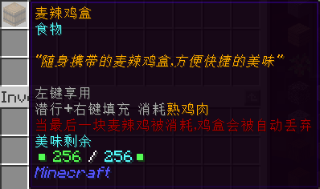
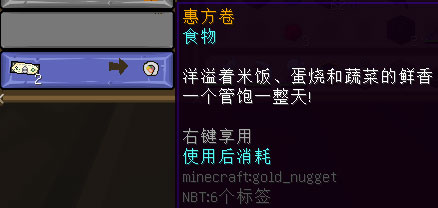
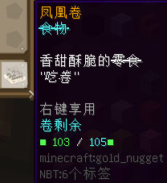
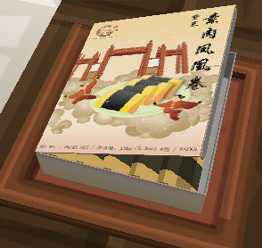
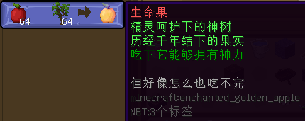

# 快捷食品
此页展示一些超越原版的快捷食品。

#### 麦辣鸡盒

- 【外形】木桶
- 【来源】Chef Steve（北溪台的望海潮麦当劳）
  + 兑换需绿宝石块 x4、熟鸡肉 x16
- 【最大容量】256 份
- 【是否可补充】是，需熟鸡肉
- **【作用】**
  + 左键使用，立即给予 4 点饥饿值与 6 点饱和度（最高叠加至 20）。
  + 注意：如若吃光，道具**会损毁**。

#### 铁板烧肉桶

- 【外形】木桶
- 【来源】Chef Steve（北溪台的望海潮麦当劳）
  + 兑换需绿宝石块 x4、牛排 x16
- 【最大容量】256 份
- 【是否可补充】是，需牛排
- **【作用】**
  + 左键使用，立即给予 5 点饥饿值与 10 点饱和度（最高叠加至 20）。
  + 注意：如若吃光，道具**会损毁**。

#### 惠方卷

  

- 【外形】定制材质
- 【来源】农协代理员 麻吉（千里田町的商业街）
  + 兑换需一元钞票 x2
- **一次性使用**
- 【作用】立即给予 20 分钟「饱和」效果。

#### 凤凰卷

  

- 【外形】定制材质
- 【来源】*凤凰卷* 的店铺
- 【最大容量】105 份
- 【是否可补充】否
- **【作用】**左键使用，立即给予 3 点饥饿值与 6 点饱和度（最高叠加至 20）。

--------

### 并没什么卯月的食物
#### 生命果

- 【外形】附魔金苹果
- 【来源】Chef Steve（北溪台的望海潮麦当劳）
  + 兑换需苹果 x64、橡树树苗 x64
- 无使用限制
- **【作用】**手持食用，“永远”也吞不掉。无其它效果。