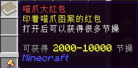
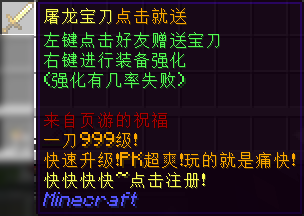

## 节庆用品

各种单纯用于节庆的用品。

### 喵爪红包

* 【外形】书
* 【物品类型】RPGItem
* **一次性道具**
* 【作用】
  * 主手持有，按右键使用，即获得 200 至 1000 不等的节操。所获节操从「系统余额」直接划扣。
* 【用途】
  * 用于在各种活动和节日向玩家派发节操。
  * 某些场合下可能会被管理组成员当作彩票大批量出售，达到喜闻乐见的效果。

### 喵爪大红包

* 【外形】书
* 【物品类型】RPGItem
* **一次性道具**
* 【作用】
  * 主手持有，按右键使用，即获得 2000 至 10000 不等的节操。同样从「系统余额」划扣。
* 【用途】
  * 与喵爪红包一致。

### 屠龙宝刀点击就送

* 【外形】金剑
* 【物品类型】RPGItem
* 无使用次数限制
* 【作用】
  * 主手持有，对准任意玩家左键使用，即可赠送该玩家一把该宝刀，同时扣除 100 节操（划扣到「系统余额」）。
  * 右键使用，脚下会出现绿色粒子，同时发出清脆的提示音。但是并没有什么用。
* 【用途】
  * 对其它玩家进行恶作剧。
  * 多位玩家可以互相合作，用它刷取金粒。 可能是最没有效率的刷金子方式。
