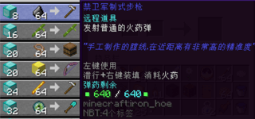
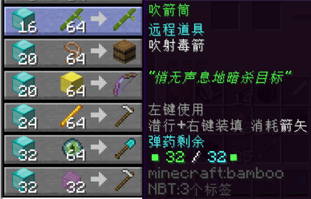
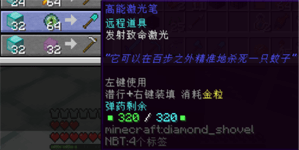
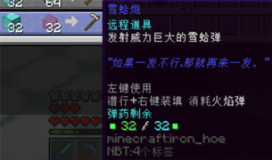
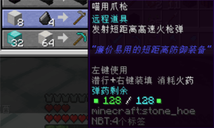

# 远程武器

以下道具皆由位于**柚木小镇**的游商NPC「狂野火枪手」提供。

#### 脉冲弓

- 【外形】弓，有附魔
- 【兑换需求】钻石块×20，金块×64
- 【最大能量值】1000
- 【是否可充能】是，需金锭
- **【作用】**
  + 对准目标，按右键稍微蓄力，发射脉冲电流。电流会直线穿行，对直线内的目标各造成**10点（:heart:×5）基础伤害**。
  + 有时会对单一目标瞬间暴击，产生**20点（:heart:×10）伤害**。
  + 电流在约0.2秒内前行约20米；当超出该距离或者遇障碍物，会向随机方向折射，折射后伤害不减。总计可折射两次。

#### 禁卫军制式步枪

- 【外形】铁锄
- 【兑换需求】钻石块×8，燧石×64
- 【最大能量值】640
- 【是否可充能】是，需火药
- **【作用】**待补充

#### 吹箭筒

- 【外形】竹子
- 【兑换需求】钻石块×16，竹子×64
- 【最大能量值】32
- 【是否可充能】是，需箭
- **【作用】**待补充

#### 暴雨箭发射器

- 【外形】木桶
- 【兑换需求】钻石块×20，栓绳×64
- 【最大能量值】640
- 【是否可充能】是，需箭
- **【作用】**待补充

#### 双发猎枪

- 【外形】铁锄
- 【兑换需求】钻石块×24，烈焰棒×64
- 【最大能量值】32
- 【是否可充能】是，需金粒
- **【作用】**待补充

#### 高能激光笔

- 【外形】铁锄
- 【兑换需求】钻石块×32，末影之眼×64
- 【最大能量值】320
- 【是否可充能】是，需金粒
- **【作用】**待补充

#### 雪蛤炮

- 【外形】铁锄
- 【兑换需求】钻石块×32，潜影壳×32
- 【最大能量值】32
- 【是否可充能】是，需火焰弹
- **【作用】**待补充

#### 龙息火炮

- 【外形】龙首
- 【兑换需求】龙蛋x1，龙首x1
- 【最大能量值】64
- 【是否可充能】是，需龙息
- **【作用】**待补充

#### 喵用爪枪

- 【外形】石锄
- 【兑换需求】铁块x8，燧石x4
- 【最大能量值】128
- 【是否可充能】是，需火药
- **【作用】**待补充

#### 电子爆发枪

- 【外形】钻石镐
- 【兑换需求】钻石块x32，堑制石英块x64
- 【最大能量值】640
- 【是否可充能】是，需青金石
- **【作用】**待补充