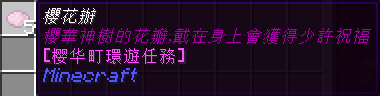

# 月常环游任务

!> 此页面介绍的是喵窝在更新至 Minecraft 1.14 版本以前的设定；**以下内容已完全过时，仅用作考古之用。**  

**月常环游任务** 是一项通过引导玩家寻找特定的 NPC、完成特定的任务，使玩家充分了解喵窝世界的计划。

## 启动条件

当玩家的每月在线时间达到 5 小时，即可领取启动任务的中间兑换物「樱花瓣」。

然后，前往樱华町「樱华神树」兑换第一本任务书，即可根据任务书的内容，开始进行任务。

当一轮任务结束时，玩家将获得「齿樱」系列近战武器中的一款（视任务分支而异）。

## 任务分支

截至下线前，月常环游任务共有 4 条分支：

- 第一章「梅雨季的[樱华町](nyaa/realms/sakurakacho)」
  + 东城区域篇「东之幻」（[阿库亚斯](nyaa/realms/aquas)）
  + 西城区域篇「西之刃」（[柚木小镇](nyaa/realms/yuzuki)）
  + 南城区域篇「南之护」（[浪花町](nyaa/realms/naniwa)）
  + 北城区域篇「北之术」（[北风城](nyaa/realms/northwind)）

## 历史

| 时间 | 描述 |
| - | - |
| 2017-03-20 | 月常环游任务 [诞生](https://bbs.nyaa.cat/d/949)。 第一章「梅雨季的樱华町」上线。 |
| 2017-03-25 | 西城区域篇「西之刃」上线。 |
| 2017-04-01 | 南城区域篇「南之护」上线。 |
| 2018-03-14 | 北城区域篇「北之术」上线。 |
| 2018-05-09 | 东城区域篇「东之幻」上线。 |
| 2019-09-20 | 服务器升级至 Minecraft 1.14.4，所有 NPC 被移除**（包括月常环游任务所涉 NPC）**。 |
| 2020-03-02 | 「樱花辦」物品不再发放。 |
| 2020-? | 「齿樱」系列近战武器在 [无尽地狱世界](legacy/inf) 有了复刻版。 |
