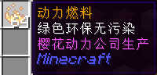

# 飞行之书

2016 年 11 月 28 日 01 时 18 分，伴随樱花动力 (SAKURA DYNAMICS) 的又一次科技突破，新型超改良飞行燃料正式民用化，此刻喵窝进入了历史新纪元——飞行时代。

## 动力燃料发展历史

自 Minecraft 1.9 以来，在凤凰君以及其他 OP 的推动下，鞘翅从「来自末地稀有的战利品」变成家户户的日常出行道具。随后一座座飞行塔矗立在喵窝的世界各地，飞行赶路开始初步在喵民中普及。但是，鞘翅自身并没有动力，因此：

1. 即使通过飞行塔开始飞行，也无法前进非常远。
2. 飞行过程必须格外小心，如果不慎坠落野外（特别是海里），想要继续前行是很困难的。

为了解决喵民们的实际困难，2016 年 9 月 4 日，樱花动力公司[发布了首款动力燃料](https://bbs.nyaa.cat/d/586)。

  
<small>最早的动力燃料。</small>

最早的试做型飞行燃料因消耗大、可控性差、大量占用背包空间以及售价昂贵，使得其不受喵窝众欢迎。多次调整后，樱花动力公司推出了全新的改良产品——飞行燃料胶囊。

### 变革的开始

「飞行燃料胶囊」首次出现时是胶囊形式，但因为当时技术不成熟会出现多倍消耗的问题，樱花集团卷社长立刻提出全面召回胶囊燃料并提供了新的瓶装液态版动力燃料。此后这些燃料瓶开始融入了我们的生活。

<!-- TODO: 添加瓶装动力燃料胶囊图片 -->

这个版本的飞行燃料采用水冷凝压缩技术，加工过程中必须消耗 3 个铁锭（装水），获得压缩燃料。然后我们可以结合 4 枚 MC 科技中的红石能量块和 4 枚压缩燃料加工出轻型动力燃料，也可以使用来自黑暗世界的草莓果酱蛋糕中的高能粉妆提取物和 17 枚压缩燃料加工出重型动力燃料。轻型动力燃料的工艺非常成熟能够无损失的保持 512 份基础燃料的当量，而重型动力燃料因为高能粉妆提取物会降低燃料内 4S 活化物的原有活性，使得其效能大致降为 2048 份基础燃料的当量。

这个时期的燃料采用液态瓶装，所以也有不要命的人曾试图饮用燃料。不过樱花动力公司的 CL. iny 研发总监早已考虑过了这个问题，所以当燃料喝下后不会被身体吸收，且藉由人体的排泄系统，燃料会自然排出体外。所以说，这是真正做到无毒、安全、绿色、环保的新型燃料。

### 一切为了用户

2016 年 12 月 25 日上午 10:40，樱花公司官方发言人 P.Nemo 广播通告「燃料改进完成」一事，现在燃料独立防伪码技术，有效抵制了 zoor、vzv 这些民间作坊生产的不合格动力燃料，同时解决了燃料胶囊早期的多倍消耗问题，并加入兑换卷机制，极大的便于储藏。需要兑换时只要一挥手，喵窝最快的光速投递小队就会在下一个瞬间发生前将燃料送至你的手中。

  
<small>现代的动力燃料胶囊。</small>

现在开始，樱花动力公司出品的动力胶囊淘汰了上一批的液态瓶装，正式开始使用全新的胶囊包装。轻型绿装和重型粉装。

### 有机遇，就有竞争

「MA-jon 科技」不久之后也推出了他们的飞行辅助用品——火箭烟花，不过掌握燃料行业核心技术的樱花动力公司并未受其影响，于 2017 年 1 月 10 日下午 3 时同期推出了再改良型动力燃料，在兼顾了火箭烟花的高机动性能的同时，加入了 shift 阀门，可以随时打开关闭燃料系统，进而使得飞行过程更加灵活。同时火箭烟花因缺少压缩技术，使得其携带部分体验非常糟糕，这一点至今难以企及樱花动力燃料。

### 改进，从未停止

2017 年 2 月初，樱花动力公司已完全掌握浮冰快速冷凝技术，现在我们不再需要浪费昂贵的金属资源来加工压缩燃料，只需要两块浮冰。

2020 年，樱花动力公司拥有了高效、精简的燃料生产配方，只需要火药、金锭和钻石。

***

在喵窝大典 (wiki) 中有虽有收录 NFMC (喵窝飞行家里程俱乐部) 条目的部分，但其中的内容侧重点在于飞行与喵窝的关系，关于飞行本身的信息则很少。现喵窝进入了历史新纪元，我们可以重提这门古老的技术，整理它的历史，并总结实际经验来交流学习。
