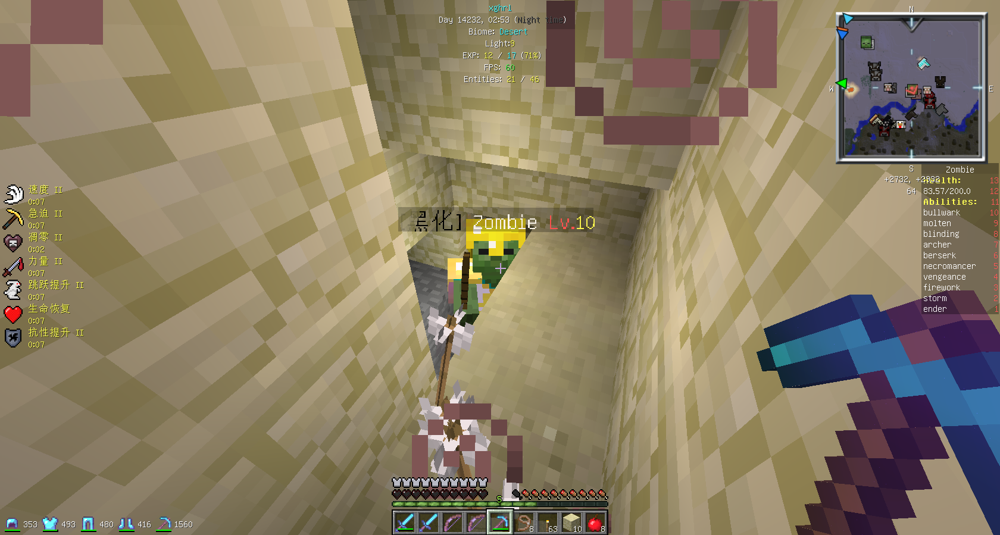

# 黑化怪（1.13 以前）

!> 此页面介绍的是喵窝在更新至 Minecraft 1.13 版本以前的黑化怪；**以下内容已完全过时，仅用作考古之用。**  
关于现在的黑化怪相关信息，请见 [无尽地狱世界](inf/index)。

> 入夜，不仅是视觉上的黑暗，无形的恐怖正在慢慢降临……
>
> 咳咳上面请别在意。当夜幕降临时，和原版生存类似，玩家周围会刷新出主动型生物，它们包括蜘蛛、骷髅、僵尸，以及臭名昭著的苦力怕（Creeper）。玩家可以通过击杀它们~~使自己变得节操满满获得灵梦的芳心，~~收取只能从怪物身上获得的材料，如骨头、腐肉、火药等。
>
> 然而这个世界并不美好。EpicWorld 世界不仅会出现这些杂鱼，还会刷出 boss 级怪物，称为『黑化怪』。根据设定，离出生点越远，黑化怪等级越高。当有黑化怪出现时，该怪物周围会有火星（也有可能是岩浆或者彩色漩涡等不同的粒子效果）到处飘动，并头顶 `[黑化]<怪物名> Lv.<等级>` 的字样，不过玩家过于远离时没有足够的粒子效果会和普通怪物显示无异。当距离足够近时，十字标指向该怪物时会在右侧显示怪物技能列表，在上方和右侧显示怪物的血量。
>
> 注意，有些黑化怪具有隐身技能，此时他们并不会显示在画面中，或者您只会看到漂浮在空中的盔甲、武器、药水或发亮的红色蜘蛛眼。距离足够近时，怪物技能列表仍会显示。
>
> 通常的建议是避开这种棘手的怪物，最简单的办法就是 `/home`。如果玩家的装备足够好，有信心和其一战的话，击杀黑化怪物会有稀有道具掉落，包括品质优良的武器防具，高质量的附魔书，以及某些玩家的终极梦想——贤者之石。
>
> 所以勇敢地战斗吧少年们，胜利的曙光~~满满的节操~~就在前方！

## 怪物能力

黑化怪物会在右侧列表表顶显示等级，等级越高一般 HP 越多，并且带有的特殊能力也越多。关于黑化怪可能拥有的技能以及他们的描述，戳 [这里](https://web.archive.org/web/20170704172109/https://wiki.nyaa.cat/%E7%8E%A9%E5%AE%B6%E7%A9%BA%E9%97%B4:%E9%99%A4%E9%AD%94)。

<small>一只典型的黑化怪（2014 年截取，但实际效果从未发生变化）</small>

## 装备与盔甲

要战胜黑化怪，强大的装备与盔甲必不可少。喵窝超出原版游戏范畴的武器由以下几类组成：

* 附魔等级、加成高于原版上限的物品
* 带有 CustomEnchantment 附魔的物品
  - 可以实现一些原版没有的附魔（例如向被攻击者赋予凋零状态）。
  - CustomEnchantment 插件本身是允许玩家自由往物品添加自定义附魔的，但喵窝没有向玩家开放相应权限。因此，具有相应附魔的物品是非常有价值的。
* RPGItem 物品

通常情况下，玩家可以通过以下渠道获得它们：

* 怪物直接掉落
* 通过怪物掉落的特定兑换（中间）物，在喵窝主世界寻找 NPC 进行兑换
* 通过不同的节日活动
* 市场交易
* ~~管理组成员的滥权~~

## 游戏事件

### 血月

[血月](https://web.archive.org/web/20170704144800/https://wiki.nyaa.cat/%E7%8E%A9%E5%AE%B6%E7%A9%BA%E9%97%B4:%E6%94%BB%E7%95%A5:%E8%A1%80%E6%9C%88) 是在黑化世界中怪物怨念聚集达到一定程度时会发生的异变现象，在一段随机时间内会出现。发生时的标记为出现 `The blood moon is rising...` 字样的公告。然而由于玩家的力量过于强大，怪物们泄愤的血月一般会变成玩家收获高级装备的『战斗嘉年华』。

## 历史

由于 1.13 以前的黑化怪与喵窝主世界设定耦合性极高，这里只介绍对黑化怪这一玩法的调整。完整的更新内容请见 [更新日志](/changelog)。

| 时间 | 描述 |
| - | - |
| 2014-? | 喵窝主世界拥有了黑化怪。 |
| 2014-09-20 | 调整了黑化怪的生成率和装备池。 |
| 2014-11-26 | 主世界不再生成黑化怪，取而代之的是 EpicWorld。 |
| 2015-02-22 | 喵窝升级到 1.8.0，黑化怪暂停生成。后于 4 月 29 日恢复。 |
| 2015-07-14 | 黑化怪生成机率提高，技能更多。 |
| 2015-07-15 | 喵窝开始维护自己的 [RPGItems 分支](https://github.com/NyaaCat/RPGItems-reloaded)。 |
| 2015-08-15 | 现在又可以显示黑化技能和血量了。 变更黑化生成方式：距离出生点越远，黑化等级越高。 创造模式的玩家击杀黑化将不会得到掉落。 部分高难度黑化技能恢复。 |
| 2015-? | 黑化怪现在会在 S 世界生成。 |
| 2015-? | 十六进制宝石装备发布。 |
| 2016-02-06 | MythicDrops 插件下线，所有宝石掉落被移除，相应宝石失效。 |
| 2016-03-08 | [若干重大调整。](https://bbs.nyaa.cat/d/284) |
| 2016-04-03 | 精英怪插件配置微调，加入新技能和新物品掉落。 |
| 2016-06-30 | 增加了技能插件。 S 世界被重置。 |
| 2016-08 | NyaaUtils 上线。 掉落物保护上线。 现在可以自助完成物品的材料修复与附魔了。 [技能插件下线。](https://bbs.nyaa.cat/d/552) |
| 2016-10 | 由于突如其来的性能问题，S 世界被重置。 玩家在 S 世界以外的其它世界不会再收到黑化击杀广播了。 |
| 2016-11-28 | [自动化血月上线。](https://bbs.nyaa.cat/d/730) |
| 2017-01 | S 世界被 EpicWorld 世界取代，同时兼顾资源世界功能。 [中间兑换物「月芒符卡」上线。](https://bbs.nyaa.cat/d/876) |
| 2017-05-03 | 重置了 EpicWorld。 |
| 2017-05-17 | 喵窝开始维护自己的 [InfernalMobs 分支](https://github.com/NyaaCat/InfernalMobs)。 |
| 2017-06-25 | 喵窝升级到 1.12。 SignShop 下线，北方主城（现北风城）不再以固定价格回收部分黑化掉落物。 |
| 2017-11-19 | 发布了六种功能各异的魔杖。 |
| 2017-12-18 | 掉落物保护有了更加灵活的选项。 InfernalMobs 完成了重构，提升了性能与游戏体验。 血月可以通过 `/back` 重新加入了。 |
| 2018-02 | 十六进制宝石装备有了它们对应的强化版本。 |
| 2018-02-24 | 将黑化怪玩法分离到其它服务器的 [提案](https://bbs.nyaa.cat/d/1246) 被发起，引发了热烈的讨论。 |
| 2018-07-07 | 原黑化怪最后一次较大 [更新](changelog?id=_2018-7-7-【黑化设定更新，掉落分布更新】)，调整了多个参数。 |
| 2018-11-08 | 喵窝升级到 1.13.2，InfernalMobs 插件下线。 EpicWorld 被重置为原版 1.13.x 地形。 |
| 2018-12-29 | 黑化怪玩法在一个独立服务器中进行，也就是现在的 [无尽地狱世界](inf/index)。 |
| 2019-09-20 | 喵窝升级到 1.14.4。 CustomEnchantment 插件下线，RPGItem 原有道具数据被移除； 这使得原有的黑化怪道具和盔甲几乎全部失效。 同时，所有 NPC 被移除。 |
| 2020-01-31 | 确认了相关黑化怪失效物品 [可以被申请更换新版](https://bbs.nyaa.cat/d/1519/3)。 |
| 2020-02-06 | 无尽地狱世界成为喵窝主服务器的一部分。 部分原有黑化怪道具陆续得到了 OTA 升级，可在新的 [无尽地狱世界](inf/index) 发挥作用。 |