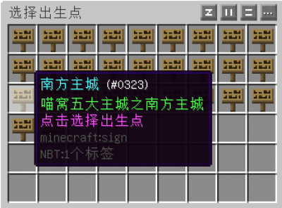
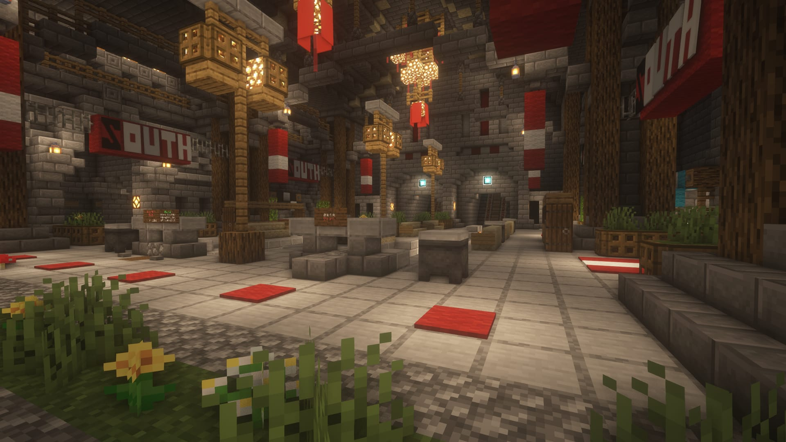

# 新人指南

*最后更新：{docsify-updated}*

本指南旨在为新玩家提供一个简洁明了、能够快速上手喵窝服务器的指南。请注意该指南可能会随着游戏设定而改变，欢迎玩家们在保持简单、简洁的原则上完善本页面。

## 关于 Minecraft

NyaaWiki **并不是** 针对《Minecraft》游戏的指南和知识库，它是针对 NyaaCat 社区和喵窝服务器的指南、手册和知识库系统。如果希望获得关于 Minecraft 游戏本身的信息，请访问：

* [中文 Minecraft Wiki](https://minecraft-zh.gamepedia.com/)
  - 如果在中国内地，可访问此 [镜像站](https://wiki.biligame.com/mc)
* [英文 Minecraft Wiki](http://minecraft.gamepedia.com/Minecraft_Wiki)

如果你是第一次玩 Minecraft，请首先参考官方 Wiki 的[《菜鸟手册》](https://minecraft-zh.gamepedia.com/%E6%95%99%E7%A8%8B/%E8%8F%9C%E9%B8%9F%E6%89%8B%E5%86%8C)（或者[内地镜像站页面](https://wiki.biligame.com/mc/%E6%95%99%E7%A8%8B/%E8%8F%9C%E9%B8%9F%E6%89%8B%E5%86%8C)）。

如果你之前没有在其它正版 Java 版服务器游玩的经历，请务必确认你使用的是 [Java 版客户端](https://minecraft-zh.gamepedia.com/Java%E7%89%88)，并通过**在 minecraft.net 注册和激活的账号**登录游戏。  
[基岩版](https://minecraft-zh.gamepedia.com/%E5%9F%BA%E5%B2%A9%E7%89%88)、[网易（中国）版](https://mc.163.com/) 等其它版本均不受支持。

- - -

## 入服准备

**如果还没提交申请，请先阅读 [新玩家申请](wiki/whitelist-application.md) 后提交申请。**

收到欢迎信时就可以进入服务器开始游戏了。但是为了确保最佳的游戏和社区体验，请先考虑以下步骤——

### 不要做隐身人

戳 [玩家群组](wiki/groups.md) 页面，加入合适的群，进而联系管理组加入 Telegram 等其它内部群组。  
IRC、Telegram 群组和游戏聊天频道互通，请注意不要刷屏。

即便不加入任何群组，管理组依然会在有重大更新或通知时，向你申请时留下的邮箱发送邮件。为确保邮件送达，宜将 `noreply@mail.nyaa.cat` 加入联系人列表。  
如需寻求管理组的帮助，可向 `owo@nyaa.cat` 发送邮件。

### 准备好客户端 :id=prepare-client

关于客户端，你仅需确保，使用的版本和服务器**完全匹配**。 
插件方面不作硬性要求。如希望使用辅助插件，但不善于安装，可在 [推荐资源](wiki/resources.md) 处获取客户端整合包。

添加服务器时，请首先尝试使用地址 `play.nyaacat.com`，并将「服务器资源包」选项设为**询问**。

?> :information_source: **小贴士**

- 添加后，服务器信息右上角将可提示**连接质量（延迟）**。  
如发现延迟较高（中国大陆约为 2\~60 ms，海外约为 40\~280 ms），请从 [首页](/) 选择其它地址尝试。  
- 如出现「无法解析」、「Unknown host」等提示，请多刷新几次。  
- 在“信号”标志稳定为绿色之前，不要尝试登录。如等待超过三分钟，应重启游戏。

### 阅读游戏规则

登录之前，请务必再次阅读[游戏规则](wiki/rules.md)。如仍有疑虑，可在玩家群组内、或进入游戏询问。

这里死亡掉落！<code>/back</code>、<code>/home</code> 命令扣款！<code>/suicide</code> 也扣款！ 
重要的事情讲过三遍了！  
把从其他服务器带过来的旧习惯改掉！  
~（粗心的编者被拖出去鞭尸）~

- - -

## Hello, world!

当你初来乍到时，服务器内也许人声鼎沸，也许稀稀疏疏，也许空无一人。但是不论何种情况，我们都希望，你能通过这份指南快速上手。

### 新星的诞生 :id=hello-world

初次亮相的你会首先来到[大神殿](nyaa/realms/sakurakacho "即樱华町")。跟窝里的各位打个招呼吧！

*（是的，就像这样）*

选择**出生点（即 spawn 点）**的传送门会自动启动，它看起来像这样：

如果你未作出选择而将其关闭，或者其没有自动开启；则可重新登录喵窝，或键入命令 `/town select` 开始选择。

选择前，可先浏览 [城镇村落总览](nyaa/realms.md) ，挑选心仪之处。  

?> :information_source: **小贴士**
- 如希望加入较活跃的聚落，目前可以考虑：**北溪台、北风城、琥珀川（北沼）、阿库亚斯**。  
  其中，北风城与阿库亚斯作为大城市，拥有 NPC 兑换点、交通等独家便利。
- 新建成的聚落：**乌木镇、雾雨港**等，也值得一试。
- 当下，对于其它聚落，本文编者**不保证**有人接应，请慎重选择。

选中一处聚落，你将被立即传送到那里，而 `/spawn` 命令也会回到此处（免费!）。当然，你仍可选择其它村落，只不过要花点小钱。

### 白手起家 :id=start-from-scratch

也许你选择了繁华的大都市，抑或是娴静的滨海小镇。你在喵窝的生涯就此正式开幕。

大部分聚落都为玩家提供了居民区。有些会提供现成的房屋，但是限制颇多；有些则会规划地块，供玩家建造融入当地特色的建筑。  
在公共规划区，如有规划好的居民区空地，一般无需申请即可占用。提供成品房的，需使用游戏币（节操）向管理组购买。详情如下：

* 北风城：提供自建区（第一、第二、第三居民区）和少量套房
* 浪花町：神楽町（一期）、长乐町（二期）
* 柚木小镇：~~北部提供自建区~~，其余为成品房（需购买）
* 阿库亚斯：[提供现成住宅及自建区](nyaa/realms/aquas.md)
* 樱华町：[提供现成住宅](https://bbs.nyaa.cat/d/1714)与自建区。*注意：成品房购置门槛较高。*
* 新北市：*不建议入住，请遵从居委会安排*
* 像素村、科技特区、月耀城等：*不可入住*

如果来到散布世界各地的村落，一些热心的村长会给予前来定居的玩家一定的补贴。建造时请**遵守当地的要求或规划**。如有不明之处，请联系村落的负责人，或者**加入该聚落的交流群**——不少聚落皆已成立居委会，他们会手把手协助你依规定居。  
一些村落可能已经很久无人活跃了。这种情况下，切忌贸然入住。

又或者，向往宁静喜欢独居的你会在野外找到了一片花海。喵窝世界如此之大，必会找到你所喜爱的居所。

自己温馨的小窝装修完成之后，可以邀请大家来参观。当然如果手艺尚待提升，也没有关系，可以在交流中学习更多姿势嘛～别忘了摆张床，睡一觉，设个家。

?> :information_source: 每当进入某个聚落，服务器会提示该聚落名称，以及管理者（如有）。请善用此提示。

### 今天吃什么 :id=first-dinner

游荡在外，吃饱很重要。在樱华町南边的守望之田，采摘麦子，享用第一餐。东边的万华街亦可能有“福利箱”无偿提供食物。  
如果你在其它聚落，可寻找明确向公众开放的农田、牧场。实在没办法了，输入命令`/espawn`（免费!），樱华町随时欢迎你。

### 当心天上的幽灵 :id=watch-phantoms

小心幻翼！如果你超过一小时（三个游戏日）未曾休息，却还在夜空下撒欢，它们便会不期而至，破坏你的派对。  
**良好的作息**（甚至只需躺上一两秒）是最好的预防措施。如不具备躺床条件，晚上可以找个屋檐躲躲，或者不停赶路（至少要比疾跑快）。

?> :heavy_check_mark: **随身带床是个不错的习惯。**

?> :heavy_check_mark: 樱华町全境**不会**生成怪物。相当安全。

### 采集资源去哪里 :id=mining

遇到心仪的城市，梦想的居所，但是看看口袋，没有足够的节操设置家，翻翻背包，也没有木材石材建造房屋。于是不禁慨叹人生如此艰难，然而贸然抱怨和伸手只会导致大家对你的好感度急剧下降。自力更生需要采集木材矿产，但是在规划整齐美观的村落中，去哪挖呢——

* 万华街的藏宝箱——萌新福利和实用战利品
*   聚落规划的林场（木材）——记得补种！
*   *主世界荒野（木材、矿石）——不推荐*
  - 对于**可再生**资源，可自行制造，尽可能避免破坏自然环境。
*   三个[资源世界](nyaa/worlds)（木材、石料、矿产等）
*   [科技特区](nyaa/realms/hitech-industries.md)（部分工业制成品）

**如对于某处可否采掘仍有疑虑，可询问其他伙伴。切忌贸然动手。**

在主世界挖掘时请注意：如挖进了聚落领域，或者不慎挖进了他人的地下设施，请原样修补并避开该处。无力修补的，应联系相关方面或管理组协助。

!> 尽量避免跑图——窝里资源过剩，跑图收益已微乎其微，反而会拖累服务器性能。

### 每个节操都要精打细算 :id=earning

**「节操」**是这里的硬通货。初来乍到，服务器娘首先会赠送 450 节操，作为礼物。

看上去不少，是吧？但其实逛商店、打命令多了，一不小心就会花光。多读读[规则](nyaa/economic.md "世界经济规则")，认真规划将来如何花费、如何赚钱。  
**贴士：**随时使用命令 `/bal` 打开你的钱包。

要是实在止不住自己的手，两下败光了，怎么办？  
_**『肝爆！开店！』**_

[万华街](nyaa/realms/sakurakacho.md#商业：万华街 "点击了解入驻规则")是目前全喵窝最大、最活跃的商业街，没有之一，玩家们皆可享受最上佳的购物乐趣。你的第一桶金，在这等着你！   
找个空铺面，打下[商店木牌](tutorial/plugins/hamsterecohelper?id=木牌商店 "牌子商店")，这就是你的第一家商店。接下来如何经营，全靠你的本事！  
**想去其它城镇购物、开分店？**多关注下其介绍！

如果你有珍贵、或大热门物品待售，而自家店面不易被发现，不妨考虑[天喵商城](tutorial/plugins/hamsterecohelper?id=世界商店 "世界商店")！上天喵，秒（拍）到你说好！  
输入命令 `/hm` 即可访问天喵，百种热门商品，满足你的不时之需！

当然生意总是细水长流。如果你需要一大笔启动资金，不妨了解一下[创造激励计划](nyaa/creation.md)，或寻找任务发布栏、询问在线玩家等，认领、完成各种工程任务来赚取大笔资财。

### 你是特别的 :id=customizing

喵窝世界中的大家都有花花绿绿的称号。别眼馋了，你也可以有！

*   查看样式代码 `/nu format`
*   更改前缀 `/nu prefix [前缀]` 例如 `/nu prefix &a&l&n&o我是前缀`
*   更改后缀 `/nu suffix [后缀]` 例如 `/nu suffix &#66ccff我是后缀`
*   更改昵称 `/nick [昵称]`
  - 此昵称会覆盖游戏 ID 显示，但不影响之。

更改前后缀需要一定的节操和经验，详情见 [NyaaUtils 插件指南](tutorial/plugins/nyaautils.md#更改前后缀、昵称)。

如果你精于滑翔，想必获得鞘翅便迫不及待地穿上。那为何不试试定制你的[飞行轨迹](tutorial/plugins/nyaautils/particle.md)？华丽的姿态、娴熟的技巧，BEST MATCH！（自己身上也能冒粒子！）

* * *

## 世界那么大，我想去看看

喵窝的交通十分发达，玩家可以选择合适的方式出行。

#### ①主世界铁路 
便捷指数：★★★  
观赏指数：★★★★★  
费用：零

👍强烈推荐！喵窝在多年发展中，建成了四通八达的铁路网。尽管如今玩家出行不再依赖铁路，但沿途领略景色、下车游行探索，仍是新老玩家的一大乐趣；甚至还有老玩家绘制了[线路图](tutorial/map-navi/railway-universal-Bersella)。

?> :information_source: **需要注意的地方**
- 各车站的出发方式有所不同。以樱华町车站为例，铁轨起点已经摆好矿车，只需坐上即可出发（小心，车上悬着绊线，不要碰到）；而其它站点则需自行弹射、或自备矿车。
- 行车中途请勿下车。
- 路上或有动物挡住去路，可自行驱赶。
- 到站后，如矿车未被自动回收，请自行收走。

#### ②传送命令
便捷指数：★★★★★  
观赏指数：N/A  
费用：收费标准各异

目前，可利用 `/home` `/back` 等命令快速回家或回到上个地点。如果要最快地穿梭于各聚落，“设置出生点” `/town select` 同样可以胜任！不过，它们都是[有偿使用](nyaa/economic.md#即时传送)的，平时要省着点用。

#### ③鞘翅飞行 
便捷指数：★★★★★  
观赏指数：★★★  
费用：基本免费

话说在管理组的推动下，鞘翅从“来自末地稀有的战利品”变成家户户的日常出行道具。随后一座座飞行塔矗立在喵窝的世界各地。飞行赶路成为喵窝出行的手段之一。赚取足够的节操入手一双鞘翅，并在喵窝的世界翱翔吧！  
然而，原版鞘翅飞行满足不了你自由翱翔的愿望？这不是问题！由*樱花动力公司* 推出的**动力燃料**，输出稳定，性能可靠，使用自由（放入背包即可工作），是居家旅行必备良品。你可以在北风城市政厅，用基础材料兑换；或者在官方商店、各大商业街及天喵商城购买，像鸟儿一样自由翱翔！

!> 如果**网络环境较差（延迟过高），请勿轻易尝试飞行；**否则，地形未完全加载的情况下，你很可能撞墙或失去控制（此时只能重连）。  
为确保安全，不建议边飞行边俯瞰大地（除非对飞行相当熟练）。  
如飞行时被强制下线，再上线时将被送回「大神殿」。

#### ④下界交通
便捷指数：★★★★  
观赏指数：★  
费用：零

利用[下界交通网](tutorial/map-navi/railway-nether.md)，可快速前往各大城市以及其它部分聚落。  
主下界是 1.10.2 版本时期生成的，拿今日的眼光看稍显单调——只有傻萌的炽足兽，以及个别经人工改造的地区，提醒你这里已经升级。另外，交通网内你很安全，在外就未必了，请小心行事。

?> :tshirt: 去下界最好带件**金质铠甲**。猪灵进不去交通隧道，但在外面会拦路打劫，你穿上便可和它[达成共识](https://www.bilibili.com/video/BV13y4y1i7XC "这个视频可助你了解猪灵习性（误）")。

#### ⑤骑马
便捷指数：★★  
观赏指数：★★★★★  
费用：零

在地形平坦之处——尤其在大片麦田里，策马奔腾是一种享受（也不会压坏耕地）。有些马跑得比矿车还快。  
骑行受地形影响较大。高山陡坡和深水，总会让骑手头疼不已。

#### ⑥乘船
便捷指数：★★  
观赏指数：★★★★  
费用：零

在主世界，茫茫大海，贯穿东西。有些海上设施或遗迹，除飞行外，唯划船可达。聚落内的河道亦能提供不一样的视角。  
长途行舟可能会稍显无聊。

#### ⑦步行
便捷指数：★  
观赏指数：★★★★★★  
费用：零

步行可到达世界陆地上任何一个角落——如果能经受路途之艰辛的话。

### 我担心迷路，怎么办？

在世界冒险，一张精确的地图必不可少。例如，使用小地图 Mod （如VoxelMap、JourneyMap），它们可以确定你的位置，协助找到回家的路。  
更加全能的办法，是按下F3键，游戏画面左上角将显示你的实时方位。往世界中心走总是没错的！  
最万能的办法，当属 `/espawn` ！

<!-- TODO: 在地图服务恢复后更新下面段落 -->

此外，亦可查看网页端[地图](https://map.nyaacat.com/nyaa/)。目前全球各地应该皆可查阅。  
注意：该地图并不会指示你当前的方位。

当然，**你可以随时询问其他伙伴**，他们会帮助你脱离困境。

* * *

<!-- TODO: 这段还不知该如何充实……by ♥ -->

## 闲暇之余，不如……

### 储备知识与提升自我

#### 建筑类

*   [建筑风格](tutorial/building?id=建筑风格)
  + 其中包含【Minecraft 建筑入门】【东亚建筑教程】【欧洲建筑教程】等实用技术。

#### 红石类

*   轨道交通技术（页面待恢复）
*   世界内有大量自动化轨道交通设施、红石演示装置，欢迎前往体验学习。

### 体验喵窝的另一面

当你日渐习惯了喵窝的缤纷，是否偶然想要重温当年发现新大陆时的新奇，挖到第一颗钻石的兴奋，和自己的爱犬在山野间共赏落日余晖的幸福？  
当你有一身手艺想要建造属于自己的梦想城市，是否期望能够自由飞行、拥有无限资源和创造辅助工具？  
当你不再满足于 Minecraft，是否想在其它游戏和伙伴们同甘共苦？

这一切在喵窝都能随时满足。详细了解 [喵窝服务器列表](wiki/server-network.md) ，以及**侧边栏底端的游戏列表**。

还有喵窝真正的另一面——[休闲广场](misc/playground)

### 回馈社区

还记得刚加入的时候，在守望之田收获大家种下的粮食吗？还记得在万华街上接受菊苣们免费赠送的武器道具吗？希望在喵窝扎根的你同样能善待每一位成员，对需要帮助的玩家伸出援助之手。社区的成长和发展，需要社区成员的不断回馈。这也是社区立足之根本。

#### 贡献作品

请先参阅 [作品集](space/works.md) 浏览社区成员目前贡献的作品。  
如果你为社区制作了作品，请将其传送门放进这里。

#### 其他方式

*   申请加入[NyaaWiki源文件仓库](https://github.com/NyaaCat/wiki)贡献者名单，协助完善这份知识库。  
  [参与详情见此页。](wiki/contribute)
*   查阅 [创造激励计划](nyaa/creation.md)，参与[公共工程](nyaa/projects.md)，让喵窝世界变得更加丰富多彩。
*   在涉及服务器与社区的讨论中积极提出自己的看法。
