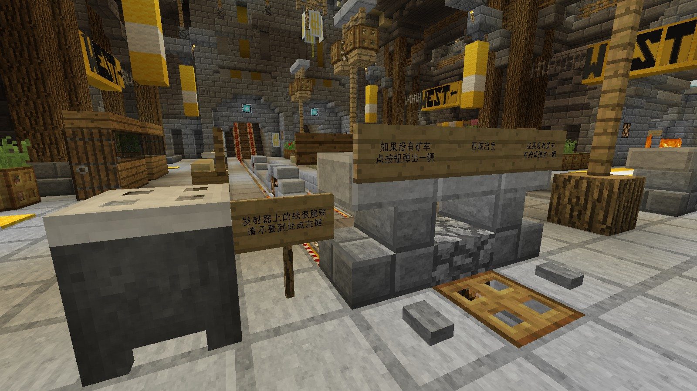

# 新人指南

*最后更新：{docsify-updated}*

本指南旨在为新玩家提供一个简洁明了、能够快速上手喵窝服务器的指南。请注意该指南可能会随着游戏设定而改变，欢迎玩家们在保持简单、简洁的原则上完善本页面。

## 关于 Minecraft

NyaaWiki **并不是** 针对《Minecraft》游戏的指南和知识库，它是针对 NyaaCat 社区和喵窝服务器的指南、手册和知识库系统。如果希望获得关于 Minecraft 游戏本身的信息，请访问：

* [中文 Minecraft Wiki](https://minecraft-zh.gamepedia.com/)
  - 如果在中国内地，可访问此 [镜像站](https://wiki.biligame.com/mc)
* [英文 Minecraft Wiki](http://minecraft.gamepedia.com/Minecraft_Wiki)

如果你是第一次玩 Minecraft，请首先参考官方 Wiki 的[《菜鸟手册》](https://minecraft-zh.gamepedia.com/%E6%95%99%E7%A8%8B/%E8%8F%9C%E9%B8%9F%E6%89%8B%E5%86%8C)（或者[内地镜像站页面](https://wiki.biligame.com/mc/%E6%95%99%E7%A8%8B/%E8%8F%9C%E9%B8%9F%E6%89%8B%E5%86%8C)）。

如果你之前没有在其它正版 Java 版服务器游玩的经历，请务必确认你使用的是 [Java 版客户端](https://minecraft-zh.gamepedia.com/Java%E7%89%88)，并通过**在 minecraft.net 注册和激活的账号**登录游戏。  
[基岩版](https://minecraft-zh.gamepedia.com/%E5%9F%BA%E5%B2%A9%E7%89%88)、[网易（中国）版](https://mc.163.com/) 等其它版本均不受支持。

- - -

## 入服准备

**如果还没提交申请，请先阅读 [新玩家申请](wiki/whitelist-application.md) 后提交申请。**

收到欢迎信时就可以进入服务器开始游戏了。但是为了确保最佳的游戏和社区体验，请先考虑以下步骤——

### 不要做隐身人

戳 [玩家群组](wiki/groups.md) 页面，加入合适的群，进而联系管理员加入 Telegram 等其它内部群组。  
IRC、Telegram 群组和游戏聊天频道互通，请注意不要刷屏。

即便不加入玩家群组，我们依然会在有重要更新或通知时通过你申请入服时使用的邮箱给你发送邮件。请确保将 `noreply@mail.nyaa.cat` 加入联系人列表以获得最佳的信件送达率。  
有任何问题或者需求，都可以发送邮件到管理员邮件列表 `owo@nyaa.cat` 寻求帮助。

### 准备客户端

你仅需确保，使用的客户端**版本正确**。 
插件方面不作硬性要求。如希望使用辅助插件，但不善于安装，可在 [推荐资源](wiki/resources.md) 处获取客户端整合包。

添加服务器时，请首先尝试使用地址 `play.nyaacat.com`，并将「服务器资源包」选项设为**启用**。

?> :information_source: 添加完成出现服务器信息后，鼠标移动到信号标识符上即可查看延迟。由于 DNS 解析和路由问题，如果发现延迟较高（中国大陆玩家一般 2\~60 ms，海外玩家一般 40\~280 ms），请从 [首页](/) 的地址列表尝试选择其它地址。  
如果出现「无法解析」、「Unknown host」等问题，请多刷新几次。
  
如果仍然不确定或者延迟、丢包导致游戏体验不佳，请在玩家群内联系管理员协助解决网络问题。

### 阅读游戏规则

进入服务器之前，请务必再次阅读【[游戏规则](wiki/rules.md)】。  
如果仍有不清楚是否会被判定违规的情况，请在游戏内或玩家群组内询问。

这里死亡掉落！<code>/back</code>、<code>/home</code> 命令扣款！<code>/suicide</code> 也扣款！ 
重要的事情讲过三遍了！  
把从其他服务器带过来的旧习惯改掉！  
~（粗心的编者被拖出去鞭尸）~

- - -

## Hello, world!

当你第一次登录服务器时，有可能正是大家玩得火热有人可以来帮助你上手游戏，或大部分忙于活动无暇理会他人，也有可能大家都还在睡梦中而服务器空无一人。但是不论何种情况，你都可以通过这份指南快速上手服务器游戏。

### 新星的诞生

初次亮相的你会首先来到[大神殿](nyaa/realms/sakurakacho "即樱华町")。跟窝里的各位打个招呼吧！

选择**出生点（即 spawn 点）**的传送门会自动启动，它看起来像这样：

如果你未作出选择而将其关闭，或者其没有自动开启；则可重新登录喵窝，或键入命令 `/town select` 开始选择。

在列表中选择一个你最感兴趣的村落，它将作为你出生的家乡——`/spawn` 命令将回到这个村落。这并不限制你前往或者居住在其他村落。  
选择前，可先浏览 [城镇村落列表](nyaa/realms.md) 页面，来看那个村落是否适合你落脚。选错了也能再改，只不过要花点小钱。

一些村落可能已经很久没有喵光顾了。  
如希望加入较活跃的聚落，目前可以考虑：**琥珀川（北沼）、南沙港、北溪台**。 
如果在寻找低价成品房，可考虑**南沙港**。 
除此之外，选择大城市作为出生点也是不错的选择。

?> :information_source: **「大城市」**即原“五大主城”——**樱华町、阿库亚斯、浪花町、柚木小镇、北风城**。其在经济、交通、公共资源等方面，相比其它聚落皆更便利；同时也是文化中心。

### 白手起家

也许你选择了繁华的大都市，抑或是娴静的滨海小镇。你会被传送到这里，开始在喵窝的生涯。

大部分聚落都为玩家提供了居民区。有些会提供现成的房屋，但是限制颇多；有些则会规划地块，供玩家建造融入当地特色的建筑。  
在公共规划区，如有规划的居民区空地，则无需申请即可直接使用。提供成品房的，需使用游戏币（节操）向管理组购买。详情如下：

* 北风城：北居民区（一期）、西居民区（二期）、南居民区（三期）
* 浪花町：神楽町（一期）、长乐町（二期）
* 柚木小镇：北部提供自建区，其余为成品房（需购买）
* 阿库亚斯：[提供现成住宅及自建区](nyaa/realms/aquas.md)
* 樱华町：[提供现成住宅](https://bbs.nyaa.cat/d/1714)——*购房要求较高，新手可能不适合*
* 新北市：*不建议入住，请遵从居委会安排*
* 像素村、科技特区、月耀城等：*不可入住*

如果来到散布世界各地的村落，一些热心的村长会给予前来定居的玩家一定的补贴。建造时请**遵守当地的要求或规划**。如有不明之处，请联系村落的负责人，或者**加入该聚落的交流群**——不少聚落皆已成立居委会，他们会手把手协助你依规定居。  
又或者，向往宁静喜欢独居的你会在野外找到了一片花海。喵窝世界如此之大，必会找到你所喜爱的居所。

自己温馨的小窝装修完成之后，可以邀请大家来参观。当然如果手艺尚待提升，也没有关系，可以在交流中学习更多姿势嘛～别忘了摆张床，睡一觉，设个家。

?> :information_source: 每当进入某个聚落，服务器会提示该聚落名称，以及管理者（如有）。请善用此提示。

### 今天吃什么

游荡在外，吃饱很重要。在樱华町南边的守望之田，采摘麦子，享用第一餐。东边的万华街亦可能有“福利箱”无偿提供食物。  
如果你在其它聚落，可寻找明确向公众开放的农田、牧场。实在没办法了，输入命令`/espawn`，樱华町随时欢迎你。

### 当心天上的幽灵

小心幻翼！如果你超过一小时（三个游戏日）未曾休息，却还在夜空下撒欢，它们便会不期而至，破坏你的派对。  
**良好的作息**（甚至只需躺上一两秒）是最好的预防措施。如不具备躺床条件，晚上可以找个屋檐躲躲，或者不停赶路（至少要比疾跑快）。

?> :heavy_check_mark: **随身带床是个不错的习惯。**

?> :heavy_check_mark: 樱华町全境**不会**生成怪物。相当安全。

### 采集资源去哪里

遇到心仪的城市，梦想的居所，但是看看口袋，没有足够的节操设置家，翻翻背包，也没有木材石材建造房屋。于是不禁慨叹人生如此艰难，然而贸然抱怨和伸手只会导致大家对你的好感度急剧下降。自力更生需要采集木材矿产，但是在规划整齐美观的村落中，去哪挖呢——

* 万华街公共藏宝箱（馆前二条8号）——萌新福利和实用战利品
*   城镇、村落附近的森林（木材）
*   村落可能有提供树场（木材）
*   *荒野（木材、矿石）——不推荐*
  - 总之，在不破坏环境的前提下，在主世界开采**可再生**资源无妨。
*   EpicWorld（木材、石料、矿产等）
*   [科技特区](nyaa/realms/hitech-industries.md)（部分工业制成品）

**如若不确定某个位置是否允许伐木、挖掘，可询问其他伙伴；若该位置不允许，可询问在何处允许采挖。切忌贸然动手。**  
当然，不管是在哪里采伐树木，都请注意保护环境，记得补种。

在主世界挖掘时请注意：如果提示进入了规划区，或者不小心挖进了他人在野外的地下室，或者挖进了地下铁工程，请原样修补并选择其他方向继续挖掘。如不能自行修补，请在玩家群组中联系管理员协助。

若欲毫无顾忌地采集资源，可以前往“美丽新世界”—— [EpicWorld](nyaa/worlds "维度列表")。还有各式海产、热带鱼、水下宝藏等你发现。

!> 请尽量避免跑图——窝里资源过剩，跑图收益已微乎其微，反而会拖累服务器性能。

### 每个节操都要精打细算

**「节操」**是这里的硬通货。初来乍到，服务器娘首先会赠送 450 节操，作为礼物。

看上去不少，是吧？但其实没两下就会花光（尽管后续仍有数档累积奖励）。商店、命令、传送牌……许多地方都会取走你的节操。多读读[规则](nyaa/economic.md "世界经济规则")，认真规划将来如何花费、如何赚节操。  
**贴士：**随时使用命令 `/bal` 打开你的钱包。

要是实在止不住自己的手，两下败光了，怎么办？  
_**『肝爆！开店！』**_

[万华街](nyaa/realms/sakurakacho.md#商业：万华街 "点击了解入驻规则")是目前全喵窝最大、最活跃的商业街，没有之一，玩家们皆可享受最上佳的购物乐趣。你的第一桶金，在这等着你！   
找个空铺面，打下[商店木牌](space/plugins/hamsterecohelper?id=木牌商店 "牌子商店")，这就是你的第一家商店。接下来如何经营，全靠你的本事！  
**想去其它城镇购物、开分店？**多关注下其介绍！

如果你有珍贵、或大热门物品待售，而自家店面不易被发现，不妨考虑[天喵商城](space/plugins/hamsterecohelper?id=世界商店 "世界商店")！上天喵，秒（拍）到你说好！  
输入命令 `/hm` 即可访问天喵，百种热门商品，满足你的不时之需！

#### 你是特别的

喵窝世界中的大家都有花花绿绿的称号，而你也可以获得你的专属称号。

*   查看样式代码 `/nu format`
*   更改前缀 `/nu prefix [前缀]` 例如 `/nu prefix &a我是前缀`
*   更改后缀 `/nu suffix [后缀]` 例如 `/nu suffix &b我是后缀`
*   更改昵称 `/nick [昵称]`
  - 此昵称会覆盖游戏 ID 显示，但不影响之。

更改前后缀需要一定的节操和经验，详情见 [NyaaUtils 插件指南](space/plugins/nyaautils.md#更改前后缀、昵称)。

获得了一双鞘翅，在飞行之时也可以向他人展示你的华丽技巧。访问 [粒子效果](space/plugins/nyaautils/particle.md) 页面，为自己的航空之路选择一个特别的轨迹吧！（也可以往自己身上添加特效！）

### 这个世界，正有暗流涌动……

在被黑暗笼罩不见天日的永夜世界—— **无尽地狱**中，有一种名为黑化精英怪的生物。它们身边闪烁着星火，拥有强大的生命力和难缠的技能，它们觊觎着幸福的喵窝世界，甚至发动血月企图摧毁喵窝，从而据为己有。  
可以前往 [无尽地狱世界](inf/index) 讨伐万恶的黑化怪，击败它们，让自己变得更加强大。

* * *

## 世界那么大，我想去看看

### 出行方式一览

喵窝的交通十分发达，玩家可以选择合适的方式出行。

#### ①主世界铁路 
便捷指数：★★★  
观赏指数：★★★★★  
费用：零

强烈推荐使用的交通出行方式！通往世界各地的铁路网为喵窝居民提供便捷的出行方式。其中一级铁路连接各大城市；而连接着各村落的二级铁路更是以风光秀丽闻名于喵窝， 强烈推荐玩家不看地图，乘坐二级铁路欣赏沿途风景，然后在某个站下车开始探索的旅程。  
铁路同时还是当前最安全可靠的押运**活物**的方式。

#### ②瞬间传送 
便捷指数：★★★★★  
观赏指数：N/A  
费用：对于传送牌，1 节操起步，详见牌子最后一行；对于命令，收费标准各异

在樱华町一级车站、万华街，以及各大城市、部分村落均设有[传送牌子](projects/teleport-center)，右击即可传送。

还可以藉由传送命令进行传送，例如 `/home` `/back` 等等。如果要最快地穿梭于各聚落，“设置出生点” `/town select` 同样可以胜任！不过，它们都是[有偿使用](nyaa/economic.md#即时传送)的，平时要省着点用。

一些传送道具亦可实现。最常见的就有[冒险者罗盘](space/items/support.md#冒险者罗盘)。

#### ③鞘翅飞行 
便捷指数：★★★★★  
观赏指数：★★★☆  
费用：基本免费

话说在凤凰君以及其他 OP 的推动下，鞘翅从“来自末地稀有的战利品”变成家户户的日常出行道具。随后一座座飞行塔矗立在喵窝的世界各地。飞行赶路成为喵窝出行的手段之一。赚取足够的节操入手一双鞘翅，并在喵窝的世界翱翔吧！  
然而，原版鞘翅飞行满足不了你自由翱翔的愿望？这不是问题！由*樱花动力公司* 推出的**动力燃料**，输出稳定，性能可靠，使用自由（放入背包即可工作），是居家旅行必备良品。你可以在北风城市政厅，用基础材料兑换；或者在官方商店、各大商业街及天喵商城购买，像鸟儿一样自由翱翔！

!> 如果**网络环境较差（延迟过高），请勿轻易尝试飞行；**否则可能产生来不及加载前方地形的情况，继而可能撞墙或“坠入无底洞”（此时只能重新进入服务器）。  
低空飞行时，前方安全和眼下美景难以兼顾。因此，不建议通过飞行观赏喵窝大地（除非对飞行相当熟练）。  
如果飞行时被强制下线，下次上线时将被送回「大神殿」。

#### ④下界交通
便捷指数：★★★★  
观赏指数：★  
费用：零

利用下界与主世界之位置关系，以及冰道上划船移动极快的特点，下界交通网应运而生。通过其可快速前往各大城市以及其它部分聚落。  
不过，下界的危险环境足以让人不寒而栗（但在交通隧道内可确保安全，**只要不招惹猪人**）；相对主世界铁路，其覆盖的聚落相当有限，详见[搭乘指南](space/map-navi/railway-nether.md)。

#### ⑤骑马
便捷指数：★★  
观赏指数：★★★★★  
费用：零

在地形平坦之处——尤其在大片麦田里，策马奔腾是一种享受（无需考虑压坏耕地的问题）。一些素质优良的马，跑得比矿车还快。  
骑行受地形影响较大。遇高山陡坡、茂密树林，要么绕路，要么硬着头皮爬坡；并且，普通马无法涉足深水区域。

#### ⑥乘船
便捷指数：★★☆  
观赏指数：★★★★  
费用：零

主世界存在多片大型水域，它们天然地连通多个城镇（村落）；更多的则是未知。一些经过城镇（村落）的内河，亦能提供不一样的视角。  
还可二人同舟，或顺路捎带一只活物到大洋彼岸。  
茫茫大海中，划船中途可能会稍显无聊。

#### ⑦步行
便捷指数：★  
观赏指数：★★★★★★  
费用：零

步行可以到达世界陆地上任何一个角落。当然，如果你能经受路途之艰辛的话。

### 车站及铁路使用

铁路作为基本的生存移动工具之一存在。如上所述，喵窝已经存在从樱华町通往各大城市及其它村落的铁路，也已经有热心玩家为其绘制 [线路图](space/map-navi/railway-universal-Ceallium) 了。

这边主要告知玩家车站使用方式。以樱华町一级车站为例（如图），其使用了一套自动发车系统；**找对方向，绕到矿车前，右键上车，便可自动出发**。小心不要碰到其它东西，尤其是车上悬着的线！（若不慎破坏，可联系其他伙伴提供帮助）

在到达目的地前请勿随意下车；到站后，若该站无自动收发装置，请自行回收矿车！  
路上可能会迎头撞上野生动物，此时可自行驱赶之。

### 我担心迷路，怎么办？

在世界冒险，一张精确的地图必不可少。例如，使用小地图 Mod （如VoxelMap、JourneyMap），它们可以确定你的位置，协助找到回家的路。  
更加全能的办法，是按下F3键，游戏画面左上角将显示你的实时方位。往世界中心走总是没错的！  
最万能的办法，当属 `/espawn` ！

此外，亦可查看网页端[地图](https://map.nyaacat.com/nyaa/)。目前全球各地应该皆可查阅。

!> 网页端地图并不会指示你当前的方位。

当然，**你可以随时询问其他伙伴**，他们会帮助你脱离困境。

* * *

## 闲暇之余，不如……

### 储备知识与提升自我

#### 建筑类

*   [建筑风格](space/building?id=建筑风格)
  + 其中包含【Minecraft 建筑入门】【东亚建筑教程】【欧洲建筑教程】等实用技术。

#### 红石类

*   轨道交通技术（页面待恢复）
*   世界内有大量自动化轨道交通设施、红石演示装置，欢迎前往体验学习。

### 体验喵窝的另一面

当你日渐习惯了喵窝的缤纷，是否偶然想要重温当年发现新大陆时的新奇，挖到第一颗钻石的兴奋，和自己的爱犬在山野间共赏落日余晖的幸福？  
当你有一身手艺想要建造属于自己的梦想城市，是否期望能够自由飞行、拥有无限资源和创造辅助工具？  

这一切在喵窝都能随时满足。详细了解 [喵窝服务器列表](wiki/server-network.md)。

还有喵窝真正的另一面——[休闲广场](misc/playground)

### 回馈社区

还记得刚加入的时候，在守望之田收获大家种下的粮食吗？还记得在万华街上接受菊苣们免费赠送的武器道具吗？希望在喵窝扎根的你同样能善待每一位成员，对需要帮助的玩家伸出援助之手。社区的成长和发展，需要社区成员的不断回馈。这也是社区立足之根本。

#### 贡献作品

请先参阅 [作品集](space/works.md) 浏览社区成员目前贡献的作品。  
如果你为社区制作了作品，请将其传送门放进这里。

#### 其他方式

*   申请加入[NyaaWiki源文件仓库](https://github.com/NyaaCat/wiki)贡献者名单，协助完善这份知识库。  
  [参与详情见此页。](wiki/contribute)
*   查阅 [创造激励计划](nyaa/creation.md)，参与[公共工程](nyaa/projects.md)，让喵窝世界变得更加丰富多彩。
*   在涉及服务器与社区的讨论中积极提出自己的看法。
