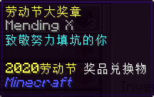
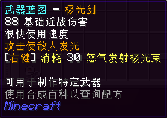
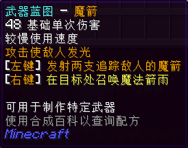
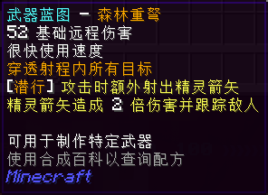
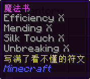
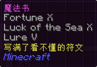

# 2020 年劳动节活动兑换道具

均为 [无尽地狱世界](legacy/inf) 相关物品。

## 代币

### 劳动节大奖章

* 【外形】绿宝石，有附魔
* 【来源】本次劳动节活动的代币奖励。

## 活动限定物品

### 武器蓝图 - 极光剑

* 【外形】纸
* 【兑换需求】**劳动节大奖章** x5
* 【物品类型】融合材料
* 【用途】
  * [融合](legacy/inf2/items?id=融合) Inf 武器「[极光剑](legacy/inf2/items/melee?id=极光剑)」和「[极光剑 S](legacy/inf2/items/melee?id=极光剑-s)」。

### 武器蓝图 - 魔箭

* 【外形】纸
* 【兑换需求】**劳动节大奖章** x5
* 【物品类型】融合材料
* 【用途】
  * 融合 Inf 武器「[魔箭](legacy/inf2/items/magic?id=魔箭)」和「[魔箭 S](legacy/inf2/items/magic?id=魔箭-s)」。

### 武器蓝图 - 森林重弩

* 【外形】纸
* 【兑换需求】**劳动节大奖章** x5
* 【物品类型】融合材料
* 【用途】
  * 融合 Inf 武器「[森林重弩](legacy/inf2/items/ranged?id=森林重弩)」和「[森林重弩 S](legacy/inf2/items/ranged?id=森林重弩-s)」。

## 其它物品

**有机会通过其它途径获取**的物品。

| 物品 | 兑换需求 | 详情 |
| - | - | - |
| 神秘礼盒 x3 | **劳动节大奖章** x1 | |
| 月耀城每日礼包 | **劳动节大奖章** x1 | |
| 月耀城每周礼包 | **劳动节大奖章** x3 | |
| 一张银行卡 | **劳动节大奖章** x2 | |
| 魔法书 | **劳动节大奖章** x3 |  |
| 魔法书 | **劳动节大奖章** x3 |  |
| 魔法书 | **劳动节大奖章** x3 |  |
| 魔法书 | **劳动节大奖章** x3 |  |
