# 2020 年国庆节活动兑换道具

:people_holding_hands: 国庆活动包含两大部分，分别是：
- **围攻行动**（[道具详情](#围攻行动)）（[活动内容](legacy/activities#national-day-besiege)）
- **王牌战机**（[道具详情](#王牌战机)）（[活动内容](legacy/activities#national-day-airfight)）

## 围攻行动

> 活动纪念代币 **「声望凭证」**，用以兑换纪念品，以下是代币详情：  
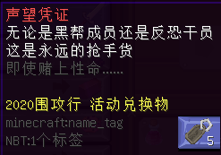  
【警告】避免手持代币！

#### 瑞士短刀

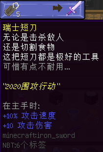

- 【外形】铁剑，有附魔
- 【来源】NPC “新晋干员”
- 【兑换需求】声望凭证 ×5
- 【耐久值】250
- 【可修复性】可用铁砧修复，**但代价极大，近乎不可能**
- 【隐藏附魔】
  + **锋利 Ⅹ**
  + 消失诅咒
- **【作用】**一把伤害较高的一次性普通铁剑。

#### 破损的玻璃弩

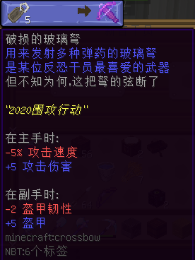

- 【外形】弩，有附魔
- 【来源】NPC “新晋干员”
- 【兑换需求】声望凭证 ×5
- 【耐久值】326
- 【可修复性】可用铁砧修复
- 【隐藏附魔】
  + **快速装填 Ⅹ**
- **【作用】**一把可瞬间装弹的普通弩。

#### 阔剑地雷

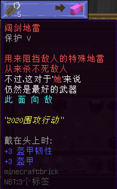

- 【外形】红砖，有附魔
- 【来源】NPC “新晋干员”
- 【兑换需求】声望凭证 ×5
- 无使用限制
- **【作用】**作为头饰佩戴。

#### 会唱歌的曲奇

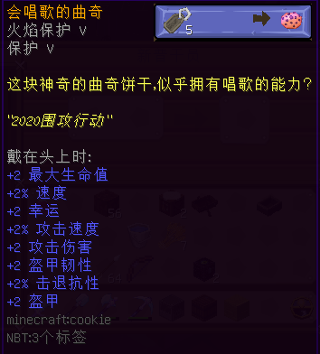

- 【外形】曲奇，有附魔
- 【来源】NPC “新晋干员”
- 【兑换需求】声望凭证 ×5
- **一次性道具**（食用时）
- **【作用】**作为头饰佩戴。注意避免食用。

#### 军用口粮

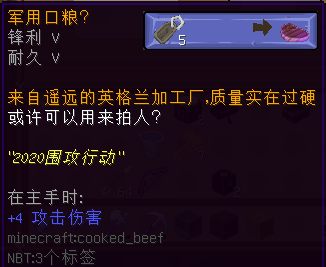

- 【外形】熟牛排，有附魔
- 【来源】NPC “新晋干员”
- 【兑换需求】声望凭证 ×5
- **一次性道具**（食用时）
- **【作用】**~~主手持有，可以抡人。~~注意避免食用。

#### 来源神秘的弹药库

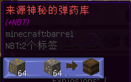

- 【外形】木桶
- 【来源】NPC “孙夏下士”
- 【兑换需求】金矿石 ×64，铁矿石 x64
- **一次性道具**
- **【作用】**使用后获得一系列烟花火箭和箭，应该是用以配合[破损的玻璃弩](#破损的玻璃弩)。

神秘的弹药库内含物品

| 物品 | 数量（组） |
| - | - |
|  | 6 |
| 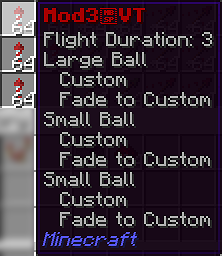 | 6 |
|  | 6 |
| 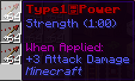 | 6 |
| 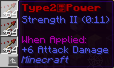 | 3 |

--------

## 王牌战机

> 活动纪念代币 **「王牌飞行员勋章」**，用以兑换纪念品，以下是代币详情：  
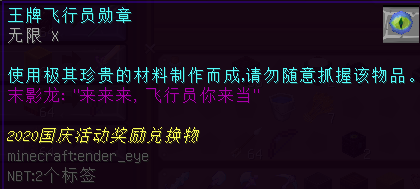  
【警告】避免手持代币！

#### 精神注入棒

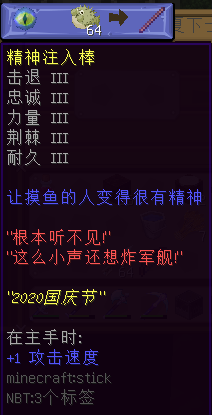

- 【外形】木棍，有附魔
- 【来源】NPC “孙夏下士”
- 【兑换需求】王牌飞行员勋章 ×1，河豚 x64
- 无使用限制
- **【作用】**一把很有精神的木棒。

#### 绝对防御圈 | Aegis

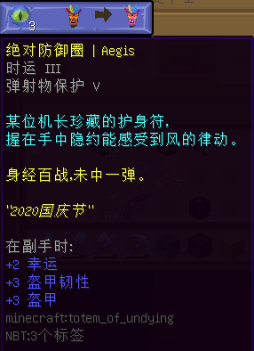

- 【外形】不死图腾，有附魔
- 【来源】NPC “孙夏下士”
- 【兑换需求】王牌飞行员勋章 ×3，不死图腾 x1
- **一次性道具**
- **【作用】**稍微加强的不死图腾，可持于副手。

#### 永久性追尾导弹 | Artemis

- 【外形】三叉戟，有附魔
- 【来源】NPC “孙夏下士”
- 【兑换需求】王牌飞行员勋章 ×5，下界石英矿 x64
- 无使用限制
- **【作用】**一把普通的三叉戟。

#### 天王星系统 | Uranus

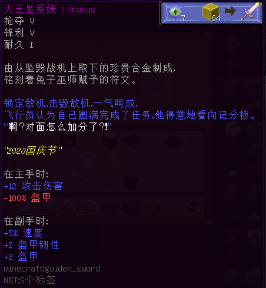

- 【外形】金剑，有附魔
- 【来源】NPC “孙夏下士”
- 【兑换需求】王牌飞行员勋章 ×7，金块 x64
- 【耐久值】32
- 【可修复性】可用铁砧修复
- **【作用】**一把普通的剑。

#### 最终兵器 | Apollon

- 【外形】弓，有附魔
- 【来源】NPC “孙夏下士”
- 【兑换需求】王牌飞行员勋章 ×10，TNT x64
- 【耐久值】384
- 【可修复性】铁砧修复，或“经验修补”附魔
- **【作用】**一把杀伤力较强的弓。
