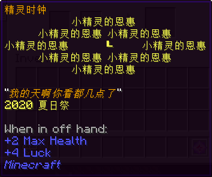
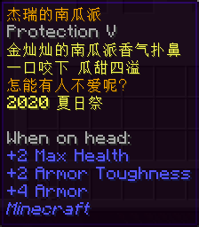

# 2020 年夏日祭活动兑换道具

## 代币

### 浅夏的风铃草

* 【外形】铃兰
* 【来源】本次夏日祭全部活动通用的代币奖励。[详见（存档截图）](/assets/images/legacy/nyaabbs/1752-2020.webp ':ignore')

## 活动限定物品

### 黄金火石

* 【外形】打火石
* 【兑换需求】**浅夏的风铃草** x3
* 【物品类型】实用工具
* 【作用】
  * 放于主手时，可获得图中所示加成。
* 【用途】
  * 当作普通的打火石使用。由于**具有不毁属性**，使用时无需担心耐久。

### 精灵时钟

* 【外形】钟
* 【兑换需求】**浅夏的风铃草** x4
* 【物品类型】普通物品
* 【作用】
  * 放于副手时，可获得图中所示加成。

### 杰瑞的南瓜派

* 【外形】南瓜派，有附魔
* 【兑换需求】**浅夏的风铃草** x5
* 【物品类型】普通物品
* 【作用】
  * 佩戴在头上时，可获得图中所示加成。
* 【用途】
  * 当做饰品佩戴。
  * 当然也是可以吃掉的（吃掉就没了哦）。

### 流仙

* 【外形】钓鱼竿
* 【兑换需求】**浅夏的风铃草** x6
* 【物品类型】实用工具
* 【用途】
  * 拿来钓鱼。  
其自带 **饵钓 V**、**经验修补** 和 **耐久 IV** 附魔，是您钓鱼的好伙伴。

### 精铁砍刀

* 【外形】铁剑
* 【兑换需求】**浅夏的风铃草** x6
* 【物品类型】近战武器
* 【作用】
  * 放置在主手或副手时，可获得图中所示的对应加成。
* 【用途】
  * 当作普通的剑使用。由于**具有不毁属性**，使用时无需担心耐久。

### 凯露的头

* 【外形】玩家头颅
* 【兑换需求】**浅夏的风铃草** x1
* 【物品类型】普通物品
* 【用途】
  * 戴在头上，在喵窝玩 [接头霸王](https://zh.moegirl.org.cn/index.php?title=%E6%8E%A5%E5%A4%B4%E9%9C%B8%E7%8E%8B)！

### 武器蓝图 - 豌豆荚

* 【外形】纸
* 【兑换需求】**浅夏的风铃草** x8
* 【物品类型】融合材料（[无尽地狱世界](legacy/inf)）
* 【用途】
  * [融合](legacy/inf2/items?id=融合) Inf 武器「豌豆荚」**（目前尚未上线）**。

## 其它物品

均为 [无尽地狱世界](legacy/inf) 相关，且**有机会通过其它途径获取**的物品。

| 物品 | 兑换需求 | 详情 |
| - | - | - |
| 魔法书 | **浅夏的风铃草** x2 |  |
| 魔法书 | **浅夏的风铃草** x2 |  |
| 魔法书 | **浅夏的风铃草** x2 |  |
| 魔法书 | **浅夏的风铃草** x2 |  |
| 特级魂玉兑换券 | **浅夏的风铃草** x2 | |
| 灵魂残片 | **浅夏的风铃草** x2 | |

<!--

## 物品名称

* 【外形】
* 【兑换需求】**浅夏的风铃草** x
* 【物品类型】
* 【作用】
  * 
* 【用途】
  * 

-->