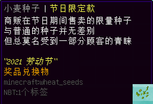
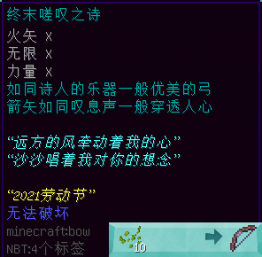
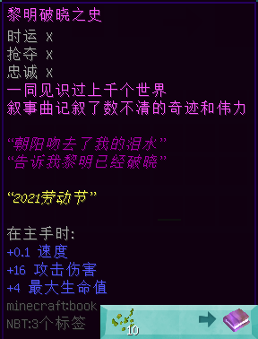

# 2021 年劳动节活动限定道具

> 活动纪念代币 **「小麦种子（节日限定款）」**，用以兑换纪念品，以下是代币详情：  

#### 劳动节庆典组合包

- 【外形】潜影盒
- 【来源】NPC “异世界商人”
- 【兑换需求】小麦种子（节日限定款） ×1
- **一次性道具**
- **【作用】**打开后，获得下界之星 x1、附魔之瓶 x384、钻石 x256、向日葵 x16。

#### 终末嗟叹之诗

- 【外形】弓，有附魔
- 【来源】NPC “异世界商人”
- 【兑换需求】小麦种子（节日限定款） ×10
- 无使用限制
- 【附魔】
  + __力量 Ⅹ__
  + __火矢__
  + __无限__
  + **不可破坏**
- **【作用】**一把略强于原版的弓。

#### 松籁响起之时

- 【外形】铁剑，有附魔
- 【来源】NPC “异世界商人”
- 【兑换需求】小麦种子（节日限定款） ×10
- 无使用限制
- 【附魔】
  + __节肢杀手 Ⅹ__
  + __锋利 Ⅹ__
  + __亡灵杀手 Ⅹ__
  + **不可破坏**
  + 持于主手时：攻击速度 +2.4，攻击伤害 +12
- **【作用】**一把稍强于原版的剑。

#### 黎明破晓之史

- 【外形】书，有附魔
- 【来源】NPC “异世界商人”
- 【兑换需求】小麦种子（节日限定款） ×10
- 无使用限制
- 【附魔】
  + __时运 Ⅹ__
  + __抢夺 Ⅹ__
  + __忠诚 Ⅹ__
  + 持于主手时：**速度 +0.1**，攻击伤害 +16，最大生命值 +4
- **【作用】**一本让人加倍精神的书。

