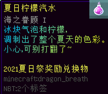
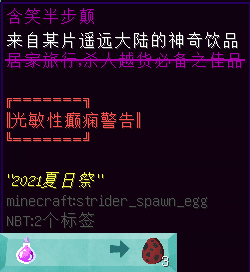
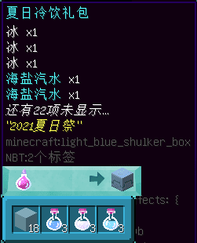
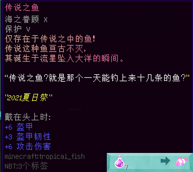
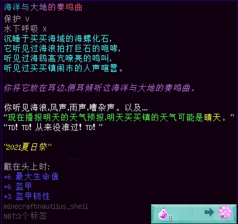
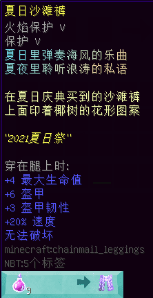

# 2021 年劳动节活动限定道具

> 活动纪念代币 **「夏日柠檬汽水」**，用以兑换纪念品，以下是代币详情：  

#### 含笑半步颠

- 【外形】炽足兽刷怪蛋
- 【来源】NPC “蓝瓜”
- 【兑换需求】夏日柠檬汽水 ×1
- **一次性道具**
- **【作用】**原地产生11种烟雾，给人以“抽风”之幻觉。

编者记得没错的话……应该是第三代了

#### 夏日冷饮礼包

- 【外形】潜影盒
- 【来源】NPC “蓝瓜”
- 【兑换需求】夏日柠檬汽水 ×1
- **一次性道具**
- **【作用】**打开后，获得以下物品：
  + 冰块 x18
  + 海盐汽水 x3（给予十分钟“幸运 V”效果）
  + 融化的香草冰淇淋 x3（给予十分钟“速度 V”效果）
  + 苏霍薄荷茶 x3（给予十分钟“跳跃提升 V”效果）

#### 奇怪的投掷器

- 【外形】木棍，有附魔
- 【来源】NPC “蓝瓜”
- 【兑换需求】夏日柠檬汽水 ×5
- 无使用限制
- **【作用】**可以把面前的人或生物击飞。

#### 美羽霜花扇

- 【外形】羽毛，有附魔
- 【来源】NPC “蓝瓜”
- 【兑换需求】夏日柠檬汽水 ×6
- 无使用限制
- **【作用】**置于副手，行如疾风。

#### 传说之鱼

- 【外形】热带鱼，有附魔
- 【来源】NPC “蓝瓜”
- 【兑换需求】夏日柠檬汽水 ×7
- 无使用限制
- **【作用】**作为头饰佩戴。

#### 海洋与大地的奏鸣曲

- 【外形】鹦鹉螺壳，有附魔
- 【来源】NPC “蓝瓜”
- 【兑换需求】夏日柠檬汽水 ×8
- 无使用限制
- **【作用】**作为头饰佩戴。

#### 夏日沙滩裤

- 【外形】锁链护腿，有附魔
- 【来源】NPC “蓝瓜”
- 【兑换需求】夏日柠檬汽水 ×9
- 无使用限制
- **【作用】**作为盔甲穿戴。

