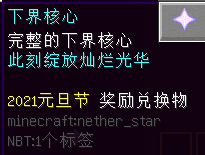
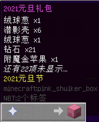
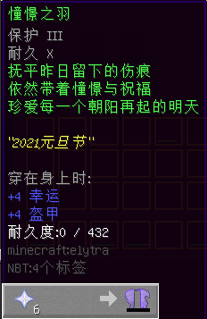
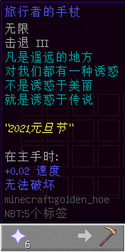
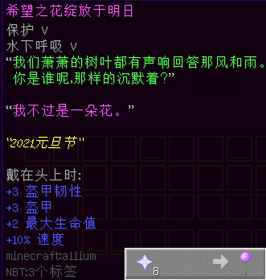
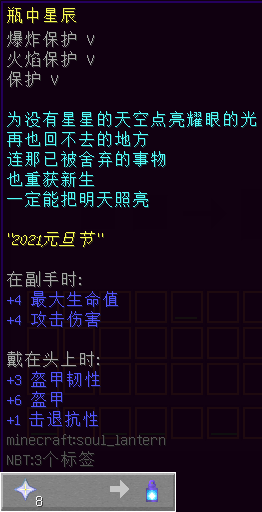
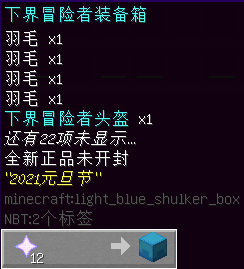

# 2021 年元旦活动限定道具

> 活动纪念代币 **「下界核心」**，用以兑换纪念品，以下是代币详情：  
  
关于活动详情，请见[此帖子（Internet Archive）](https://web.archive.org/web/20210127045743/https://bbs.nyaa.cat/d/1795-2021)。

#### 2021 元旦礼包

- 【外形】潜影盒
- 【来源】NPC “大魔王的使者”
- 【兑换需求】下界核心 ×1
- **一次性使用**
- **【作用】**获得下界之星 x1、附魔金苹果 x4、钻石 x84、潜影壳 x48、绒球葱 x10。

#### 憧憬之羽

- 【外形】鞘翅，有附魔
- 【来源】NPC “大魔王的使者”
- 【兑换需求】下界核心 ×6
- 【耐久值】432
- 【可修复性】可用铁砧修复
- **【作用】**一件普通的鞘翅。使用前须先修复。

#### 旅行者的手杖

- 【外形】金锄，有附魔
- 【来源】NPC “大魔王的使者”
- 【兑换需求】下界核心 ×6
- 无使用限制
- **【作用】**一件不错的助跑手杖。路上有怪物阻拦，也可以驱离。

#### 希望之花绽放于明日

- 【外形】绒球葱，有附魔
- 【来源】NPC “大魔王的使者”
- 【兑换需求】下界核心 ×8
- 无使用限制
  + 非必要时请勿手持，以免不慎放置！
- **【作用】**作为头饰佩戴。

#### 瓶中星辰

- 【外形】灵魂灯笼，有附魔
- 【来源】NPC “大魔王的使者”
- 【兑换需求】下界核心 ×8
- 无使用限制
  + 非必要时请勿手持，以免不慎放置！
- **【作用】**作为头饰佩戴，提供一定防御。持于副手，可加强攻击力。

#### 下界冒险者装备箱

- 【外形】潜影盒
- 【来源】NPC “大魔王的使者”
- 【兑换需求】下界核心 ×12
- **一次性使用**
- **【作用】**获得下界之星（改名） x1、羽毛 x22、下界冒险者盔甲四件（均为钻石制）。  
全套盔甲属性及增益：
  + 速度 +20%（每件各 +5%）
  + 盔甲 +20
  + 盔甲韧性 +8
  + **不可破坏**（全部）
  + 保护 16 级（每件各 4 级）
  + 爆炸保护 Ⅳ（头盔）
  + 弹射物保护 Ⅳ（胸甲） 
  + 火焰保护 Ⅳ（护腿）
  + 摔落保护 Ⅳ（靴子）