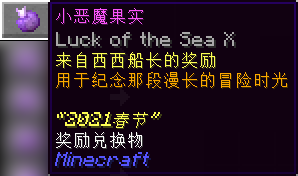
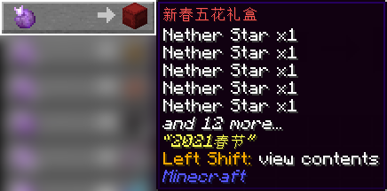
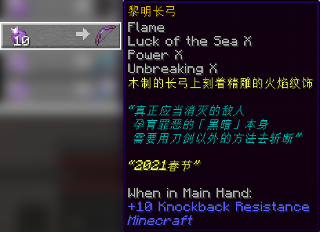
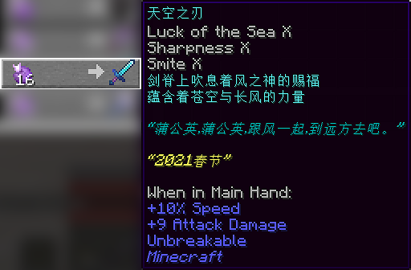
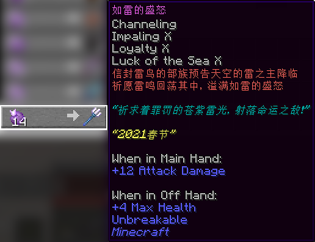
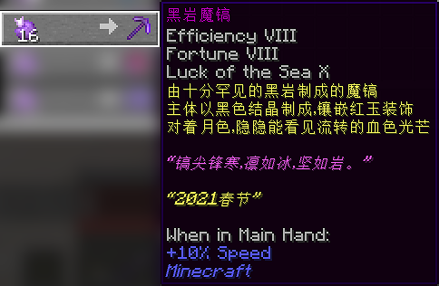
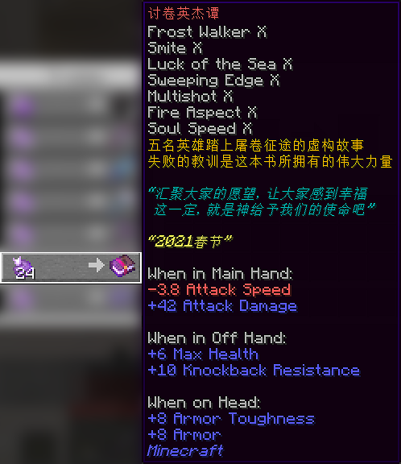
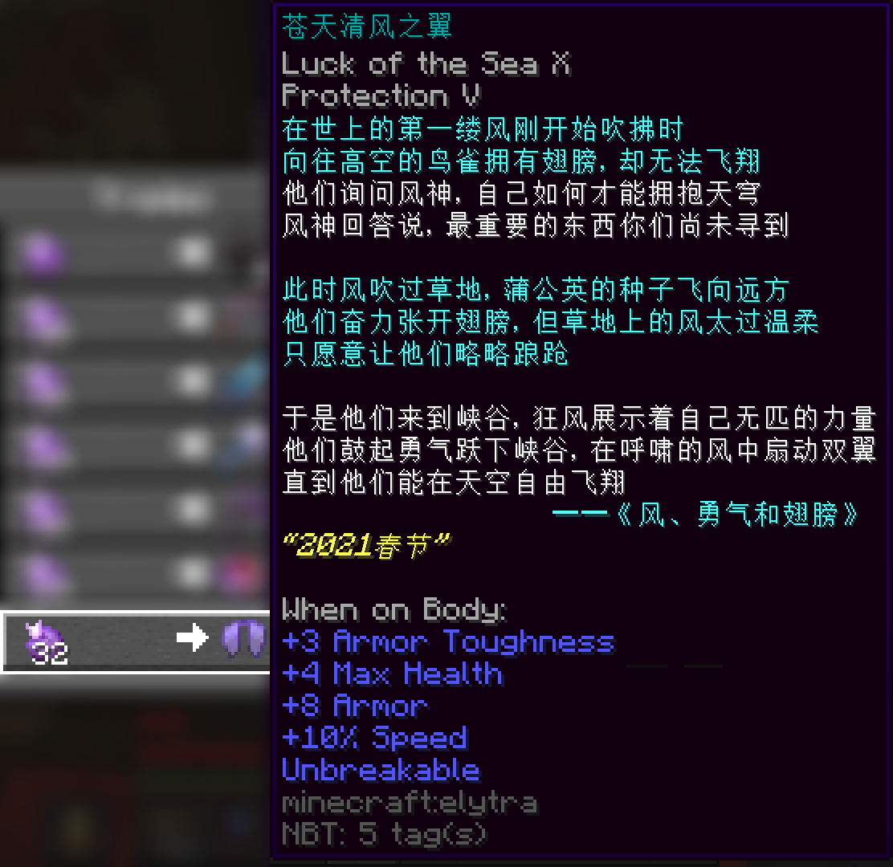

# 2021 年春节活动限定道具

> 活动纪念代币 **「小恶魔果实」**，用以兑换纪念品，以下是代币详情：  
  
关于活动详情，请见[此帖子（存档截图）](/assets/images/legacy/nyaabbs/1816-2021.webp ':ignore')。

所以为什么它们都有“海之眷顾”的附魔？

## 活动限定物品

#### 新春五花礼盒
- 【外形】潜影盒
- 【来源】NPC “西西船长”
- 【兑换需求】小恶魔果实 ×1
- **一次性道具**
- **【作用】**打开后，获得下界之星 x10、附魔之瓶 x128、五种花卉各 4 支。其中，花卉均带有来自*凤凰卷、阿姨、火龙果、蓝瓜、李德二* 的新春祝福。

#### 黎明长弓

- 【外形】弓，有附魔
- 【来源】NPC “西西船长”
- 【兑换需求】小恶魔果实 ×10
- 【耐久值】384
- 【可修复性】可用铁砧修复
- 【附魔】
  + __海之眷顾 Ⅹ__
  + __耐久 Ⅹ__
  + __力量 Ⅹ__
  + __火矢__
  + 持于主手时：击退抗性 +10
- **【作用】**一把比较强力的弓。注意：其未包含“无限”附魔。

#### 天空之刃

- 【外形】钻石剑，有附魔
- 【来源】NPC “西西船长”
- 【兑换需求】小恶魔果实 ×16
- 无使用限制
- 【附魔】
  + __海之眷顾 Ⅹ__
  + __锋利 Ⅹ__
  + __亡灵杀手 Ⅹ__
  + **不可破坏**
  + 持于主手时：速度 +10%，攻击伤害 +9
- **【作用】**一把比较锐利的剑。

#### 如雷的盛怒

- 【外形】三叉戟，有附魔
- 【来源】NPC “西西船长”
- 【兑换需求】小恶魔果实 ×14
- 无使用限制
- 【附魔】
  + __海之眷顾 Ⅹ__
  + __忠诚 Ⅹ__
  + __穿刺 Ⅹ__
  + __引雷__
  + 持于主手时：攻击伤害 +12
  + 持于副手时：最大生命值 +4
- **【作用】**一把比较尖锐的三叉戟。

#### 黑岩魔镐

- 【外形】下界合金镐，有附魔
- 【来源】NPC “西西船长”
- 【兑换需求】小恶魔果实 ×16
- 【耐久值】2031
- 【可修复性】可用铁砧修复
- 【附魔】
  + __海之眷顾 Ⅷ__
  + __效率 Ⅷ__
  + __时运 Ⅷ__
  + 持于主手时：速度 +10%
- **【作用】**一把比较得力的镐子。

#### 讨卷英杰谭

- 【外形】附魔书
- 【来源】NPC “西西船长”
- 【兑换需求】小恶魔果实 ×24
- 无使用限制
- 【附魔】
  + __海之眷顾 Ⅹ__
  + __亡灵杀手 Ⅹ__
  + __横扫之刃 Ⅹ__
  + __多重射击 Ⅹ__
  + __火焰附加 Ⅹ__
  + __灵魂疾行 Ⅹ__
  + 持于主手时：攻击伤害 +42，攻击速度 -3.8
  + 持于副手时：最大生命值 +6，击退抗性 +10
  + 戴在头上时：盔甲 +8，盔甲韧性 +8
- **【作用】** ~~一本比较暴躁的书。~~放在副手或是头上，也可加强防御。  
该书是否支持给装备附魔尚不明确。

#### 苍天清风之翼

- 【外形】鞘翅，有附魔
- 【来源】NPC “西西船长”
- 【兑换需求】小恶魔果实 ×32
- 无使用限制
- 【附魔】
  + __海之眷顾 Ⅹ__
  + __保护 Ⅴ__
  + **不可破坏**
  + 穿在身上时：最大生命值 +4，盔甲 +8，盔甲韧性 +3，速度 +10%
- **【作用】**一件比较可靠的鞘翅。

## 其它可兑换物品

以下如无特殊说明，均仅支持原版功能。

|物品|所需代币|
|-|-|
| **猪灵蛮兵刷怪蛋** | 3 |
| **疣猪兽刷怪蛋** | 3 |
| **下界合金块** | 1 |