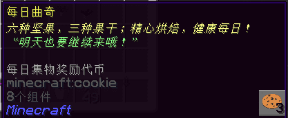
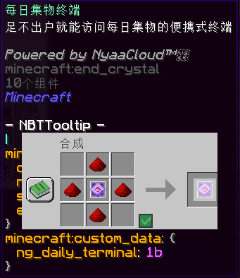
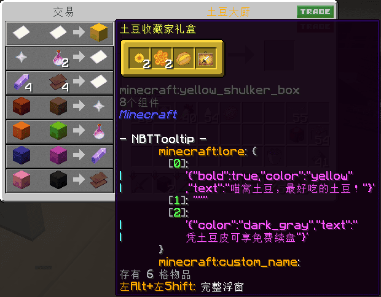
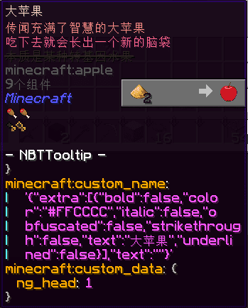

# NyaaGears “喵秘宝”专属道具

## 通用代币

现“喵秘宝”代币有三种：

| 名称 | 形态 | 获取途径 | 可兑换对象 |
|-|-|-|-|
|  **每日曲奇** | 曲奇 | 完成集物宾果游戏； 用【液压机】销毁任意家具 | 【幻晶之尘】； 【祝福之尘】； 魔术礼券、突破石、消咒石等 |
| **幻晶之尘** | 火药 | 【每日曲奇】兑换； 用【液压机】销毁任意祝福幻晶 | 【祝福之尘】； 一些特殊原版材料； 喵窝经典装备重制版等 |
| **祝福之尘** | 荧石粉 | 【每日曲奇】或【幻晶之尘】兑换； 用【液压机】销毁任意祝福 | 【大苹果】； 更特殊的原版材料； 原版宝箱； 喵窝经典装备重制版等 |

> 【液压机】见 NyaaWorks “喵工坊”。  
> 【突破石】【消咒石】见 NyaaEnchants “喵附魔”。

## 每日集物终端

随时随地观看集物宾果棋盘。  
可用以下方法制作：

| 名称 | 材料 |
|-|-|
| 每日集物终端 | 末地水晶 x1、红石粉 x4 |

## 烤马铃薯（无限续杯版）

由天下美食大杂烩炼出的一颗土豆。为什么是土豆？我也不大清楚。但是，这只土豆成了精：**吃下去长出一颗，吃下去再长一只**，子子孙孙无穷尽也。但是！**它有小概率发生突变**，一般变成*毒马铃薯*，罕见其它不可食用的变种。

制作方法非常复杂：首先找到 Aqua's（阿库娅丝）海星城市政厅四楼的【**土豆大厨**】；然后要准备多达 22 个盒子——

| 潜影盒颜色 | 盒数 | 内容 |
|-|-|-|
| 红色 | 1 | 苹果 x64、金苹果 x64、附魔金苹果 x64、浆果 x64、发光浆果 x64 |
| 棕色 | 1 | 萝卜 x64、金萝卜 x64、马铃薯 x64、烤马铃薯 x64、毒马铃薯 x64 |
| 橙色 | 2 | 牛排 x64、熟猪排 x64、熟羊排 x64、熟鸡肉 x64、熟兔肉 x64 |
| 绿色 | 2 | 生牛排 x64、生猪排 x64、生羊排 x64、生鸡肉 x64、生兔肉 x64 |
| 蓝色 | 4 | 生鲑鱼 x64、生鳕鱼 x64、热带鱼 x64、熟鳕鱼 x64、熟鲑鱼 x64 |
| 品红色 | 4 | 面包 x64、曲奇 x64、南瓜派 x64、甜菜汤 x1、蘑菇煲 x1 |
| 粉红色 | 4 | 蛋糕 x1、蜂蜜瓶 x16、西瓜片 x64、干海带 x64、甜菜 x64 |
| 黑色 | 4 | 腐肉 x64、蜘蛛眼 x64、紫颂果 x64、河豚 x64、奶桶 x1 |

筹备难点：

- 纯生存条件下，附魔金苹果仅可从各种宝箱中开出提示：万华街各处有地牢宝箱，有机会开出此物；
- 现有渔场不可能获取鲑鱼、热带鱼和河豚，意味着需自行收集；
- 鲜有农场种植甜菜，可能需自行筹备；
- 以上须依次放入盒子的前 5 格，否则无法识别。

+ 盒子本身所需的潜影壳不算难点——已有自动化设施在生产。

## 大苹果

顾名思义，一只变异的大苹果；吃下后**获得基于自己皮肤的头**，可赠予好友。

该物品需从 Aqua's 海星城市政厅门口处的【大厅接待员】兑换：

| 名称 | 兑换条件 |
|-|-|
| 大苹果 | 祝福之尘 x2 |

