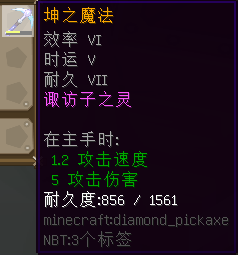
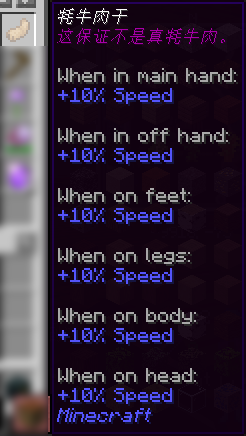
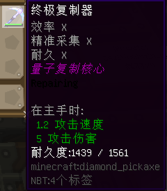

# 旧版装备道具

目前在喵窝世界尚具备价值的、在 *Minecraft* 1.13.2 及以前更新的物品。  
本页面中的物品暂时按（拼音）首字母排序。

### 风神十字弓

  
<small>（图片中模糊的附魔是玩家自行添加的附魔。如果能够提供完全未修改的物品图片，感激不尽。）</small>

* 【外形】弓，有附魔
* 【物品类型】远程武器
* 【作用】
  * 放在主手或副手上，可**大幅增加玩家行走速度**。同时，此效果会大幅扩大视场（FOV）。
  * 当作普通的弓使用。

### 坤之魔法

* 【外形】钻石镐，有附魔
* 【物品类型】实用工具
* 【作用】
  * 作为普通的钻石镐使用。
  * 来自旧版黑化怪，存世量极大。因原生拥有 **时运 5** 等附魔，在旧版常被用以制作「时运 10」镐子，以便挖开矿石。

### 牦牛肉干

* 【外形】兔子脚
* 【物品类型】普通物品
* 【作用】
  * 作为头饰佩戴或放在副手。随后，可以获得上图所示的加成。

### 樱花发饰

* 【外形】粉红色染料
* 【物品类型】普通物品
* 【作用】
  * 作为头饰佩戴。佩戴以后，可以获得上图所示的加成。

### 战神的巨斧

* 【外形】金斧
* 【物品类型】实用工具
* 【作用】
  * 作为普通的斧头使用。
  * 尽管没有任何加成，但拥有不可破坏（Unbreakable）的属性，因此无需担心耐久消耗。

### 终极复制器

  

* 【外形】钻石镐，有附魔
* 【物品类型】实用工具
* 【作用】
  * 作为普通的钻石镐使用。
  * 尽管没有任何加成，但原生拥有 **效率 10**、**精准采集 10**（尽管效果与 **精准采集 1** 无异）和 **耐久 10** 附魔，是喵窝的开矿神器之一。
* 【备注】
  * 该工具已知有两种变种，一种拥有 lore `量子复制核心`，而另外一种拥有 lore `(Socket)`。但两者的功能是一致的。
  * ~~现在也可以用[魔法书](legacy/inf2/items.md#附魔与消魔)制作功能完全一致的镐子了。~~
