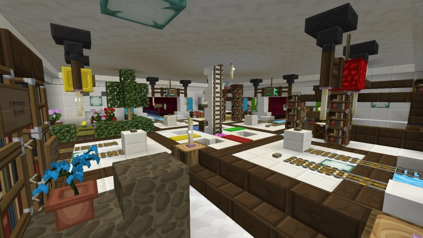

# 下界交通网

**下界交通网（又称下界地铁，Nether Subway）**是设在下界的公共轨道交通工程，分为主线（Y=7）与复线（Y=130）。其中：
- 主线以下界`(0, 7, 49)`为中心，连接主要热门聚落。因建设活动所涉Y坐标最低至5，也简称『Y5NS（Y=5 Nether Subway）』。
- 复线以下界`(0, 0, 130)`为中心，也即**基岩层之上**。主要服务于私人住宅与未登记聚落。

其起初由以*霞羽 `Akyuu`* 为首的玩家团队规划、铺设，后由*小爱 `Bersella_AI`* 负责维护与扩展。  
截至目前，下界交通网已联络16座聚落，里程达4.5公里以上。

主线所有路段采用冰、铁混合结构，同时支持行车、行船；行船时速度极快，一分钟内可跨越相当于主世界万米的距离。冰道里程亦是喵窝之最。

  
*樱华町站全景（摄于2019年5月19日）*

### 搭乘指南

请参见[下界铁路搭乘指南](tutorial/map-navi/railway-nether)。

### 建设标准

对于 2021 年以来新建的路段，**不再强制统一风格**；但仍要求有可供行舟的冰道。  
[此页](tutorial/building/railway-construction-standard)展示现有线路的规范，仅供参考。

### 历史

- 该工程最初于[2017年3月17日](https://bbs.nyaa.cat/d/954--)建成自浪花町到*霞羽* 家（后称“长方洲”）的试验路段，隧道宽、高为3米，仅铺设单条铁轨。  
- 在此之前，管理组成员*凤凰卷* 曾表达建设“下界城”之想法；试验路段公开时，其对*霞羽* 建议观望。[当年5月17日](https://bbs.nyaa.cat/d/987--)，其宣布放弃“下界城”规划，建设者因此放开手脚。  
- 此后三个月间，建设工作如火如荼：加宽隧道与站台，在铁轨之下引入浮冰以支持行船，设置电梯以供出入。大部分路段皆在此时期建成通车。  
- 2018年3月，经*小爱* 提议，*霞羽* 铺设并开通新北市——北沼路段。此后一年半，未尝有新路段接入。

- 2018年11月8日，因[服务器升级](https://bbs.nyaa.cat/d/1362-minecraft-1-13-2-aquatic-update)，原有电梯全部报废。交通网由于完全依赖电梯出入，因而停运。  
- 当年12月23日，*小爱* 主持电梯改造工作，在原电梯井内铺设爬梯，恢复交通网运营。

- 2019年1月25日，*霞羽* 宣布[退出一切维护工作](https://bbs.nyaa.cat/d/1362-minecraft-1-13-2-aquatic-update/17)。
- 当年4月11日至5月18日，*小爱* 主持[冰道翻修工作](https://bbs.nyaa.cat/d/1395)，将浮冰更换为性能更好的蓝冰。  
- 8月21日至9月17日，*小爱* 主持[延伸交通网至科技特区](https://bbs.nyaa.cat/d/1457)的工程。

- 2020年1月，*小爱* 与*花名 `AstroDreamer`* 联合新建月望谷——南沙港路段。
- 同月，*花名* 主持升级改造浪花町——长方洲路段，以达到现行标准。自此，除该路段三个站台之外，交通网全线统一了标准。

- 2021年7月 - *霞羽* 于下界基岩层之上（Y130）[建设复线](https://bbs.nyaa.cat/d/1870)。  
  同时期，*琪露喵 `Cirneko`* 开始了松木泉支线的修建。