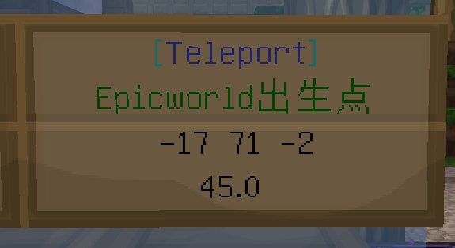

# 传送中心（Capcat传送牌）

主世界有数个传送中心，设置若干传送牌（以 Capcat 插件实现），可以快速到达**主世界以及其它维度（包括非原版的 EpicWorld、小游戏世界等）的各个位置**。
尽管现在已可借由`/mvtp [维度代号]`命令跨维度传送，但其仅可抵达各维度的世界出生点。要前往出生点以外的任意地点，还需依靠传送牌。

所有传送牌均收费，每次传送至少收费 1 节操。如若不能负担，可考虑其它低成本交通方式。
使用时，**对准写着所希望到达之目的地的传送牌，右键触碰即可**。请确保有足够现金支付传送费用。

下面可了解**由樱华町传送中心（一级车站）出发，可用的目的地；以及其它传送中心之概要**。请注意，由于现在传送牌可以被实时购买、撤销，以下列表仅作参考，具体请以当地实际情况为准。

*一块典型的传送牌。其中：* 
*第一行 —— [Teleport]* 
*第二行 —— 传送目的地描述* 
*第三行 —— 传送目的地坐标（X Y Z）* 
*第四行 —— 单次传送费用（节操）* 
*请注意，此处坐标不显示其所在维度（世界），须根据描述判断。* 

### 樱华町（一级车站）传送中心详情

?> 坐标：(207, 38, 300) 可以从大神殿南侧 (127, 62, 287) 进入

以下是樱华町（一级车站）传送中心目前可用的传送目的地。

| 目的地所在城镇（村落） | 单次传送价格 | 目的地坐标 (X, Y, Z) |
| - | - | - |
| 北风城 | 10 | 245, 73, -2285 |
| 浪花町 | 10 | 179, 79, 2325 |
| 阿库亚斯 | 10 | 2340, 89, 421 |
| 柚木小镇 | 10 | -2611, 79, 242 |
| 东海望 | 57 | 1700, 81, 1852 |
| 永恒霜风 | 60 | 4526, 65, 441 |
| 动漫流行馆 | 55 | 1527, 63, -1255 |
| 红魔城 | 60 | -3838, 71, -11 |
| 云落村 | 40 | -2471, 81, -2288 |
| 新北市（新北商城） | 60 | 860, 74, -3547 |
| 南沙港（二期） | 60 | -2799, 66, 3402 |
| 亡灵幻境（刷怪场安全屋） | 60 | 2795, 58, 2840 |
| 琥珀川（沼中） | 20 | -2499, 67, -3950 |
| 琥珀川（北沼） | 1 | -2524, 72, -4626 |
| 猹湾 | 45 | 1637, 63, 2297 |
| 喵窝科技特区 | 40 | -7737, 68, 4716 |
| 千里田町 | 10 | -1400, 66, -1000 |
| 艾尔 | 15 | 6991, 63, -643 |
| 格兰 | 9.9 | -3500, 67, 2761 |

### 诸传送中心一览

本表仅包含在**主世界**维度内的传送点。

若某处传送点新增**首个**可前往某非原版维度（世界）的传送牌，欢迎补充。

!> minigame维度已关闭，相关传送牌将不可用。

| 所在城镇（村落） | 坐标 (X, Y, Z) | 传送牌数量 |
| -- | -- | -- |
| 樱华町（一级车站） | 207, 38, 300 | 22 |
| 樱华町（万华街一期） | 451, 72, 283 | 23 |
| 樱华町（万华街二期） | 408, 66, 108 | 16 |
| 北风城 | 356, 74, -2322 | 12 |
| 浪花町 | 200, 69, 2564 | 21 |
| 柚木小镇 | -2444, 81, 268 -2450, 81, 268 | 30 |
| 阿库亚斯（风水商桥） | 2320, 89, 420 | 24 |
| 阿库亚斯（南站 / 二级车站前） | 2179, 86, 364 | 12 |
| 琥珀川（沼中） | -2477, 69, -3941 | 7 |
| 琥珀川（北沼） | -2519, 72, -4621 | 21 |
| 猹湾（教堂） | 1648, 63, 2306 和1648, 63, 2291 | 8 |
| 猹湾（林地） | 1679, 72, 2216 | 12 |
| 南沙港（二期） | -2871, 88, 3502 | 12 |
| 千里田町 | -1387, 67, -988 | 16 |
| 北溪台 | 5611, 35, -5860 | 10 |

?> `传送牌数量`指所有可供购买和使用的传送牌数量之总和。

----

请参阅[Capcat插件指南](space/plugins/capcat) 了解现行传送牌的使用详情（包括购买传送牌、付款方式等）。

如果希望寻找下界传送门，请参阅[下界传送门](nyaa/projects/nether-portal)。

关于各个维度（世界），请参见[维度列表](nyaa/worlds)。
