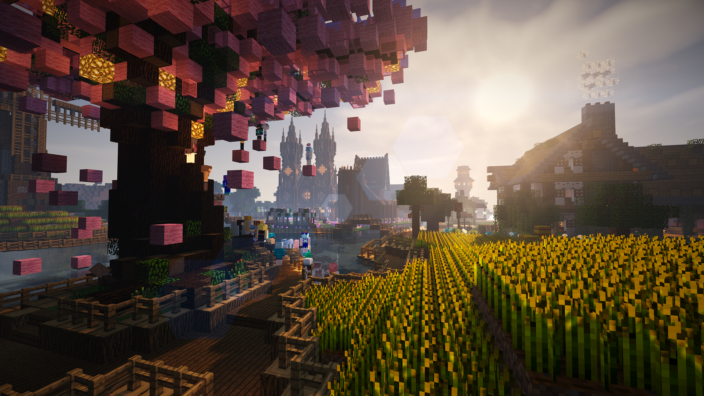
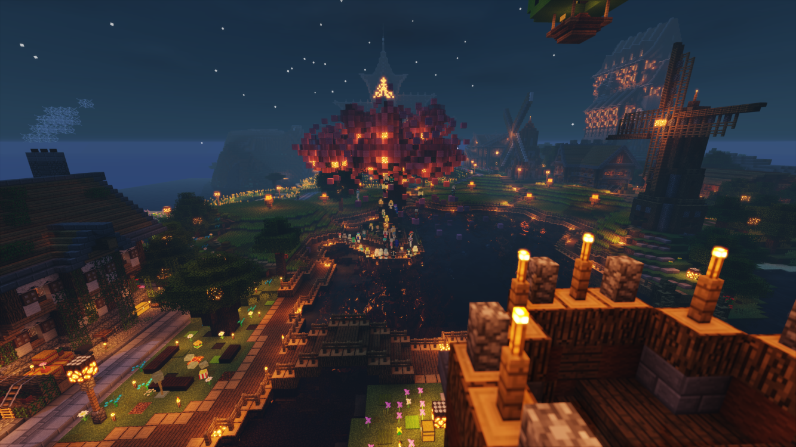

# 猹湾

> 很久很久以前，有一只可爱的 Cc。她带着来自毛玉的小伙伴们，一起来到了喵窝大陆。
>
> Cc 和她的朋友们怀着热情与憧憬，踏遍喵窝大陆，领略了无数风光。他们欣赏了樱华神树的落英飞舞，也体验了各大主城的异种风情。感受过极东凛冽刺骨的寒风，也亲历过月望谷亘古不变的风光。在这段旅程的最后，他们来到了南城边的这片小小港湾。
>
> 当时这里还只有一间小小的房屋。他们走到小屋前，欣赏着小屋精致的造型和周围种下的各色花朵。这时，一位穿着红色棉袄的老人从小屋里走了出来。
>
> “是圣诞老人！” Cc 高兴地叫了起来。
>
> “我不是圣诞老人……” 那位老人说道。“我是 Star，是这里的村长。”
>
> “那……村长好！这里还有其他村民吗？我也要和他们打招呼！” Cc 说。
>
> “这……实在抱歉。我建村以来一直希望能有其他人加入，只是一直没有遇到愿意留下来的人……” 老村长低声说道。
>
> “这么说……村长一直是一个人吗……” Cc 露出了同情的眼神。
>
> 老村长陷入了沉默。
>
> “那样的话！我要加入！我要成为第一个村民！” Cc说道。
>
> 老村长突然抬起了头。“这是……真的吗？你们要来这里定居？！”
>
> “恩！” 说着，Cc 转向了她的朋友们：“你们也愿意留下来吗？”
>
> 看着 Cc 充满决心的眼神，大家都点了点头。
>
> “那太好了！” Cc 高兴的说道。“村长以后再也不是一个人了！”
>
> 一丝泪光闪过老村长的双眼，随后，正如花开一般，笑容绽放在了老村长的脸上。他一定是很久都没有这么开心过了，笑得像个孩子一样，就连脸上的皱纹都如消失了一般。不只是村长，Cc 和大家也很高兴找到了住所。
>
> “谢谢！谢谢你们！……欢迎你们来到我的村子！” 老村长的声音中甚至带着一丝颤抖。
>
> “村长！这个村庄什么名字吗！” Cc 问道。
>
> “我还没有起名字呢！要不这会大家起一个名字？”
>
> “那太好了！我来起名字！我想想……我们叫这里 X 湾吧！X 代表了未知数，这也意味着我们村庄的未来将有无限的可能！” Cc 说道。大家都投来了赞成的目光。
>
> “那就这么决定了！” 老村长说道。
>
> 从此，X 湾便从喵窝大陆上诞生了。Cc 和她的朋友们很快建造了各自的新家。不仅如此，他们还为村庄修建教堂、旅店、图书馆。他们栽下桃花树，开垦麦田，种下了数不胜数的花朵，他们开辟荒地，铺设道路，为了能让后来的村民有地方建造自己的新家。他们日日夜夜付出的汗水和智慧，最终成就了如今的猹湾美景。
>
> 至于从什么时候开始，这里改叫了猹湾，已经无从可考。唯一的线索，可能是因为 猹 和 叉 发音相近，在漫长的岁月中，不知不觉产生了变化吧。

### 地理

（图片待补全）

猹湾东南面朝大海，西北背靠高山。南方为沙滩，中部为平原，而北部为高原和山脉。

地理位置上，猹湾北端与东海望隔岸相望，西临南方主城，东方不远处为东南主城与亡灵幻境。

### 交通

##### 铁路

一级铁路环线跨过猹湾南部的海面，并设有站点停靠。站点位于铁路环线南城站的东侧。

##### 传送

猹湾共有两个传送点，教堂传送点位于 `[1648, 63, 2306]` 和 `[1648, 63, 2291]` ，共设有 8 个传送木牌；它们的目的地与花费见下表：

教堂传送木牌列表

| 传送目的地 | 目的地坐标 | 花费 | 
| --- | --- | --- |
| 西方主城教堂顶端 | | 45.00 |
| 动漫流行馆树顶 | | 10.00 |
| 北方主城 Arch Linux 顶端 | | 10.00 |
| 红魔馆顶部 | | 10.00 |
| 南方主城市政厅前 | | 10.00 |
| 永恒霜风热气球顶 | | 10.00 |
| 东方主城海天之门顶端 | | 10.00 |
| 黑化前线空中平台 | | 110.00 |

林间传送站位于 `[1679, 72, 2216]` 周围，共有 12 个传送木牌，其中 3 个已投入使用。见下表：

林间传送站木牌列表

| 传送目的地 | 目的地坐标 | 花费 |
| --- | --- | --- |
| 极东某屋顶 | | 100.00 |
| Lv.16 黑化沙漠 | | 45.00 |
| 琥珀川沼原飞行塔 | | 100.00 |

##### 内部交通

猹湾地铁正在规划中。

### 建筑

猹湾的建筑各具风情，对建筑的样式没有过多的限制。从传统的中世纪城堡，~~到现代风格的牛棚~~，再到空岛、树屋等等。我们不会限制你的想象力。但在建设中请与周围建筑保持和谐，不要过于突兀。

猹湾东部的人工平原目前为第一自建区。房屋可沿路建设，并合理设计安排，并控制规模。如果希望开挖面积过大或过深的地下室，需要提前告知。

### 公共设施

猹湾拥有多处可供公共设施，即使你不住在这里，也可以自由使用。

##### 熔火之心酒店

酒店大楼位于猹湾西部，一楼为“龍王錢莊”本部，二楼以上为酒店。如希望入住，请联系我们，我们会为你办理入住手续，并提供免费的行李搬运服务。你随时可以离开酒店，办理退房手续后，我们也可以提供行李搬运服务。

酒店二楼为餐厅，三楼以上为客房。内部较为复杂，小心迷路。

##### 龍王錢莊本部

位于猹湾西部的熔火之心酒店一层。提供储蓄和贷款业务。取款和还款的手续费相比其它各处更低。

##### 图书馆

猹湾图书馆位于熔火之心酒店大楼北。一层为藏书室，目前藏书有《Ankou54的？？？》全集、《猹湾往事记》全集、《猹话会》全集、《南城周刊》全集等。

二层和三层为 “仓鼠之心” 主题展览，其中可以欣赏到喵窝的大部分装备。

由于图书馆使用了大量展示框，可能会很卡。

##### 自动树场

位于西南角的实验基地内。可以用于快速获取树苗或原木。请按照木牌的指示使用。机器只支持橡木和白桦木，在使用时请自备骨粉。

##### 自动熔炉组

位于实验基地内。为 23 核无缝填料熔炉组，并支持盒进盒出的大量全自动烧烤。请认真阅读熔炉组边上的使用手册后使用，建议自备燃料。

##### 村民交易中心

位于麦田北侧。拥有各种交易项目（主要为附魔书）。请自带绿宝石或材料，并在进入后收起主副手的武器。

注意，村民培育中心位于兔子洞内。未经允许，请不要进入兔子洞中！常用的交易项目都可以在村民交易中心找到。

##### 红石音乐

位于教堂地下室。地下室入口位于教堂最深处十字架之下。目前可供欣赏的音乐有「ハレ晴レユカイ」一曲。

加入

> 欢迎热爱建筑或游戏技术的喵们加入我们。由于我们对聚落有一定的规划要求，如果希望定居猹湾，即使是在自建区，也请在实际建设前联系我们。

