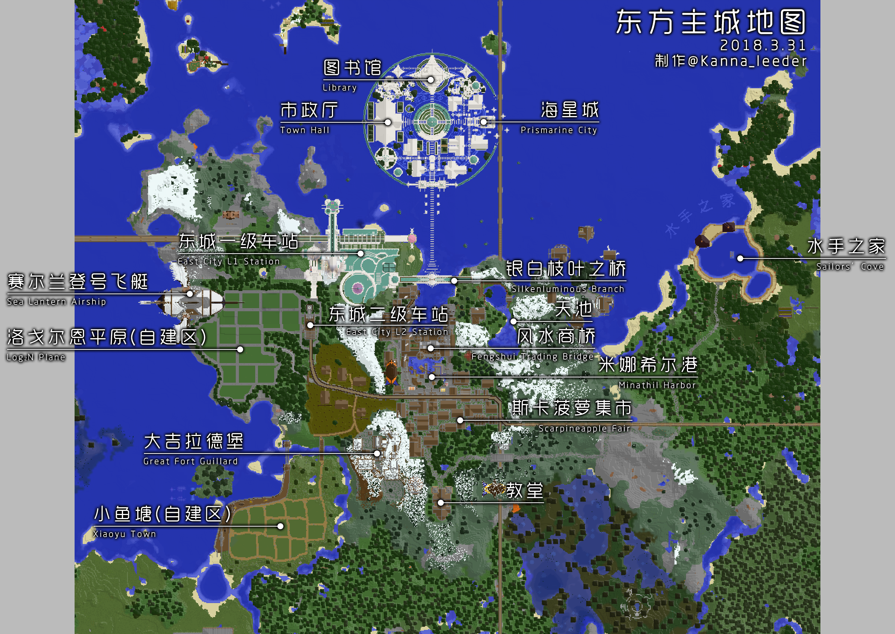

# AQUA'S

-   **旧称：东方主城（简称“东城”）**
-   类型：公共规划区
-   范围：(1584, -172), (3162, 808)
-   名誉城主：Cc  `Aqua_Cc`
    

## 城市简介

AQUA'S*（读作：阿库亚斯）* 为喵窝原『五大主城』之一，位居大神殿东方，是著名的交通及文化中心。

经历漫长的波折后，2018年3月10日，在水之女神 *Cc·阿库娅 `Aqua_Cc`* 的诞生纪念日这一天，象征海洋与星空的东方主城重新开放。后改称现名。

### 城市地图

### 海星城

一日，魔法少女花灵来到了AQUA'S北方的海域，召唤出了巨大反重力魔法阵。不久，海星城在魔法阵之上建成了。由于魔法阵的作用，建筑、花园、空中平台能够漂浮在空中。最初建造的AQUA'S**市政厅**和**图书馆**就位于海星城内。在魔法阵的影响之下，AQUA'S范围内还形成了数个**空中岛屿**。

海星城的建筑为幻想风格，多具有超常规的建筑结构。由于魔法阵的作用过于强大，建筑物的底部可能会因受力过大而碎裂。

### 银白枝叶

作为通往海星城的天梯之起点，银白枝叶之桥却在海星城建成之前便已存在，没有人知道它的历史，但经过翻修，它现在是通往海星城的重要门户。

### 米娜希尔港

由海星城沿天梯一路走下，眼前就是AQUA'S最为繁荣的港口——米娜希尔港。曾经的米娜希尔港只是位于南侧的小镇，但随着海星城的建立，越来越多的观光客来到了这里，从而极大促进了小镇与外邦的经济往来。随后建成的**风水商桥**则成为了整个港口的中心。曾经小镇的民居如今则作为**斯卡菠萝集市**而依旧繁荣，各家均会在一层开设商铺来吸引过往的旅客。

米娜希尔港整体为蒸汽朋克风格，建筑密集，处处展现出工业化的气息。

### 赛尔兰登号飞艇

看到米娜希尔港的无限前景后，影之商人驾驶着赛尔兰登号飞艇，带领他的船队来到了这里。巨大的飞艇飞过港口上空时，所有人都为之惊叹。当时也许没有人会想到，曾经的影商人是一名在世界各地掠夺的海盗。如今还能在赛尔兰登号飞艇中找到各地的奇珍异宝。

### 洛戈尔恩平原

由东方而来的铁路穿过港口和麦地，最后停在了洛戈尔恩平原。这片平原最早由探险先锋雷姆开辟，四周树木环绕。未来的这里将是一片新的城市。

### 小鱼塘

与高度发展的港口不同，这里则充满了乡间气息。定居在这里的居民都因远离港口的喧嚣而得到心中的宁静。

### 大吉拉德堡

古老的城堡坐落在山顶险要之地，破损不堪，充满幽暗的气息。四周的居民每日都能看见城堡的高塔，但却从不敢真正步入它的大门。

### 锂钴港

?> :information_source: **【位置】**  
锂钴港写字楼坐标 `（2080,81,339）`，在一级车站西南，二级车站西北，楼顶有金色H标识的停机坪。可通过轨道交通二号线锂钴港支线抵达**锂钴港港口**及**锂钴港写字楼**站。

**锂钴港**是由喵窝科技风投人 Librazy 出资并建造的一个综合性开发区，坐落于**赛尔兰登号飞艇**正下方**洛戈尔恩平原自建区**的一处海湾上，由**锂钴海湾港口**与**锂钴港写字楼**组成，意在为喵窝与东城的高新技术发展出一份锂。

**锂钴港港口**为一处天然的海湾港口扩建而成，水深、避风，有良好的通航条件，风景优美，同时兼有客运、工商业码头。航线近可方便往返[dreamine庄园](/nyaa/realms?id=dreamine庄园)，远可通航[北风城](/nyaa/realms/northwind)、[新北市](/nyaa/realms/newnorth)、[永恒霜风](/nyaa/realms?id=永恒霜风)以及[樱华町](https://wiki.nyaa.cat/#/nyaa/realms/sakurakacho)。

**锂钴港写字楼**为高档SOHO写字楼，为喵窝特别是东城的高新技术人才提供了SOHO的绝佳环境。**锂钴港写字楼**兼可作为办公、商业、住宅使用，通勤方便，室内空间提供多种户型，且提供完善的物业、安保和管理服务。进入**锂钴港写字楼**原则上不可持有武器，写字楼入口处安装有先进的安保设施，保障了港区内业主的安全。

现在锂钴港开店可以申请[创业基金](https://bbs.nyaa.cat/d/1564-npc)！

## 居民指南

### 交通

AQUA'S具有三个铁路站点以及两个铁路支线站点，两个飞行塔，多个城内折跃点以及两个传送站。

#### 铁路

AQUA'S连接西侧的一级铁路干线、南北的一级铁路环线以及东侧的二级铁路霜风线。铁路并不直接相连，它们接入AQUA'S不同的位置。其中：

-   **西侧干线**接入一级铁路车站（即阿库亚斯站）；可通过自动道岔驶入**锂钴港支线**前往**锂钴港港口**站以及**锂钴港写字楼**站；
-   **北侧环线**接入天池北侧（即阿库亚斯北站）；
-   **南侧环线和霜风线**则接入二级铁路车站（即阿库亚斯南站）。

除南侧铁路环线和霜风线之间的换乘可以直接在**阿库亚斯南站内**进行外，其余的换乘均需要出站换乘。

#### 飞行塔

一级铁路车站飞行塔是位于AQUA'S 一级铁路车站旁的白色高楼。顶层 `(2210,131,225)`  提供三向（北/东/西）助跑起飞平台。

?> :information_source: **【进入办法】**  
走进高楼，至阶梯入口 `（2185,91,296）` ；上楼至第二层 `（2185,105,294）` ；右转，继续上楼，直到顶层。

锂钴港写字楼飞行平台位于锂钴港写字楼七楼 `(2083,110,330)` ，可从楼南侧电梯上至六楼后沿楼梯到达，提供西向助跑平台。

#### 折跃站

折跃为AQUA'S内部传送方式，用于城内诸片区之间以及城际传送。折跃点遍布AQUA'S各地，集中于**二级铁路站（南站）**和**风水商桥**，**外形为末地折跃门**。

其中，**风水商桥**提供通往樱华町和三大主城之城际折跃。

#### 传送站

木牌传送站位于**风水商桥上**和**二级铁路车站（南站）北侧**。港口大桥拥有 24 个传送牌，而二级车站拥有 12 个。

### 商业

AQUA'S的主要商铺位于**斯卡菠萝集市**和**风水商桥**。  
其中，在风水商桥一层和二层共有 8 间店铺；而集市有 6 间独立店铺。集市有部分住房要求在一层开设商店。

与大部分商店街不同，AQUA'S的店铺**需要购买**。闲置的店铺在内部会有木牌表示，请在联系管理组后，按照屋内木牌的标价购买店铺。购买后请进行内部的装修。

### 住宅

AQUA'S提供短期居住的驿站、可购买的成品房和自建区。

#### 驿站

矮人矿工驿站位于港口大桥西侧。入住驿站请在房间门口贴上自己ID的木牌，离开后请将房间恢复至原样，并移除自己的木牌。驿站仅提供短期居住，如希望定居请购买成品房或至自建区建设房屋。

#### 成品房

AQUA'S范围内的大部分房屋均为可购买的成品房。它们位于：

-   海星城内；
-   斯卡菠萝集市南部建筑群；
-   大麦田（集市以西）内；
-   天池北侧空岛周围；
-   锂钴港写字楼内。

闲置的房屋在内部会有木牌表示，请在联系管理组后，按照屋内木牌的标价购买房屋。购买房屋后请拆除屋内的闲置木牌，并**按照指示进行内部装修**。对于在地面上的房屋，装修时需注意：

-   不得更改房屋框架结构；
-   不得更改房屋的外墙；
-   不得更改房屋的楼层布局；
-   可以在符合设定且美观的情况下少量更改房屋的外部装饰；
-   可以修改房屋的地板，但不能修改屋顶。

对于在天空中的房屋，有以下的额外要求：

-   不得修改房屋一层的地板；
-   不得修改楼梯（除特殊注明）。

对于房屋装修的标准以具体屋内的木牌指示为准。一些成品房会要求同时开设商店，请按照要求布置。

#### 自建区

AQUA'S具有两片自建区——**洛戈尔恩平原**和**小鱼塘**。

自建区要求**基于主要木框架建造房屋**。主要建材为木材、石砖。建筑高度不得超过飞艇底部（120格），围墙不要砌在路边台阶上、也不要高于 2 格（矮墙）。在小鱼塘不建议铺设围墙。

可以挖掘自己地块水平线以下最深 8 格的区域作为地下室；更深层区域不允许挖掘。地下室不能超出自己地块范围。

仅自建区周围的树木可以砍伐，砍伐后需要补种同种树木。**自建区范围外的树木禁止破坏**（包括树叶）。AQUA'S全范围地下禁止挖矿。

自建区内符合要求的新住宅可获得最高 5 万节操的补贴。补贴最高额度在未来可能变更。
