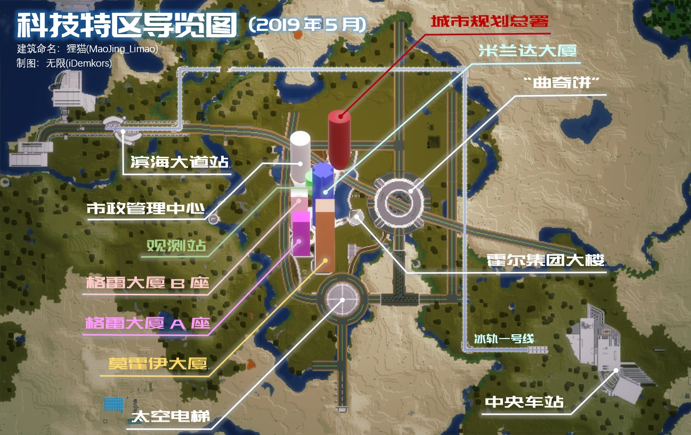

# 科技特区

喵窝科技特区位于主世界 -7700, 4500 附近，是喵窝的工业基地。

由于长久以来依赖黑化产出的小农经济，在黑化退出喵窝主世界舞台后受到巨大冲击，紧迫的生产需求将喵窝推向了工业化发展的道路。2019年5月15日，工业化项目在此启动。

特区的基础建设由建筑师曲奇 Round_Cookies 率先建造。先前，其将此规划为“科幻”风格，后停止建设长达两年有余；直至2019年5月15日，特区由凤凰卷 phoenixlzx 征用，转型为近未来工业城市。

### 交通

特区内设置高速冰道交通和普通公路交通。

往来其他区域的各种交通手段目前建设中。

### 公共服务

##### Space Elevator

飞行弹射塔和到各地的折跃门。

##### 格雷大厦 A 座

(WIP) 各类工业生产设施

##### 格雷大厦 B 座

(WIP) 各类工业生产设施

##### 莫霍伊大厦

(WIP) 各类工业生产设施

#### 米兰达大厦

(WIP) 各类工业生产设施

##### 曲奇饼

村民交易中心、地下交通集散。

##### [待建] 原材料仓储中心

原材料存储、输入和输出。

##### [待建] 产品仓储中心

成品输入输出。

（待补完）

### 工业发展和建设规则

- 如未特殊说明，工业生产设施为喵窝全体玩家所有，应当共同爱护、维护并协调改进。
- 公共生产设施的产出为实际投入原料并运作的玩家所有。如此过程涉及多名玩家，请自行协商分配。
- 生产设施的设计应首选最高效率且最低算力消耗的方案
- 每个生产设施单元不宜过大。如需要提高产量，请建设多个单元。
- 每个生产设施单元应有独立的开关控制。不需要生产时，整个设施应处于关闭状态。
- 由于 TNT 无法在主世界破坏方块，需要使用 TNT 的生产设备应在科技特区中建设原型机，并按需复制到 Epic 等资源世界使用。可联系管理员协助此操作。
- 如无特殊必要，工业生产设施应建设在工业大厦内。
- 工业大厦的风格以钢筋混凝土（混凝土/石英）和玻璃为主，在外部即可看到生产设施的状态为佳。
- 使用流水管道替代传统漏斗降低算力消耗。对于高产设备，应有独立的管道并避免接入分类机。
- 对于需要大量物品、较远距离传输的生产设施，可提供折跃门支持。

### 私有工业产能设施规范

- 必须以聚落为单位，占用工业区中的特定地块建设。
- 所有产能设施必须严格遵照**工业发展和建设规则**设计制造。
- 私有工业区块中的设施由相应聚落负责维护。

（待补充）
