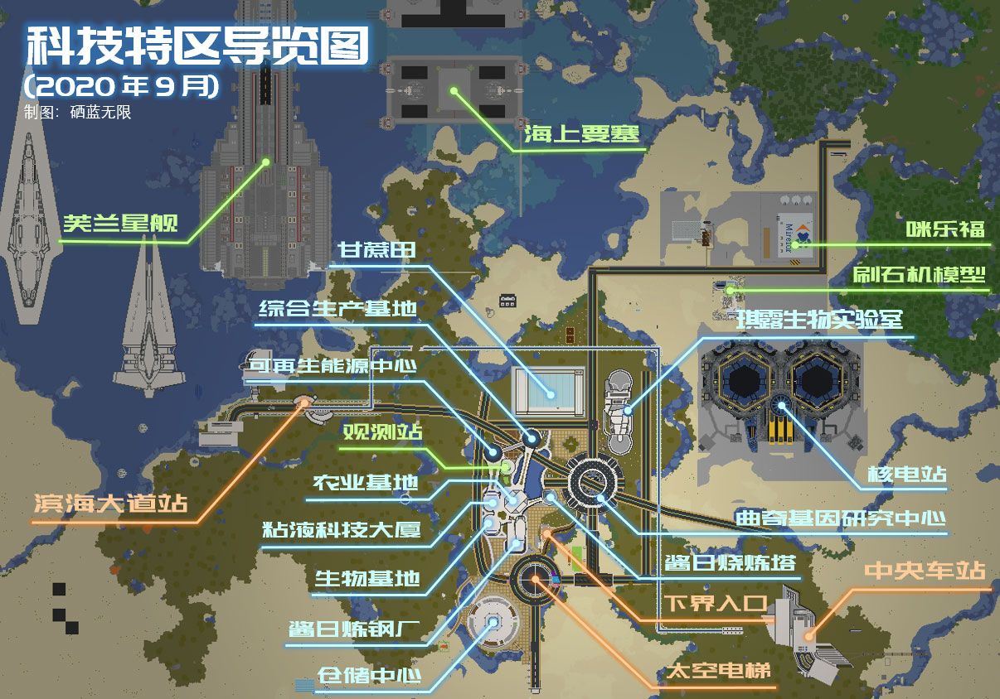

# 科技特区

喵窝科技特区位于主世界 `(-7700, 4500)` 附近，是喵窝的工业基地。

由于长久以来依赖黑化产出的小农经济，在黑化退出喵窝主世界舞台后受到巨大冲击，紧迫的生产需求将喵窝推向了工业化发展的道路。2019年5月15日，工业化项目在此启动。

特区的基础建设由建筑师曲奇 `Round_Cookies` 率先建造。先前，其将此规划为“科幻”风格，后停止建设长达两年有余；直至2019年5月15日，特区由凤凰卷 phoenixlzx 征用，转型为近未来工业城市。

## 交通

特区内设置高速冰道交通和普通公路交通。

往来其他区域的各种交通手段目前建设中。当前已开通的对外联络方式：

- **传送牌** 樱华町主传送站、万华街传送站均设有科技特区站点；
- **太空电梯**（Space Elevator）飞行塔 `(-7756, 4756)`，同时设有到各地的折跃门；
- **下界交通网入口** `(-7742, 4658)`，位于“太空电梯”地下避难所。由**炼钢厂东侧**地下通道进入。

?> :information_source: “太空电梯”同时是全喵窝最高建筑——建筑上最高的方块位于Y=255；由地面计算，高度达187米。

## 公共生产建筑

!> `建造者`仅列出设备的主要建造者。如无特殊说明，带有“原名”条目的设施的建筑均为曲奇 `Round_Cookies`团队建造。  
如果游戏内设施附近存在使用指南与条目内冲突，以游戏内的为准。  
维护并非义务性，为热心且有能力维护的玩家提供参考。  

#### SAKURA DYNAMICS 樱花动力可再生能源中心
提供可再生能源（海带）的自动生产和输出  
- *原名：市政管理中心*  
- 位置：*`(-7793, 4558)`*
- 设备建造：*胡萝卜`RDCarrot`*
- 使用指南：第4层收集并烘干海带；第6~13层生产海带。
  - 产出的干海带与（原）海带自动装盒，自行取用，建议整盒取用时补充空盒。
- 维护：
  - 补充空盒（放入打包机上方的箱子）、燃料（放入烟熏机后部的箱子）。*

#### 酱日烧炼塔
NxN 核自动熔炉/烟熏炉/高炉机  
- *原名：霍尔集团大楼*
- 位置：*`(-7730, 4620)`*
- 设备建造：*日酱 `Skill_Sun`*
- 使用指南：
  - 一层入口处有楼层指示；烟熏炉与高炉分别对特定物品的烧制有加速效果，请自行查阅Minecraft Wiki以选择合适的楼层。
  - 请自行携带燃料。
  - 在标有煤炭的箱子放入燃料，点击对应的按钮会加注燃料。
  - 在标有圆石的箱子放入要烧炼的物品，点击对应的按钮会分配物品并开始烧炼；注意按钮只需要按一次，之后会自动分配直至所有物品都被烧炼。
  - 打开收集处的拉杆，烧炼完成的物品会被收集进入箱子。**收集完全后请关闭拉杆。**
- 维护：
  - 进入舱室，检查各个熔炉是否有不可烧制物品或非燃料卡住。

#### 酱日炼钢厂
六联刷铁机
- *原名：莫霍伊大厦*
- 位置：*`(-7764, 4668)`*
- 设备建造：*日酱 `Skill_Sun`*
- 使用指南：
  - 在一层或二层均可挂机；一楼仓储有收集的铁锭和红花，请自行取用。
- 维护：
  - 进入二层刷铁厂核心；二层不应当有漫游的铁傀儡，如果有可以击杀（小心）。
  - 正常每层应当具有三个村民；观察村民是否正常存在。
  - 正常溺尸坐着矿车会随着脉冲每次在管道的某层停留一下，最终掉落在管道底部的铁轨上，并进入上升气泡柱周期往复；观察溺尸是否消失，是否呈周期性运动；如果溺尸卡在底层，可以推一下。
  - 观察是否有脉冲：如果中继器没有周期性点亮，即脉冲丢失；此时应当关闭左侧的拉杆，等待10s作用再开启。
  - 观察脉冲是否错位：如果听不到栅栏门周期性的两声开闭的声音，应当检查发射器内水桶是否是常空状态；如果是常满状态，点击发射器上的按钮使水倒出。**注意这个问题发生得很普遍，建议每次挂刷铁厂都检查一下。**
  - 如果以上问题均不存在，但是长时间仍然没有刷铁傀儡，请关闭管道底部的动力铁轨的控制拉杆，让溺尸停留在底部至少一个mc天，让村民完整地睡一个夜晚，再让溺尸重新进入循环。

#### 综合农业生产基地
- *原名：米兰达大厦*
- 位置：*`(-7765, 4623)`*
- 用于生产常规农作物。**当前暂未开发。**

#### 综合生物生产基地
- *原名：格雷大厦A座*
- 位置：*`(-7869, 4659)`*
- 用于建设各种生物来源的自动生产设施。一层为大厅和仓储，二层以上自行规划建设产能设施。   
  当前设有：
  -  二层：简易羊毛自动生产装置。

##### 简易羊毛自动生产装置
- 设备建造：*`CitingNutria`*
- 使用说明：设备西侧收集箱子内收集羊毛，请自行取用。
- 维护：
  - 剪刀补充：像发射器上方的漏斗中补充剪刀。

#### 粘液科技大厦
- *原名：格雷大厦B座*
- 位置：*`(-7808, 4605)`*
- 用于生产粘液球。**当前暂未开发。**

#### 综合生产基地
小型自动化生产设施，例如铁轨复制机、地毯机等
- *原名：城市规划总署*  
- 位置：*`(-7769, 4550)`*
- 设备建造：*蘑菇牛`Nekotara`*
- 使用说明：
  - 铁轨复制机：拉下拉杆开始刷铁轨，离开时请关闭；对应的箱子收集产出的铁轨请自行取用。
  - 地毯机为自动控制，箱子中不满会自动开启，拉杆用于停止自动补充，长时间不用请关闭；对应的箱子收集产出的地毯请自行取用。*注意由于地毯生产速度远高于漏斗收集速度，有时需要手动控制开关以防止机器频繁停启。*

#### 曲奇基因研究中心
村民繁殖基地、交易所
- *原名：曲奇饼*  
- 位置：*`(-7684, 4596)`*
- 设备建造：*日酱 `Skill_Sun`*，*`etwxr9`*（打折系统）
- 使用指南：
  - 村民交易所和打折系统位于顶层，繁殖机位于地下，由四个支柱的水电梯上下。
  - 打折系统使用：
    1. 选择需要执行打折的村民。
    2. 拉下对应村民的拉杆，此时后端铁路变轨。
    3. 点击按钮，此时打折大师将来到村民位置，并将村民转化为僵尸村民；如果打折大师不对村民攻击，请稍稍远离至僵尸失去视野的地方以消除仇恨。 请勿离开此处避免僵尸村民被刷掉。
    4. 关闭拉杆，打折大师应当自动回到原始位置。
    5. 使用喷溅虚弱药水和金苹果治疗僵尸村民。僵尸村民完成治疗前请勿离开此处，避免僵尸村民被刷掉。
    6. 此时被恢复的村民的交易应当都打了骨折；注意交易次数仍然是有限制的；注意一个mc日同一个村民只能打折一次。

#### 巨型半自动甘蔗田
全窝最大甘蔗田。为节约服务器资源，全自动收割方案被摒弃，转而采用按需启动的联合收割机
- 位置：*`(-7692, 4507)`*
- 建造：*恋恋`Nekoishi_`*
- 使用说明
  1. 检查：收割机停止工作时，手动开关应当处于关闭[power=false]状态，飞行器应当停靠于甘蔗农场东侧的墙面；如果不是请勿开启，并联系维护者。
  2. 开启：手动开关置于开启[power=true]状态，此时飞行器应当向西运行并来回往复收割；飞行器停止前不得离开农场。
  3. 关闭：手动开关置于关闭[power=false]状态；注意此时飞行器并未停止工作；直到飞行器重新停靠到东侧墙体时方可离开。
  4. 空盒补充：左下箱子为补充的空盒的投放处，建议整盒取用时补充空盒。

#### 琪露喵的超生物实验室
四联刷怪笼刷怪塔。生产苦力怕、女巫、骷髅之主要战利品。  
- 位置：*`(-7659, 4495)`*
- 建造：*琪露喵`Cirneko`* ， *`CitingNutria`* ， *日酱`Skill_Sun`*
- 使用指南：
  当前设施前门封闭，由一条爬梯`(-7665,4508)` 下行进入设施内部。地面灯黑，注意安全。  
  挂机最佳地点在主管道周围的手动杀怪点。  
  拉杆开关控制切换自动模式/手动模式；离开时请切换回自动模式。  

#### 猪人塔
生产腐肉、金粒及经验球；主世界获取经验最快的场所
- 位置：特区东北边界处*`(-7297, 4144)`*。  
- 当前维护者：`Coco`

?> :information_source: 猪人塔正在整修，当前暂不开放。

#### 狸氏仓储中心
- 位置：*`(-7807, 4768)`*
- 原材料存储、输入和输出。**当前建造中。**

#### 自动化刷石机、木材厂模型
- 该设备依赖TNT（在主世界无效），在特区仅作展示之用。
- 当前已复制到 EpicWorld 出生点西南处 `(-410, 706)`；当地可正常生产，提供**圆石及各种木材（除黑橡木以外）**。

### 科技特区外公用工业生产设施
记录科技特区以外公开公用的工业生产设施。这些设施可能归属于个人、集团、聚落等，并开放使用权限。  
使用这些设施请注意遵守所在地区的要求。  

| 设施     | 简介                                       | 位置             | 交通               |
| ------ | ---------------------------------------- | -------------- | ---------------- |
| 末地蜜蜂农场 | 生产蜜蜂产品及蜜蜂繁殖基地 所属：[无极限拉玛控股（集团）有限公司](https://bbs.nyaa.cat/d/1293/22) | 末地出生点附近 | `/mvtp world_the_end` |
| 静静渔场 | 生产守卫者之主要战利品 by `Leon_Xu` | 主世界 `(5300, 4965)` | 万华街传送站点有传送牌直达 |
| SK反应堆 | 潜影贝刷怪塔 所属：松木泉 | 主世界 `(4906, 5091)` | 万华街传送站点至松木泉再行至此处 |
| 半自动末地养鸡场 | 生产各种鸡产品和凋零玫瑰 by `tcdw` | 末地出生点附近 | `/mvtp world_the_end` |
| 半自动制冰场 | 生产冰 by `tcdw` | 主世界 `(-390, -3640)` | 向新北市以西方向飞行 |

## 工业发展和建设规则

- 如未特殊说明，工业生产设施为喵窝全体玩家所有，应当共同爱护、维护并协调改进。
- 公共生产设施的产出为实际投入原料并运作的玩家所有。如此过程涉及多名玩家，请自行协商分配。
- 生产设施的设计应首选最高效率且最低算力消耗的方案
- 每个生产设施单元不宜过大。如需要提高产量，请建设多个单元。
- 每个生产设施单元应有独立的开关控制。不需要生产时，整个设施应处于关闭状态。
- 由于 TNT 无法在主世界破坏方块，需要使用 TNT 的生产设备应在科技特区中建设原型机，并按需复制到 Epic 等资源世界使用。可联系管理员协助此操作。
- 如无特殊必要，工业生产设施应建设在工业大厦内。
- 工业大厦的风格以钢筋混凝土（混凝土/石英）和玻璃为主，在外部即可看到生产设施的状态为佳。
- 使用流水管道替代传统漏斗降低算力消耗。对于高产设备，应有独立的管道并避免接入分类机。
- 对于需要大量物品、较远距离传输的生产设施，可提供折跃门支持。

## 私有工业产能设施规范

- 必须以聚落为单位，占用工业区中的特定地块建设。
- 所有产能设施必须严格遵照**工业发展和建设规则**设计制造。
- 私有工业区块中的设施由相应聚落负责维护。

## 注意事项

- 为避免造成持续卡顿影响游戏，单个方块空间的最大实体挤压数量是 4 （原版默认 24）。任何与实体有关的生产设施不得造成实体积压，过度密集的实体将自动窒息死亡。

（待补充）

- - -
## 在这里，你还可以……
#### 剿匪！
受基因研究所影响，特区东部广大沙漠中，时而有一至三支**掠夺者巡逻队**入侵。在确保自身安全的前提下，你可以出城巡逻剿匪；回城前喝牛奶（以免触发袭击）。

#### 捉猫！
炼钢厂、基因研究所周边是主世界已知的少数可生成野猫的场所之二。若有猫站立，且**总是试图逃离你**，则此猫可捉。  
驯服后应将其带离该设施以外百米，以便野猫持续生成。最佳方式是经由下界带离——可从“筑梦庄园”站安全带出（或借助“魔力调教棒”从任意站点带出）。

#### 游览！
在城区以北海面，有一处海上科幻要塞；不远处漂浮着主世界最大飞船——“芙兰星舰”。该舰在先前版本用于开设副本、举办活动，现已放弃，无法进入。  
据悉，该舰为*芙兰 `Lieselotte`* 所建。
