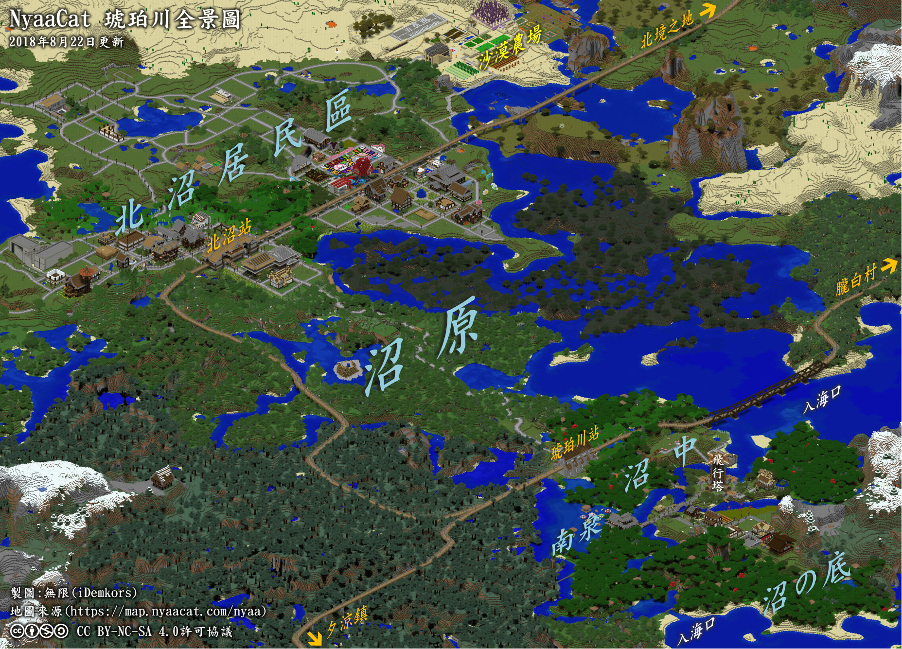

# 琥珀川

喵窝西北重镇琥珀川，蜿蜒纵横千里，养育着山脉与黑森林。  
琥珀川拥有百万平方（1400×1500）的山川平原，飞行塔和三条二级骨干铁路交汇于此。  
当前玩家聚集在沼中区和北沼区，尤其北沼。  

## 地貌

  
*琥珀川全景图 / 大小：885KB / ©无限 / CC BY-NC-SA 4.0*

琥珀川主要聚集区（沼中）在琥珀川入海口处，四周环绕着黑森林。琥珀川流域内包含数个平原和山脉地貌。

琥珀川主要分为沼原、北沼、南泉和沼の底区域。

## 交通

琥珀川流域的海原電鉄拥有三条二级电气化铁道干线，东至胧白村、新北市，西南至夕凉镇、新维加斯、红魔城，北方通达北境之地。

流域内设有两座车站，分别对接沼中区、北沼区；一座飞行塔，位于沼中。

## 建筑

琥珀川为现代日式乡村，建筑风格偏向日式木制一户建和庭院建筑，有少量石质或水泥建筑。

北沼区提供大量地块供玩家自建。建造时请注意：

- 建筑高度不超过当地车站/神社的高度、围墙不要砌在路边台阶上、也不要高于 2 格（矮墙）；
- 住民可挖掘自己番地水平线以下最深 12 格的区域作为地下室等，更深层区域不允许挖掘。

## 公共服务

- 飞行塔 (-2500, -3970)
- 温泉浴场 (-2618, -3978)
- 琥珀神社 (-2548, -3836)
- 琥珀川站 (-2567, -4101)
- 北沼站/北沼传送站 (-2519, -4621)
- 沼中传送站 (-2477, -3941)
- 公共农牧场 (北沼居民区以东沙漠地区)

~~大富翁游戏场 (北沼居民区东部)~~

## 著名景点
### 宝蓝之家
玩家*宝蓝 `Takaranoao`*在北沼的家位于`(-2285, 65, -4574)`，是一座典型的日式木结构建筑。建成后，因*宝蓝* “阔别”喵窝多时，邻居们便于其门前、屋内插木牌，留言多为对*宝蓝* 之思念，以及对其**爽约（放鸽子）行为**之调侃；随后，此风气扩散到全窝，热心玩家纷纷到此驻足观望、增加留言，内容则更多偏向“为插牌而插牌”。

由于告示牌数量过多，在**较低端平台**上进入*宝蓝* 家（尤其在大堂内），**游戏帧率会显著下降**。以GeForce 940MX显卡为例，背向*宝蓝* 家时，帧率在60\~82fps之间；面向*宝蓝* 家，则帧率减至34\~42fps，**近乎减半**。

#### 那么告示牌究竟有多少？
Good question。截至2019年7月28日，外人在*宝蓝* 家及周边留下的告示牌至少达**337个**。  
屋顶另有两座形似告示牌的巨型雕塑。
分区域统计如下：

|区域|数量|备注|
|-|-|-|
|大门前喷泉及地下室|1|另有3个应为*宝蓝* 所留|
|大门前第零排|1|X坐标：-2289|
|大门前第一排|27|X坐标：-2287|
|西南空地|1| |
|西北空地|0|另有1个应为*宝蓝* 所留|
|大门框|4|另有1个应为*宝蓝* 所留|
|玄关|16| |
|前台及两侧|10|另有1个应为*宝蓝* 所留|
|前台左/右后方|6| |
|南门房|15| |
|北门房|15|另有1个应为*宝蓝* 所留|
|大堂西面墙|31| |
|大堂南面墙|4| |
|大堂北面墙|21| |
|大堂西北角|17|X坐标：-2268至-2266 Z坐标：-4582至-4584|
|大堂西南角|8|X坐标：-2270至-2265 Z坐标：-4563至-4569|
|大堂前一排|12|X坐标：-2270至-2268 不含西南、西北角|
|大堂前二排|18|X坐标：-2267至-2265 不含西南、西北角|
|大堂前三排|62|X坐标：-2264至-2262|
|大堂前四排|27|X坐标：-2261|
|大堂前五排|24|X坐标：-2259至-2258|
|大堂前5.5排|9|X坐标：-2257|
|内房|2|另有5个应为*宝蓝* 所留|
|地下室|2|另有50余个应为*宝蓝* 所留|
|后门前|4| |
