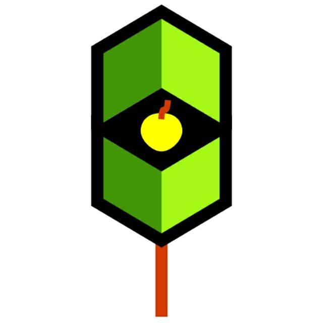
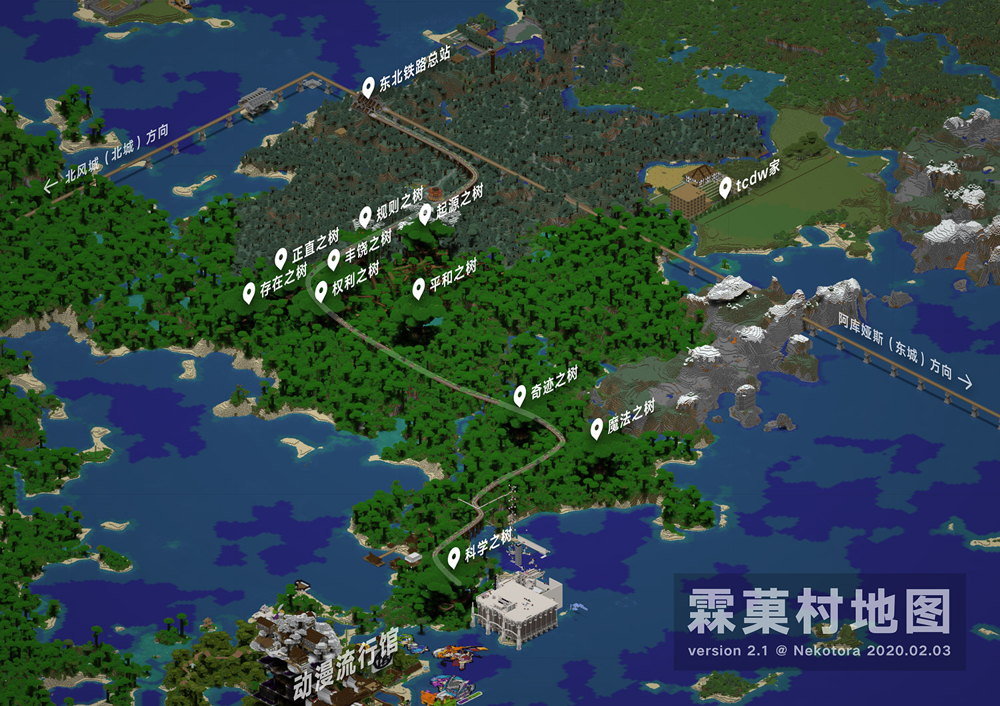

# 霖菓村

  
*Logo by Almsev*

#### 简介

-   位于雨林、针叶林之中的村落，建筑多使用木制或者砖石等材料。（但首先要还有地方修）
-   远古时期在这里遗留下来的十棵[巨树](#巨树详情)，被冠以**「起源·规则·丰饶·正直·存在·权利·平和·奇迹·魔法·科学」**之名，被霖菓村的村民视为神圣的存在。*~~（无神论者说不定可以挖开）~~*
-   意外地，一条森林观光铁路修建了起来，是否会使得这个小村落面临与现代世界的融合呢？


-   近来，丛林中搭起了纵横交错的栈道——**“千连回路”**，方便了村民，也方便了慕名而来的游客。

#### 地图



#### 想要入住？

**请向村长 *折羽*  `Almsev`  询问可否入住。**  
一般而言：

-   西部（雨林）不可自建，部分神树内允许住人；
-   东部（针叶林）允许自建，风格需尽可能贴近自然。

夜晚，林中多妖怪，出行请谨慎。  
入住后，即可加入由村长以及名义上的、实际上的村民、建设者组成的群组。群号：`1038881828`。

#### 公共服务

**东北总站**可提供基本的合成、打铁、附魔、图书借阅、解决内急等服务。*~~（值班室可供借宿一宿）~~*  
[村内地铁](https://bbs.nyaa.cat/d/1516 "好耶是新坑/ 霖菓村地铁完成计划")近期正在修建，并将逐步开放。

*~~也许会推出羊驼代运行李、骑游项目~~*

----------

#### Logo设计理念
Logo由*折羽* 设计。以下为其解释：

> 1. 采用了「[卡巴拉生命之树](https://www.baike.com/wikiid/181774958345926535)」（Kabbalah）的造型，用卡巴拉的 10 个节点象征霖菓村的十棵巨树。
> 1. 金苹果象征了霖菓村的名字（=りんご 林檎）和 *Minecraft*，同时用英语 *Apple of one's eye* 的比喻象征了瞳仁。
> 1. 设计参照了[埃舍尔](https://www.baike.com/wikiid/946091018484408666)（Maurits Cornelis Escher）的版画作品和由此衍生的纪念碑谷构图理念，用不可能正方形象征了霖菓村雨林间道路的错综复杂。

#### 巨树详情

- **「起源」之树**
  + 符号 `α`
  + 名称来源①：*折羽* 最初到访的巨树。
  + 名称来源②、铭文：`「始まりの唄、扉は啓かれた（开始的歌谣，门扉被开启了）」`
    * 👉[君に捧ぐファンタジア](https://www.bilibili.com/video/av33422765 "在哔哩哔哩观看PV")（献给你的幻想曲）/ PolyphonicBranch feat. 鏡音レン
- **「规则」之树**
  + 符号 `β`
  + 名称来源：暗示轻小说、动画片*《No Game No Life》（游戏人生）*之中的「十条盟约」。
  + 铭文：`「ルールは簡単です！（规则很简单！）」`
    * 👉[永远に幸せになる方法、見つけました](https://www.bilibili.com/video/av345458 "在哔哩哔哩观看PV")（找到了、永远幸福的方法）/ うたたP feat. 初音ミク
- **「丰饶」之树**
  + 符号 `γ`
  + 由*萌狼 `Ken_Ookami_Horo`* 命名。据称，其灵感源自轻小说*《狼与香辛料》*。
  + 铭文：`「君の心は君だけの物、命は輝いてこそ命だ（你的心灵仅为你自己所有，生命只有闪耀才方为生命）」`
    * 👉[テロル](https://www.bilibili.com/video/av1168990 "在哔哩哔哩观看PV")（Terror）/ Neru feat. 鏡音リン
- **「正直」之树**
  + 符号 `δ`
  + 名称来源、铭文：`「正直者は何を見る？（正直的家伙像什么？）」`
    * 👉[東京テディベア](https://www.bilibili.com/video/av2959589 "在哔哩哔哩观看PV")（东京泰迪熊）/ Neru feat. 鏡音リン
- **「存在」之树**
  + 符号 `ε`
  + 名称来源、铭文：  
```
「存在证明。 あー、shut up ウソだらけの体
完成したいよ ズルしたいよ 今、解答を」
（存在证明。啊，shut up 充满谎言的身体
好想完成啊 好想瞒骗啊 现在将解答）
```  
    * 👉[東京テディベア](https://www.bilibili.com/video/av2959589 "在哔哩哔哩观看PV")（东京泰迪熊）
- **「权利」之树**
  + 符号 `ζ`
  + 名称来源：  
```
『無限』に広がる夢も 描く未来も，僕達に許された 虚栄の権利
（『无限』膨胀的梦想与理想的未来，是我们应得的虚荣权利）
```  
    * 👉[Hacking to the Gate](https://www.bilibili.com/video/BV16R4y1E7GD)（动画片《命运石之门》片头曲）/ いとうかなこ
  + 铭文：`「存在　確信　猜疑　制御　不能　理解　不能」`
    * 👉[二次元ドリームフィーバー](https://www.bilibili.com/video/av216293 "在哔哩哔哩观看PV")（二次元 Dream Fever）/ PolyphonicBranch feat. 初音ミク
- **「平和」之树**
  + 符号 `η`
  + 名称来源、铭文：  
```
「平成壊れちゃって　壊れちゃって
平和なんて嘘をついたのは誰だ」
（平成被破壞了，被破壞了，講出和平這種謊言的人是誰啊？）
```  
    * 👉[ヘイセイカタクリズム](https://www.bilibili.com/video/av424525 "在哔哩哔哩观看PV")（平成灾变）/ Zips feat. IA
- **「奇迹」之树**
  + 符号 `θ`
  + 名称取自漫画、动画片《魔法少女小圆》。
    * *“奇迹和魔法都是存在的！”*
  + 铭文：`「微風踊る蒼い空、流れ行く白い軌跡（微風躍動在尉藍晴空，流劃出白色的軌跡）」`
    * 👉[雲の遺跡](https://www.bilibili.com/video/av85411001 "在哔哩哔哩观看PV")（云的遗迹）/ Yanagi feat. 鏡音レン
- **「魔法」之树**
  + 符号 `ι`
  + 名称同样取自《魔法少女小圆》。
  + 铭文：`「それなら僕が、魔法をかけてあげようか（那么由我，为您施上魔法吧）」`
    * 👉[夢喰い白黒バク](https://www.bilibili.com/video/av10436176 "在哔哩哔哩观看PV")（黑白食梦貘）/ Nem feat. 鏡音レン
- **「科学」之树**
  + 实际上位于动漫流行馆领域内，**毗邻红石科技馆**。
  + 符号 `κ`
  + 由`光棱`取名，有「暗之城 科学之城」之意。
  + 铭文：`「さぁさぁ、コードを0で刻め，想像力の外侧の世界へ（来吧来吧，将code印刻上0，朝著想象力外侧的世界）」`
    * 👉[チルドレンレコード](https://www.bilibili.com/video/av2869230 "在哔哩哔哩观看PV")（孩童记录）/ じん feat. IA


#### 你知道吗？

- 「千连回路」在日语读音上，与*《游戏人生》*之中的「精灵回廊」谐音。
-   东部（针叶林）在一级环线以东的部分，名义上不在本村领域内——即被视为“荒野”。
- 东北总站原址位于北部海上，仍保留完整结构。据悉，有村民认为在该原址换乘稍显麻烦，遂于陆上选址重建站楼。
