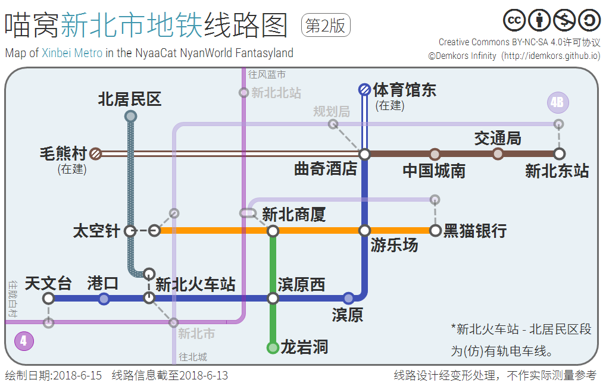

# 新北市

***旧称**：北城新区*
**类型**：“新主城”，公共规划区  
**范围**：(110，-4071)至(1829，-2825)  
**名誉市长**：*奈尔 `Addams_Chen`，曲奇 `Round_Cookies`，狸猫  `MaoJing_Limao`*

新北市是北方主城下辖、自主发展的一个地级市，位于北方主城东北方。  
如需入住，请翻阅【[功能区划](/nyaa/realms/newnorth.md?id=功能区划)】了解详情。

### 历史

很久以前（据考究，最晚至2015年下半年），一些移民来到[北方主城](/nyaa/realms/north.md)（以下简称“北城”）以北的半岛决定修建一个村落，取名为“新北村”，后又称“新桥北区”；随着喵窝人口急剧上升，*奈尔* 负责的北城新区在这里建设，作为北城的扩展区，各种现代化科技和建筑技术逐渐引进。  
后来北城新区的发展越来越加迅速，北城发展却突然停滞，于是移民们决定脱离北城建立新北市。至此，以 *“龙脉工坊”团队（DragonWork，[“新式创筑”](https://innovacreation.studio/)前身）* 为首的一群满怀激情的建筑师、设计师来到，彻底改变了这里，各式摩天大厦拔地而起，轻轨地铁的高速现代化路网快速发展建设，使得新北跃居喵窝国际化大都市，以及新兴港口城市之一。  
独立建城后，其仍旧分担北城的部分城市功能（如容纳蔬果基地，以及北城环游任务的NPC）。

直至2019年1月，新北市作为玩家村落存在。期间，城市建设由三位前市长接力，在一众热心人士协助下，断断续续地进行，规划、既有建筑等不断修改，跌跌撞撞中，成就今日规模。即便如此，相当一部分高楼仍处于“空壳”状态——毫无内饰可言。  
当年2月1日“用户组改革”后，全市改为公共规划区。建造师们不再能轻易实施建设方案。这座“空壳大城”何去何从，犹未可知。

#### 新北时报

在高速发展期，市内甚至出版了报纸。为宣传新北市，**新北时报社**于2016年8月28日至10月15日，试发行《新北时报》六期，以及特刊一期。其中：

-   前 5 期、特刊由 *大明  `Maki_Nishikino`* 主笔；
-   第 6 期由 *step  `stepchick`* 主笔。

报纸的副本现可于**北方主城图书馆**阅览。

### 地理状况

新北市与北方主城隔海相望，与毛熊村、胧白村、风蓝市接壤。

主城区地处奈叶平原，南接沂尔山脉，莲曲山脉，东临奇霖平原，西部月叶雪原，周圈丘陵连绵。海拔均在50～100米左右，其中月叶雪原中凯克山为地理最高（不含城市建筑）。

新北市属温带大陆性季风气候，四季分明，光照充足，暖湿交替。

### 功能区划

按位置、功能，新北市划分为 8 个辖区，以及一个名义辖区（即喵窝科技特区）。

下图为截至2019年2月1日，全市划区情况（不含科技特区）。

#### 居民区

共三个，均要求**自主建造房屋**。

!> 居民区迁入规则尚不明确，请谨慎决定是否迁入。

##### 新桥北区

**剩余西北方 1~2 个地块。**  
中央有小公园。西南方有新北农业大学。

##### 滨桥北区

**剩余 2 个地块。**  
南部为太空针公园；西北部（毗邻冰原）设有蔬果花卉大棚，可满足全市及北城之需。

##### 滨原区

**目前暂无空地供应。**  
**设有[商业大厦](/nyaa/realms/newnorth.md?id=新北商厦)，可经【新北商厦】站到达。**  
居住区临海而建，景色优美。  
中央有一座死火山；毗邻之有游乐场（未完成），靠近滨港区。

#### 城市功能区 & 旅游区

##### 新桥南区

即原“北城新区”，西部中央商务区。  
辖下有**新北火车站、红石机械展览馆**；以及游艇港口、海滨公园①号、《新北时报》报业大厦、苹果公司直营店（无入口）、*狸猫* 市长家①号，和其它不具名大楼。

_狸猫_  家设有公共建材仓库。取得同意后，可与*狸猫*  共建。

##### 滨港区

东部中央商务区。  
大厦密集，令人侧目。其中，具名者有“中国城”、“棱镜大厦”、“曲奇国际酒店”、“新北建筑规划局”、“衫叶大厦”等。  
黑猫银行总部也设在棱镜大厦。  
辖下还有体育馆、海滨公园②号、公寓楼（不可用）、新北东火车站、*狸猫*  市长家②号等等。

##### 龙岩洞区

**旅游功能区。** 主要包含中式吊脚楼结构建筑群“龙岩洞”，由*“龙脉工坊”团队* 负责施工。  
2016年9月前后，龙岩洞一期工程竣工。[（来源）](https://bbs.nyaa.cat/d/677-dragonwork "DragonWork-龙脉工坊的建筑视频~ - NyaaBBS")  
随后，二期工程在其东北方启动，目前陷入停滞。

龙岩洞一期以北，原为 *“龙脉工坊”团队* 总部大楼；现为新北市知识产权大厦（NNIP）。

##### 毛熊村新区

**毛熊村规划地块**，名义上划归新北市领域内。由 *毛熊  `NikoraiDrakon`* 负责。目前建设工作陷入停滞。

##### 凯克山新区

西边的凯克山，建有**凯克天文台**。为保障天文台的观测工作，设置新区作为缓冲，区域内严禁灯火。

#### 名义辖区——喵窝科技特区

特区位于喵窝主世界西南偏远处——即（-8000, 4000）周围；主打科幻，是独立于新北市区存在的玩家村落。  
特区为前市长 *曲奇* 主管，其声明该区**隶属于新北市**。_狸猫_  接任其市长一职后，也继承了该声明。事实上，其“新北市辖区”身份从未被广泛承认。  
*曲奇* 大约于2016年无限期暂停特区建设；此后该区事实上被废弃，直至2019年5月。

关于其2019年5月以后的故事，请见【[科技新城](/nyaa/realms/hitech-industries.md)】。

### 交通

新北市交通系统发达，市内有纵横交错的公路、铁路，并设有两处起飞平台。  
市内同时容纳三座下界传送门（其中两座公用，分别位于火车站西侧楼内、滨港区写字楼内），对接下界交通网。

#### 航空

穿戴鞘翅，由此可起飞。  
请注意，两个平台皆有辅助起飞系统，目前已失效。

##### 太空针

-   全喵窝公认的世界第二高建筑。[（第一高在此）](/nyaa/realms/hitech-industries.md)
-   2017年夏日祭[“世界鞘翅滑翔拉力赛”（WWR）](/nfs/events/wwr.md)主会场及起点。
-   设置 7 层，其中第 5 层及以上为起飞平台；
    -   第 6 层设有四向 弹射装置 助跑跑道；
    -   ~~第7层（顶层）设置垂直弹射装置。~~
-   中间有水电梯，可以到达各层。
-   可在太空针第 4 层或附近的街道降落。
   
##### 衫叶大厦

-   新北市交通局所在地（虽然不见一张办公桌）。
-   顶层设置东、西向弹射起飞平台；~~和垂直弹射起飞平台。~~
-   **原木牌电梯尚未置换，故目前无法用于起飞。**

#### 轨道交通

以下数据截至  **2018 年 6 月 15 日**。

  
【[点击此查看changelog](https://bbs.nyaa.cat/d/951--/75 "路痴、新喵士的解药：全喵窝铁路线指南（“无限”版）")】

##### 车站概览

-   已完工：新北中心站、新北商厦站、新北北站、凯克天文台站、滨桥北地铁站（飞行塔地铁站）……**（详情见“线路”）**
    
-   待建：体育馆东地铁站，毛熊村地铁站

##### 已建成线路

-   **城际轨道：**  胧白村 ← 天文台站 - 新北火车站 - 新北商厦站 - 新北北站 → 风蓝市
    
-   **城际轨道：**  北城 ← 新北火车站 - 滨桥北（太空针）地下站 - 新北建筑规划局站 - 新北东站
    
-   **地铁线：**  天文台 - 港口 - 新北火车站 - 滨原西 - 滨原 - 游乐场 - 曲奇酒店
-   **地铁线：**  龙岩洞 - 滨原西 - 新北商厦
-   **地铁线：**  太空针 - 新北商厦 - 游乐场 - 黑猫银行
-   **地铁线：** 曲奇酒店 - 中国城南 - 交通局 - 新北东站
-   **有轨电车线：**  新北火车站 - 太空针 - 北居民区

##### 待建

-   地铁，曲奇酒店 - 毛熊村段。
-   地铁，曲奇酒店 - 体育馆东段。

### 商业

市内商业发达，先后有三处商业集散地落户。其中，仅【新北商厦】仍维持营业。

#### 新北商厦

坐标：`(816, -3547)`  
由樱华町一级车站内的传送中心可直达。  
低层建筑，一楼和二楼提供常规的店铺。距离居民区相对较近。  
开设商店可以直接占用空铺位；一层的商户可以挖掘最多一层地下室（不低于 Y=60）。

#### ~~新北商业中心~~

坐标：`(560, -3289)`  
现代化的大型商业中心，供给玩家设置自己的超级市场。  
开设商店可以直接占用整层的空间，或者单层中的独立房间。内饰自由，请勿改造墙体、天花板和地板。

!> 此中心原为旧式木牌商店（每个牌子皆拥有独立空间）设计；其下线后，任意个“出售”木牌共享固定空间，故占用整层的意义大减。  
!> **目前不再建议入驻。**

#### ~~龙岩洞商业街~~

龙岩洞一期内，大街上熙熙攘攘，古风浓郁，各式商品琳琅满目，夺人眼球。  
——以上皆为想象。这条街从未吸引到一位商人进驻。

### 新北强制规定

“用户组改革”后，以下内容待定，仅供参考。

> -   任何在新北市内的建设请联系新北市市长、副市长进行申请。任何未经允许的建筑将在评估后进行相关处理。
> -   新北市属于现代风格城市，请以建设现代风格建筑为主，但并不绝对禁止其他风格建筑，其他风格建筑请尽量切合周围建筑特色，以保证城市风格的普遍性。
> -   普通居民请在居民区建设宜居型建筑。如有大型建筑建设想法，请联系新北建设团队。
>     -   任意存在于居民区的未占领地块均可以选择建设自己在新北的房屋，但拒绝存在在新北同时建设两个及以上建筑。在完成第一个房屋后，若有建设第二套房屋并建筑风格符合新北市风格，可以通过申请来申请可用土地进行建设其他建筑。诸如：大型居住型房屋，大型种植大棚等。
>     -   居住型建筑，高度限制范围 64 - 85 格，地下限制范围 50 - 64 格，任意限制超过请及时申请。
>     -   居民建筑地下若存在矿坑等内容，若需要填平，请联系新北建筑团队（创造组成员即可）。
> -   在非居民区位置严禁非新北建设团队进行建设。本条内容不适用于建设团队管理人员同意的非新北建设团队成员在新北的建设。
> -   新北市禁止任何破坏城市以及破坏玩家物品的行为，一经发现，经评估后，严重将直接取消新北居住权并驱逐出境。
> -   若玩家认为交通等不方便自身出行，并且有更好的规划设计建议，请提交至新北建设团队。
> -   本强制规定一切内容解释权均归属新北市长。
