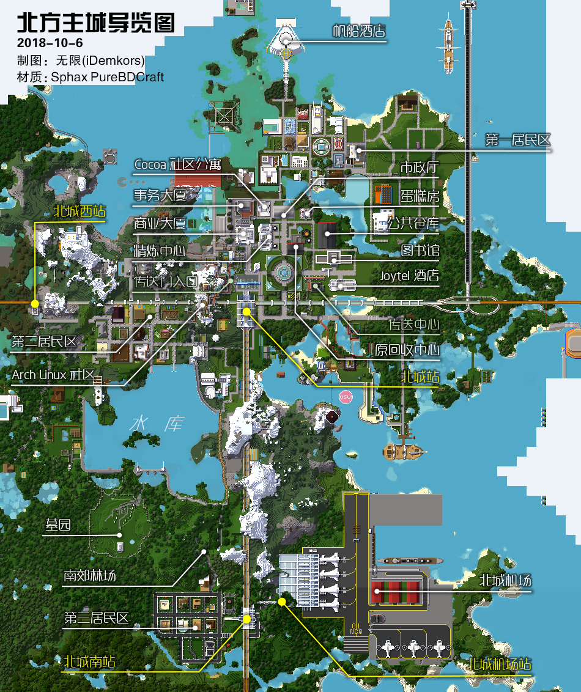

# 北方主城

-   类型：主城，公共规划区
-   范围：(-266, -2816), (1084, -1734)
-   **名誉城主：** *浅羽  `yahagi1943`*

北方主城（简称“北城”）是工业化风格城市，拥有完善的公共基础设施。

### 本地交通

目前有一级铁路、二级铁路，以及市内道路，连通市中心、南郊、西郊、机场等区域。  
另有传送中心、传送门等；飞行塔暂缺。

#### 传送中心

入口位于坐标  `(348, -2345)`；  
目前设有12个传送牌，允许玩家购置空牌。

#### 下界、末地传送门

由北城车站广场西侧的山洞进入，左手可见下界门、右手可见末地门。  
北城因此成为低成本快速进入末地的最佳中转地之一。

### 商业

#### 北城商业大厦

坐标  `(240, -2400)`；  
允许玩家使用单个销售专柜，或占用整层。如占用一层可自行装修内饰，请不要修改整体外观。  
地下有公共储物箱，可对空箱上锁占用；如果被占满，请联系_卷_ （或其他管理员）处理。

#### 北千里事务大厦

坐标  `(240, -2450)`；  
玩家可租用其中一层用于商业事务所办公之用。请注意，大厦内不允许建立商店。

### 旅游风光

#### 蜂蜜蛋糕房

坐标  `(342, -2446)`；  
专门销售各种蛋糕甜品，拥有情侣餐桌和家庭聚会桌供玩家们约♂会。  
现不再提供食品。蛋糕仅作展示之用。如果觉得饿，去找好心人家罢。

#### 水库

位于南郊。  
炎炎夏日，谁不想找个池子游泳呢？但可惜，水库无一处浅滩可供游泳。  
所幸，游艇项目以及东、南侧新建的栈道，可令上班一族于此放松身心。

#### 帆船酒店（在建）

位于第一居民区正北。目前空有外表，仅可于正门前仰望。  
未来将兼作飞行塔。

!> [酒店内饰项目现正招标，欢迎踊跃投标。](https://bbs.nyaa.cat/d/1342--/2 "好耶是新坑。北城帆船酒店招标建设")

#### 机场

位于北城南站附近。它真的只是个仅供观赏的机场而已。  
~~发现某神秘军港~~

#### 羊驼与家兔乐园

位于北城南站西侧。集中所有品种的羊驼、家兔（杀手兔除外），可供观赏。  
本乐园为_无极限拉玛牧业有限公司_ 所有。[游览时请遵守相关规定](https://bbs.nyaa.cat/d/1293--/8 "无极限拉玛牧业有限公司——羊驼、家兔专营")。

#### 墓园

由水库闸门西侧，下楼梯，可达正门。~~亦可自围墙破损处翻入。~~  
谁会去墓园里观光……哦是来探险的，港真，除了晚上刷普通怪物，无险可探，少侠请回罢。

### 公共服务

#### 北方主城市政厅

坐标  `(305, -2436)`；  
市政厅提供各类公共服务站和官方运营物品的兑换/购置。

#### 矿物精炼中心

坐标  `(279, -2400)`；  
玩家可通过消耗青金石，从原矿石中精炼出更多矿物。

?> :heavy_check_mark: 推荐手头**未掌握含“时运 X”（及以上）附魔之铁镐或钻石镐**的玩家至此“开箱”。

#### 北城公共仓库

坐标  `(324, -2388)`；  
用于短期、中期存放物品的公共仓库。  
如确认使用某空箱，请锁上箱子；将物品搬走后请将锁移除。

#### 北城图书馆 / 魔法研究中心

坐标  `(390, -2360)`；  
北城图书馆提供各类附魔书/魔法装备兑换。  
请事先准备好所需的材料，详情请垂询图书馆接待柜台的店员。

#### 北城 Joytel Hotel

坐标  `(400, -2340)`；  
北城旅馆提供大量标准间供新玩家临时居住。  
请入住后在门前挂牌注明占用；退房时敲掉木牌，并带走所有私人物品。

#### 北城南郊林场

位于第三居民区以北、水库以南；  
提供**全部六种木材**，缺原木、缺树苗、缺藤蔓、缺可可豆，在此都能解决。林场内**全境覆盖充足光照**，避免怪物生成（除幻翼）。某热心市民会不定期巡山，检视并完善植被与光照。  
请于光照充足之处工作，以策安全。请自然、科学补种。

!> **当心幻翼。** 如需长时间作业，请及时睡觉，或在夜间到树荫下或隧道内避难。

#### 原北城回收中心

位于精炼中心对面。  
该处曾作为以固定价格“回收”部分常见战利品（由击杀黑化怪物取得）之场所。  
在[HamsterEcoHelper](/space/plugins/hamsterecohelper)插件之“木牌商店”功能上线后，其失去了原本功能；之后，“系统收购”全面接管回收功能。现为文化遗产之一。  
——目前有若干NPC进驻，并提供非回收服务~~好像做什么符的转换以及什么食物的压缩~~。估计该处在可预期之将来不会被拆除。

### 在北城定居

城中大多为自建区，并提供少量公寓套房；**无整栋成品房**。如需成品房，不妨移步其它主城。

#### Arch Linux Cliff Neighborhood

位于坐标  `(214, -2340)`及周围；  
这里专供 Arch Linux 中文社区的玩家居住。

#### 北城第一居民区

坐标  `(368, -2550)`  及附近区域；  
**现代化向自由风格**建筑区，请不要建造过高的建筑，地下室请不要超过地面规划面积。

?> :heavy_check_mark: **东部空地较多，建议于本区定居。**

#### 北城第二居民区

坐标  `(90, -2260)`  及附近区域；  
同为自建区，建筑要求同上。  
**目前空地紧张。**

#### 北城第三居民区

坐标  `(202, -1750)`  及附近区域，通过北城南站可达；  
同为自建区，建筑要求同上。  
**目前空地较紧张。**

#### CoCoa社区公寓

坐标  `(265, -2450)`；  
本公寓为双层复式 loft 风格；用于长期居住，不能视作旅馆。  
玩家如若**不想自行建造**，可以入住本公寓；入住时请挂牌注明。入住后，可自行于内部装修，但不可变更外墙外观；请勿影响他人的居住体验。  
如需退房，请清理所有私人物品，并将门牌恢复原样。

----------

### 你知道吗？

-   北城曾经存在环城铁路线、地铁系统。目前仍可于西北郊、北城西站发现环城线之遗迹（如柱子、月台）；中心城区广场、图书馆等处可见地铁站遗迹。
