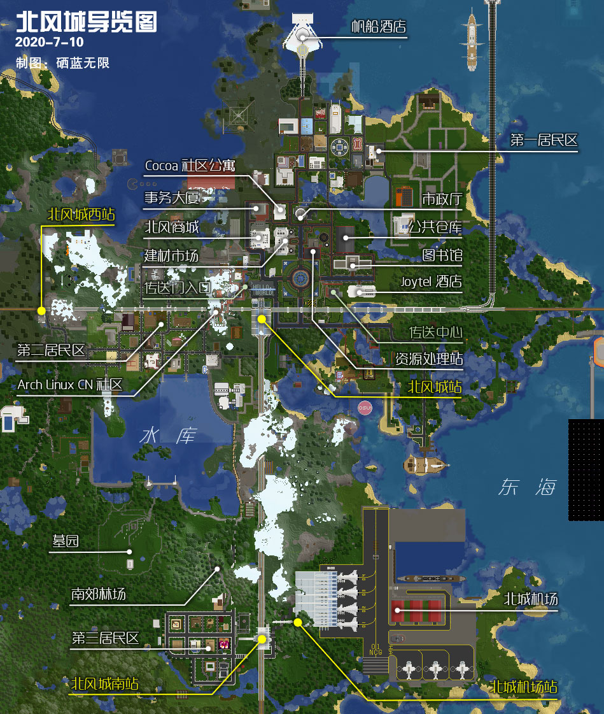

# 北风城

-   **旧称：北方主城**
-   类型：主城，公共规划区
-   范围：(-266, -2816), (1084, -1734)
-   **名誉城主：** *KK `Kuroi_Kuroha`，风筝 `yahagi1943`*
- **[居委会](#council)主任：** *小爱 `Bersella_AI`*

北风城（简称“北城”）是最早期的工业化风格城市，拥有完善的公共基础设施。“百年”老城，现正焕发新生。

城市中央的广场上，印有程序员的共同语言——“Hello World”，并矗立着 [Arch Linux](https://www.archlinux.org) 标志，彰显极客风范。事实上，北风城最初的居民均为 Arch Linux [中文社区](https://www.archlinuxcn.org)核心成员出身。

## 本地交通

目前有一级铁路、二级铁路，以及市内道路，连通市中心、南郊、西郊、机场等区域。在下界业已修筑了通向姊妹城——新北市之便道。  
另有传送中心、传送门等；飞行塔暂缺。

#### 传送中心

入口位于坐标  `(348, -2345)`；  
目前设有12个传送牌，允许玩家购置空牌。

#### 下界、末地传送门

由车站广场西侧的山洞进入，左手可见下界门、右手可见末地门。  
要想零成本跳进末地，北风城是最佳中转地之一。

## 商业服务

#### 北风商城

!> :construction: **本商城将择机重建，请勿入驻！**

坐标  `(240, -2400)`； 
一楼仅用于设置银行柜台。  
~~本城及新北市居民，可在二楼自由使用铺位。~~  
~~三楼以上，允许**以聚落为单位，占用整层**。~~如需占用，请向居委会[主任团](#council)报备；应自行装修内饰，请勿修改建筑外观。各聚落玩家可于各自申请的楼层设置零售木牌。

地下有公共储物箱，可对空箱上锁占用；如果被占满，请联系**管理组**处理。

#### 北千里事务大厦

坐标  `(240, -2450)`； 
玩家可租用其中一层用于商业事务所办公之用。请注意，大厦内不允许建立商店。

## 公共服务

#### 北风城市政厅

坐标  `(305, -2436)`； 
市政厅一楼提供部分资源（目前含**飞行燃料**、铁轨）的兑换/购置，和临时储物柜。

二楼以上暂仅供观赏。其中，
- 二楼作为会议室；
- 三楼设置了咖啡厅与露天平台；
- 四楼以上为办公区，闲暇之余可眺望全城。

#### 建材集散市场

坐标  `(279, -2400)`； 
出售大部分原版初级建材，包括沙石料、所有原木、部分下界及海底产品等。

该处曾称为「矿物精炼中心」，在1.13.2版本及以前，玩家在此可通过消耗青金石，从原矿石中精炼出更多矿物。2019 年 9 月，旧版 NPC 全部移除之后，其失去了原本功能。

#### 资源处理站

坐标 `(326, -2407)`； 
提供若干加工业务，包括：
- 加工**白色混凝土粉末及预拌成品**，和工业级**红沙、黏土**等副产品。
- 碾碎石料（石头 → 圆石、圆石 → 沙砾）。
- 从TNT提取**火药**。
- 给原木剥皮。
- 从腐肉提取蛋白质，缝制**线、羽毛**。或者将羽毛剥开为线。

该处曾称为「魔法分解中心」，在1.11.2版本及以前，以固定价格“回收”部分常见黑化怪战利品。2017 年 6 月，旧木牌商店（SignShop）插件下线之后，其失去了原本功能。

其隔壁为发电厂。

#### 猪灵交易所

由*土豆大王 `tcdw`* 维护，位于下界 `(47, -400)` 上层空间。从北风城进入下界，北行，找到并攀登一条被标记的诡异藤即可抵达。  
本设施生产和猪灵交易可能的[一切产品](https://wiki.biligame.com/mc/%E4%BB%A5%E7%89%A9%E6%98%93%E7%89%A9 "见游戏Wiki“以物易物”")，其中较实用者有黑石、抗火药品、“灵魂疾行”书等。

#### 城区公共仓库

坐标  `(324, -2388)`； 
用于短期、中期存放物品的公共仓库。  
如确认使用某空箱，请锁上箱子；将物品搬走后请将锁移除。

#### 北城南郊林场

位于第三居民区以北、水库以南；  
仿自然林场，提供**全部六种木材**，缺原木、缺树苗、缺藤蔓、缺可可豆，在此都能解决。林场内**全境覆盖充足光照**，避免怪物生成（除幻翼）。某热心市民会不定期巡山，检视并完善植被与光照。  
请于光照充足之处工作，并注意幻翼，以策安全。请自然、科学补种。

#### 北风城图书馆

坐标  `(390, -2360)`； 
图书馆内可陈列玩家撰写的成书，对公众开放阅览。

该处也曾称为「魔法研究中心」，在 1.13.2 版本前，提供各类附魔书/魔法装备兑换。此后因内容调整，不再提供兑换。

#### 帆船酒店（在建）

位于第一居民区正北，规划为宾馆兼**飞行塔**。目前在建，由 *`Kujo__Jolyne`* 负责。

#### ~~美食店（蜂蜜蛋糕房）~~

坐标  `(342, -2446)`； 
~~专门销售各种蛋糕甜品，拥有情侣餐桌和家庭聚会桌供玩家们约♂会。~~  
现已被拆除。

## 旅游风光

#### 下界便道

自北风城进入下界，在去新北市的路上，可一睹全新下界风采——全窝独家，别无分店！

#### 水库

位于南郊。  
炎炎夏日，谁不想找个池子游泳呢？但可惜，水库无一处浅滩可供游泳。  
所幸，游艇项目以及新建的栈道，可令上班一族于此放松身心。

#### 羊驼与家兔乐园

位于北风城南站西侧。集中所有品种的羊驼、家兔（杀手兔除外），以及北极熊、熊猫等，可供观赏。  
该设施由*小爱* 维护。游览时请遵守当地相关规定。

#### 蜂房

在水库东南角、南郊丛林边缘，蜜蜂们在阳光沐浴下，辛勤作业。你可驻足观看，亦可自助采蜜。  
该设施由*小爱* 维护。

#### 墓园

由水库闸门西侧，下楼梯，可达正门。~~亦可自围墙破损处翻入。~~  
谁会去墓园里观光……哦是来探险的，港真，除了晚上刷普通怪物，无险可探，少侠请回罢。

#### 机场

位于北风城南站附近。它真的只是个仅供观赏的机场而已。  
~~发现某神秘军港~~

## 在北风城定居

城中大多为自建区，并提供少量公寓套房；**暂无整栋成品房**。如需成品房，不妨移步其它聚落。  
原则上，不得在超出居民区范围的郊野划地自治。

?> :moneybag: 自 2021 年起，入住任何空地块、空套房（不含旅馆）之前，须向居委会主任团交纳一定押金（售价以实际标示为准；主任团将全额上缴系统）。 
施工装修完成后，可申请验收（每单元仅可申请一次）；主任团视完成情况返还押金的 50% 或以上，不设上限。

#### Joytel 旅馆

坐标  `(400, -2340)`； 
城区旅馆提供大量标准间供新玩家临时居住。  
请入住后在门前挂牌注明占用；退房时敲掉木牌，带走所有私人物品，并清空房间。

### Arch Linux Cliff Neighborhood

位于坐标  `(214, -2340)`及周围，即车站广场西侧山上；  
这里专供 Arch Linux 中文社区的玩家居住。

#### 第一居民区

坐标  `(368, -2550)`  及附近区域；  
**现代化向自由风格**建筑区，请不要建造过高的建筑，地下室请不要超过地面规划面积。

!> :construction: **东部地区有待重新规划，请暂勿入住！**

#### 第二居民区

坐标  `(90, -2260)`  及附近区域；  
同为自建区，建筑要求同上。  

?> :heavy_check_mark: **现提供若干精品地块，欢迎入住。**

#### 第三居民区

坐标  `(202, -1750)`  及附近区域，通过北风城南站可达；  
同为自建区，建筑要求同上。  

?> :construction: 目前空地紧张，即将拓展，敬请期待。

#### CoCoa社区公寓

坐标  `(265, -2450)`； 
本公寓为双层复式 loft 风格；用于长期居住，不能视作旅馆。  
玩家如若**不想自行建造**，可以入住本公寓；入住时请挂牌注明。入住后，可自行于内部装修，但不可变更外墙外观；请勿影响他人的居住体验。  
如需退房，请清理所有私人物品，并将门牌恢复原样。

!> 如声明占有后久未装修，居委会有权收回空房。  
新来者不可私自使用已声明占有的空房，请在居委会商讨相关事项。

#### 滨海小区

坐标 `(407, -2200)` 及周边住宅区，是玩家 *`Miaji` `Episode15c`* 等的私人住所。谢绝迁入。

- - -
## 有关居民委员会 :id=council
现居委会主任团组成如下：
- 主任 *小爱 `Bersella_AI`*
- 副主任 *塞纳罗斯 `Xander_Zhao`*
- 副主任 *土豆大王 `tcdw`*
- 副主任兼新北街道办全权代表 *狸猫 `MaoJing_Limao`*
- 特别顾问、前城主 *风筝 `yahagi1943`*

居委会的任务，是**将世间变得更好**。除本城居民外，也欢迎全窝愿意参与城市建设、提供帮助的伙伴加入居委会。  
为本城（或新北市）做出突出贡献者，经评估后可选拔进主任团。

居委会内部现仅通过QQ群联系，群号：`977738329`。

## 历史 :id=history
- **建城之初**，城市处于无序发展状态。
- **2015 年**
  + 在以*KK* 兄弟为首的“北方建设集团”（NCG）主持下，原北方主城**大规模翻修**，中心城区自此定型。同时，三个居民区（Arch、第一区、第二区）及水库固定下来。
  + 同年，“北城环线高铁”建成；“北城新区”成立，接纳原来无法于北城大展拳脚的建筑师。
- **2016 年**
  + 第三居民区、机场开辟，火车南站设立。
  + “环线高铁”被拆除。
  + 第一区东部被重置（需要证明）。
  + “北城新区”更名为[新北市](nyaa/realms/newnorth)，脱离北城自治。
  + “飞行燃料”上线，北城市政厅承接部分兑换配方。
- **2017 年**
  + 第一区东部与第三区扩充自建地块。
  + 6 月 25 日，因插件调整，魔法分解中心失去功能。
  + 七月，南郊林场被开辟。
  + 八月，*风筝* 离开喵窝，北城发展几乎中断。
- **2018 年**
  + 五月，[无极限拉玛公司](https://bbs.nyaa.cat/d/1293) 于北城成立，在居委会成立前，有限接管城市建设。
- **2019 年**
  + 3 月至 7 月，*无极限拉玛公司* 试发行杂志[《北城拉玛电台·新闻月刊》](https://bbs.nyaa.cat/d/1388-2019-3-5-2019-7-20/14)，总计发行五期。杂志副本现可于**北风城图书馆**查阅。
  + 九月，因内容调整，原精炼中心及图书馆失去主要功能。
  + 十月，城市**改名为“北风城”**，并沿用至今。
  + 居民委员会于 12 月 1 日成立，*小爱* 任主任；并收回了新北市管辖权。
- **2020 年**
  + 3 月 1 日，原精炼中心、分解中心相继改造，接收柚木小镇的工业功能。
  + 五月起，*小爱* 开始[第二次大翻修](https://bbs.nyaa.cat/d/1637)工作。主要任务是翻新基础设施与公共建筑、美化城市景观、加强安保、改造下界等。
  + 六月起，帆船酒店开始装修（此前闲置达五年之久）。
  + 7 月 8 日至 8 月 4 日，市政厅彻底重建。参加重建的有： *`Hoshino_Kaede` `Look_Forward` `tcdw` `Bersella_AI` `Xander_Zhao`*
    * 一旁的蛋糕房也被移除了，以让出空间。
- **2021 年**
  + 元旦起，对空余地块、公寓单元实施有偿准入制。
  + 1 月 19 日，第二次大翻修提前终止。
  + 1 月 22 日，*土豆大王* 被提名为居委会副主任。

----------

## 你知道吗？

-   北风城曾经存在环城铁路线、地铁系统。目前仍可于西郊、北风城西站和宾馆附近的水下，发现环城线遗迹（如支柱、月台、隧道等）；车站广场、图书馆地铁站则保留至今，其中广场站入口被改建为便利店，图书馆站被完全封闭。
- 主城区迎宾大道旁 `(312, -2311)`，尚留有一处[旧版维修站](misc/history/historical-sites#旧版维修站)遗迹。
- 建材市场地下，也保留了一条地下河。

- 在北风城东郊近海上，有一片巨大的、功能未知的浮空方块“阵列”，在原版地图上，其形如显像管测试画面。因其位于世界高度上限`Y=255`，其被 VoxelMap 显示为“一团黑色矩形”（本页所示地图的右下方）；而在 JourneyMap 则显示正常。
- 在东郊海底，隐藏着音符盒制作的两支曲子——因受 WG 保护，普通人即便能够进入也不可弹奏。

- 在第一区某民居，有全窝罕见的**僵尸马**。
- 在某中式庭院里，Ubuntu 中文论坛站长正默默居住着。
- 在城区西北部的沼泽区域（包括事务大厦地下），有机会生成史莱姆。
