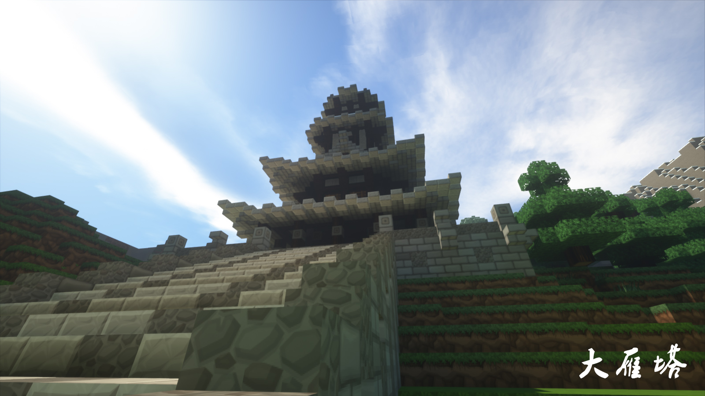

# 樱华町

樱华町（旧称“新手村”）位于喵窝世界的中心。本服开服第一个出现的村落即为「樱华町」。

**对于2018年11月8日前、2019年3月4日14时后加入喵窝的玩家：** 可随时使用 `/espawn` 命令免费前往。  
**若在其它时段加入**，需藉由其它路径（如坐车、使用传送卷轴、将 `/spawn` 目的地设于此）到达。

## 大神殿

全服标志性建筑之一，大神殿分为先天八卦阵广场、外殿、本殿，本殿底面为太极（阴阳玉）图案，中央为出生点「生命之源」。玩家进入大神殿后即会得到生命恢复、力量、跳跃、抗性、速度、急迫等等属性加成。且在「生命之源」中，玩家将是无敌状态。

坐标：(148, 173)

## 万华街


樱华町万华街是**全服最大的商业中心**，建筑风格为和风。玩家可自由入驻并建立商店。只需确认店铺无人使用，即可贴上自己的木牌开始与其他玩家交易。  
万华街由“南街”（一期工程）和“北街”（二期工程）构成，分别占据樱华町东面、东北角，以春日神社为界。

坐标：(333, 302)

### 入驻规则

每个铺面皆已分配一块门牌，其上有门牌号以及店主ID。  
**门牌上写明“空铺面”者，可直接拎包入驻，无需申请。**唯一要做的是，**拆除并重写门牌，并设置至少一块商店木牌（或对应之NPC）。**

万华街最终负责人为*静琴*  `shizukoto`  。其会不定期清理久未补货之店铺（上一次是2018年4月）。  
门牌号暂由*无限*  `iDemkors`  负责维护。

!> **门牌如何重写？**

记住门牌号（假设为“南街 一条39号”），然后手持一块告示牌，执行以下命令：  
```
    /nu se sign 0 `&l南街 一条39号`
    /nu se sign 2 &o[你的游戏ID]
  ```
将分别于第一行、第三行刻下门牌号及店主 ID。  
拆除旧门牌，将此贴上原处即可。  
如有2~3人合作经营同一铺面，可在第二、四行再登记其余店员的游戏 ID，命令与上述类似。

## 骑士驿站

骑士驿站可以为所有新玩家提供**临时免费住所**。新入服玩家可直接进入骑士驿站寻找空房间居住（没有占有性木牌或房门上居住指示灯没有亮）。入住时须在门边贴占用木牌表示该房间已被使用；在其他地方定居后请搬运走自己的物品，并拆除所有保护性或占有性木牌、关闭房门上方居住指示灯，以便其他玩家入住。

坐标：(262, 170)

## 春日神社

拥有如此浓郁的日本文化气息的新手村，怎能没有信仰！春日神社永远屹立于新手村东山之上，等待您投入五分钱，节操也可以的到来！

坐标：(435, 210)

## 一级车站入口

**车站入口共五个。**    
其中一个位于大神殿正南方，由此进入一级车站及传送中心最快。坐标：`(121, 287)`。    
其余入口分别位于大神殿正东、万华街、出征楼、二级车站。

## 出征楼


樱华町原传送中心——出征楼。现作为下界、飞行塔、一级车站入口。  
正如其名，征战的路程从此开始！确定好你的目标，向外界、下界出发吧！

坐标：(279, 336)

## 传送中心

现分散于三处，详见下表。

|**所在位置**|**坐标 (X, Y, Z)**|**传送牌数量**|**可前往EpicWorld**|**可前往minigame**|**可前往brainhole**|
|--|--|--|--|--|--|
|一级车站|207, 38, 300|22||||
|万华街一期|451, 72, 283|23|√|√|√|
|万华街二期|408, 66, 108|16|√|||

## 守望之田

历史悠久的千里麦田，在大神殿的光辉下茁壮成长！生命之水的灌溉使得这里的土地不会干枯。尽情地收获并持续播种吧！  
~~岛屿腹地仍会干枯（但不会进一步还原为泥土）~~

坐标：(218, 291)

## 高塔



位于守望之田以西。  
爬至顶层，可见樱华神树、守望之田与天色有机结合的绝美画卷。  
有条件者提高视距、开启光影效果，景色更佳。
