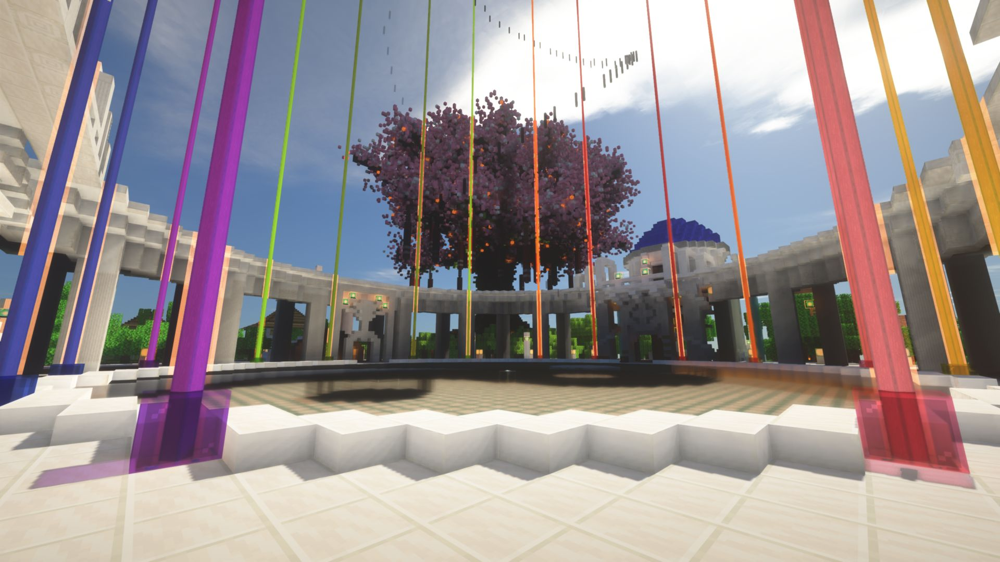
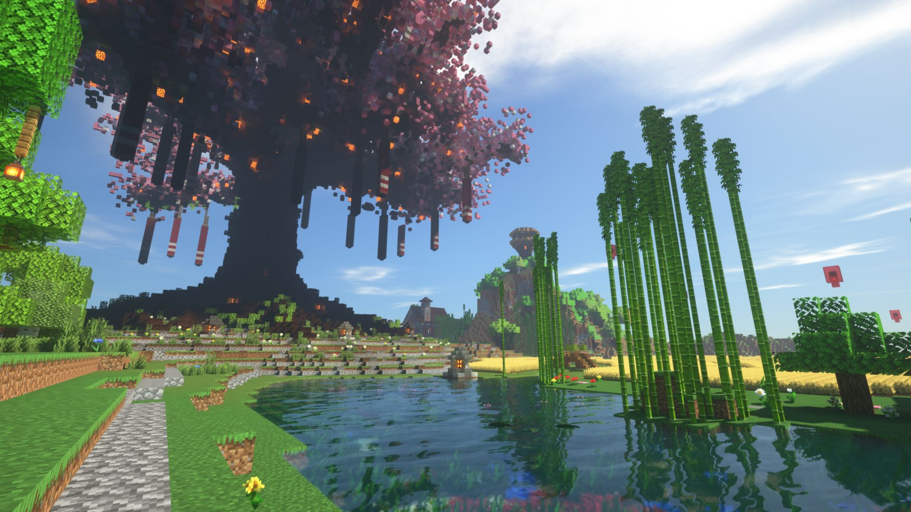
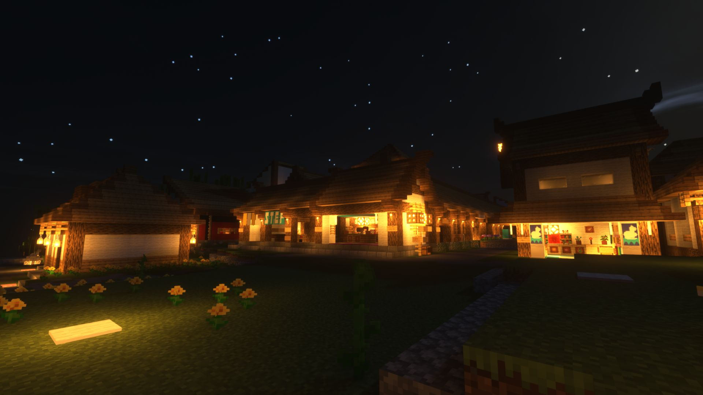
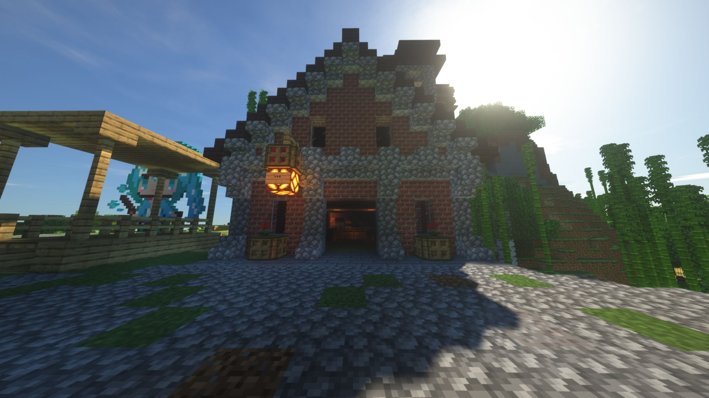
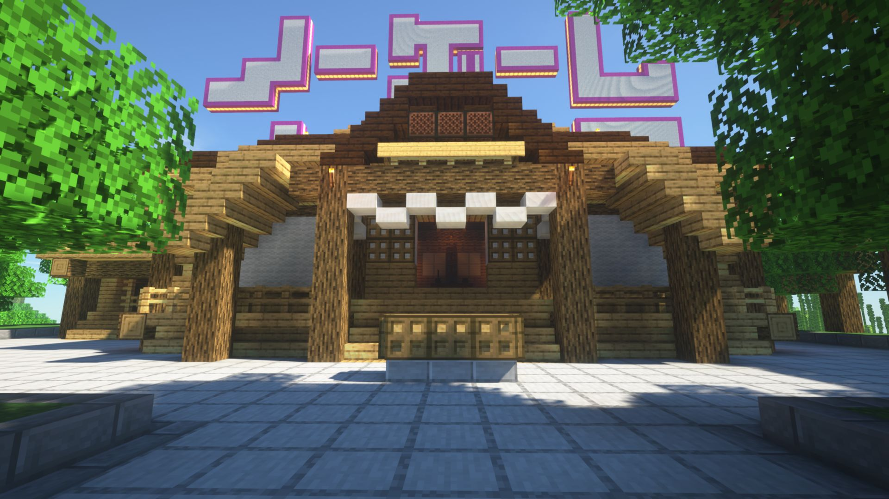
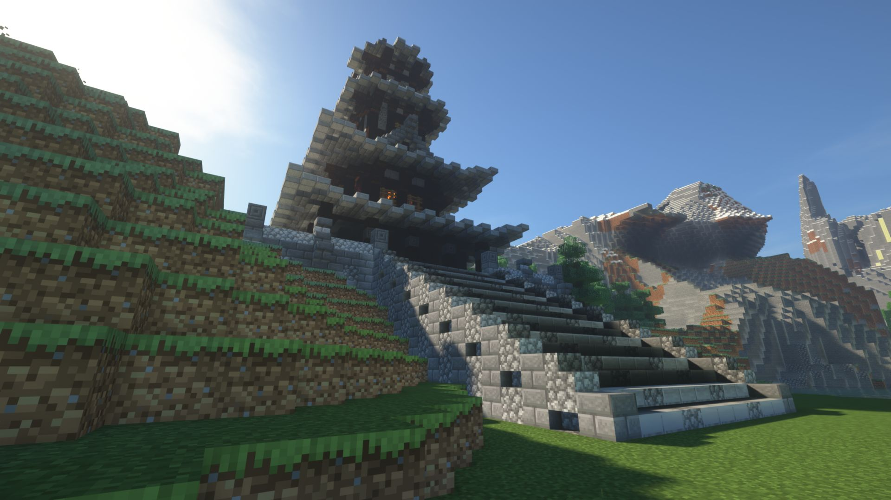
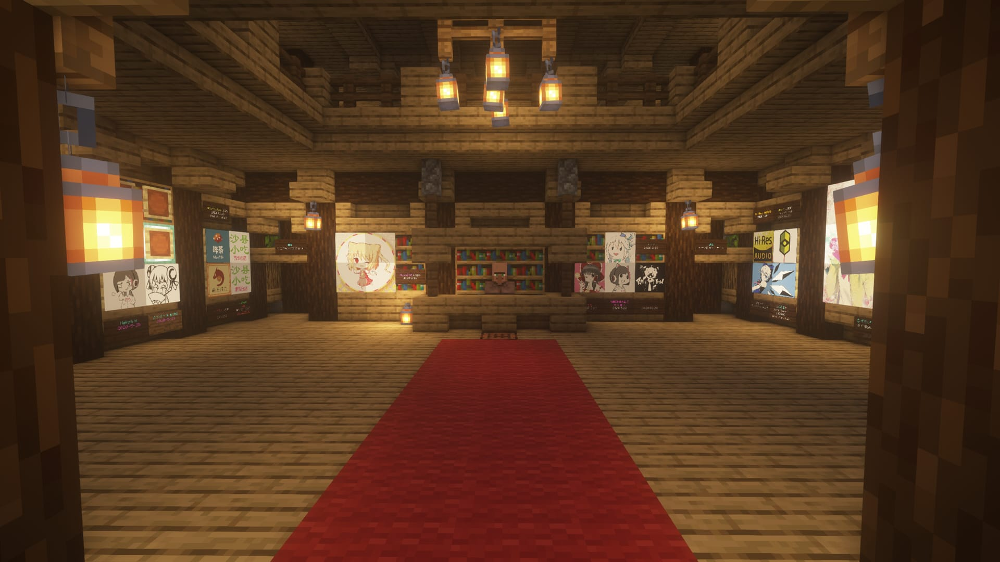
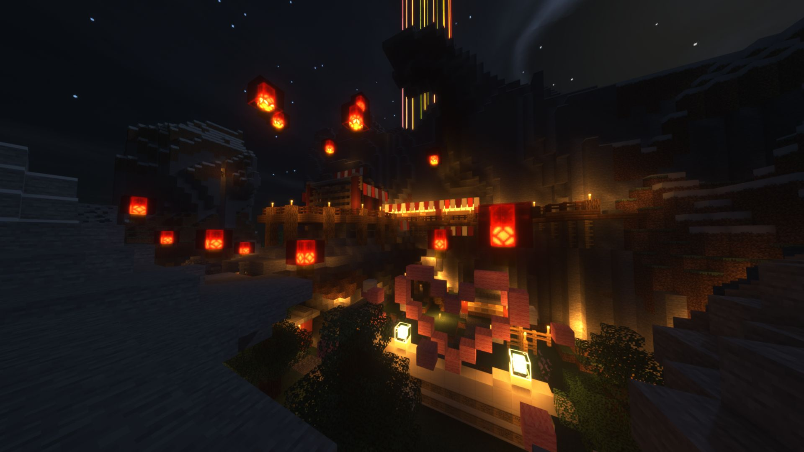

# 樱华町

樱华町（旧称“新手村”）位于喵窝世界的中心。本服开服第一个出现的村落即为「樱华町」。  
樱华町属地范围为(-125, -481)至(1051, 574)；整个属地内，**不会生成敌对生物**。

玩家可随时使用 `/espawn` 命令免费前往。

## 出生点：大神殿

  
*（摄于 2020 年 7 月。光影包：SEUS Renewed 1.0.1，下同）*

全服标志性建筑之一，大神殿分为先天八卦阵广场、外殿、本殿，本殿底面为太极（阴阳玉）图案，中央为出生点「生命之源」。玩家进入大神殿后即会得到生命恢复、力量、跳跃、抗性、速度、急迫、潮涌能量等属性加成。且在「生命之源」中，玩家将是无敌状态。

坐标：`(148, 173)`

### 樱华神树与守望之田



全窝最大、最具标志性的人工树。树冠长满了樱花，水平大小约 150 X 150 格，下方及周边会飘落“樱花瓣”颗粒。  
**文化遗产，谢绝采掘。**

历史悠久的千里麦田——守望之田，位于神树西南方，在大神殿的光辉下茁壮成长！生命之水的灌溉使得这里的土地不会干枯<sup>（岛屿腹地仍会缺水）</sup>。尽情地收获并持续播种吧！  
这里的耕地不会被踩坏或还原为泥土。

坐标：`(218, 291)`

--------

## 商业：万华街



樱华町万华街是**全服最大的商业中心**，建筑风格为和风。玩家可自由入驻并建立商店。只需确认店铺无人使用，即可贴上自己的木牌、摆放NPC开始与其他玩家交易。  
万华街由“南街”（一期工程）和“北街”（二、三期工程）构成，分别占据中心城区东面、东北角，以春日神社为界。

坐标：
- 南街一期 `(333, 302)`，即神树东侧
- 北街二期 `(320, 107)`
- 北街三期 `(150, 80)`，即大神殿以北

### 入驻规则

每个铺面皆已分配一块门牌，其上有门牌号以及店主ID。  
**门牌上写明“空铺面”者，可直接拎包入驻，无需申请。**唯一要做的是，**拆除并重写门牌，并设置至少一块商店木牌（或对应之NPC）。**

万华街最终负责人为*静琴*  `shizukoto`  。其会不定期清理久未补货之店铺（上一次是2018年4月）。  
门牌号暂由*无限*  `CealliumInfinity`  负责维护。

!> **门牌如何重写？**

记住门牌号（假设为“南街 一条39号”），然后手持一块告示牌，执行以下命令：  
```
    /nu se sign 0 `&l南街 一条39号`
    /nu se sign 2 &o[你的游戏ID]
  ```
将分别于第一行、第三行刻下门牌号及店主 ID。（注：如果使用非白桦木告示牌，最好在`&l` `&o`前面加上`&f`。）  
拆除旧门牌，将此贴上原处即可。  
如有2~3人合作经营同一铺面，可在第二、四行再登记其余店员的游戏 ID，命令与上述类似。

--------

## 交通枢纽
樱华町拥有全窝最高规格的交通配套设施，是公共铁路网中心，和热门中转地之一。

#### 一级车站与传送站

*（摄于 2020 年 8 月。光影包：BSL Shaders v7.1.05p3）*

一级铁路总站位于樱华神树地下根部周围，通向四大主要城市。  
也设有传送中心 `(207, 38, 300)`，传送牌总共22个，可传送至一些热门聚落；但空位价格达 30 万节操左右，为全窝最高。

设有**五个入口**，其中一个位于大神殿正南方，由此进入一级车站及传送中心最快，坐标：`(121, 287)`。其余入口分别位于大神殿正东、万华街（南街）、出征楼、二级总站。

#### 二级铁路总站

位于大神殿以北 `(160, 44)`，当前在建。主要通往近畿丛林线诸站，包括**神山高中、要塞**等。

#### 出征楼与飞行塔



该处曾作为传送站使用——正如其名，征战的路程从此开始。现用作下界、飞行塔、一级车站入口。  
飞行塔在出征楼后山上，设有助跑装置。

坐标：`(279, 336)`

#### 万华街传送站

南街、北街各一，牌位价格较为实惠，也可抵达部分热门聚落。

|位置|坐标|传送牌总数|
|-|-|-|
| 南街 一条17号 | `(451, 72, 283)` |23|
| 北街 一条16号 | `(408, 66, 108)` |16|

--------

## 居住条件

目前樱华町拥有琴音原、綾鶴原两座居民区和数个小型驿站。

#### 琴音原（东居民区）

自万华街南街往东，走出百余米可达。

#### 綾鶴原（北居民区）

从大神殿北门直出即到。

#### 骑士驿站

骑士驿站可以为所有新玩家提供**临时免费住所**。新入服玩家可直接进入骑士驿站寻找空房间居住（没有占有性木牌或房门上居住指示灯没有亮）。入住时须在门边贴占用木牌表示该房间已被使用；在其他地方定居后请搬运走自己的物品，并拆除所有保护性或占有性木牌、关闭房门上方居住指示灯，以便其他玩家入住。

坐标：`(262, 170)`

#### 购房和居住要求

购置房产：

- 在喵窝有足够长的有效游戏时间
- 对于自己和社区的关系、责任有较好的理解
- 购房后一个月内完成地表部分内饰
- 未来很长时间在社区内保持活跃（指不会失踪。因学业、事业繁忙等原因不常上线不在此限制）

购置房产请群内联系管理员。

一户建：

- 在易用性和美观的基础上，允许对房屋进行少量改造。除管理员许可，不得大规模修改或重建房屋，不得更改房屋支撑结构。
- 不超过地表私有规划区域的地下部分可自由使用。
- 在正门等明显位置标注所有者。
- 不得占用规划外区域。

公寓：


- 不得修改建筑外墙和内部支撑结构。
- 地下部分一般为共享区域，仅可在管理员许可情况下进行改造。
- 在正门等明显位置标注所有者。
- 外部装饰不得影响邻居和公共空间。

其他居民区内的特殊建筑：

**商场/便利店**。符合购房要求的玩家可购买商店作为商用建筑。其中必须有可交易实体（木牌、NPC、易物箱等）。商店可合购，购买后在易用和美观的基础上可自由支配内部空间，但不得修改建筑支撑结构。

**医院**。医院仅向医学类专业学生或医科从业者开放（免费）入住。每位玩家可选择一片区域使用。除住房区外，每位玩家的区域内必须有诊室或实验室（观赏性），且不得修改建筑外墙和支撑结构。

--------

## 景点与功能建筑

#### 春日神社



拥有如此浓郁的和风气息的樱华町，怎可没有信仰！春日神社永远屹立于樱华町东山之上，等待您投入五分钱，节操也可以的到来！

坐标：`(435, 210)`

#### 高塔



位于守望之田以西 `(52, 328)`。  
爬至顶层，可见樱华神树、守望之田与天色有机结合的绝美画卷。有条件者提高视距、开启光影效果，景色更佳。

#### 像素美术馆


*（摄于 2020 年 8 月。光影包：BSL Shaders v7.1.05p3）*

想要一睹喵窝玩家粘贴的[像素画](https://wiki.biligame.com/mc/%E5%9C%B0%E5%9B%BE%E7%89%A9%E5%93%81%E6%A0%BC%E5%BC%8F "点击参见：地图物品格式")，或者想要向大家展示自己的像素画新作？来像素美术馆吧。

像素美术馆提供多间面积不同的陈列室，你可以自由选择合适的墙面，粘贴你心爱的像素画，并邀请小伙伴们参观；如果希望出售你粘贴的像素画，在这里展示有机会提升你的销量！

坐标：`(174, 23)`

#### 言叶山谷


玩家们的愿望、憧憬、寄语……皆汇集于此。三面环山，只有一条小径进出；但山洞内部则是别有洞天。  
地面上有新年专栏和新婚（2017 年 9 月婚礼）专栏。

坐标：`(10, 160)`，即大神殿以西

## 你知道吗？

* 出征楼是喵窝现存历史最古老的建筑之一（[2014 年 7 月以前就已经存在](https://bbs.nyaa.cat/d/275)），在樱华町经过数次改造之后，依然保留着它原来的模样。
* 樱华町地下曾经有一个大型驿站，可容纳**大量**玩家临时居住，但为了提升游戏帧率而被拆除，地下也被全部填实。
  * 此驿站于 2018 年 2 月 25 日 [回归](https://bbs.nyaa.cat/d/1231/17)（期间限定）。
  * 不过后来，此驿站于主世界西南方向的深海下方再次复现。目前，只有一个不起眼的、位于海底的入口可以进入。
