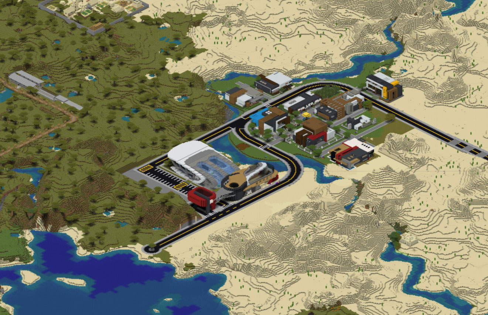
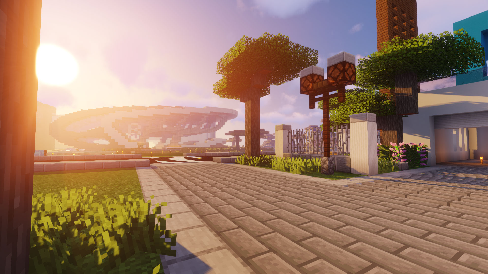
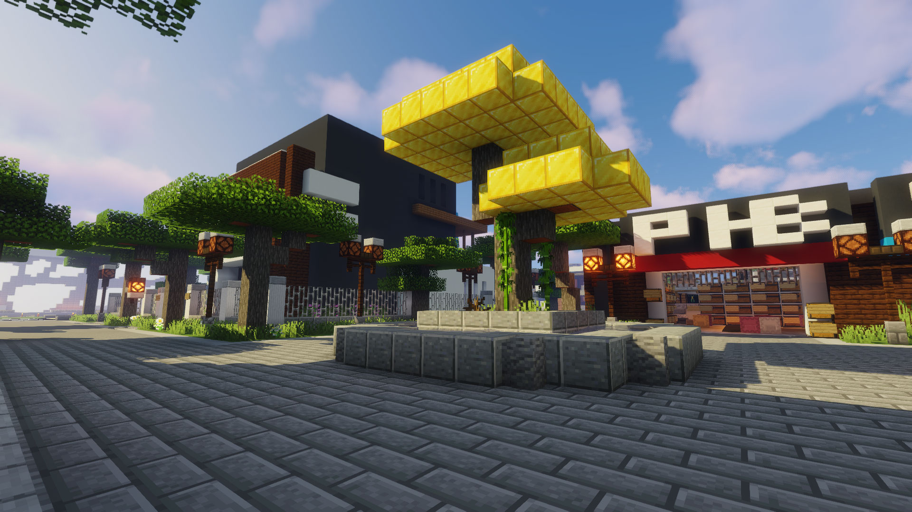
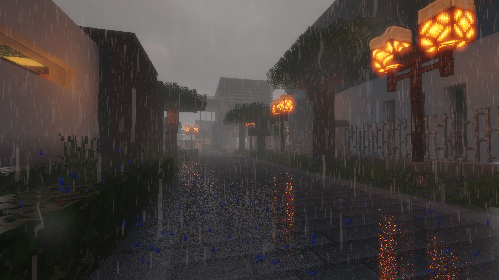

# 金合欢镇

-   类型：玩家村落
-   范围：(1700，4300)至(2300，4000)
-   名誉镇长：静静 **Leon_Xu**
-   名誉副镇长：老市长 **Nozomi1994**

## 简介

-   于喵窝大陆东南方向存有一片广袤无垠的沙漠，其中片片翠绿与潺潺碧波交汇之绿洲之处，金合欢镇坐落于此。

-   金合欢镇为**现代风格**绿洲小镇，四周大部为沙漠所包围，西北角毗邻一片金合欢热带草原。向北穿过一片热带区域与大海后可抵达猹湾，沿水路向东不远处可停靠乌木镇河岸，南部公路连接正在建设中的CBD —— **谷鄉町**。

-   绿洲区域盛产金合欢树。某日绿洲中一新发树苗，其枝叶通体金黄，妙不可言。镇中居民将其移至镇中心培育，以此为镇之宝树，金合欢镇以此得名。

## 交通

-   坐标：**(1700，4300)至(2300，4000)**

-   金合欢镇计划于主城购买传送牌，届时将可于樱华町神树附近车站处直接传送抵达。

-   可通过樱华町车站传送到猹湾后，使用鞘翅直接向南方飞行，即可抵达。

-   可通过输入指令 `/town select` 后选择金合欢镇，花费45节操传送到铁路站地表层大厅。

## 相关事项

-   金合欢镇在目前的基础上会进行一定的扩展，但由于本意是建造一处绿洲小镇，故无意大规模扩展当前区域。聚落未来的建设会以分区的模式进行。

-   本镇定位为纯建筑性聚落，地面范围内不设生产设施。目前由名誉镇长 **Leon_Xu** 保有鱼场一座，其他生产设施若干。若您加入后打算进行建筑，可先进行具体规划，并优先于 **Leon的服务器** 进行模拟建造。

-   金合欢镇欢迎各路朋友加入。若您热爱**现代建筑/园林造景**或对**建筑**有一定造诣且您希望找到一处休闲养老~~咕咕~~之聚落，这里会是您的理想去处。

## 联系方式

-   联系人
    -   静静 **Leon_Xu** @毛玉线圈物语 @NyaaCat
    -   老市长 **Nozomi1994** @毛玉线圈物语 @NyaaCat
    -   ~~小王八蛋~~ **Hoshino_Kaede** @毛玉线圈物语 @NyaaCat
    -   **Look_Forward** @NyaaCat
    -   **Walker_No908889** @毛玉线圈物语 @NyaaCat

-   群聊
    -   QQ： `459839514` 欢迎您与联系人进行**联系**后加入
