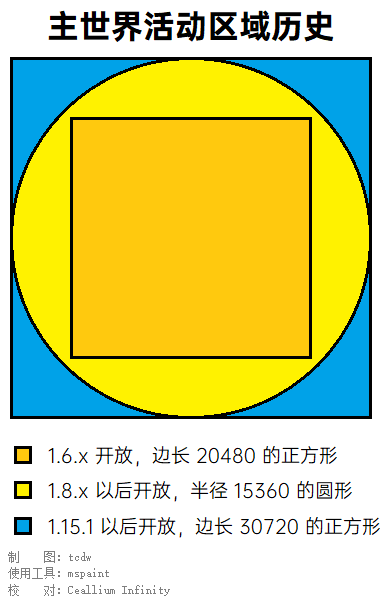

# 维度列表

!> 本页是关于喵窝主服务器 `nyaa` 内各个**维度（又称世界）**的。  
如需了解不同服务器，以及在不同服务器之间来回，请参见【[服务器列表](wiki/server-network.md)】。

喵窝服务器安装有多世界插件。本页面介绍喵窝主服务器 `nyaa` 内可到达的所有维度——包括**原版的和非原版的维度**。  
**所有维度互通经济、背包与商店内容。**

~~2018年3月中旬起，玩家仅可通过Capcat传送牌前往非原版维度。~~  
2019年5月14日起，玩家可通过 `/mvtp [维度代号]` 命令在不同维度间来回穿梭。

## 原版维度

?> :information_source: 原版维度全部开启爆炸保护，火不会蔓延；通常情况下不会重置。

### 主世界

**维度代号：**`world`

主世界是玩家出生、日常游戏、活动的区域，永不重置，是喵窝Minecraft的主要内容及精髓所在。  
主世界特定区域可能对建造、砍伐、挖矿等原版内容有所限制；请参见【[新人指南](nyaa/beginners-guide.md)】。其它维度一般不受类似限制。

当前，主世界开放区域为边长 30720 格、以世界原点`(0, 0)`作为中心的正方形。

?> :cat2: :heart: :fish: :whale:  
2019年8月，主世界旧版水域以“打补丁”的形式，升级为 1.13+ 风格。其本质上仍基于旧版地形，藏宝图在此无效。  
如需探索真正的新版地形，请考虑“[美丽新世界](#epicworld)”。

### 下界

**维度代号：**`world_nether`

下界（又名地狱），充满岩浆和可怕的怪物。  
下界和主世界的坐标是对应的（比例为1:8），在下界移动1米，等同于在主世界移动8米；因此，如果需要于主世界长距离移动，可以先通过下界门前往下界，再移动到对应位置，通过另一下界门回到主世界。目前已建成[下界交通网](nyaa/projects/nether-traffic.md)。

### 末路之地

**维度代号：**`world_the_end`

末影人的大本营；末影龙的栖息地；紫颂花、果的原产地；~~大型野生潜影贝主题公园。~~  
遍地空岛，下面便是无尽虚空。但神秘的末地城、末地船，~~以及稀有的鞘翅、潜影壳、龙首等宝物~~，吸引着无数勇士前去探索。  
还是获取黑曜石、圈养蜜蜂的绝佳场所。

!> 当前，末地已出现养殖场。**如需屠龙，应前往**[二号末地](#二号末路之地)，以免末影龙扫荡养殖场并杀害其中的动物。

--------

## 非原版维度

?> :information_source: 以下维度是借助插件加入的额外维度。  
其中，**“美丽新世界”及二号下界、末地**取消了针对方块（如TNT）及部分生物（如末影龙）的爆炸保护；且每逢服务器版本升级时重置。  
各维度相互独立，均须**以命令出入**。

### 美丽新世界（原黑化世界） :id=epicworld

**维度代号：**`EpicWorld`

~起源于1.6.x版本的主世界，水底下枯燥无味、毫无生机。为了拯救海底世界……~  
喵窝斗士终于将黑化怪物赶进[镇妖塔](#无尽地狱世界)。黎明降临大地。**基于1.15.x默认地形的美丽新世界**现已开放。    
这是你没有玩过的全新海底、村庄、~大马蜂~ 小蜜蜂——只需体验三分钟，你就会跟我一样，爱上这里的一切！  
寻找海产、热带鱼、海洋之心、蜂蜜蜂巢，将其带回家，装点我们的家园吧！

EpicWorld 地下还有着丰富的矿物资源，来 EpicWorld 挖掘是个极好的选择（几乎也是唯一的选择）。  
当前边境已完全开放，神秘林地府邸、全新海底神殿等你造访！（注意安全！）

~~新世界亦可承接一些依赖方块爆炸的自动化生产设备。~~

这里的下界传送门，会将你单向传送至**主下界**（而非“二号下界”）。 
末地传送门则会将你送到 **主末地**（而非“二号末地”）的一处偏僻平台上，位于`(-750, 1500)`。

### 二号下界

**维度代号：**`EpicNether`

源于 1.4.x 版本的主世界下界，枯燥无味、毫无吸引力……终于，基于 1.16.x 默认地形的全新下界来到了喵窝世界。

这里的下界传送门，会将你单向传送至**主世界**（而非“美丽新世界”）。

<!-- 话说有人来提供更好的文案吗（ -->

### 二号末路之地

**维度代号：**`EpicEnd`

此末地仅作采集资源、屠龙之用。  
主岛中心的传送门功能与原版一致。

### 脑洞世界

**维度代号：**`brainhole`

此世界目前仅用于建造地图展示用像素画。如果你希望在此建造像素画，请确保所需范围内没有其他建筑或像素画冲突。  
在此不会生成怪物。吟诗作画，悠哉游哉。

该世界的各类建筑将逐步移动到其他位置。以下是关于该世界的旧定义。

> 顾名思义，脑洞世界就是为了实现各种脑洞而设。玩家可以在此游玩各种娱乐设施，感悟他人脑洞之浩瀚。参观后，如果你也脑洞大开，思如泉涌，也可以申请一块区域来建设属于自己的脑洞天地。脑洞世界也可吞噬主世界的各类娱乐设施，包括已有的优秀设施、曾经大放异彩的活动场地，~或者是银行商标~。
>
> 先前，在此维度，死后不掉落、不扣除节操；因此曾作为获取玩家头颅的“专用”场所。现已不再例外。

### 无尽地狱世界

~~**维度代号：**`inf`~~

**主条目：[Infinite Infernal](legacy/inf)**

此世界已经废弃。请等待后续更新。

:ghost: 关于这个维度的故事（点击展开）

黑化怪物们逃出喵窝之后，被一群疯狂博士发现，送至月耀城外的秘密基地收治。博士们在其身上做了各种恐怖实验，终于，它们失去控制，攻破月耀城，要挟博士，卷土重来。  
“黑化世界”独立运营后，全新“肝黑”玩法经过长期测试，获得了广泛认可。现在，其以“无尽地狱”之身份重返喵窝。

该维度沿用独立运营时的原有地形（含月耀城），并在此基础上，进一步拓展内容。
该维度使用冒险模式，无法放置方块。

### 小游戏世界

~**维度代号：**`minigame`~

此世界已废弃。请移步“竞速游戏”“美羽实验室”[子服务器](wiki/server-network.md)。
