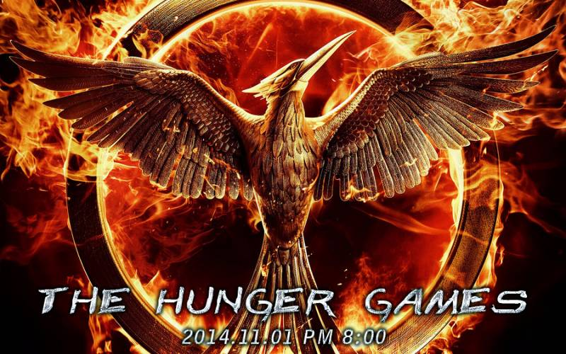

# 2014 年活动

## 万圣节活动：战斗版赛马竞速

活动时间：2014-11-01 20:00 (CST)

活动概述：通过各种方♂式♂赢得比赛的胜利，打开宝箱拿到奖励！

### 活动准备

参与活动前请将自己的装备和物品栏全部收藏好，进场时会清空全身物品。

### 活动流程

1. 清理背包和装备
1. 新手村大神殿东门外点击进场按钮
1. 确认无误后点击本层的按钮清空道具同时发放 8 枚兑换物
1. 传送到二楼 (PVE) 从各个村民商人处兑换想要的比赛用品（药水、弓、马护甲等等之类）
1. 从二楼出口进入马场 (PVE) 选择马匹骑乘（驯服需要的糖和马鞍都在马场的箱子里，请自取）
1. 进入赛场起点 (PVE)
1. 等待比赛开始同时观察对手
1. 起点基岩移除后开始比赛
1. 赛场 30 码拐弯之后进入 PVP 区域（地面有提示）
1. 向着终点奔跑吧

### 赛场提示

动物、怪物、陷阱、跳跃、效果加成、小宝箱、流水、岩浆等。

### 奖励

未知宝物会安放在终点处的宝箱内，第一名到达的玩家手快就能拿到哦！

### 禁止行为

- 禁止在 PVE 区域杀马和攻击别人的马
- 禁止在赛道中死亡后使用 `/back` 回到死亡位置（可在新手村复活后通过传送点重新开始流程）
- 禁止使用末影珍珠
- 禁止从赛道外跳入赛道

### 作弊惩罚

- 攻击 +9999 的板砖秒杀

### 技巧提示

- 杀掉对手比杀掉对手的马(已驯服)更有价值？
- 前期取得速度优势最重要？
- 是否应该快速的进入 PVP 赛道？
- 我应该关注赛道上可以拾取的宝箱吗？

## 国庆节活动

（由于考虑到国庆日当天大家可能有其他安排或者在归途中，活动日期延后至 10 月 2 日）

由于长期经受黑化怪物的骚扰，喵窝的居民逐渐失去了原本平静悠哉的生活。为了再次体验原来不用担惊受怕的世界，喵窝世界进行了一系列变化，其中包括——新矿界诞生！

但是！喵窝的居民发现新矿界的矿储量相比原来急剧降低，资源危机爆发！

### 活动信息

* 活动名称：钻石争霸
* 活动时间：2014-10-02 14:00 - 22:00 (CST)

### 活动规则

* 参与玩家将在半径为 1024 格子的原版地图中生存，建造居所、种植畜牧、与怪物战斗、升级、探险并获取资源
* 活动将单独开放新的服务器，没有新手装备、没有动态地图、没有各种插件的辅助、没有黑化和不科学的装备
* 可以 PvP，杀死其他玩家可以抢夺物品
* 游戏时间 8 小时，不可使用 `/afk`。游戏结束后以每位玩家所拥有的钻石数量排名并发放奖励
* 开放游戏区域之前和游戏结束，成绩评审期间不允许继续破坏 / 建造任何方块或任何 PvP 行为，一经发现则取消本次游戏奖励
* 禁止使用任何作弊性质的插件或材质，以及任何作弊行为。一经发现则移除白名单和玩家社群

### 游戏流程

* 13:50 启动活动服务器
* 14:00 开放游戏区域，玩家自由探索世界区域开始游戏
* 22:00 游戏结束，所有玩家将被传送到出生点进行评分
* 22:30 按照玩家成绩排名发放奖励、集体合影，随后活动服务器关闭

游戏结束后除成绩最好的 N 名玩家将获得特殊奖励，所有参与玩家也将会获得一份礼物！

## 中秋节活动：侵入！血月堡！

随着中秋节的临近，活跃在喵窝的异界士们发现黑化妖梦出现的频率越来越高、威胁度越来越强，除了部分实力强悍的异界士，很多低阶和中阶勇士惨死于黑化妖梦的魔爪之下，人类不得不收缩活动范围，由主动猎杀转为被动防御，避免成为黑化妖梦的猎物……

疑惑、担忧、紧张的情绪萦绕在每个人的心头，人们不知道为什么这个世界会突然变得如此危险，这时，永恒霜风要塞传来的消息震惊了世人：血月世界的领主通过手下黑化妖梦的报告，得知喵窝世界存在可以大幅度强化实力的贤者之石，为了将血月战火蔓延到更多的世界，血月领主必须获得贤者之石的力量！因此，它集结力量，在喵窝世界撕裂了多处空间传送黑化部队，在人们纷纷躲避力量得以分散的时候，派遣血月堡穿过撕裂空间，意图一举击破喵窝世界现存最强军事要塞——永恒霜风！

永恒霜风作为上古时期建造的军事要塞，因为岁月的流逝和长久的和平，早已处于半荒废的状态，要想防御血月空堡的进攻，必需您的一臂之力！

为了喵窝的和平，为了女仆的幸福，为了中秋的月饼，为了装备和节操，现在就加入中秋特别行动组，攻占血月堡！

### 活动信息

* 时间：2014.9.6 20:00
* 地点：永恒霜风东首-新建的活动用空岛
* 到达方法：新手村骑士驿站门外临时双向传送点 传送到永恒霜风东门 步行前往指定区域点击单向传送按钮到达登岛用热气球
* 活动方式：探险 + 智力 + 攻城
* 分为三个阶段：P1力量挑战 P2智慧挑战 P3黑化BOSS魔塔

整个区域玩家只可以互动，不能放置方块和破坏。

整个空岛分为三个区域，难度逐渐变大，区域内设置较为隐秘的陷阱、藏宝箱、刷怪机关等，每个区域安排持续20分钟左右的进攻时间，清理掉当前区域的时候会打通行路口开放下一区，同时本区域停止刷怪，最终目的完成最后一区击破黑化BOSS。

藏宝箱的探索由玩家自主进行，不畏艰险可以在未平定该区域时进行。

### 活动规则

不可以在岛外搭设脚手架 / 作弊梯等，使用末影珍珠引起的自由落体、瞬间死亡情况（90% 会发生）自负损失，禁止使用变态武器（单项属性超过附魔等级 30）参与活动，查出强制没收，其他不限。

### 奖励

击杀 BOSS 成功后每人发放 32 个附魔金苹果，每人赠送随机装备一件；藏宝箱的道具和黑化怪的掉落物由玩家先到先得；最后一击击杀最终 BOSS 的玩家会获得贤者之石 *1。

建议的准备：各种药水，防御向装备，足够的食物。

*本次活动的财务支出由 17windy 提供赞助:)*