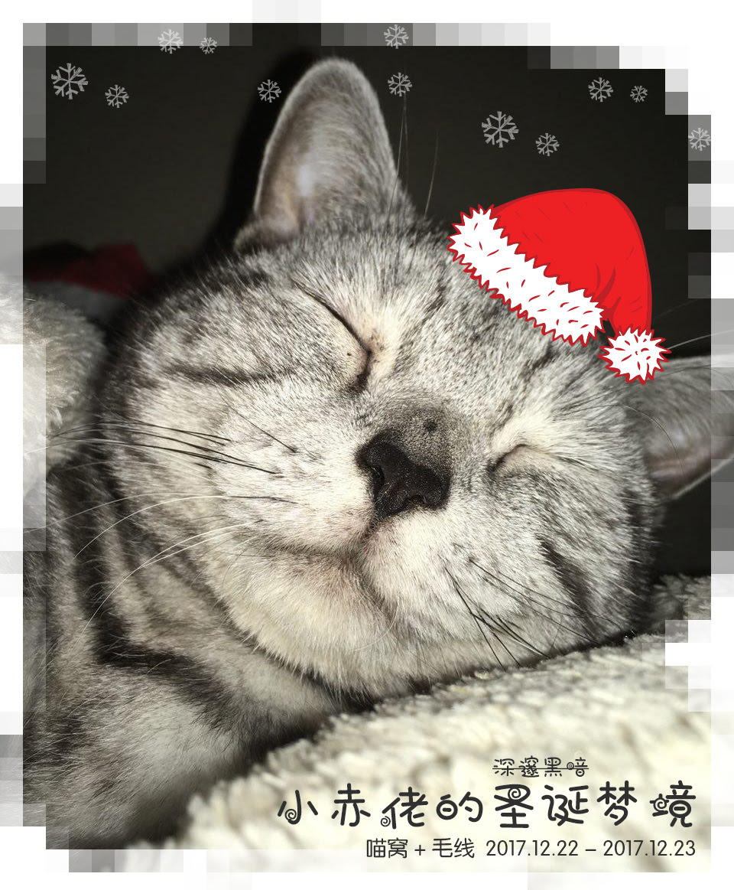
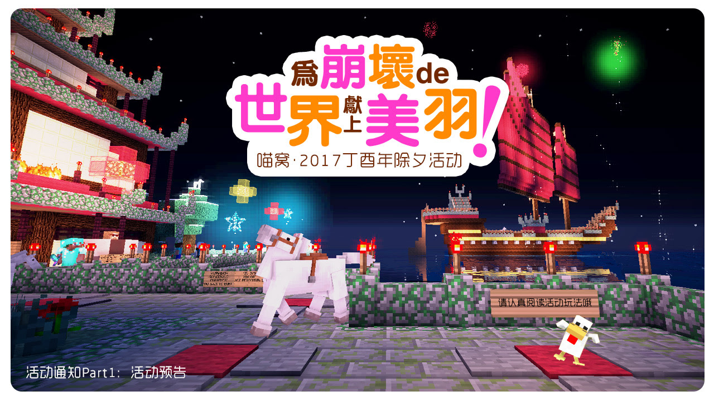
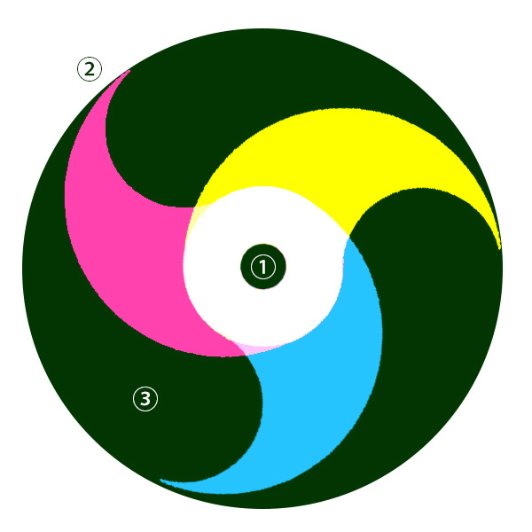
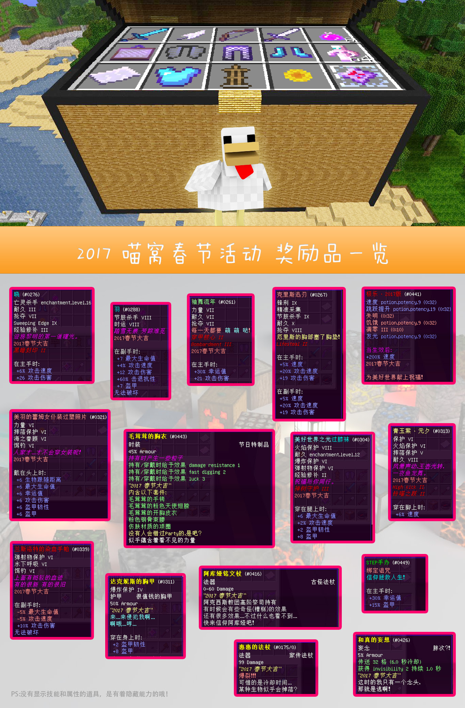

# 2017 年活动

## 圣诞活动：小赤佬的圣诞梦境

#### 引言

“逃跑是不可能逃跑的 这辈子都不可能逃跑的 电脑又不会玩 就只能靠睡才能梦乡冒险这个样子 睡着了就感觉跟喵窝毛线一样 里面的老哥个个都是人才 又会吹牛逼 刚黑无敌 梦中捉鳖 女装大佬什么的...... 我超喜欢在里面的！”  
小赤佬讲完，便懒懒的翻了个身，不再搭理人，似乎进入了梦乡。  
“咔嚓！”凤凰君看小赤佬真的睡着了，抿嘴笑着拿出手机，拍下小赤佬的睡姿，转手发给了女友，转过身来唤醒电脑，歪头想了下，又端起手机，给喵窝和毛线群各发了一张，全然不知背后的小赤佬已然抬起爪子...  
十分之一秒之后，“大家一起来和小赤佬过圣诞节吧~”凤凰君邪魅一笑，于是，圣诞梦境真正的开始了~~~  

#### 活动总览

首先感谢协助进行活动场地建设的各位大佬（排名不分先后）：

- Ankou54
- QQ18522
- nan\_jue
- shiluoshiluo
- Kanna\_leeder
- Maki\_Banshee
- Rem\_shoushou
- RainSea\_Zinc
- Ghost\_wh1026
- Yui\_cn

#### 活动时间

所有时间均为北京时间 (UTC+8)

- 前半场 2017.12.22 20：00 - 12.23 20:30
- 后半场 2017.12.23 21：00 - 23：00

#### 活动关键词

PVE 任务 探索 收集 组队 角色 提升 副本

#### 活动服务器

Act 果体进服

#### 玩家模式

探险模式 无死亡掉落

#### 初始装备

初始武器和食物等 爪印的邀请函（kit牌子一次性领取）开启巡游任务 完成后可以获得进阶的任务道具。

#### 探险队组成

- 想要获得喵窝或者毛线的活动奖励，玩家必须加入由探险队长组织的探险队，每支探险队应由最少3人、最多10人组成（含队长）；
- 结算奖励将会只结算每支队伍的团队副本收获总和（由队长集中和提交），之后将奖励在喵窝或者毛线发送给对应探险队队长，由队长自行分配奖励。
- 需要注意的是，原则上奖励是根据队长选择的领取服务器决定的，比如，同时在喵窝和毛线游玩的兔纸当了队长，那么她（?）必须在组织和报名阶段决定报名论坛，在喵窝论坛报名，则奖励在喵窝服务器发放给她，如果队伍内有纯毛线玩家，那么就无法领取到奖励。

#### 报名方式

在喵窝和毛线论坛分别会开辟报名帖子，由队长跟帖报名即可（队长：兔纸 队员：林登万，林等图，林登斯瑞。合计4人。），在活动结束前自己的帖子均可自行修改，奖励只针对队长发放。

#### 玩家角色

活动中提供各类型的装备道具，玩家们可以根据自己或者队伍的喜好有目的的武装自己，变身成战士、刺客、游侠、牧师、法师、德鲁伊就是可以为所欲为的等等不同角色。

#### 服务器插件

同喵窝

#### 活动地图大小

中小型

#### 活动地图分区

- 喵呜堡
- 不同难度刷怪区域
- 多等级精英怪刷新点
- 不同难度普通副本
- 后半场团队副本

#### 喵呜堡NPC类型

除了功能性NPC，例如酒吧老板、铁匠、大法师、军武库等等，这些在初始的巡游任务中均可以接触到，还有很多身含其他秘密的具名角色。

#### 前半场概述

通过各种探索活动和连续任务，解开秘密，攻克副本，各个探险队锻炼队伍，积累后半场活动需要的装备和道具（特别是针对前半场因为各类原因不能参加的朋友，可以通过探险队其他队员前半场的努力，直接变得强力）。

#### 后半场概述

团队副本作战，攻克每个区域（小怪区和BOSS区），收集战利品，在击败最终BOSS以后回到喵呜堡，由各队队长汇集队伍战利品收获和排队提交（请注意分喵窝提交处和毛线提交处），全部统计完成后回到各自服务器领取奖励。

#### 兑换比率

会标注在不同的战利品Lore上面。

#### 活动Q&A

1，冒险模式有什么限制？  
基本等于不能破坏和放置的生存模式。

2，探险队该如何储存和整理物资？  
可以由队长或队员于军武库NPC处兑换储藏许可，之后联系在线OP选择存储区，由OP在2F指定放置三个加锁箱子和开箱钥匙多枚给该玩家分配，玩家也可以自行rename任何物品成同名的作为钥匙，所以请注意不要泄露钥匙名字(开箱密码)。 储藏许可，可以多次购买。 少量私人物品请储藏于末影箱。 1F的储存区为公共储存空间。

3，可以自己制作物品吗？  
可以，喵呜堡内有多处工作台、熔炉、铁毡、附魔台、炼药台等可以随意使用。

4，团队副本BOSS奖励如何分配？  
目前的设定为分配给对BOSS造成最多伤害的玩家。

5，团队副本全灭会如何？  
玩家全灭，BOSS脱离战斗后血量会回满，请研究战术、补给物资，重新挑战。

6，小副本有何限制？  
友善游戏，如果副本内有玩家在战斗，尽量避免重置副本导致互相的不愉快。 副本本身对于通刷次数并无限制，只要足够的副本门票。

7，独狼玩家能拿到最终奖励吗？  
抱歉，独狼玩家最好也结成名义上的3人小队...即使另外两位玩家没有上线。

8，活动中我可以问各种帖子和邮件说明了但是我忘记的事宜吗？  
日后你惹出祸来，不要把师傅说出来就行了...

9，如果后半场活动开始之后我才来参加活动怎么办？  
有队伍的话，直接找队友接洽；没有队伍的话，建议独自在外面体验下前半场丰富多彩的世界。

10，为什么活动不在24日或者25日举办？  
一方面是考虑到24日晚间现充玩家较多，一方面是25日是周一了大家不方便上线。

11，会有群语音吗？  
一方面OP会在自己的频道沟通活动状况不能带群语音，一方面各个探险队也会有自己的频道内部交流，所以，也许大概差不多不会有群语音~

12，喵呜堡内安全吗？  
我觉得......嗯...不... 所以请注意安全

13，我有机会和凤凰君对战吗？  
你看看你。

14，参与的玩家都有奖励吗？  
每支队伍根据人数，都有低保。

15，我可以朝人堆里面扔自制的大往生吗？  
嘘...别被抓到的话...

16，我觉得资料还不够详细啊！！！！！！例如你应该告诉我哪个家伙卖牛排？  
这就是你老玩别人的世界的...原因

[论坛讨论](https://bbs.nyaa.cat/d/1194)

[组队报名帖](https://bbs.nyaa.cat/d/1195)

特别声明：以上内容均为某不愿透露姓名的 17 编纂，我相信你们都懂的。

## 万圣节活动：ゲームモード · S

恩就是这样，咱在万圣节也准备搞个小活动。视活动情况可能会成为周常或者月常活动~

**活动时间：**

2017.10.28 晚  
20:00可以进入act服务器并且分组，建议提前组队。  
20:30开始游戏  

**游戏玩法：**

原汁原味的Minecraft！利用你的技巧在这片土地上生存！消灭你的敌人，成为最后的幸存者！同样，地图的边界会缓慢缩小，等待着你们的终将是一场决战！

**关键词：**

原版生存，PVP

**活动流程：**

玩家进入后自由组队或者选择当独狼。组队的玩家每队至多4人，并站到同一颜色的区域中。  
游戏开始时将在地图内随机传送玩家。同一队的玩家将被传送到一起，而不同队伍的玩家会相隔较远。  
世界边界将均匀缩小至中心。在此期间玩家将自我发展并消灭其它的队伍。最后存活的队伍或者独狼获得胜利。  

**游戏设定：**

难度：困难  
初始世界边界：1500半径  
世界边界衰减速度：0.3方块每秒  
出生点保护：0格  
玩家无法进入下界以及末地  
玩家死亡成盒，并转为旁观者模式  

**注意事项：**

禁止使用玩家雷达  
可以使用小地图，但请关闭玩家雷达  
禁止使用任何PVP作弊工具  
禁止使用任何生存作弊工具如矿综  
尽管并不禁止，但也请不要过度的破坏他人的游戏体验  
违反规则的玩家会在毛线主服务器被封禁  

**活动奖励：**

按玩家/队伍存活时间计算排名  
第一名的玩家/队伍获得2000卷  
第二名的玩家/队伍获得1000卷  
第三名的玩家/队伍获得500卷  
获得的奖金由队伍内部自行分配  

此外，在右侧击杀排行榜中的玩家，每击杀一名敌人+100卷  

活动参与奖励 南瓜*1728  

**ACT服务器使用需求**

服务端版本：1.12 spigot  
服务器插件：Clipactator，Essential（可以的话配置文件也一起），WorldEdit（可无）  
命令方块：开启  
出生点保护直径：0格  
默认游戏模式：生存  
玩家无法进入下界或者末地  

## 国庆活动：Pirates of the Caribbean: Dead Earnest Treasures

**Pirates of the Caribbean: Dead Earnest Treasures**

#### 关键词

PVP，职业角色扮演，登陆战，合作，背叛，慢节奏，枪剑并用，低魔法。

#### 活动时间

2017/10/02 20:00 CST 集合，21:00 CST 活动开始。预计 22:30 CST 活动结束

#### 活动限制

- 不可制造合成，不允许开战后更换队伍，开战后新加入玩家仅允许加入英国皇家海军火枪手职业。
- 全场自动补满饥饿度。
- 开战前参加活动全员增加前缀标明队伍：皇家海军 黑珍珠号 复仇女王号。
- 严禁互换和给予装备。
- 皇家海军因为舰队出航，陆地士兵禁止下水。

#### 故事

东印度公司获得了一件神话时代的神器，将其临时存放于布鲁谢特岛的马丁银行并且重兵防守。

而处于海盗生涯低谷期的杰克斯派洛船长，使用他神奇的指南针发现了此处并成功刺探到了秘密…然而，他的黑珍珠号还在瓶子里，只靠一条[垂死海鸥号]没武装的小型卡维尔帆船和几个部下…

于是，他无奈通过某种渠道匿名通知了老朋(对)友(头)巴博萨船长，巴博萨洞若观火，独自奚落了一阵子杰克，然后驾驶着他的[复仇女王号]前往岛屿。

在皇家舰队出港之后，港口不远处，两海盗船相遇，巴博萨大声嘲笑杰克，而杰克也不甘示弱的嘴炮回击，两人的搞笑争吵被英军的炮击声打断，于是，混乱的抢劫案开始了…

需要注意的是，皇家舰队将在出港一个半小时之后回港，所以时间对两位船长而言很紧张，同时…财宝两个船长分好呢？还是一个船长？

#### 阵营

- 英国皇家海军
- 杰克
- 巴博萨

**活动指南、地图、报名、规则和奖励等，请务必访问论坛讨论帖。**

[活动指南、规则、地图和讨论等](https://bbs.nyaa.cat/d/1130)

[队伍报名](https://bbs.nyaa.cat/d/1131)

## 夏日祭

各位期待已久的夏日祭，现已满载到来。

夏日祭的活动时间是 2017/7/14 - 2017/7/22。

~~由于一些原因部分活动可能会有替补场~~

详细安排及负责人名单：

#### 7/14 （喵窝管理组）

- 夏日祭开幕式
- 万华街将有美食可供购买/兑换
- [飞行越野竞速] World Wings Ralley

#### 7/15 （喵窝管理组）

- [空中格斗] 黄昏海平线

#### 7/16 ~ 7/18 （Ankou54）

- [多项运动赛事] 毛玉线圈物语运动会

#### 7/19 （miu、天芎）

- [团队合作对抗] 竞争之魂

#### 7/20 （miu）

- [人与自然] 鹦鹉竞速

#### 7/21 （miu）

- [Mine Craft] 挖矿争霸

#### 7/22 （喵窝管理组）

- 闭幕式、焰火晚会和言叶山谷祈福等
- 合影w

活动详情和规则等会在当天或提前在论坛发布，不会再次邮件通知。请留意论坛帖子。如果无法看帖（404 或论坛显示不正常），请注册帐号、验证邮箱再登陆论坛即可。

如果必要，活动当日会在春日神社或 act 服务器准备区发放道具。夏日祭活动将在多个服务器中组织，请注意活动说明和要求，不要传送错服务器。活动开始前到结束后，请遵守规则、保持秩序，不要攻击其他玩家或丢撒药水，活动时管理员可能没有时间响应不熟悉规则的玩家请求，请认真阅读规则和要求。

论坛讨论移步 -> https://bbs.nyaa.cat/d/1055

## 劳动节活动：黑暗崛起之七日而亡

#### 发生了什么？

- （天芎）既然你诚心诚意的发问了，
- （美羽）我们就大发慈悲的告诉你！
- （天芎）为了防止世界被破坏，
- （美羽）为了守护世界的和平；
- （天芎）贯彻爱与真实的邪恶，
- （美羽）可爱又迷人的反派角色~~
- （天芎）天芎！
- （美羽）美羽！
- （合）我们是穿梭在喵窝的搞事队！隙间，巨大的隙间在等着我们！！
- （蘑菇）关我菇事~~~~

咳咳，这个故事是这样的，从前有个喵窝，喵窝里有个封印，封印里面是整天窃窃私语的古神，他在讲：喵窝的小虫子们整天无所事事，维持封印的信仰之力很快就要降低到打开隙间的程度...届时...女装诅咒将会弥漫整个喵窝...

你们看，坏人总喜欢说很多话，让大家都知道他要干坏事了！

于是，英灵殿（误）的管理者凤凰卷再次举办了新一届勇气试炼，召集喵窝的居民们参加，期望以此再次激发起洪荒之力强化封印。看，英灵殿！勇士，参与勇气试炼，无上的荣耀和强力的奖励在等待着你！

万事屋17：前排出售斩龙剑、乳胶枕、十字军盾、华尔拉亚战剑、泰坦之击、萨格拉斯智障（？）啦...

#### Q: 如何参与？

您只需要当天晚上活动时间之前（或者活动中）上线，清空背包和装备后于大神殿传送点传送到活动场地即可参与。

#### Q: 活动方式？

在活动开始后，充分发挥自己的特长，组队或者独狼，建设生活和防御设施，购买领主NPC、放置并且保护他，努力在勇气试炼的世界活下去，活着看到第八天太阳的玩家聚落并且领主存活，即告胜出！

#### Q: 有什么需要注意的方面？

- 活动期间关闭 back & home ，开启火灾蔓延和关闭爆炸保护，关闭死亡保护；
- 活动期间白天怪物较弱，夜间怪物较强，第二天夜间的怪物会比前一天要强，第七夜的血月攻击将是最危险的；
- 组队和聚落建设玩家自行结成；
- 活动期间允许PVP、允许偷窃和破坏。

#### Q: 活动死亡会如何？

活动中死亡并不会让您丧失活动资格，但因为不能使用命令，如果您死亡的时候没有在活动场地放置床，则很可能导致您要很长时间返回，所以开始聚落建设之后，请第一时间搞定床并且用各种方法保护好床的存在。

#### Q: 如何获得武装？

- 原版制造和附魔获得；
- 地图上特定位置商人会提供一些先进装备的兑换服务。

#### Q: 部分无法在主世界获得的资源怎么获得？

部分由NPC商人提供兑换，部分由出现在活动场地的怪物掉落。

#### Q: 领主是什么？

选定位置、开始建设聚落后，聚落酋长应该尽早前往任意NPC处兑换领主道具，并且由持有人在在聚落选定位置联系OP，放置领主。领主的放置会宣告聚落的建立、并且由OP给予领主放置聚落的额外奖励-附魔台和酿造台各1。领主会被怪物或玩家攻击致死，所以需要严加防护，领主的死亡会宣告当前聚落的挑战失败。

#### Q: 领主可以多个吗？

每个聚落只允许存在一位领主，在第七日天亮之前，领主死亡均可由聚落酋长再次兑换领主道具，联系OP再次放置（领主奖励只发放一次）。

#### Q: 奖励发放？

每个胜出的聚落（活着看到第八天太阳的玩家聚落并且领主存活），都由OP将奖励兑换物发放个聚落酋长，由酋长分配后自行兑换活动奖励。

#### Q: 活动中获得的物品和道具在活动结束后可以带回主服务器吗？

不可以。但是活动结束后的奖励是直接在主服务器发放的。

#### 禁止行为（请务必遵守，违规会严重影响他人的活动体验，可能导致您直接被ban）：

- 禁止携带任何道具装备（包含游戏过程中返回非活动世界取得任何物品）；
- 禁止制造和使用末影箱；
- 禁止制造地狱门和进入地狱门/末影门；
- 禁止活动中使用粗俗语言进行人参公鸡；
- 禁止玩家于NPC商人附近半径30格内建设任何设施和放置方块、禁止破坏商人的居住地；
- 禁止不科学的任何浮空（缺少支撑）建筑， 浮空建筑会遭到高空势力的制裁哦。

#### 最重要的，当然要在最后说。

**活动时间** 2017 年 5 月 1 日 （周一）北京时间 20:30

**活动地点** 请在活动开始前登陆服务器，活动开始时将统一传送到活动专用服务器。如果无法提前登陆，请在登陆主服务器后使用 /server act 进入活动专用服务器。

#### 其他
如果有任何问题，请移步论坛讨论帖（须登录）：https://bbs.nyaa.cat/d/967

## 新春祭/除夕活动

#### 2017喵窝春节活动预告 Part1

汪汪汪~在不论是单身狗还是恩爱狗、开发狗还是美术狗、社会狗还是学生狗的汪汪声中，2016年已然渐行渐远。

玉宇迎春，雄鸡昂首。鞭炮声声，辞旧迎新。在这充溢的喜庆气氛中，喵窝的居民们即将迎来大吉的2017年，在此，喵窝也为大家准备了既有趣又能提起您一年精气神儿的除夕活动。

#### 活动内容剧透

P1.竞争之魂

概况：玩家们组成最少5人、最多8人的队伍，采取三队竞技的方式进行比赛，通过合理的职业分配与道具使用，夺取积分动物，赢得主题宝物！  
职业：队长、宝藏猎人、守护者、偷猎者x3、替补队员（冷~）；  
队长：只有队长可以拉取场上的动物哦！  
职责：职业由队长提前分配并配给装备，活动禁止自带任何物品和装备；  
道具：场内届时会有各种可以利用的奇妙道具，甚至还会有针对整支队伍的团体增益减益道具哦！  
评分：每场比赛Time UP后，根据每支队伍动物存放区动物数量x对应积分评分；  
奖励：每支队伍根据最终成绩发放对应数量兑换物至队长，由队长分配给队员，可以兑换2017春节主题装备。  
场地：场地大概形状可以参照下图↓  

①为积分动物刷新点  
②为动物和物品的交付点  
③为场地间隔和打野区域  

P2.焰火许愿

在樱华町观赏焰火晚会，并前往言叶山谷为新的一年留下美好祝福。

那么，看到第一预告的我，应该做什么呢？

**组队！组队！组队！不论是找到队长还是队长找到队员，越早组队，优势就越大哦！**

[如无法正常浏览邮件或希望参与讨论，请戳这里移步论坛](https://bbs.nyaa.cat/d/831)

#### 春节活动预告 Part2

活动时间：2017-1-27 21:00 CST

活动奖励：（图片）

如果错过了上一封邮件说明，请[戳这里阅读](https://bbs.nyaa.cat/d/831)。

本次活动非常注重团队合作，请尽早组建团队、练习游戏技巧，请不要在活动中打闹或乱用道具，只有获得最终胜利的团队才会获得最高奖励！

所以，请务必、务必、务必阅读以下有用的内容！

- [简易流程、制式装备、训练场](https://bbs.nyaa.cat/d/837)
- [必须要知道的妨害道具](https://bbs.nyaa.cat/d/836)

如果邮件图片无法正常显示，请[戳这里阅读原帖](https://bbs.nyaa.cat/d/838)。您必须先登录论坛才能查看帖子，如果遇到 404 等问题，请戳这里登录。

由于本次活动需要团队合作，且需要一定的技巧方能玩出精彩，请打算参加的玩家尽快在论坛或玩家群组中组队。

每支队伍至少 5 人，最多 8 人。相关要求和分配请查阅之前的邮件，或访问论坛帖 活动预告 Part 1 活动预告 Part 2 流程与道具介绍等

组队完成后，请务必戳这里报名。如果没有及时报名，可能会造成活动时混乱、妨碍他人的活动体验。请务必尽快组队并报名，感谢您的支持与配合。
