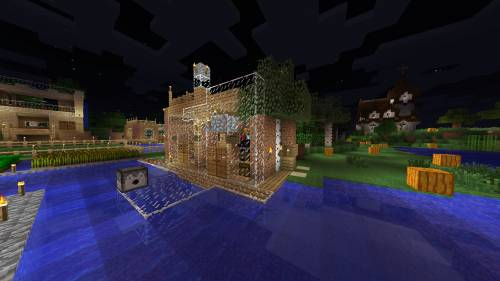
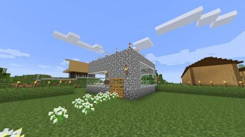
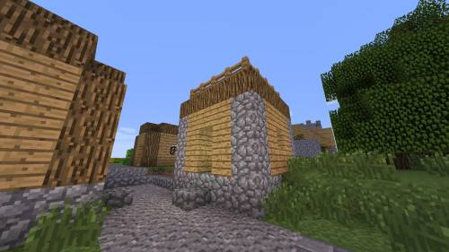
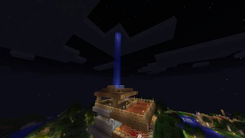
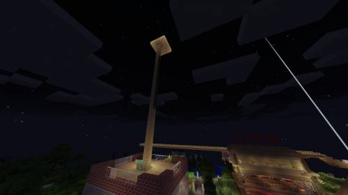

# 建筑要求

喵窝服务器对建筑有一定的要求，细节如下：

- 全服范围内禁止各种豆腐块，发现即通知整改，否则拆除。
- 全服范围内禁止各种无意义的「擎天柱」，发现即拆除。
- 请勿在野外/沙漠建造测试用建筑。如果是红石测试用，请在红石科技馆的测试区建造。
- 在各主城/村落范围内请保持建筑风格统一，风格不符的奇葩建筑将被通知整改，否则拆除。
- 在各主城/村落范围外请勿建筑完全不符合结构学的建筑（对物理学有不同要求的地区附近除外）。
- 各种刷怪塔，包括各种全自动/半自动生产设施，都应建设在整洁、美观的建筑物内。如果使用 TNT，每个生产单元需要黑曜石罩保护。

### 建筑风格

在进行建造行为时，请在各主城/村落范围内请保持建筑风格与主城/村落风格相统一。主城/村落的相应城主有整改风格不符建筑的权力和义务。

主城/村落的建筑风格，请参见[「世界设定」－「村落」](nyaa/realms)

建筑风格与类型，请参见[「建筑学院」－「建筑风格」](space/building/building-style)

### 不良建筑风格

#### 豆腐块

却说喵窝服务器乃生存与建造混合服务器，因而对各位的住所有一定的美观要求。“豆腐块”一般指材料简陋、粗制滥造的建筑。其中最典型的代表是生存时常见的使用橡木板建造的简单立方体，因而这类建筑通称“豆腐块”。但需要注意，这里的“豆腐块”并非现代建筑学上的“方盒子”概念。也即是说，反对“豆腐块”，并非禁止建筑使用平屋顶。

“豆腐块”的典型特征：

- 材料使用过于单一。
- 墙体构造方式混乱。
- 不符合结构力学。

典型的豆腐块照片

    

可是，为什么下图里的自然生成房屋（而且还是平顶！）却不会被认为是豆腐块？

原因很简单：**这些房屋有合理的结构。**他们不会令人感到粗制滥造。（请注意：喵窝世界里存在允许反力学结构的村落，力学结构在不同地区可能存在不同要求）

- 想了解更多木屋的建构方式，请参见[「木构建筑」](space/building/tutorial-wood-building)
- 想了解更多结构学相关内容，请参见[「结构学入门」](space/building/architechture-introduction)

#### 擎天柱

擎天柱不难理解，以下是典型案例照片：
    

