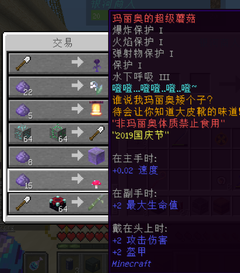

# 活动兑换道具

此页记载各种需要使用**参与特定活动得到的特殊代币**来兑换的道具。

最近更新时间:2020/9/14 19:40

银河商人发现于:东京巴比伦

## 银河商人

#### 来自明日的赞美之卷

- 【外形】附魔书
- 【兑换需求】崭新出厂的铲雪锹(2019圣诞活动兑换物)×1，海洋之心×32
- 【来源】2020新年

#### 崭新出厂的铲雪锹

- 【外形】铁铲
- 【兑换需求】钻石矿石×64，绿宝石矿石×64
- 【来源】2019圣诞节

#### 卖女孩的小火柴

- 【外形】附魔竹子
- 【兑换需求】崭新出厂的铲雪锹(2019圣诞活动兑换物)×1，附魔台×64
- 【来源】2019圣诞节

#### 武士刀

- 【外形】附魔石剑
- 【兑换需求】崭新出厂的铲雪锹(2019圣诞活动兑换物)×1，钟×64
- 【来源】2019圣诞节

#### 小胡闹

- 【外形】附魔凋零玫瑰
- 【兑换需求】崭新出厂的铲雪锹(2019圣诞活动兑换物)×1
- 【来源】2019圣诞节

#### 祝福之花 ?

- 【外形】附魔铃兰
- 【兑换需求】被遗忘的碎石(2019国庆活动兑换物)×22
- 【来源】2019国庆节

#### 叮叮咚咚钟

- 【外形】附魔钟
- 【兑换需求】被遗忘的碎石(2019国庆活动兑换物)×5
- 【来源】2019国庆节

#### 从天而降的石头

- 【外形】附魔石头
- 【兑换需求】被遗忘的碎石(2019国庆活动兑换物)×8
- 【来源】2019国庆节

#### 玛丽奥的超级蘑菇

- 【外形】附魔红蘑菇
- 【兑换需求】被遗忘的碎石(2019国庆活动兑换物)×15
- 【来源】2019国庆节

## 活动记录

### 2020 年

- [周末搞事活动「是强者就下 255 层」](space/items/activities/2020-255floor)
- [夏日祭](space/items/activities/2020-natsu-matsuri)
- [喵窝&毛线劳动节活动 【 Adventurer Legends | 职业死斗 】](space/items/activities/2020-labour-day)
- 喵窝&毛线春节活动【 An Epoch of D.D. Juan | 卷卷纪实 】

### 2019 年

- [圣诞活动：喜欢！雪！真实的魔法](space/items/activities/2019-xmas)
- 国庆活动：Falling World

?> :information_source: 更早以前的活动道具由于均在 1.14 更新后失效，且数量过于庞大，因此暂不收录。
